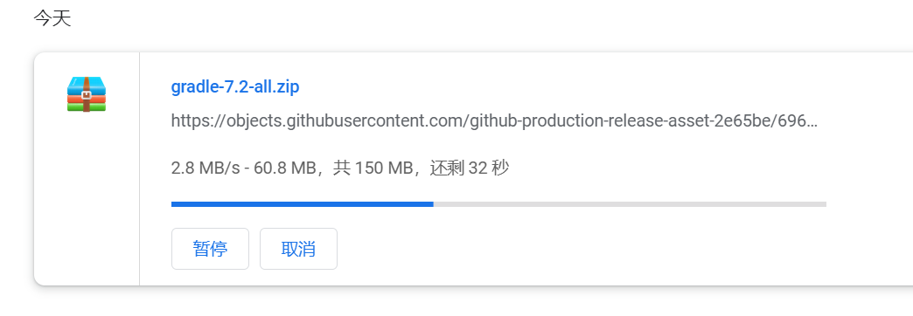
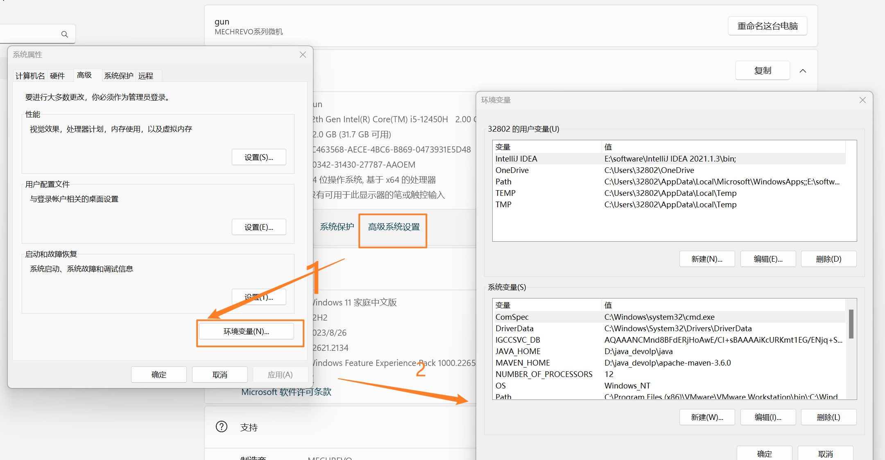
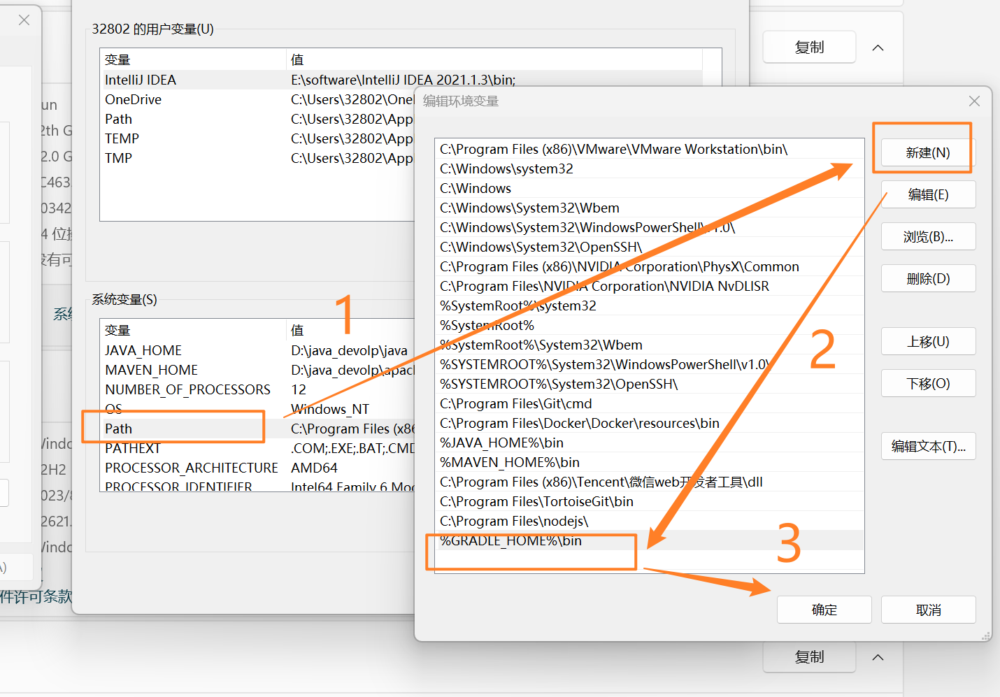
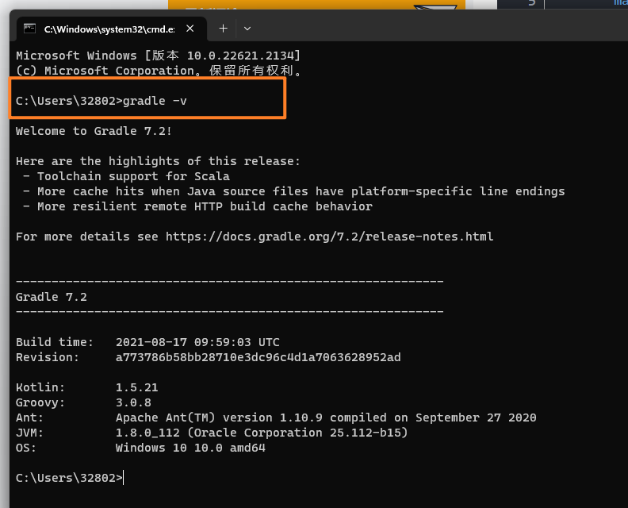
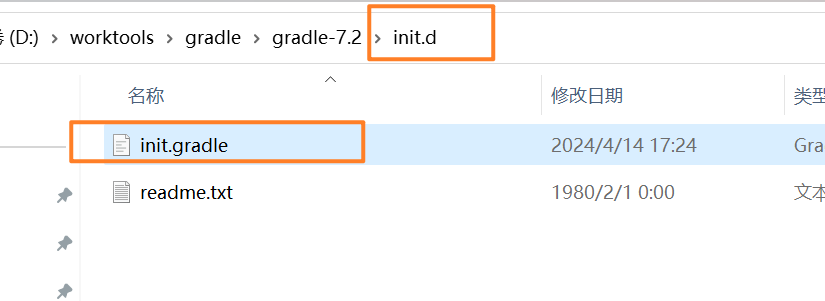
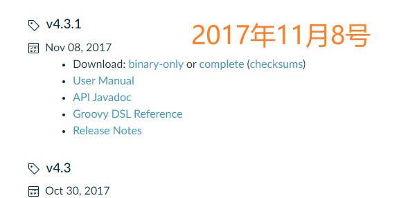
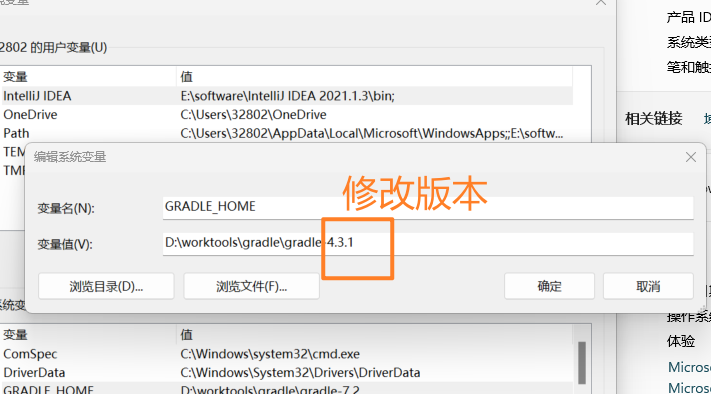
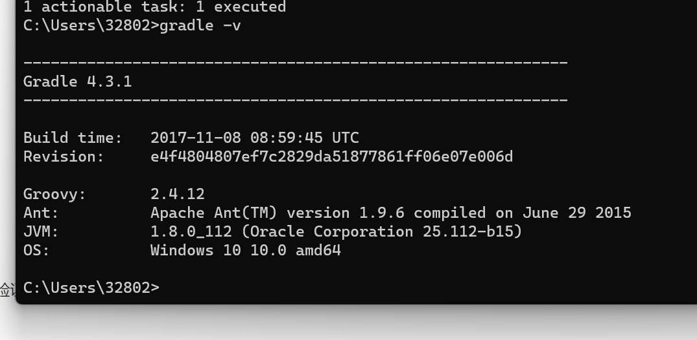

# 安装gradle

Gradle下载地址如下【官网下载】

https://gradle.org/releases/


点击下载。



进入页面后向下寻找自己想要的版本。如果是查看spring源码，那么下载spring源码gradle-wrapper.properties配置文件中指定的版本。（本人下载的7.2）


可以选择下载完整的压缩包，将压缩包解压到自己指定的目录中即可。点击complete会自动下载，并跳转感谢页面。


## 01)配置gradle系统变量



```
GRADLE_HOME
D:\worktools\gradle\gradle-7.2
```


```
%GRADLE_HOME%\bin
```




## 02)配置本地仓库路径

配置Gradle本地仓库地址，会将jar下载到该目录下。

```
GRADLE_USER_HOME
```


## 03)检验是否配置成功

```
gradle -v 或者 gradle --version: 通过gradle -v或者 gradle --version检测是否安装成功
```




## 04)配置Gradle仓库源

在Gradle安装目录下的 init.d 文件夹下，新建一个 init.gradle 文件，里面填写以下配置。



```groovy
allprojects {
    repositories {
    	//本地存放依赖的路径
        maven { url 'file:///D:\\worktools\\gradle\\gradle_repository'}
        mavenLocal()
        maven { name "Alibaba" ; url "https://maven.aliyun.com/repository/public" }
        //使用该下载地址会报错，因为不是https。可以将http改为https
        //maven { name "Bstek" ; url "http://nexus.bsdn.org/content/groups/public/" }
        mavenCentral()
    }

    buildscript { 
        repositories { 
            maven { name "Alibaba" ; url 'https://maven.aliyun.com/repository/public' }
            //使用该下载地址会报错，因为不是https。
            //maven { name "Bstek" ; url 'http://nexus.bsdn.org/content/groups/public/' }
            maven { name "M2" ; url 'https://plugins.gradle.org/m2/' }
        }
    }
}

```

repositories 中写的是获取 jar 包的顺序。首先从本地的依赖仓库中获取jar包。第一条和第二条都是从本地获取jar包，不冲突，第三条是从阿里云的镜像仓库中获取jar包，第四条是从国外仓库获取jar包，最后一条是从Apache指定的中央仓库获取jar包


## 05)安装4.3.1版gradle







**验证**




