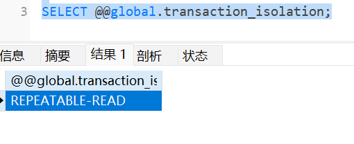

# MySql中的幻读是什么？

什么是幻读？

场景：操作我们的数据库时如下步骤：

步骤一：事务a先来查id = 1的数据，结果是没有查出数据。

步骤二：这个时候有一个并发事务b的id = 1进行插入数据。插入数据后事务b提交了。这个时候数据库中是有id = 1的数据。

步骤三：事务a在来执行步骤二中事务b插入id=1的数据时。数据库返回数据已经存在了<font color='red'>（主键重复）</font>。不能插入数据。

步骤四：事务a在去执行id = 1的查询。查询不出来数据。

## 演示用的表

```sql
CREATE TABLE `admin` (
  `id` int(11) NOT NULL AUTO_INCREMENT,
  `username` varchar(255) DEFAULT NULL,
  `email` varchar(255) DEFAULT NULL,
  `age` int(11) DEFAULT NULL,
  PRIMARY KEY (`id`) USING BTREE
) ENGINE=InnoDB AUTO_INCREMENT=2 DEFAULT CHARSET=utf8 ROW_FORMAT=DYNAMIC;
```

## 演示常用命令

查看当前全局的事务隔离级别：

```sql
SELECT @@global.transaction_isolation;
```



查看当前mysql数据库的版本：

```sql
SELECT VERSION();
```


事务控制sql语句：

```sql
-- 事务控制
-- 开始
START TRANSACTION;
-- 提交
COMMIT;
-- 回滚
ROLLBACK;  
```

## 演示幻读

a事务的操作语句：

```sql
START TRANSACTION; 

-- 步骤1
select * from admin where id = 1;

-- 步骤3
INSERT INTO `admin` (`id`, `username`, `email`, `age`) 
VALUES (1, 'admin', 'admin@example.com', 30);

-- 步骤4：感觉产生了幻读。
select * from admin where id = 1;

COMMIT;
```

b事务操作的语句：

```sql
START TRANSACTION; 

-- 步骤2
INSERT INTO `admin` (`id`, `username`, `email`, `age`) 
VALUES (1, 'admin', 'admin@example.com', 30);

COMMIT;
```

给人的感觉就是：明明确认了里面不存在这个数据，但是在自己执行插入时候是失败的。在次确认后还是没有数据。当自己事务提交后再次查询又有这个数据。

事务开始后：确认没有这条id = 1的数据。进行插入数据id = 1的数据。无法插入。再次查看没有查出id = 1的数据。

事务提交后：再次查询id = 1的数据是存在的。


