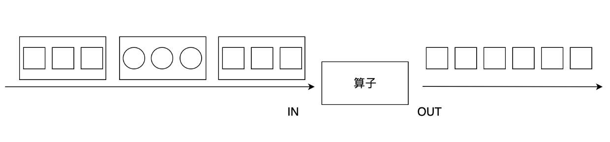

# Flink零基础学习教程flatMap算子原理

`flatMap`算子和`map`有些相似，输入都是数据流中的每个元素，与之不同的是，`flatMap`的输出可以是零个、一个或多个元素，当输出元素是一个列表时，`flatMap`会将列表展平。

如下图所示，输入是包含圆形或正方形的列表，`flatMap`过滤掉圆形，正方形列表被展平，以单个元素的形式输出。

输入多个列表进行 过滤、...等一系列逻辑处理。然后输出扁平化的列表结果。