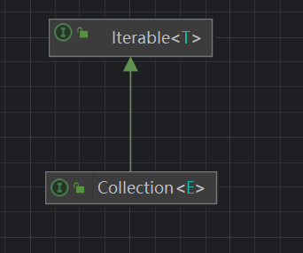

# Collection<E>接口分析



## 定义接口

```java
public interface Collection<E> extends Iterable<E> {

}
```

## 接口定义的抽象操作

获取大小size()方法，返回一个int类型描述大小。

```java
int size();
```

是否为空。true标识集合是空的。false表示集合不是空的。

```java
boolean isEmpty();
```

contains表示：v.包含。集合中是否包含某一个元素、指定集合里面的元素。

参数Object：表示任意对象。

```java
boolean contains(Object o);
```


```
Iterator<E> iterator();
```


```
Object[] toArray();
```


```
<T> T[] toArray(T[] a);
```


```
boolean add(E e);
```


```
boolean remove(Object o);
```


```
boolean containsAll(Collection<?> c);
```


```
boolean addAll(Collection<? extends E> c);
```


```
boolean removeAll(Collection<?> c);
```


```
    default boolean removeIf(Predicate<? super E> filter) {
        Objects.requireNonNull(filter);
        boolean removed = false;
        final Iterator<E> each = iterator();
        while (each.hasNext()) {
            if (filter.test(each.next())) {
                each.remove();
                removed = true;
            }
        }
        return removed;
    }
```


```
    boolean retainAll(Collection<?> c);
```


```
void clear();
```


```
boolean equals(Object o);
```


```
int hashCode();
```


```
    @Override
    default Spliterator<E> spliterator() {
        return Spliterators.spliterator(this, 0);
    }
```


```
    default Stream<E> stream() {
        return StreamSupport.stream(spliterator(), false);
    }

```


```
default Stream<E> parallelStream() {
    return StreamSupport.stream(spliterator(), true);
}
```