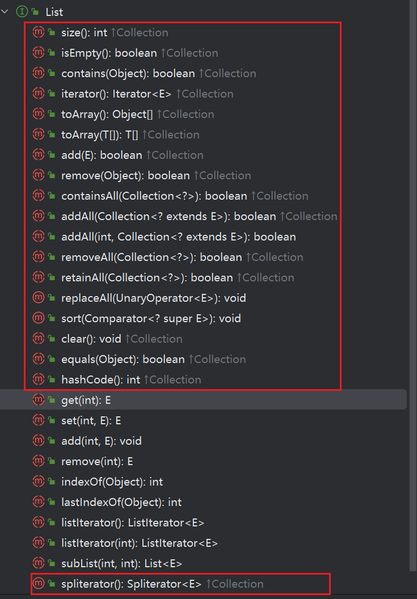

# List<E>接口分析

## 接口定义

```java
public interface List<E> extends Collection<E> {
// 继承Collection<E>接口
}
```


## 继承Collection<E>接口的方法




List<E>接口中有些方法是给子类去实现的。具体是那个类去实现呢？


List<E>重写的逻辑

```java
    // List<E>接口
	@Override
    default Spliterator<E> spliterator() {
        return Spliterators.spliterator(this, Spliterator.ORDERED);
    }
```

Collection<E>接口原有的逻辑

```java
	// Collection<E> 接口
	@Override
    default Spliterator<E> spliterator() {
        return Spliterators.spliterator(this, 0);
    }
```


## List<E>独有的方法

::: tip 注意

- 下面哪些方法都是List<E>接口独有的，在 Collection<E> 接口没有。不是继承 Collection<E> 接口的。
- 这些方法在这个list接口只是定义，没有具体的实现。

:::


```java
E get(int index);
```


```java
E set(int index, E element);
```


```java
void add(int index, E element);
```


```java
E remove(int index);
```


```java
int indexOf(Object o);
```


```java
int lastIndexOf(Object o);
```


```java
ListIterator<E> listIterator();
```


```java
ListIterator<E> listIterator(int index);
```


```java
List<E> subList(int fromIndex, int toIndex);
```