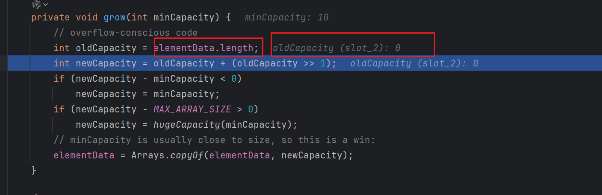

# jdk1.8的ArrayList源码分析add()方法


## 测试用例代码

```java
public class TestList01 {
    // debug ArrayList class
    public static void main(String[] args) {
        List list = new ArrayList();
        list.add("hello");
    }
}
```

## 空参构造

ArrayList类的空参构造。

```java

	// 类的静态常量。
	private static final Object[] DEFAULTCAPACITY_EMPTY_ELEMENTDATA = {};

	// 默认初始化为null
    transient Object[] elementData;

	public ArrayList() {
        // elementData与DEFAULTCAPACITY_EMPTY_ELEMENTDATA引用地址相同
        this.elementData = DEFAULTCAPACITY_EMPTY_ELEMENTDATA;
    }
```

## add方法分析

```java
    
	// 指容器中包含的元素数量值
	private int size;


    public boolean add(E e) {
        // 确认内部容量
        ensureCapacityInternal(size + 1);  // Increments modCount!!
        elementData[size++] = e;
        return true;
    }

	// 第一步：确定内部容量
    private void ensureCapacityInternal(int minCapacity) {
        if (elementData == DEFAULTCAPACITY_EMPTY_ELEMENTDATA) {
            minCapacity = Math.max(DEFAULT_CAPACITY, minCapacity);
        }
		
        ensureExplicitCapacity(minCapacity);
    }
	
	// 第二步：确保显示容量
    private void ensureExplicitCapacity(int minCapacity) {
        modCount++;

        // overflow-conscious code
        if (minCapacity - elementData.length > 0)
            grow(minCapacity);
    }

	// 第三步：增长
    private void grow(int minCapacity) {
        // overflow-conscious code
        int oldCapacity = elementData.length;
        int newCapacity = oldCapacity + (oldCapacity >> 1);
        if (newCapacity - minCapacity < 0)
            newCapacity = minCapacity;
        if (newCapacity - MAX_ARRAY_SIZE > 0)
            newCapacity = hugeCapacity(minCapacity);
        // minCapacity is usually close to size, so this is a win:
        elementData = Arrays.copyOf(elementData, newCapacity);
    }
```

**第一次：调用add方法添加元素时：**

第一步：容器size（大小）是0。ensureCapacityInternal方法传的最小容量是 0 + 1 = 1。

第二步：elementData == DEFAULTCAPACITY_EMPTY_ELEMENTDATA表示使用ArrayList类的空参构造的对象实例。默认的实例size为0。 这个时候minCapacity = Math.max(DEFAULT_CAPACITY, minCapacity);返回的是10。

第三步：ensureExplicitCapacity(minCapacity);显示的容量为minCapacity = 10。

第四步：minCapacity - elementData.length表示保证minCapacity 大于elementData.length这个值。意思是数组的空间大小要大于数组实际元素的大小。

第五步：调用grow方法。传递的参数是minCapacity。minCapacity默认情况是10。minCapacity可能是当前大小size + 1的值。

第六步：grow方法解析：

```java
    private void grow(int minCapacity) {
        // 原来数组的实际长度。
        int oldCapacity = elementData.length;
        // 新的容量值 = 原来数组的实际长度 + 原来数组的实际长度右移动1位
        int newCapacity = oldCapacity + (oldCapacity >> 1);
        // newCapacity < minCapacity
        if (newCapacity - minCapacity < 0)
            // 取minCapacity
            newCapacity = minCapacity;
        // newCapacity > MAX_ARRAY_SIZE
        if (newCapacity - MAX_ARRAY_SIZE > 0)
            newCapacity = hugeCapacity(minCapacity);
        // minCapacity is usually close to size, so this is a win:
        elementData = Arrays.copyOf(elementData, newCapacity);
    }
```

第一次调用add方法。oldCapacity是0。



newCapacity取的是minCapacity值。minCapacity值默认情况使用的是常量10（DEFAULT_CAPACITY）。

```java
    	private static final int DEFAULT_CAPACITY = 10;


		// newCapacity < minCapacity
        if (newCapacity - minCapacity < 0)
            // 取minCapacity
            newCapacity = minCapacity;
```


参数elementData：表示原来数组大小引用变量。

参数newCapacity新容器大小。

```java
    elementData = Arrays.copyOf(elementData, newCapacity);
```

返回一个新的数组。

Arrays类的解析请看下一篇文章。


