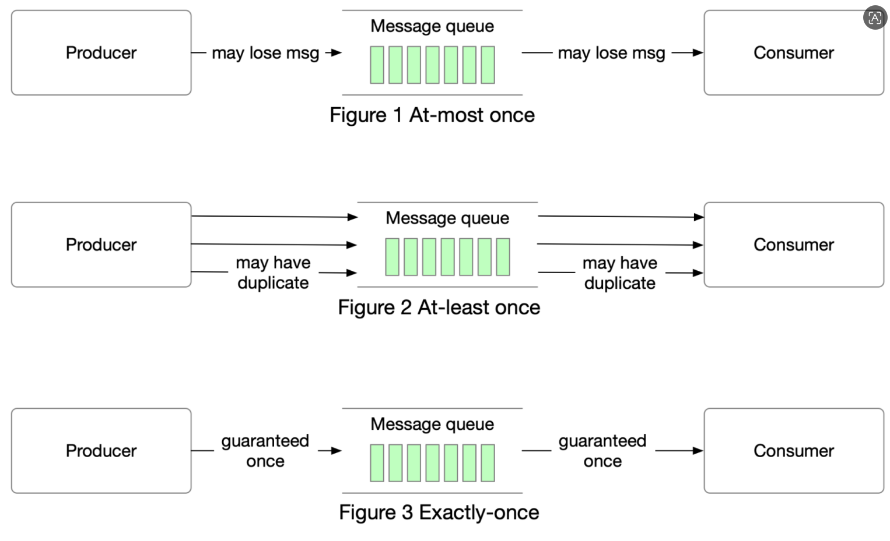

# kafka生产者数据传递语义

| 数据传递语义  | 语意     | 解释                             |
| ------------- | -------- | -------------------------------- |
| At Most Once  | 最多一次 | 就发一次                         |
| At Least Once | 至少一次 | 保证服务端接收到（可以会有重复） |
| Exactly Once  | 精确一次 | 保证服务端只能接收到一次         |

## At Most Once 语义(最多一次)

**原理**：产者发送消息后，不会等待任何来自 Kafka 服务器的确认。一旦消息发送出去，生产者就认为任务完成，不会关心消息是否成功到达 Kafka 集群或被存储。如果在消息发送过程中出现网络故障、服务器故障等问题，该消息可能会丢失，并且生产者不会尝试重新发送。

这种语义下，生产者的性能通常是最高的，因为它减少了等待确认的时间，但牺牲了消息的可靠性。

::: tip  总结

优点：生产者性能是最高

缺点：消息不可靠。有丢失等问题。

:::

**适用场景**：适用于对消息丢失不太敏感，但对性能和低延迟要求较高的场景。例如，一些监控数据的实时传输，即使部分数据丢失，也不会对整体监控结果产生重大影响，因为后续的数据可以弥补之前的信息缺失。

## At Least Once 语义(至少一次)

- **原理**：
  - 生产者发送消息后，会等待 Kafka 服务器的确认（通常是 ack 确认）。如果没有收到确认，生产者会认为消息发送失败，会尝试重新发送该消息，直到收到确认。这种情况下，可能会导致消息被重复发送，因为生产者无法确定消息是在第一次发送时未到达还是在确认过程中丢失。
  - 为了保证消息不丢失，生产者会不断重试发送消息，可能会导致接收方收到重复的消息，因此在消费者端需要处理可能出现的重复消息，如通过消息去重机制。
  
- **适用场景**：
  - 适用于大多数业务场景，特别是对消息丢失非常敏感，但可以容忍一定程度的消息重复的情况。例如，在金融交易系统中，宁可重复处理一笔交易，也不能让交易消息丢失，后续可以通过业务逻辑或幂等性操作来解决重复消息的问题。

## Exactly Once 语义(精确一次）

- **原理**：

- - 生产者确保消息在发送过程中，从发送到存储在 Kafka 集群的整个过程中，只会被存储一次，既不会丢失也不会重复。这是最严格的数据传递语义，需要生产者、Kafka 集群和消费者端协同工作。
  - 在生产者端，通过使用事务（transactions）和幂等性（idempotency）机制。事务允许生产者将多个消息发送操作组合成一个原子操作，幂等性确保生产者在重试发送时不会重复发送消息。Kafka 集群内部也需要支持事务，消费者端也需要配合使用事务来保证从正确的偏移量开始消费，以避免重复消费。

- **生产者端的消息标识：**

- - Kafka 生产者启用幂等性（enable.idempotency=true）后，会为每条消息分配一个唯一的序列号（Sequence Number）。这个序列号是针对每个生产者实例和主题分区的组合生成的。
  - 对于同一个生产者发送到同一分区的消息，序列号是递增的。当 Kafka 服务器接收到消息时，会检查该消息的序列号。如果接收到的消息序列号与该分区下此生产者上一个成功存储的消息序列号连续（即比上一个序列号大 1），则认为该消息是合法的；如果序列号小于或等于上一个存储的序列号，Kafka 服务器会将其视为重复消息并拒绝存储。

- **适用场景**：

- - 适用于对消息的准确性和一致性要求极高，既不能丢失也不能重复的场景。例如，在涉及重要的订单处理、库存管理等业务场景中，确保消息的精确传递非常重要，避免出现多扣库存或重复订单等问题。

