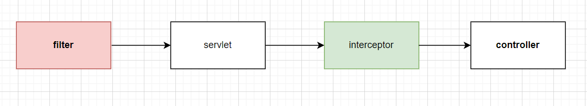

# 1)过滤器和拦截器有什么区别？

考察目的：

- 对web应用程序中常见技术的掌握程度。
- 对请求处理流程和各个技术应用场景的理解程度。
- 对servlet容器、spring框架等相关技术掌握程度。

回答方法：

1. 技术实现。
2. 应用场景。
3. 性能等多个方面来回答。

展示对web程序开发的深入理解和实际应用能力。

## 完整回答模板

区别1：**运行的顺序不同。**过滤器是servlet容器接收到请求之后。但是在servlet被调用之前运行。而拦截器是在servlet被调用之后，但是在响应被发送到客户端之前来运行的。

区别2：**配置方式的不同。**

过滤器是在web.xml里面配置的。

拦截器是在spring配置文件进行配置的。或使用注解方式进行配置。

区别3：filter依赖于servlet容器，interceptor不依赖于servlet容器。

区别4：filter在过滤器中只能对request、response进行操作。interceptor可以对request、response、handler、modelAndView、exception进行操作。相当于interceptor多了对springMVC生态下组件的一个操作能力。

