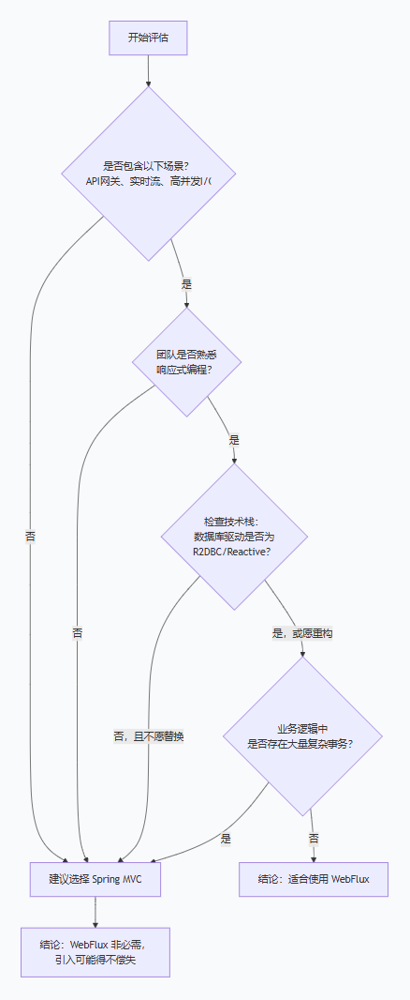

# java的webflux适合在哪些场景？

**WebFlux适合的场景主要是高并发、I/O密集型的应用，但并不建议用它作为所有网站的“银弹”方案**。

简单来说，选择 WebFlux 还是传统的 Spring MVC，取决于你的业务是“计算重”还是“等待多”。

## WebFlux 的“高光时刻”：哪些场景最能发挥优势？

WebFlux 的核心优势在于其**异步、非阻塞**的 I/O 模型，这使它非常适合以下场景：

- **API网关或边缘服务**：作为系统流量的“总开关”，网关需要处理大量来自客户端的并发连接，并聚合下游多个微服务的响应。WebFlux 的非阻塞特性可以避免线程资源被大量 I/O 操作耗尽。
- **高并发下的I/O密集型应用**：例如**电商秒杀**、**抢票系统**等，请求量大，但业务逻辑主要是查询和调用其他服务，属于I/O密集型。WebFlux能用更少的资源支撑更高的并发。
- **实时数据流应用**：如**股票行情推送**、**物联网设备数据上报**、**实时聊天**等场景，本质上是处理连续的数据流。WebFlux 内置的响应式流（`Flux`）能天然、高效地处理这类需求。
- **长连接场景**：对于**文件上传/下载**、**WebSocket**或**Server-Sent Events (SSE)** 推送服务，传统模型会长时间占用线程。WebFlux 则能显著降低连接开销。
- **微服务间的高效调用**：WebFlux 内置的 `WebClient` 是**异步非阻塞的 HTTP 客户端**，非常适合在微服务架构中高效地调用其他 REST 服务，避免因等待响应而阻塞线程。

## 如果决定全栈使用，这意味着什么？

这意味着你必须进行一次**彻头彻尾的全栈技术革命**：

- **数据访问层**：必须**完全放弃传统的 JDBC**（如 MyBatis、JPA），全面拥抱**响应式关系型数据库驱动（R2DBC）**，或者使用非阻塞的 MongoDB/Redis 驱动。
- **HTTP 客户端**：需要停用 `RestTemplate`，全线改用 `WebClient`。
- **编程思维转换**：代码将从熟悉的命令式风格，全面转变为基于 `Mono` 和 `Flux` 的响应式风格。
- **事务支持受限**：传统基于线程的声明式事务（`@Transactional`）无法直接使用，响应式事务支持相对有限。
- **团队能力要求**：需要团队核心成员深刻理解**背压（Backpressure）** 等响应式流概念，能妥善处理**响应式流**的错误和回调问题。
- **生态适配代价**：常用工具如 **Spring Security**、缓存、消息队列等需要确认是否有对应的响应式版本或SDK。

总体而言，WebFlux 的价值不在于“更快的绝对速度”，而在于**用极少的线程和内存资源，支撑起海量并发连接**。你真正需要评估的，是承担一次性的高迁移成本，来换取未来的弹性。如果你的项目符合这些条件，WebFlux 将是卓越的架构选择；如果不符合，坚守 MVC 的简单与成熟，往往是更务实的策略。