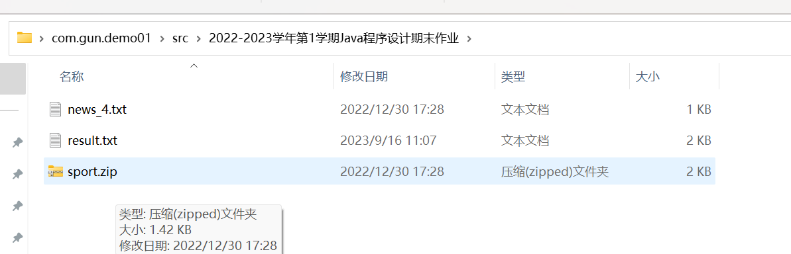
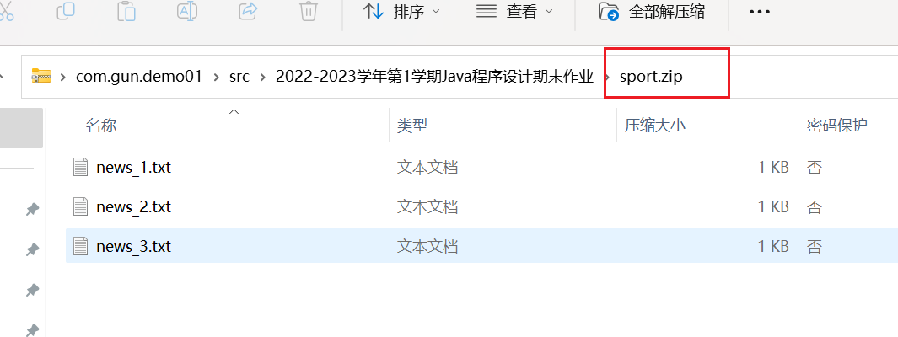
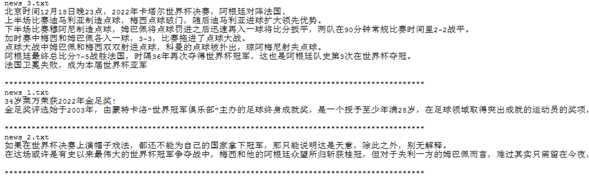
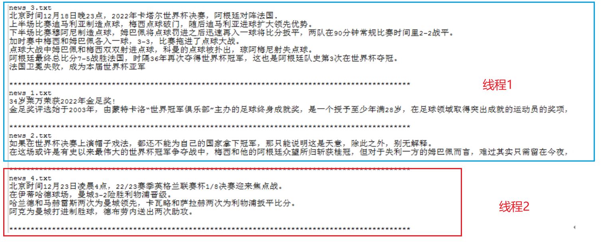
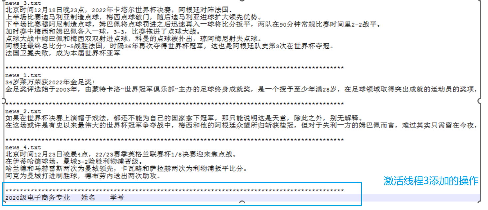
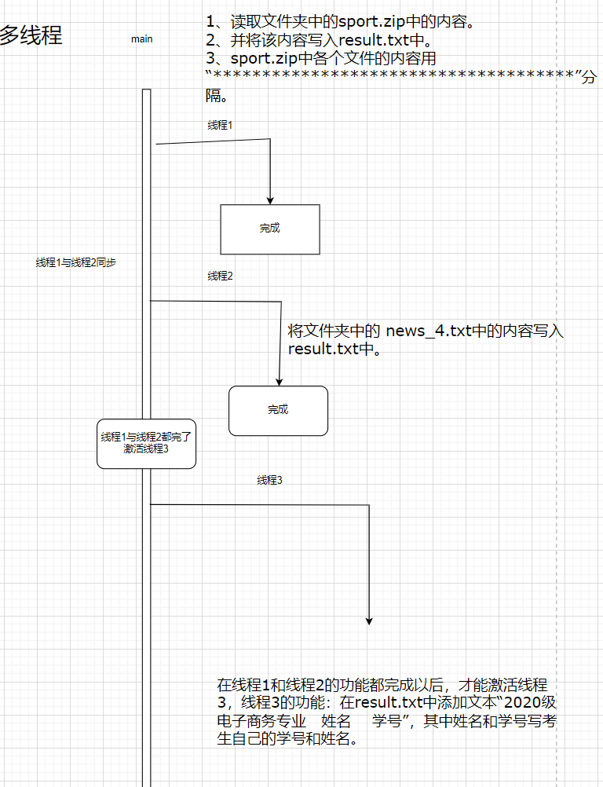
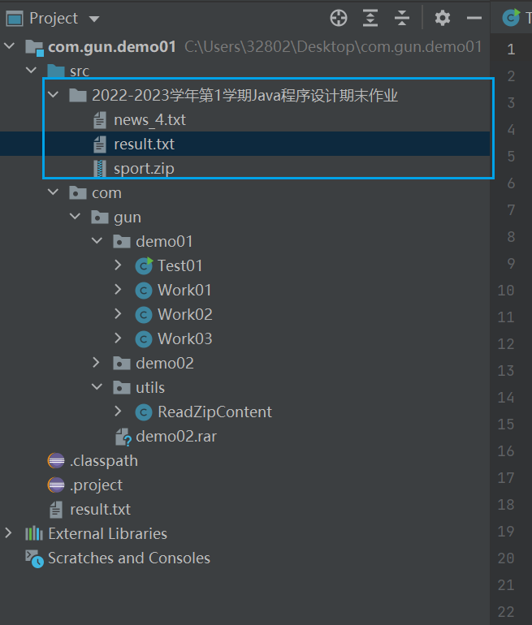
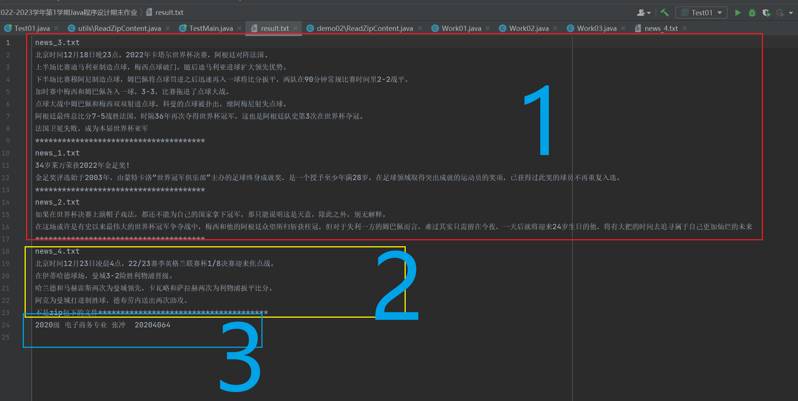

# 线程案例01

请结合所学知识实现下述程序：




zip压缩包的文件内容。




## 需求描述

1、线程1的功能：读取“2022-2023学年Java程序设计期末作业”文件夹中的sport.zip中的内容，并将该内容写入result.txt中，sport.zip中各个文件的内容用“*************************************”分隔。如图1所示。



2、线程2的功能：将“2022-2023学年Java程序设计期末作业”文件夹中的 news_4.txt中的内容写入result.txt中。

3、要求实现线程1和线程2的同步访问。如图2所示。



4、在线程1和线程2的功能都完成以后，才能激活线程3，线程3的功能：在result.txt中添加文本“2020级 电子商务专业  姓名  学号”，其中姓名和学号写考生自己的学号和姓名。如图3所示。



5、最终的程序以工程的方式提交，工程以“学号+姓名”方式命名，作业截止时间为2023年1月3日。


## 分析执行逻辑图




## 代码实现

工程结构



创造主类。

```java
package com.gun.demo01;

public class Test01 {
	public static void main(String[] args) {
		// 1.实现线程1和线程2的同步访问
		System.out.println(Thread.currentThread().getName()+"主线程执行了");
		//创建线程一:读取下面的文件
		Thread task01 =new Thread(new Work01());
		Thread task02 =new Thread(new Work02());


		// 创建了线程 3
		Thread task03 =new Thread(new Work03(task01,task02));
		task01.start();
		task02.start();
		task03.start();
		
	}

}

```


线程1

```java
package com.gun.demo01;

import java.io.IOException;
import java.util.ArrayList;
import java.util.Enumeration;
import java.util.List;
import java.util.zip.ZipEntry;
import java.util.zip.ZipFile;


import com.gun.utils.ReadZipContent;

public class Work01 implements Runnable{

	@Override
	public void run() {
		
		System.out.println(Thread.currentThread().getName()+"子线程执行了");
		
		//读取zip文件
		List<List<String>> readZipFile = ReadZipContent.readZipFile("C:\\Users\\32802\\Desktop\\com.gun.demo01\\src\\2022-2023学年第1学期Java程序设计期末作业/sport.zip");
		
		try {
			ReadZipContent.writeFilesContent(readZipFile);
		} catch (IOException e) {
			// TODO Auto-generated catch block
			e.printStackTrace();
		}

	}
	
	
    //读取zip文件内的文件,返回文件名称列表
    public static List<String> readZipFileName(String path){
        List<String> list = new ArrayList<>();
        try {
        	// zip文件对象
            ZipFile zipFile = new ZipFile(path);
            
            Enumeration<? extends ZipEntry> entries = zipFile.entries();
            
            while (entries.hasMoreElements()) {
            	
                list.add(entries.nextElement().getName());
            }
        } catch (IOException e) {
            e.printStackTrace();
        }
        return list;
    }
    
}

```

线程2

```java
package com.gun.demo01;
import java.io.IOException;
import java.util.List;

import com.gun.utils.ReadZipContent;

public class Work02 implements Runnable{

	@Override
	public void run() {
		System.out.println(Thread.currentThread().getName()+"子线程执行了");
		List<List<String>> readZipFile = null;
		try {
			// 读取，news_4.txt文件
			readZipFile = ReadZipContent.readZipFile("C:\\Users\\32802\\Desktop\\com.gun.demo01\\src\\2022-2023学年第1学期Java程序设计期末作业\\news_4.txt");
			
			ReadZipContent.writeFilesContent(readZipFile);
			
		} catch (IOException e) {
			// TODO Auto-generated catch block
			e.printStackTrace();
		}
		
		
	}

}

```

线程3

```java
package com.gun.demo01;

import java.io.File;
import java.io.FileOutputStream;
import java.io.IOException;


public class Work03 implements Runnable{

	/**
	 * 静态常量
	 */
	private static Thread task01;
	private static Thread task02; 


	public Work03(Thread task01,Thread task02) {
		this.task01 = task01;
		this.task02 = task02;
	}


	/**
	 * 线程三的逻辑方法
	 */
	@Override
	public void run() {
		
		try {
			task01.join();
			task02.join();
		} catch (InterruptedException e1) {
			e1.printStackTrace();
		}


		/**
		 * 创建文件输出流对象。写
		 * 一行年级 + 专业 + 名字 + 学号
		 */
		try {
			FileOutputStream fileOutputStream = new FileOutputStream(new File("C:\\Users\\32802\\Desktop\\com.gun.demo01\\src\\2022-2023学年第1学期Java程序设计期末作业\\result.txt"),true);
			fileOutputStream.write("2020级 电子商务专业 张冲  20204064\n".getBytes());
			fileOutputStream.close();
		} catch (IOException e) {
			// TODO Auto-generated catch block
			e.printStackTrace();
		}


	}

}

```


## 测试效果



## 读txt文件工具类


```java
package com.gun.utils;

import java.io.BufferedInputStream;
import java.io.BufferedReader;
import java.io.File;
import java.io.FileInputStream;
import java.io.FileNotFoundException;
import java.io.FileOutputStream;
import java.io.IOException;
import java.io.InputStream;
import java.io.InputStreamReader;
import java.nio.charset.Charset;
import java.util.ArrayList;
import java.util.List;
import java.util.zip.ZipEntry;
import java.util.zip.ZipFile;
import java.util.zip.ZipInputStream;


/**
 * 是用来读取zip文件的内容的，
 *
 * 读：2022-2023学年第1学期Java程序设计期末作业下面的.txt的文件。
 */
public class ReadZipContent {


	/**
	 *
	 * @param path
	 * @return 一个容器，容器放到是list容器
	 * 每一个list集合元素的字符串，
	 * 一个字符串元素：表示.txt的一行记录。 0  ==》 表示txt的第一行。
	 *
	 * 还原原来的文本就是：从0开始遍历list就行。
	 */
	//读取zip文件内的文件,返回文件内容列表
    public synchronized static List<List<String>> readZipFile(String path){
        

        // 存放的是每一个文件的内容容器
    	List< List<String> > ddlList=new ArrayList<>();
    	
    	BufferedReader br = null;
    	
    	System.out.println(path.substring(path.lastIndexOf(".")));


    	if(path.substring(path.lastIndexOf(".")+1).equals("zip")){


    		// ================   是一个压缩包
        try {
        	// 创建文件要读取的
            ZipFile zipFile = new ZipFile(path);
            InputStream in = new BufferedInputStream(new FileInputStream(path));
            ZipInputStream zin = new ZipInputStream(in);
            //文件对象
            ZipEntry ze;

			/**
			 * 遍历zip包下的文件。
			 */
			while ((ze = zin.getNextEntry()) != null) {
                if (ze.isDirectory()) {
                	//是个目录怎么办？
                } else {
                	//开始读取文件
                	System.err.println("zip包下的文件：file - " + ze.getName() + " : "+ ze.getSize() + " bytes");
                    long size = ze.getSize();
                    // 大于0  文件有内容
                    if (size > 0) {
                    	
                    	ArrayList<String> list = new ArrayList<>();
                    	// 将文夹的名字放入 容器首元素
                    	list.add(ze.getName());
                    	
                        br = new BufferedReader(new InputStreamReader(zipFile.getInputStream(ze),Charset.forName("utf-8")));
                        //循环读取每一行
                        String line;
                        while ((line = br.readLine()) != null) {
                        	list.add(line);
                        }
                        
                        list.add("**************************************");
                        // 文件 容器  放入存放内容的容器
                        ddlList.add(list);
            
                      
                    }
                }
                //处理ddlList,此时ddlList为每个文件的内容,while每循环一次则读取一个文件
            }
            zin.closeEntry();
            
            br.close();
        } catch (IOException e) {
            e.printStackTrace();
        }
        
    	}else{

    		// 不是一个压缩包       如读取  news_4.txt文件
    		ArrayList<String> list = new ArrayList<>();
    		File file = new File(path);
    		try {
				 br = new 
						BufferedReader(new 
								InputStreamReader(new 
										FileInputStream(file),Charset.forName("utf-8")));
				
				String name = file.getName();
				
            	// 将文夹的名字放入 容器首元素
            	list.add(name);
                //循环读取每一行
                String line;
                while ((line = br.readLine()) != null) {
                	list.add(line);
                }
                list.add("不是zip包下的文件**************************************");
                
                // 文件 容器  放入存放内容的容器
                ddlList.add(list);
    
               
				
			} catch (FileNotFoundException e) {
				// TODO Auto-generated catch block
				e.printStackTrace();
			} catch (IOException e) {
				// TODO Auto-generated catch block
				e.printStackTrace();
			}finally {
				 try {
					br.close();
				} catch (IOException e) {
					// TODO Auto-generated catch block
					e.printStackTrace();
				}
			}
    		
    	}
        //此处返回无用,懒得修改了
        return ddlList;
    }
    
    
    
    public synchronized static void writeFilesContent(List<List<String>> readZipFile) throws IOException{
    	
    	FileOutputStream fileOutputStream = null;
		// 开始写入文件到result.txt中
		try {
			fileOutputStream = new FileOutputStream(new File("src/2022-2023学年第1学期Java程序设计期末作业/result.txt"),true);
			for(List<String> list:readZipFile){
				
				for(String line:list){
					System.out.println(line);
					byte[] lineBytes = line.getBytes();
					fileOutputStream.write(lineBytes);
					fileOutputStream.write("\n".getBytes());
				}
				
			}
			
		} catch (FileNotFoundException e) {
			// TODO Auto-generated catch block
			e.printStackTrace();
		} catch (IOException e) {
			// TODO Auto-generated catch block
			e.printStackTrace();
		}finally {
			fileOutputStream.close();
		}
		
	}
    

}

```


