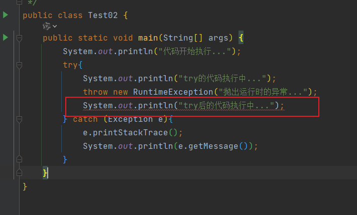
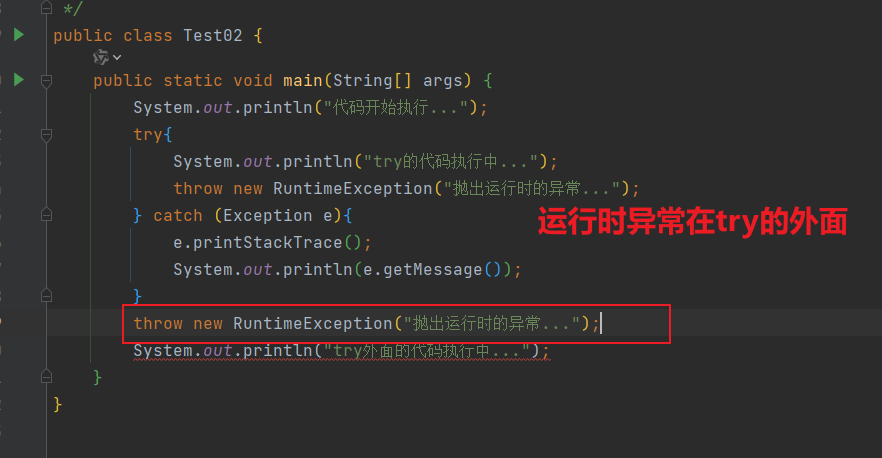
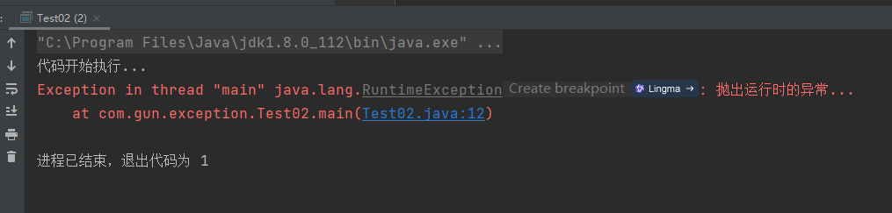
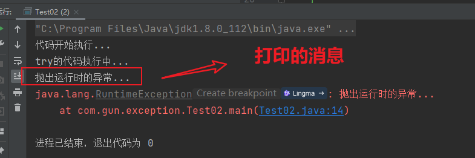

# java异常提问

## 问题一

问：java执行抛出运行时的异常，后面的代码还会运行吗？

实践案例：







```
public class Test02 {
    public static void main(String[] args) {
        System.out.println("代码开始执行...");
        throw new RuntimeException("抛出运行时的异常...");
    }
}
```

运行结果：




```
public class Test02 {
    public static void main(String[] args) {
        System.out.println("代码开始执行...");
        try{
            System.out.println("try的代码执行中...");
            throw new RuntimeException("抛出运行时的异常...");
        } catch (Exception e){
            e.printStackTrace();
            System.out.println(e.getMessage());
        }

    }
}

```

运行结果：




结论一：抛出运行时的异常，后面的代码是不会运行的。【后面的代码不会在执行】