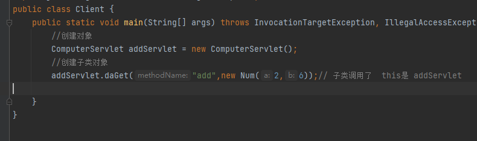
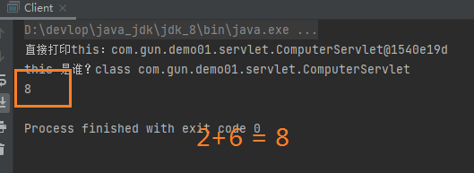
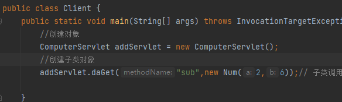
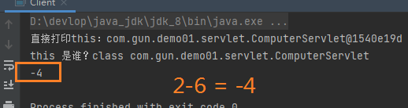
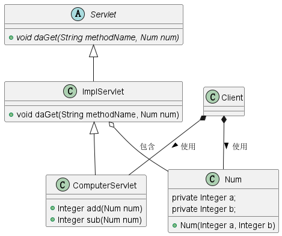
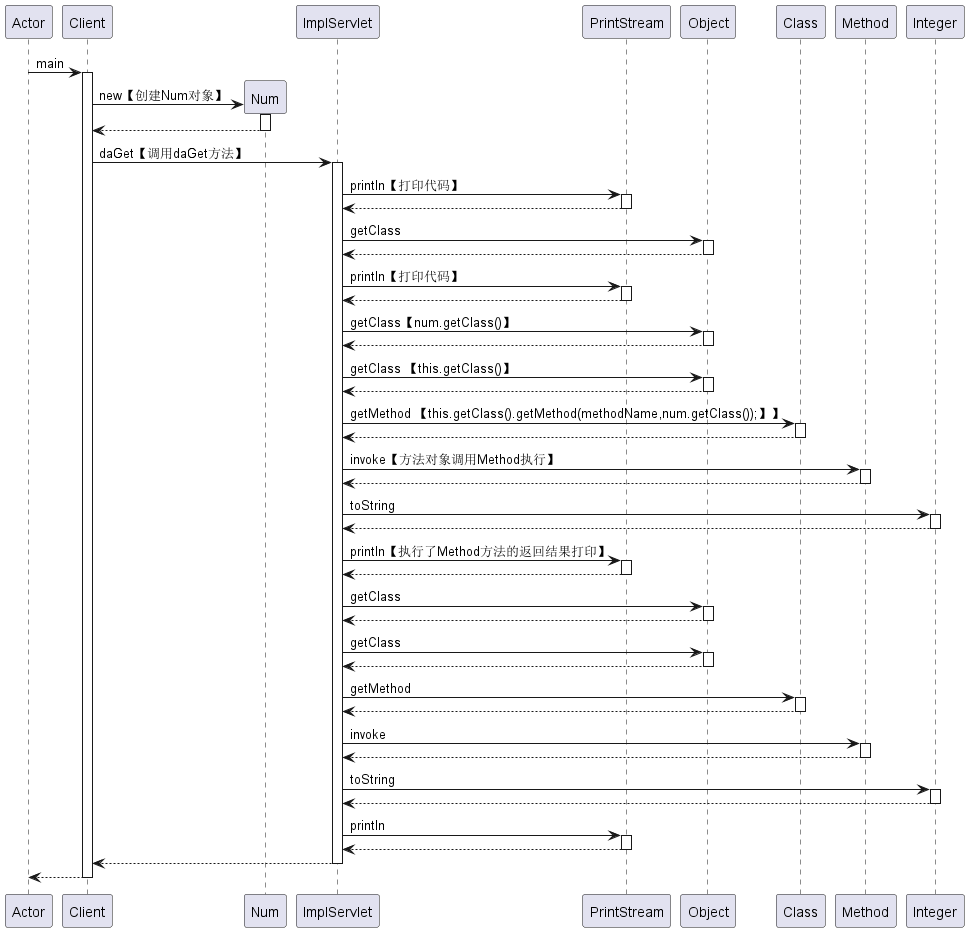

# 反射(reflect)

**案例一：**客户端创建一个运算的对象，并且调用获取运算结果的doGet()方法。传递参数！第一个参数：指定做什么运算，第二个参数表示：对二个数进行xxxx运算的程序设



- 参数一：指定要进行什么运算！
- 参数二：指定对那二个数进行运算！

**运行效果**



当传递的参数为sub时。



**运行效果**



## 四则运算案例

**实现的UML图如下：**



- ImplServlet类
  - doGet()方法：
    - 参数一：要调用的方法名
    - 参数二：运算的操作数
- ComputerServlet类
  - add()：对二个数进行加法操作
  - sub()：对二个数进行减法操作

::: tip
> - 这样的好处：
>   1. `容易操作性：`客户端我们只要创建二个对象。和一个指定做什么运算的参数。就不用要做减法，要去创建一个对象进行传递参数进行运算返回值！
>   2. `易扩展性：`如果我们进行其他运算呢？就不需要进行创建类，在进行编写方法。我们只需要在ComputerServlet类中进行添加要操作的方法。在ImplServlet类的doGet()方法里面添加一个Switch分支就行。
:::
客户端效果的实现，还是依赖于java的反射特性去完成的！主要核心代码也就是doGet()的实现。创建ImplServlet类去实现Servlet抽象类。

```java
package com.gun.demo01.servlet;

import com.gun.demo01.servlet.bean.Num;

import java.lang.reflect.InvocationTargetException;
import java.lang.reflect.Method;

public class ImplServlet extends Servlet{
    /**
     * @param methodName 客户端传递过来的方法名，用途：指定做什么运算操作
     * @param num ：对那二个数进行运算操作
     * @throws InvocationTargetException 执行目标异常
     * @throws IllegalAccessException 无效接收异常
     * @throws NoSuchMethodException  没有那样的方法异常
     */
    @Override
    public void daGet(String methodName, Num num) throws InvocationTargetException, IllegalAccessException, NoSuchMethodException {
        /**
         * this.getClass() 获取全类路径 class com.gun.demo01.Son
         */
        System.out.println("直接打印this："+this);
        System.out.println("this 是谁？"+this.getClass());
        Method method;
        Object invoke;
        switch (methodName){
            case "add":// 添加运算
                // this 是 Son对象
                method = this.getClass().getMethod(methodName,num.getClass());
                invoke = method.invoke(this,num);
                System.out.println(Integer.toString((Integer) invoke));
                break;
            case "sub":
                method = this.getClass().getMethod(methodName,num.getClass());
                invoke = method.invoke(this,num);
                System.out.println(Integer.toString((Integer) invoke));
                break;

        }

    }
}

```

子类的`ComputerServlet`的实现是：继承了父类`ImplServlet`，并且有自己的成员方法。

```java
package com.gun.demo01.servlet;

import com.gun.demo01.servlet.bean.Num;

public class ComputerServlet extends ImplServlet{

    // 继承了父类的doGet方法;没有重写

    // 自己独有的添加方法;
    public Integer add(Num num){
        return num.getA()+num.getB();
    }

    // 自己独有的添加方法;
    public Integer sub(Num num){
        return num.getA()-num.getB();
    }

}

```

### 客户端的实现

```java

package com.gun.demo01.servlet;

import com.gun.demo01.servlet.bean.Num;
import java.lang.reflect.InvocationTargetException;
public class Client {
    public static void main(String[] args) throws InvocationTargetException, IllegalAccessException, NoSuchMethodException {
        //创建对象
        ComputerServlet addServlet = new ComputerServlet();
        //创建子类对象
        addServlet.daGet("sub",new Num(2,6));// 子类调用了  this是 addServlet

    }
}
```

### 代码执行时序图



