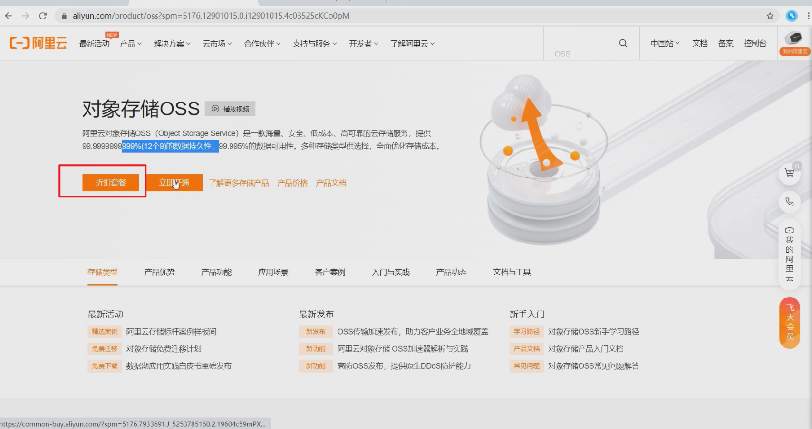
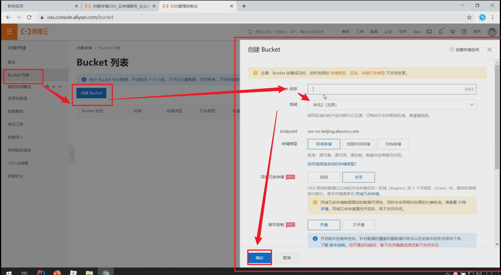
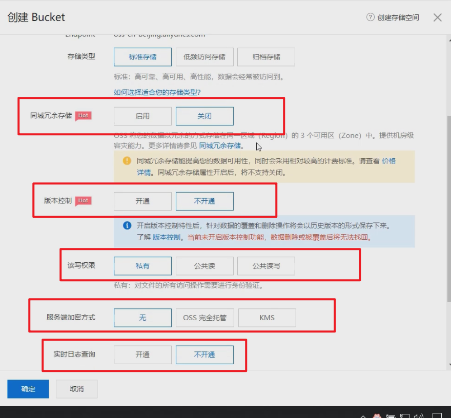
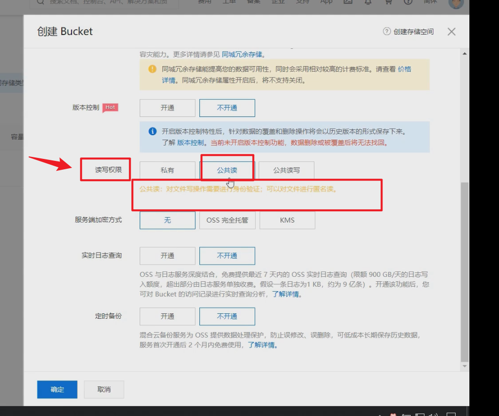
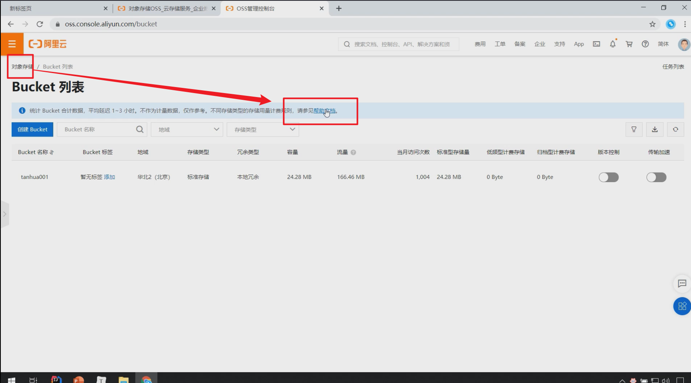
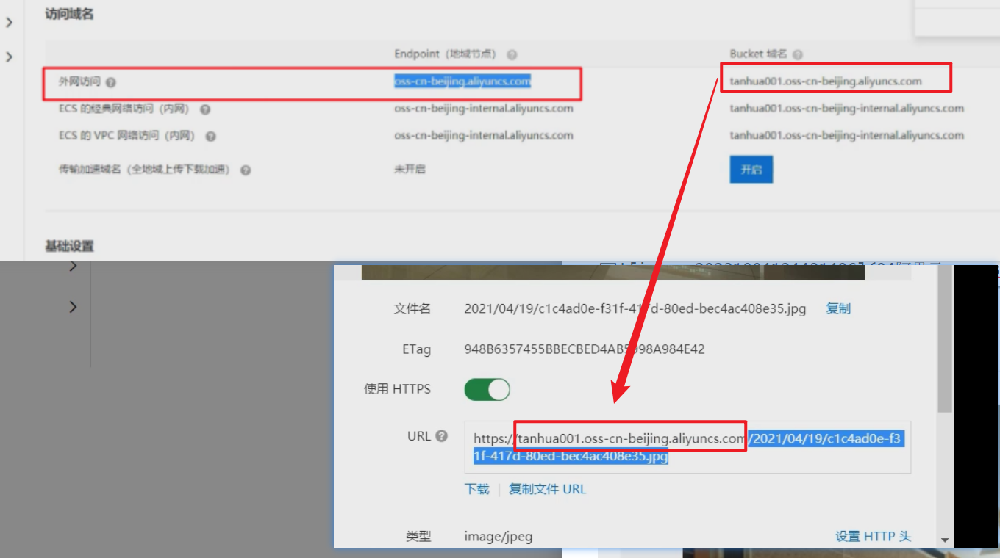
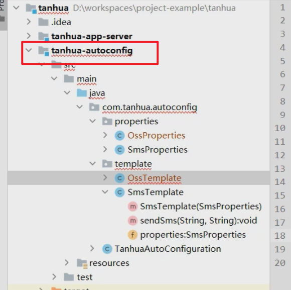

# 阿里云oss

## 如何实现用户头像上传与存储？

问题：用户图片多且杂，不易维护,不易扩展

解决：存储到第三方服务器，如阿里云

优点：自动扩容，后台可维护

实现图片上传服务，需要有存储的支持，那么我们的解决方案将以下几种：

1. 直接将图片保存到服务的硬盘（springmvc将的文件上传）
   1. 优点：开发便捷，成本低
   2. 缺点：扩容困难
2. 使用分布式文件系统进行存储
   1. 优点：容易实现扩容
   2. 缺点：开发复杂度稍大（有成熟的产品可以使用，比如：FastDFS）
3. 使用第三方的存储服务
   1. 优点：开发简单，拥有强大功能，免维护
   2. 缺点：付费

1. 1. 缺点：付费

选用阿里云的OSS服务进行图片存储。


## 01)概述

对象存储服务（Object Storage Service，OSS）是一种海量、安全、低成本、高可靠的云存储服务，适合存放任意类型的文件。容量和处理能力弹性扩展，多种存储类型供选择，全面优化存储成本。

地址：https://www.aliyun.com/product/oss


## 02)账号申请

注册并开发阿里云OSS的步骤如下

1. 注册阿里云账号
2. 开通对象存储OSS功能
3. 购买服务
4. 创建Bucket
5. 代码测试

### 2.1)开通对象存储OSS功能




::: tip 注意

购买下行流量包： （不购买也可以使用，按照流量付费）

:::


::: tip 注意

说明：OSS的上行流量是免费的，但是下行流量是需要购买的。

:::


### 2.2)创建Bucket










### 2.3)代码测试








## 抽取模板工具

和发送短信类似，阿里云OSS也是采用自定义工具的形式进行封装

**OssProperties**

tanhua-autoconfig创建配置类

```java
@Data
@ConfigurationProperties(prefix = "tanhua.oss")
public class OssProperties {

    private String accessKey; 
    private String secret;
    
    // 桶的名字
    private String bucketName;
    private String url; //域名，访问图片使用的。
    private String endpoint;
}
```

**OssTemplate**

tanhua-autoconfig创建模板对象

```java
package com.tanhua.autoconfig.template;

import com.aliyun.oss.OSS;
import com.aliyun.oss.OSSClientBuilder;
import com.tanhua.autoconfig.properties.OssProperties;

import java.io.InputStream;
import java.text.SimpleDateFormat;
import java.util.Date;
import java.util.UUID;

public class OssTemplate {

    // 组合
    private OssProperties properties;

    public OssTemplate(OssProperties properties) {
        this.properties = properties;
    }

    /**
     * 文件上传
     *   1：文件名称
     *   2：输入流
     */
    public String upload(String filename, InputStream is) {
        
        
        // 阿里云机子上的路径
        //3、拼写图片路径
        filename = new SimpleDateFormat("yyyy/MM/dd").format(new Date())
                +"/"+ UUID.randomUUID().toString() + filename.substring(filename.lastIndexOf("."));


        // yourEndpoint填写Bucket所在地域对应的Endpoint。以华东1（杭州）为例，Endpoint填写为https://oss-cn-hangzhou.aliyuncs.com。
        String endpoint = properties.getEndpoint();
        // 阿里云主账号AccessKey拥有所有API的访问权限，风险很高。强烈建议您创建并使用RAM账号进行API访问或日常运维，请登录 https://ram.console.aliyun.com 创建RAM账号。
        String accessKeyId = properties.getAccessKey();
        String accessKeySecret = properties.getSecret();

        // 创建OSSClient实例。
        OSS ossClient = new OSSClientBuilder().build(endpoint, accessKeyId,accessKeySecret);

        // 填写Byte数组。
        // 填写Bucket名称和Object完整路径。Object完整路径中不能包含Bucket名称。
        ossClient.putObject(properties.getBucketName(), filename, is);

        // 关闭OSSClient。
        ossClient.shutdown();

        String url = properties.getUrl() +"/" + filename;
        return url;
    }
    
    
}

```

**TanhuaAutoConfiguration**

TanhuaAutoConfiguration加入配置

```java
@EnableConfigurationProperties({
        SmsProperties.class,
        OssProperties.class
})
public class TanhuaAutoConfiguration {

    @Bean
    public SmsTemplate smsTemplate(SmsProperties properties) {
        return new SmsTemplate(properties);
    }

    @Bean
    public OssTemplate ossTemplate(OssProperties properties) {
        return new OssTemplate(properties);
    }
}
```

## 测试

tanhua-app-server加入配置内容，并测试

```yaml
tanhua:  
  oss:
    accessKey: LTAI4GKgob9vZ53k2SZdyAC7
    secret: LHLBvXmILRoyw0niRSBuXBZewQ30la
    endpoint: oss-cn-beijing.aliyuncs.com
    bucketName: tanhua001
    url: https://tanhua001.oss-cn-beijing.aliyuncs.com/
```




编写测试类

```java
@RunWith(SpringRunner.class)
@SpringBootTest(classes = AppServerApplication.class)
public class OssTest {

    @Autowired
    private OssTemplate template;

    @Test
    public void testTemplateUpload() throws FileNotFoundException {
        String path = "C:\\Users\\lemon\\Desktop\\课程资源\\02-完善用户信息\\03-资料\\2.jpg";
        FileInputStream inputStream = new FileInputStream(new File(path));
        String imageUrl = template.upload(path, inputStream);
        System.out.println(imageUrl);
    }
}
```

