# java项目打包exe文件


snale是java的项目名字


::: tip 第一步

idea打开

:::


::: tip 第二步

配置：外部的資源

注意：外部资源是放在src项目的根目录下的。

什么是项目的根目录？答：就是src目录下就是。【可能回答有错误！】

:::


图片、音乐的资源文件存放的目录本别是：img、music。

## 01)java项目打成jar包

设置好的效果：


步骤如下

### 第一步：

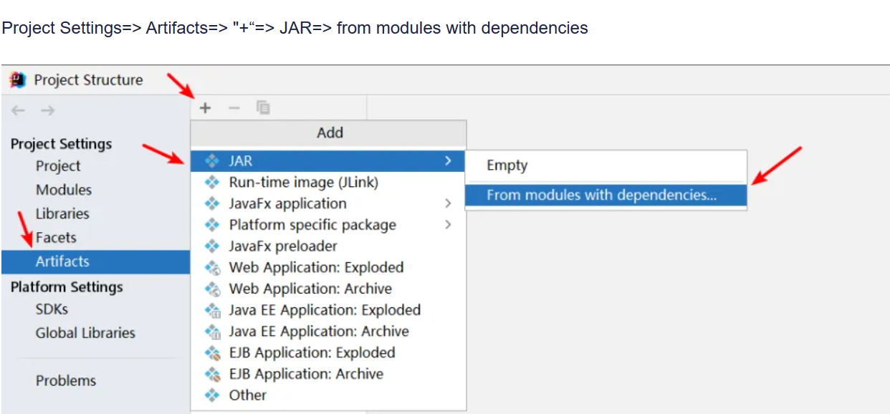

配置"Main Class"：点击那个文件夹图标，Idea会自动识别到main类。

JAR files from libraries选择“extract to the target JAR”：将所有的依赖放到生成的JAR包中。

另外要注意：Directory for META-INF/MANIFEST.MF这里，会自动生成出来。如果没有自动生成或者是灰色的，重新操作上述步骤。否则，后边用java -jar来执行时会失败，报错为：

配置"Main Class"：点击那个文件夹图标，Idea会自动识别到main类。

JAR files from libraries选择“extract to the target JAR”：将所有的依赖放到生成的JAR包中。

另外要注意：Directory for META-INF/MANIFEST.MF这里，会自动生成出来。如果没有自动生成或者是灰色的，重新操作上述步骤。否则，后边用java -jar来执行时会失败，报错为：

Error: Invalid or corrupt jarfile jar


**确认上述操作**

执行完上一步之后，左侧会生成META-INF文件夹。

先点击“Apply”，再点击“OK”

## 02)打包 

Build=> Build Artifacts...=> 点击“Build”或“Rebuild”即可生成最终的可运行的jar


## 03)命令行运行jar包

**法1：用命令行运行**

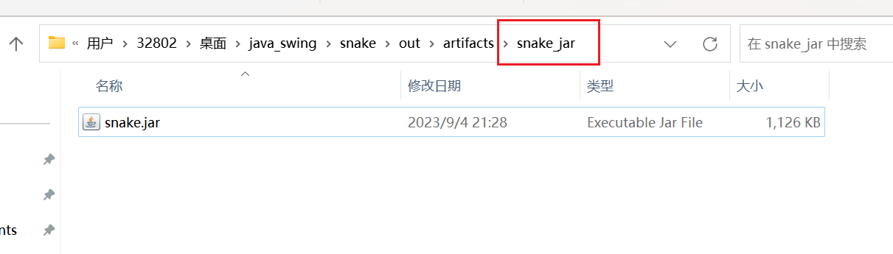


复制外部的音乐文件。到当前的目录下。


## 前提


1.输入注册码"L-g782dn2d-1f1yqxx1rv1sqd"。

```
L-g782dn2d-1f1yqxx1rv1sqd
```


## 【重点】exe4j_windows-x64_6_0_1将jar打成exe

如下图：

### 第一步


### 第二步

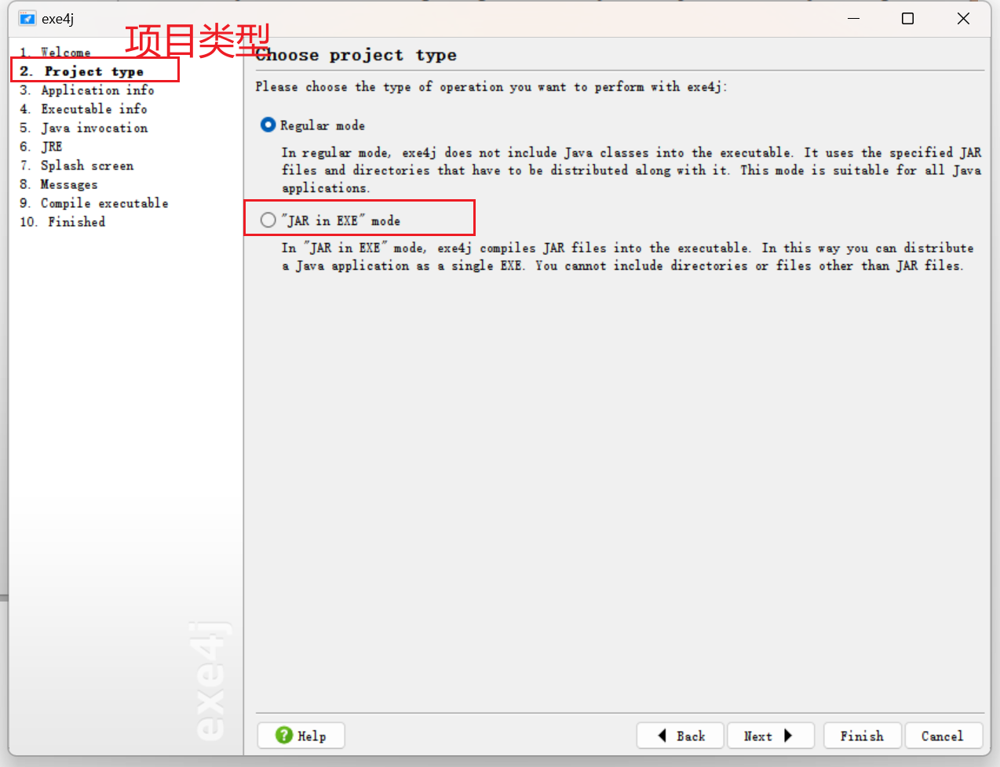

选择第二个。第一个打包完成后以后更新时需要更换jar，第二个更新时需要重新打包。


### 第三步


### 第四步

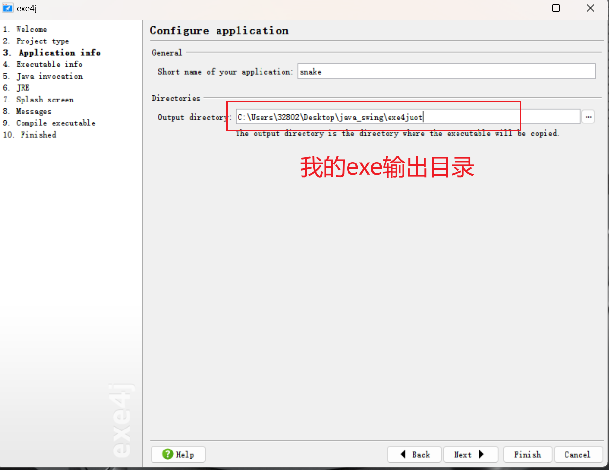


### 第五步


### 第六步

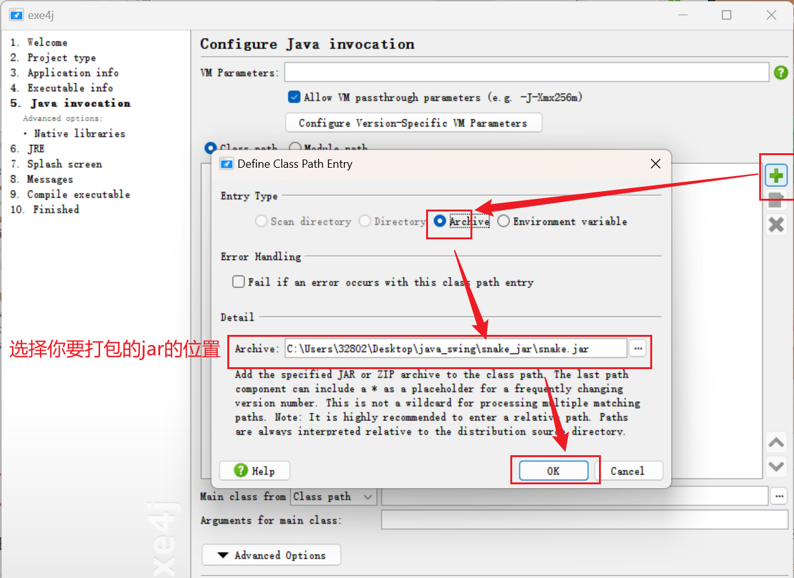


### 第七步


### 第八步


### 第九步)在输出的目录下查看


## 运行exe

因为有外部的音乐的资源。所以要复制到音乐的文件夹下面。


双击运行。


## 没安装jdk运行报错


## 重新打包安装【设置jre环境】

说明下：jre在哪里。


## 在次运行在没有jdk的环境下


## 04)将外部的文件全部打成一个exe有安装引导程序


jre要在当前目录下

音乐要在当前目录下

exe4j的文件是导入exe4j软件进行快速打成exe文件的文件。

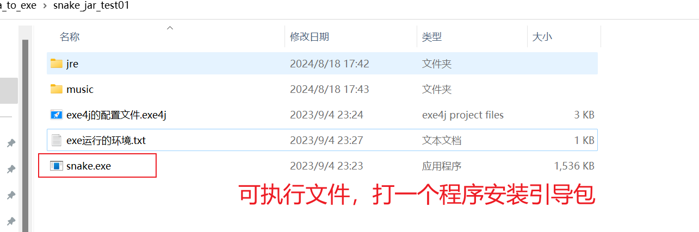


### 打java程序引导安装的包

innosetup-5.6.1    将外部支援、jre   打成 exe 的安装包


### 打开软件


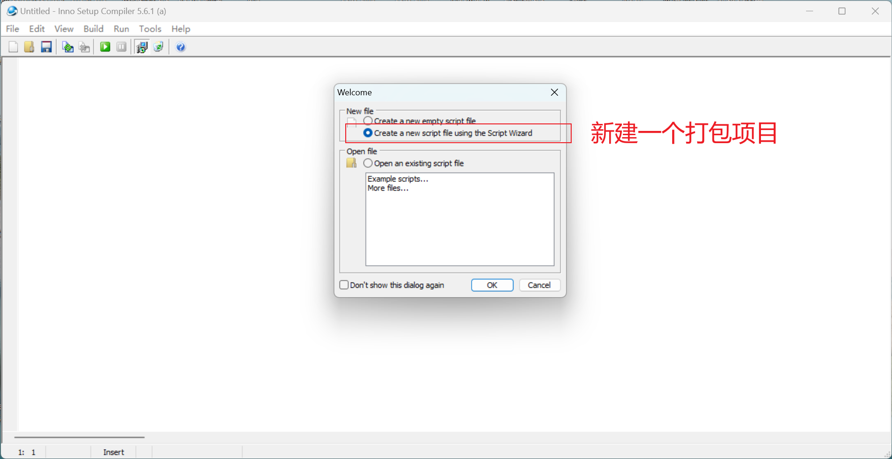


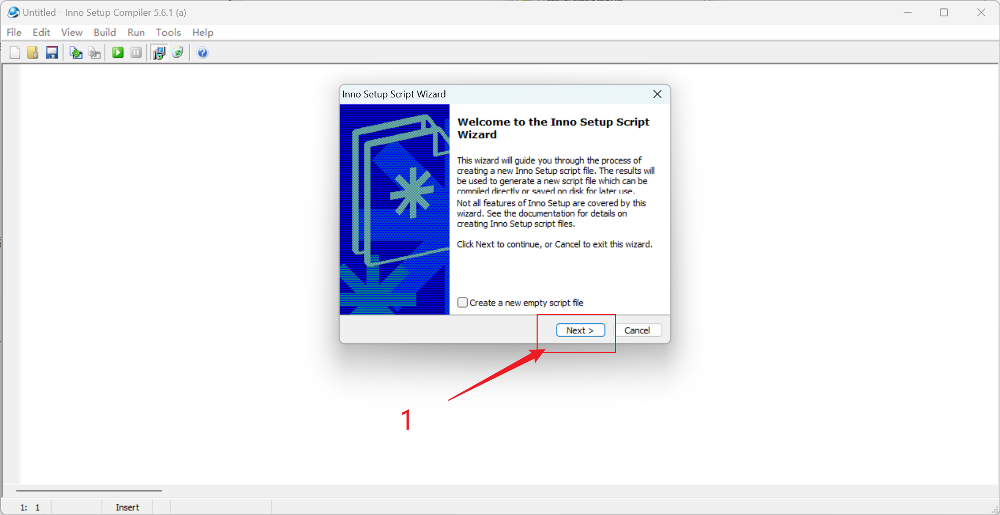


填写程序信息


这里不用更改，点击next


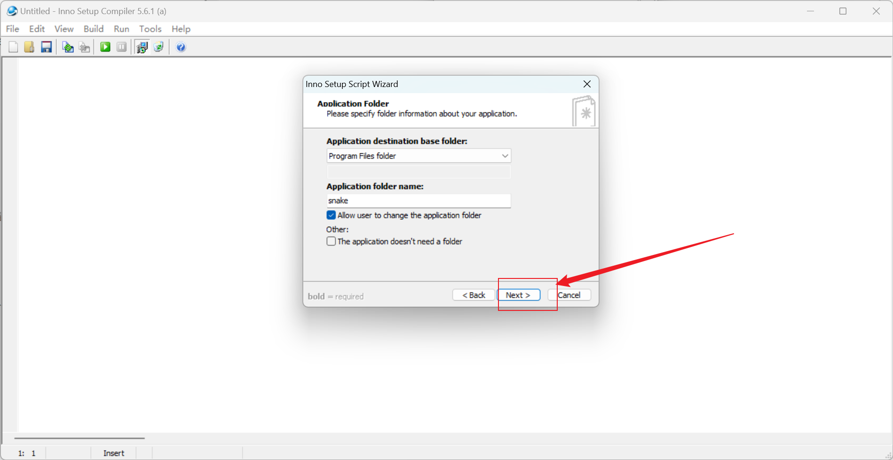


### 重点这一步

这里上面要选择程序的执行文件，也就是你已经生成的exe文件，下面选择添加文件夹，把所有你的程序运行需要的环境资源以及配置文件放在一个总的文件夹里，选择文件夹。然后next


这里可以选择许可文件，安装前的文件（如Readme文件等），安装后显示信息等，点击下一步。【默认我没有选！】

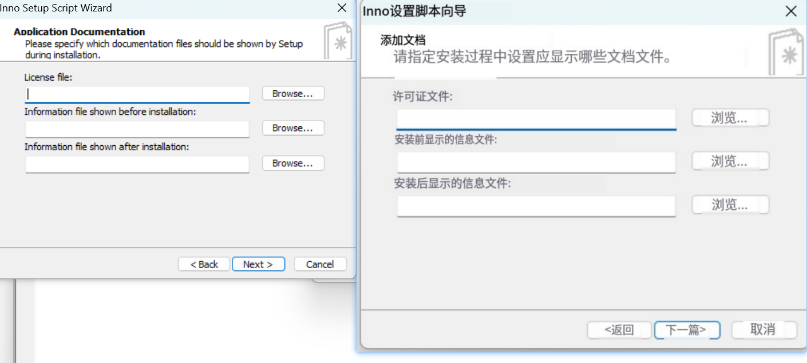


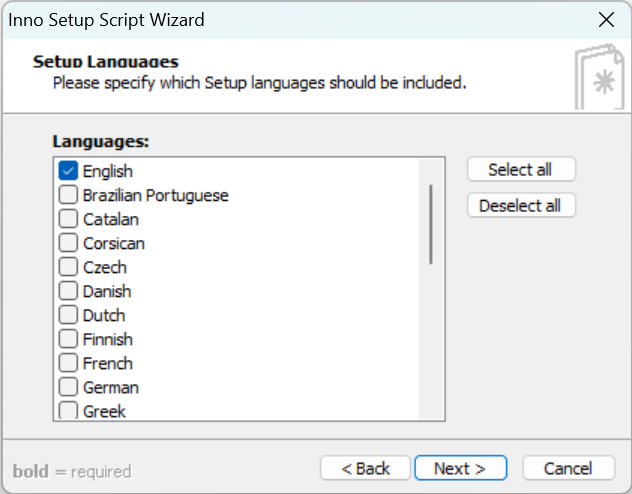


### 设置程序ico图片


在这里选择编译后安装包的输出文件夹位置，输出文件名等，还可以自定义的安装程序图标，填写完成后，点击下一步

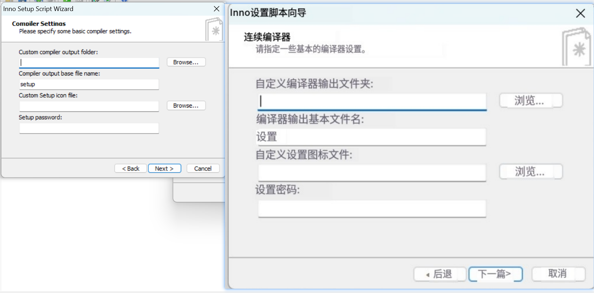


在这里选择是否使用define编译指令，选择是也就是在生成的脚本里使用#define宏定义一些常量，方便脚本编写，不勾选就是不用，看个人。选择后点击next。


### finish【完成】


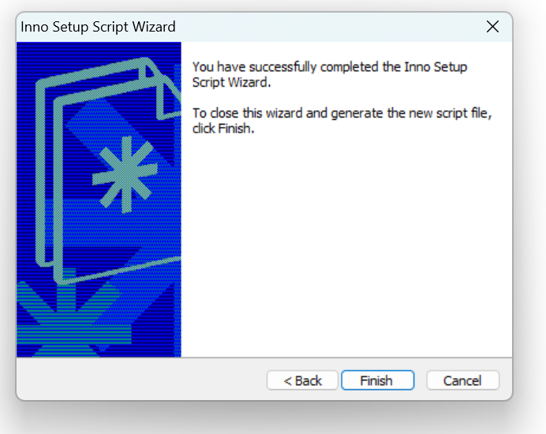


点击完成后会询问你是否立即编译新的脚本，这个脚本是根据刚才我们前面填写的那些内容自动生成的。可以直接使用编译，也可以自己重新编写。


问你是否保存script脚本信息，可保存，可不保存

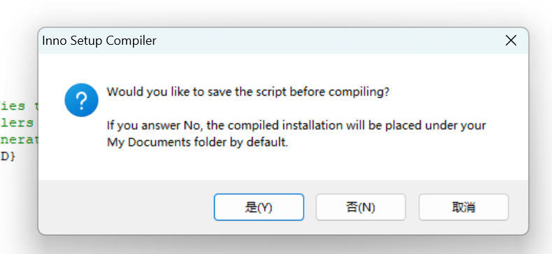


可以在之前设置的目录里找到生成的exe文件，现在你可以将它发给任何一个有windows电脑的人安装使用你所编写的java程序。


## 安装snake程序


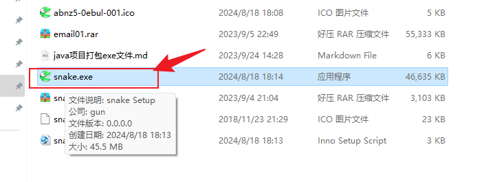


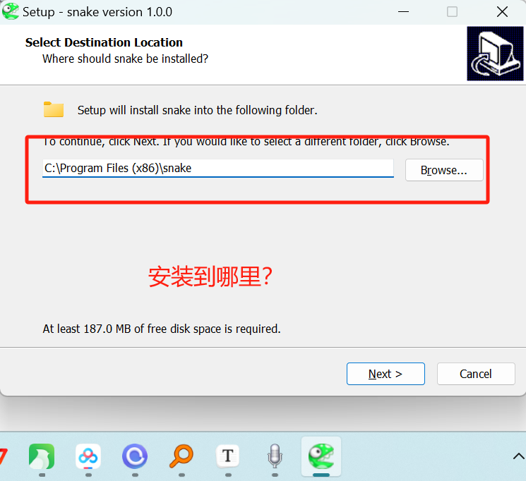


验证安装的程序没事声音。

