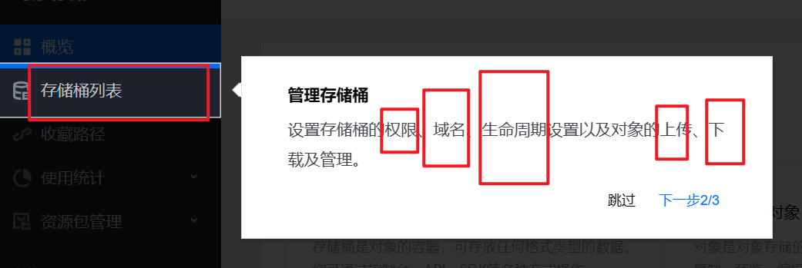
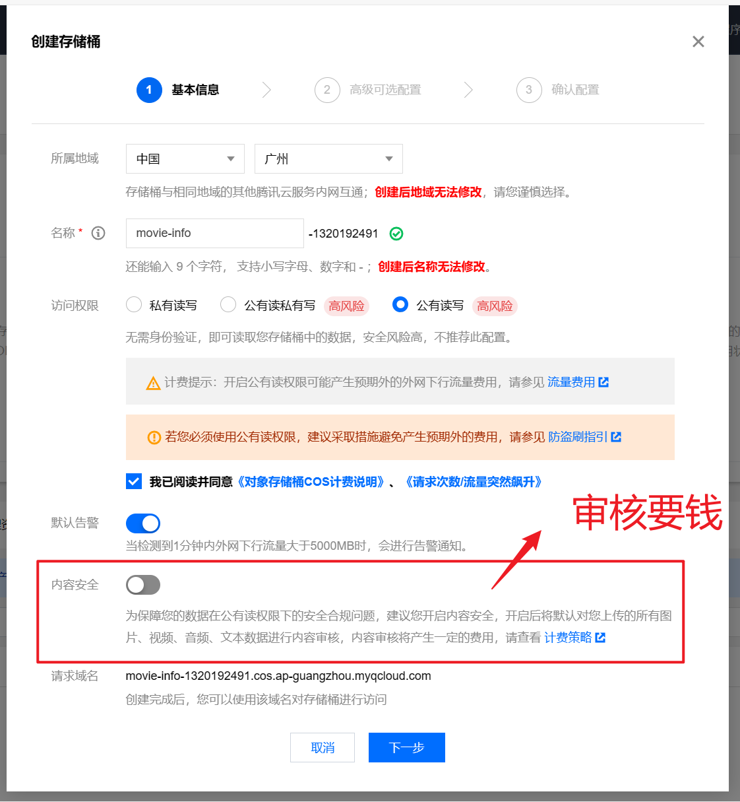
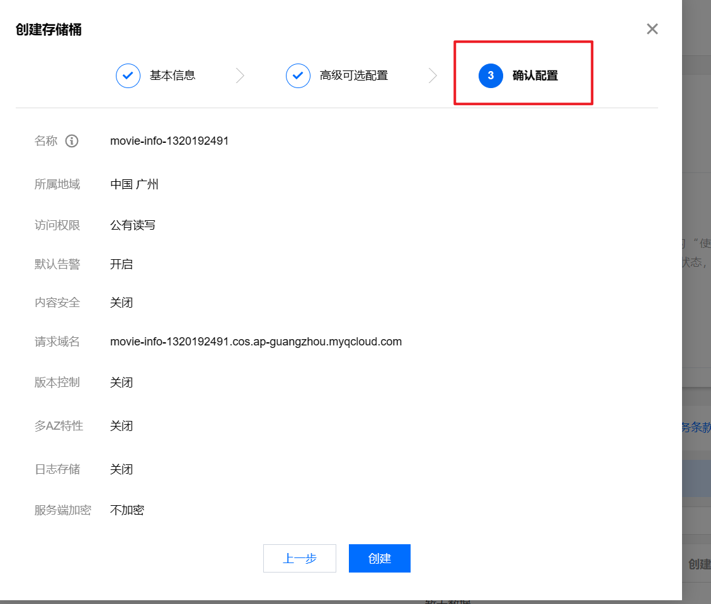
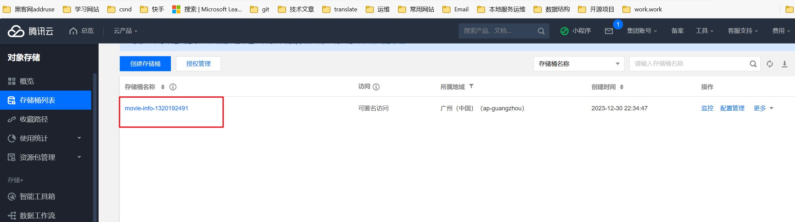

# 开通对象存储COS服务

- COS 是由腾讯云推出的无目录层次结构、无数据格式限制，可容纳海量数据且支持 HTTP/HTTPS 协议访问的分布式存储服务。COS 的**存储桶空间无容量上限，无需分区管理**，适用于 CDN 数据分发、数据万象处理或大数据计算与分析的数据湖等多种场景。
- COS 支持**按量计费（后付费）**和**资源包（预付费）**两种计费方式。开通 COS 后默认按量计费，支持所有地域。在您使用 COS 后，将根据您的存储容量、请求、流量等计费项的具体用量进行计费和结算。了解更多请查看 [计费概述](https://cloud.tencent.com/document/product/436/16871)

- 首次开通 COS 的新用户将获得一个**免费额度资源包**。该免费额度资源包的类型是**标准存储容量包**，有效期**6个月（180天）**，规格**个人用户50 GB 或企业用户1 TB** 。您的免费额度资源包的规格，取决于开通时的账号是个人用户还是企业用户。了解如何查询及使用以及适用范围，请查看[免费额度](https://cloud.tencent.com/document/product/436/6240)
- 当您有免费额度资源包和自购资源包时，结算顺序为：**免费额度 > 资源包 > 按量计费**。即系统将优先抵扣免费额度资源包和自购资源包，超出免费额度资源包和自购资源包部分将采用按量计费方式结算。了解更多场景的结算顺序，请查看[结算顺序](https://cloud.tencent.com/document/product/436/6240#.E7.BB.93.E7.AE.97.E9.A1.BA.E5.BA.8F)

## 计费与到期时间

## 开通访问权限

- 访问权限设置为：公有读写。

## 第三步确认配置

## 查看自己创建的桶

