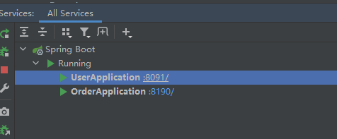
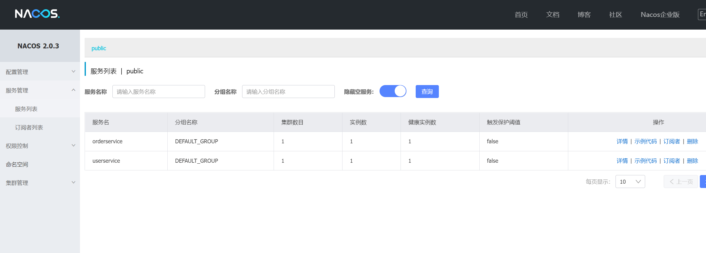
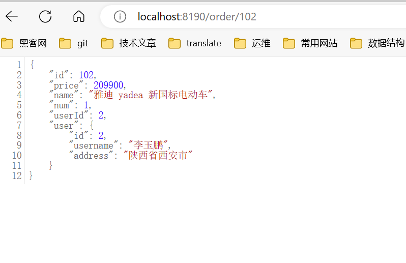

# 服务注册到nacos


## 数据准备

创建数据库。

- cloud-order【订单数据库】

```mysql
SET NAMES utf8mb4;
SET FOREIGN_KEY_CHECKS = 0;

-- ----------------------------
-- Table structure for tb_order
-- ----------------------------
DROP TABLE IF EXISTS `tb_order`;
CREATE TABLE `tb_order`  (
  `id` bigint(20) NOT NULL AUTO_INCREMENT COMMENT '订单id',
  `user_id` bigint(20) NOT NULL COMMENT '用户id',
  `name` varchar(100) CHARACTER SET utf8 COLLATE utf8_general_ci NULL DEFAULT NULL COMMENT '商品名称',
  `price` bigint(20) NOT NULL COMMENT '商品价格',
  `num` int(10) NULL DEFAULT 0 COMMENT '商品数量',
  PRIMARY KEY (`id`) USING BTREE,
  UNIQUE INDEX `username`(`name`) USING BTREE
) ENGINE = InnoDB AUTO_INCREMENT = 109 CHARACTER SET = utf8 COLLATE = utf8_general_ci ROW_FORMAT = Compact;

-- ----------------------------
-- Records of tb_order
-- ----------------------------
INSERT INTO `tb_order` VALUES (101, 1, 'Apple 苹果 iPhone 12 ', 699900, 1);
INSERT INTO `tb_order` VALUES (102, 2, '雅迪 yadea 新国标电动车', 209900, 1);
INSERT INTO `tb_order` VALUES (103, 3, '骆驼（CAMEL）休闲运动鞋女', 43900, 1);
INSERT INTO `tb_order` VALUES (104, 4, '小米10 双模5G 骁龙865', 359900, 1);
INSERT INTO `tb_order` VALUES (105, 5, 'OPPO Reno3 Pro 双模5G 视频双防抖', 299900, 1);
INSERT INTO `tb_order` VALUES (106, 6, '美的（Midea) 新能效 冷静星II ', 544900, 1);
INSERT INTO `tb_order` VALUES (107, 2, '西昊/SIHOO 人体工学电脑椅子', 79900, 1);
INSERT INTO `tb_order` VALUES (108, 3, '梵班（FAMDBANN）休闲男鞋', 31900, 1);

SET FOREIGN_KEY_CHECKS = 1;

```


- cloud-user【用户数据库】

```mysql
SET NAMES utf8mb4;
SET FOREIGN_KEY_CHECKS = 0;

-- ----------------------------
-- Table structure for tb_user
-- ----------------------------
DROP TABLE IF EXISTS `tb_user`;
CREATE TABLE `tb_user`  (
  `id` bigint(20) NOT NULL AUTO_INCREMENT,
  `username` varchar(100) CHARACTER SET utf8 COLLATE utf8_general_ci NULL DEFAULT NULL COMMENT '收件人',
  `address` varchar(255) CHARACTER SET utf8 COLLATE utf8_general_ci NULL DEFAULT NULL COMMENT '地址',
  PRIMARY KEY (`id`) USING BTREE,
  UNIQUE INDEX `username`(`username`) USING BTREE
) ENGINE = InnoDB AUTO_INCREMENT = 109 CHARACTER SET = utf8 COLLATE = utf8_general_ci ROW_FORMAT = Compact;

-- ----------------------------
-- Records of tb_user
-- ----------------------------
INSERT INTO `tb_user` VALUES (1, '柳岩', '湖南省衡阳市');
INSERT INTO `tb_user` VALUES (2, '李玉鹏', '陕西省西安市');
INSERT INTO `tb_user` VALUES (3, '华沉鱼', '湖北省十堰市');
INSERT INTO `tb_user` VALUES (4, '张必沉', '天津市');
INSERT INTO `tb_user` VALUES (5, '郑爽爽', '辽宁省沈阳市大东区');
INSERT INTO `tb_user` VALUES (6, '刘亦菲', '山东省青岛市');

SET FOREIGN_KEY_CHECKS = 1;

```


## 服务注册配置

在user-service和order-service的application.yml中添加nacos地址：

```yaml
spring:
  cloud:
    nacos:
      server-addr: localhost:8848
```


## 启动测试

- springboot服务启动。




- nacos查看是否注册成功。





- 访问地址：[localhost:8190/order/102](http://localhost:8190/order/102)




