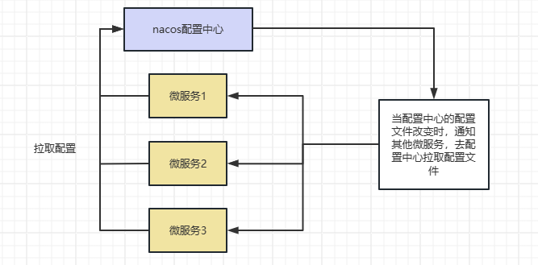
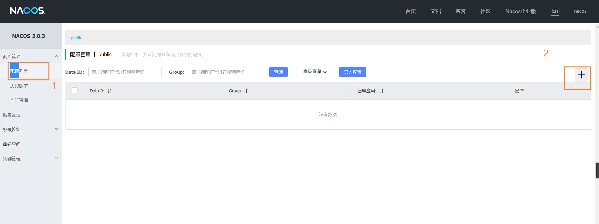
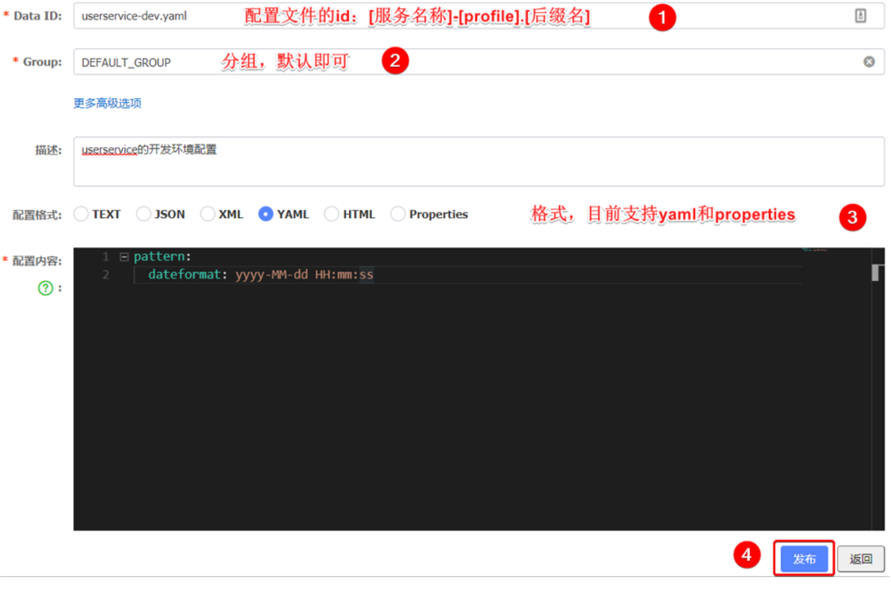
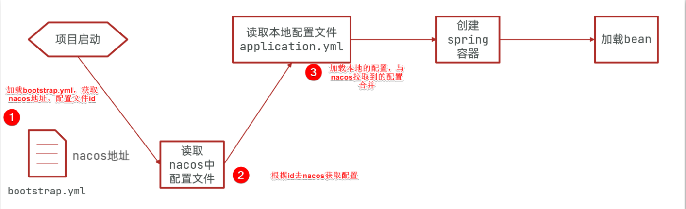
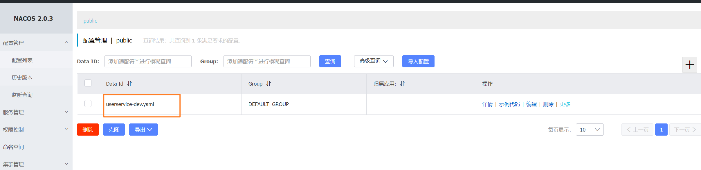
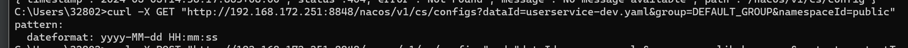
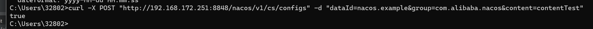

# Nacos配置管理


## 1)统一配置管理

当微服务部署的实例越来越多，达到数十、数百时，逐个修改微服务配置就会让人抓狂，而且很容易出错。我们需要一种统一配置管理方案，可以集中管理所有实例的配置。




Nacos一方面可以将配置集中管理，另一方可以在配置变更时，及时通知微服务，实现配置的热更新。


### 1.1)在nacos中添加配置文件

如何在nacos中管理配置呢？




然后在弹出的表单中，填写配置信息：




::: tip 注意

注意：项目的核心配置，需要热更新的配置才有放到nacos管理的必要。基本不会变更的一些配置还是保存在微服务本地比较好。

:::

### 1.2)从微服务拉取配置

微服务要拉取nacos中管理的配置，并且与本地的application.yml配置合并，才能完成项目启动。

但如果尚未读取application.yml，又如何得知nacos地址呢？

因此spring引入了一种新的配置文件：bootstrap.yaml文件，会在application.yml之前被读取，流程如下：

1. 加载bootstrap.yml文件，获取nacos的地址、配置文件的id。
2. 读取nacos配置中心的配置文件。【根据id去nacos获取配置文件】
3. 加载本地的配置，与nacos的配置进行**合并**。
4. spring容器进行创建
5. 加载对应的Bean




1）引入nacos-config依赖

首先，在user-service服务中，引入nacos-config的客户端依赖：

```xml
<!--nacos配置管理依赖-->
<dependency>
    <groupId>com.alibaba.cloud</groupId>
    <artifactId>spring-cloud-starter-alibaba-nacos-config</artifactId>
</dependency>
```

2）添加bootstrap.yaml文件

然后，在user-service中添加一个bootstrap.yaml文件，内容如下：

```yaml
spring:
  application:
    name: userservice # 服务名称
  profiles:
    active: dev #开发环境，这里是dev 
  cloud:
    nacos:
      server-addr: localhost:8848 # Nacos地址
      config:
        file-extension: yaml # 文件后缀名
```

3）在user-service服务中，修改PatternProperties类，读取新添加的属性：

```java
/**
 * 读取配置文件
 */
@Data
@Component
@ConfigurationProperties(prefix = "pattern")
public class PatternProperties {
    private String dateformat;
    private String envSharedValue;
    private String name;
}
```


4）在user-service服务中，修改UserController，添加一个方法： 

```java
    @Autowired
    private PatternProperties properties;
    /**
     * 配置文件的属性
     * @return
     */
    @GetMapping("/prop")
    public PatternProperties properties(){
        return properties;
    }
    /**
     * 读取配置文件
     * @return
     */
    @GetMapping("now")
    public String now(){
        return LocalDateTime.now().format(DateTimeFormatter.ofPattern(properties.getDateformat()));
    }
```

4）在nacos上添加，配置中心配置文件yaml。

1. data id 配置：userservice-dev.yaml

```yaml
pattern:
  dateformat: yyyy-MM-dd HH:mm:ss
```



配置文件。

- nacos启动信息

```java
05-04 20:35:36:835  INFO 187176 --- [           main] c.a.n.client.config.impl.ClientWorker    : [fixed-192.168.172.251_8848] [subscribe] userservice+DEFAULT_GROUP
05-04 20:35:36:836  INFO 187176 --- [           main] c.a.nacos.client.config.impl.CacheData   : [fixed-192.168.172.251_8848] [add-listener] ok, tenant=, dataId=userservice, group=DEFAULT_GROUP, cnt=1
05-04 20:35:36:836  INFO 187176 --- [           main] c.a.n.client.config.impl.ClientWorker    : [fixed-192.168.172.251_8848] [subscribe] userservice.yaml+DEFAULT_GROUP
05-04 20:35:36:836  INFO 187176 --- [           main] c.a.nacos.client.config.impl.CacheData   : [fixed-192.168.172.251_8848] [add-listener] ok, tenant=, dataId=userservice.yaml, group=DEFAULT_GROUP, cnt=1
05-04 20:35:36:837  INFO 187176 --- [           main] c.a.n.client.config.impl.ClientWorker    : [fixed-192.168.172.251_8848] [subscribe] userservice-dev.yaml+DEFAULT_GROUP
05-04 20:35:36:837  INFO 187176 --- [           main] c.a.nacos.client.config.impl.CacheData   : [fixed-192.168.172.251_8848] [add-listener] ok, tenant=, dataId=userservice-dev.yaml, group=DEFAULT_GROUP, cnt=1
```


### 1.3)配置热更新


```
curl -X GET 'http://192.168.172.251:8848/nacos/v2/cs/config?dataId=userservice-dev.yaml&group=DEFAULT_GROUP&namespaceId=public'
```




```
curl -X POST "http://192.168.172.251:8848/nacos/v1/cs/configs" -d "dataId=nacos.example&group=com.alibaba.nacos&content=contentTest"
```




