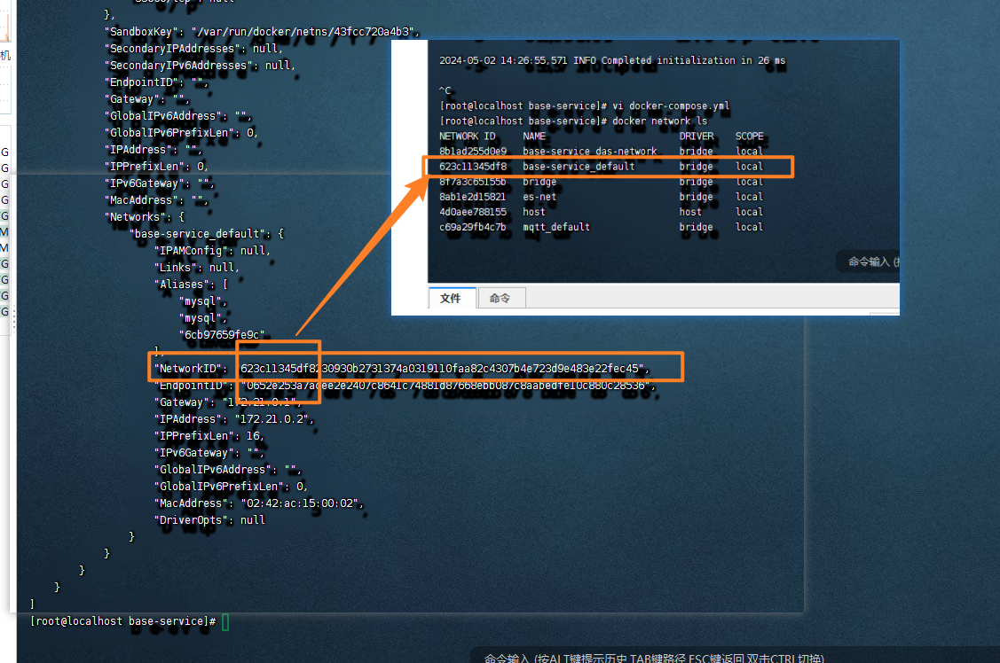
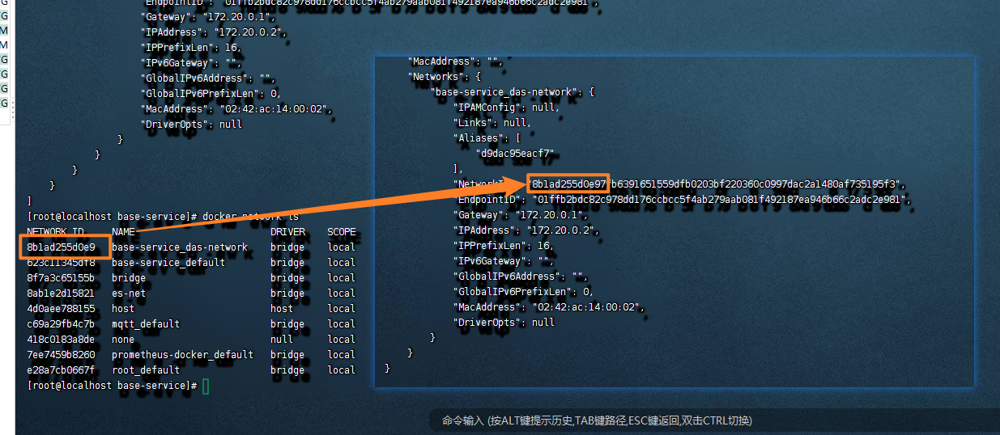
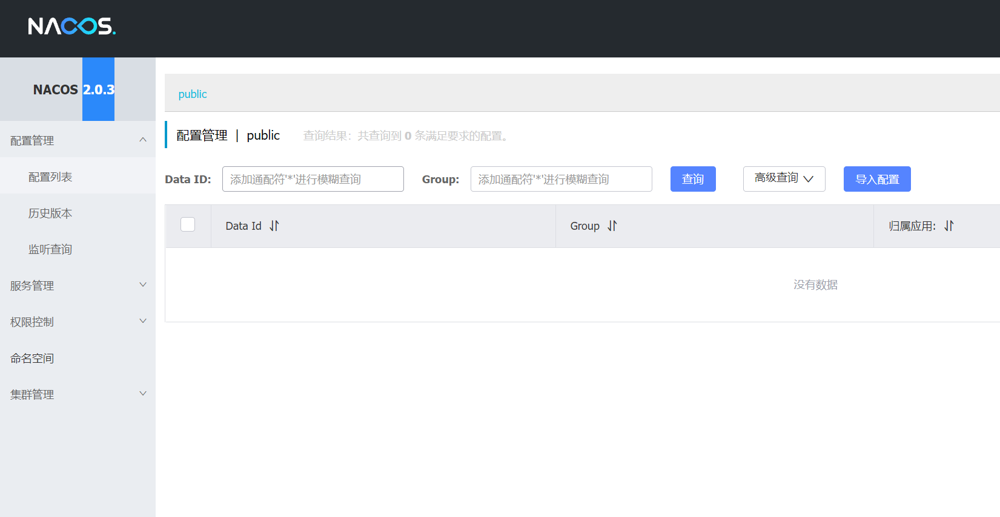

# nacos常见问题


## 1)nacos启动报错问题【docker】

```
 JAVA_OPT=' -Xms1g -Xmx1g -Xmn512m -Dnacos.standalone=true -Dnacos.member.list= -Djava.ext.dirs=/usr/lib/jvm/java-1.8.0-openjdk/jre/lib/ext:/usr/lib/jvm/java-1.8.0-openjdk/lib/ext:/home/nacos/plugins/health:/home/nacos/plugins/cmdb:/home/nacos/plugins/mysql -Xloggc:/home/nacos/logs/nacos_gc.log -verbose:gc -XX:+PrintGCDetails -XX:+PrintGCDateStamps -XX:+PrintGCTimeStamps -XX:+UseGCLogFileRotation -XX:NumberOfGCLogFiles=10 -XX:GCLogFileSize=100M -Dnacos.home=/home/nacos'
+ JAVA_OPT=' -Xms1g -Xmx1g -Xmn512m -Dnacos.standalone=true -Dnacos.member.list= -Djava.ext.dirs=/usr/lib/jvm/java-1.8.0-openjdk/jre/lib/ext:/usr/lib/jvm/java-1.8.0-openjdk/lib/ext:/home/nacos/plugins/health:/home/nacos/plugins/cmdb:/home/nacos/plugins/mysql -Xloggc:/home/nacos/logs/nacos_gc.log -verbose:gc -XX:+PrintGCDetails -XX:+PrintGCDateStamps -XX:+PrintGCTimeStamps -XX:+UseGCLogFileRotation -XX:NumberOfGCLogFiles=10 -XX:GCLogFileSize=100M -Dnacos.home=/home/nacos -jar /home/nacos/target/nacos-server.jar'
+ JAVA_OPT=' -Xms1g -Xmx1g -Xmn512m -Dnacos.standalone=true -Dnacos.member.list= -Djava.ext.dirs=/usr/lib/jvm/java-1.8.0-openjdk/jre/lib/ext:/usr/lib/jvm/java-1.8.0-openjdk/lib/ext:/home/nacos/plugins/health:/home/nacos/plugins/cmdb:/home/nacos/plugins/mysql -Xloggc:/home/nacos/logs/nacos_gc.log -verbose:gc -XX:+PrintGCDetails -XX:+PrintGCDateStamps -XX:+PrintGCTimeStamps -XX:+UseGCLogFileRotation -XX:NumberOfGCLogFiles=10 -XX:GCLogFileSize=100M -Dnacos.home=/home/nacos -jar /home/nacos/target/nacos-server.jar '
+ JAVA_OPT=' -Xms1g -Xmx1g -Xmn512m -Dnacos.standalone=true -Dnacos.member.list= -Djava.ext.dirs=/usr/lib/jvm/java-1.8.0-openjdk/jre/lib/ext:/usr/lib/jvm/java-1.8.0-openjdk/lib/ext:/home/nacos/plugins/health:/home/nacos/plugins/cmdb:/home/nacos/plugins/mysql -Xloggc:/home/nacos/logs/nacos_gc.log -verbose:gc -XX:+PrintGCDetails -XX:+PrintGCDateStamps -XX:+PrintGCTimeStamps -XX:+UseGCLogFileRotation -XX:NumberOfGCLogFiles=10 -XX:GCLogFileSize=100M -Dnacos.home=/home/nacos -jar /home/nacos/target/nacos-server.jar  --spring.config.additional-location=/home/nacos/init.d/,file:/home/nacos/conf/'
+ JAVA_OPT=' -Xms1g -Xmx1g -Xmn512m -Dnacos.standalone=true -Dnacos.member.list= -Djava.ext.dirs=/usr/lib/jvm/java-1.8.0-openjdk/jre/lib/ext:/usr/lib/jvm/java-1.8.0-openjdk/lib/ext:/home/nacos/plugins/health:/home/nacos/plugins/cmdb:/home/nacos/plugins/mysql -Xloggc:/home/nacos/logs/nacos_gc.log -verbose:gc -XX:+PrintGCDetails -XX:+PrintGCDateStamps -XX:+PrintGCTimeStamps -XX:+UseGCLogFileRotation -XX:NumberOfGCLogFiles=10 -XX:GCLogFileSize=100M -Dnacos.home=/home/nacos -jar /home/nacos/target/nacos-server.jar  --spring.config.additional-location=/home/nacos/init.d/,file:/home/nacos/conf/ --spring.config.name=application,custom'
+ JAVA_OPT=' -Xms1g -Xmx1g -Xmn512m -Dnacos.standalone=true -Dnacos.member.list= -Djava.ext.dirs=/usr/lib/jvm/java-1.8.0-openjdk/jre/lib/ext:/usr/lib/jvm/java-1.8.0-openjdk/lib/ext:/home/nacos/plugins/health:/home/nacos/plugins/cmdb:/home/nacos/plugins/mysql -Xloggc:/home/nacos/logs/nacos_gc.log -verbose:gc -XX:+PrintGCDetails -XX:+PrintGCDateStamps -XX:+PrintGCTimeStamps -XX:+UseGCLogFileRotation -XX:NumberOfGCLogFiles=10 -XX:GCLogFileSize=100M -Dnacos.home=/home/nacos -jar /home/nacos/target/nacos-server.jar  --spring.config.additional-location=/home/nacos/init.d/,file:/home/nacos/conf/ --spring.config.name=application,custom --logging.config=/home/nacos/conf/nacos-logback.xml'
+ JAVA_OPT=' -Xms1g -Xmx1g -Xmn512m -Dnacos.standalone=true -Dnacos.member.list= -Djava.ext.dirs=/usr/lib/jvm/java-1.8.0-openjdk/jre/lib/ext:/usr/lib/jvm/java-1.8.0-openjdk/lib/ext:/home/nacos/plugins/health:/home/nacos/plugins/cmdb:/home/nacos/plugins/mysql -Xloggc:/home/nacos/logs/nacos_gc.log -verbose:gc -XX:+PrintGCDetails -XX:+PrintGCDateStamps -XX:+PrintGCTimeStamps -XX:+UseGCLogFileRotation -XX:NumberOfGCLogFiles=10 -XX:GCLogFileSize=100M -Dnacos.home=/home/nacos -jar /home/nacos/target/nacos-server.jar  --spring.config.additional-location=/home/nacos/init.d/,file:/home/nacos/conf/ --spring.config.name=application,custom --logging.config=/home/nacos/conf/nacos-logback.xml --server.max-http-header-size=524288'
+ echo 'Nacos is starting, you can docker logs your container'
+ exec /usr/lib/jvm/java-1.8.0-openjdk/bin/java -Xms1g -Xmx1g -Xmn512m -Dnacos.standalone=true -Dnacos.member.list= -Djava.ext.dirs=/usr/lib/jvm/java-1.8.0-openjdk/jre/lib/ext:/usr/lib/jvm/java-1.8.0-openjdk/lib/ext:/home/nacos/plugins/health:/home/nacos/plugins/cmdb:/home/nacos/plugins/mysql -Xloggc:/home/nacos/logs/nacos_gc.log -verbose:gc -XX:+PrintGCDetails -XX:+PrintGCDateStamps -XX:+PrintGCTimeStamps -XX:+UseGCLogFileRotation -XX:NumberOfGCLogFiles=10 -XX:GCLogFileSize=100M -Dnacos.home=/home/nacos -jar /home/nacos/target/nacos-server.jar --spring.config.additional-location=/home/nacos/init.d/,file:/home/nacos/conf/ --spring.config.name=application,custom --logging.config=/home/nacos/conf/nacos-logback.xml --server.max-http-header-size=524288
Nacos is starting, you can docker logs your container

         ,--.
       ,--.'|
   ,--,:  : |                                           Nacos 2.0.3
,`--.'`|  ' :                       ,---.               Running in stand alone mode, All function modules
|   :  :  | |                      '   ,'\   .--.--.    Port: 8848
:   |   \ | :  ,--.--.     ,---.  /   /   | /  /    '   Pid: 1
|   : '  '; | /       \   /     \.   ; ,. :|  :  /`./   Console: http://172.20.0.2:8848/nacos/index.html
'   ' ;.    ;.--.  .-. | /    / ''   | |: :|  :  ;_
|   | | \   | \__\/: . ..    ' / '   | .; : \  \    `.      https://nacos.io
'   : |  ; .' ," .--.; |'   ; :__|   :    |  `----.   \
|   | '`--'  /  /  ,.  |'   | '.'|\   \  /  /  /`--'  /
'   : |     ;  :   .'   \   :    : `----'  '--'.     /
;   |.'     |  ,     .-./\   \  /            `--'---'
'---'        `--`---'     `----'

2024-05-02 14:34:40,732 INFO Bean 'org.springframework.security.access.expression.method.DefaultMethodSecurityExpressionHandler@5b43e173' of type [org.springframework.security.access.expression.method.DefaultMethodSecurityExpressionHandler] is not eligible for getting processed by all BeanPostProcessors (for example: not eligible for auto-proxying)

2024-05-02 14:34:40,741 INFO Bean 'methodSecurityMetadataSource' of type [org.springframework.security.access.method.DelegatingMethodSecurityMetadataSource] is not eligible for getting processed by all BeanPostProcessors (for example: not eligible for auto-proxying)

2024-05-02 14:34:41,181 INFO Tomcat initialized with port(s): 8848 (http)

2024-05-02 14:34:41,801 INFO Root WebApplicationContext: initialization completed in 7426 ms

2024-05-02 14:34:55,065 WARN Exception encountered during context initialization - cancelling refresh attempt: org.springframework.beans.factory.UnsatisfiedDependencyException: Error creating bean with name 'memoryMonitor' defined in URL [jar:file:/home/nacos/target/nacos-server.jar!/BOOT-INF/lib/nacos-config-2.0.3.jar!/com/alibaba/nacos/config/server/monitor/MemoryMonitor.class]: Unsatisfied dependency expressed through constructor parameter 0; nested exception is org.springframework.beans.factory.UnsatisfiedDependencyException: Error creating bean with name 'asyncNotifyService': Unsatisfied dependency expressed through field 'dumpService'; nested exception is org.springframework.beans.factory.BeanCreationException: Error creating bean with name 'externalDumpService': Invocation of init method failed; nested exception is ErrCode:500, ErrMsg:Nacos Server did not start because dumpservice bean construction failure :
No DataSource set

2024-05-02 14:34:55,130 INFO Nacos Log files: /home/nacos/logs

2024-05-02 14:34:55,130 INFO Nacos Log files: /home/nacos/conf

2024-05-02 14:34:55,130 INFO Nacos Log files: /home/nacos/data

2024-05-02 14:34:55,130 ERROR Startup errors : 

org.springframework.beans.factory.UnsatisfiedDependencyException: Error creating bean with name 'memoryMonitor' defined in URL [jar:file:/home/nacos/target/nacos-server.jar!/BOOT-INF/lib/nacos-config-2.0.3.jar!/com/alibaba/nacos/config/server/monitor/MemoryMonitor.class]: Unsatisfied dependency expressed through constructor parameter 0; nested exception is org.springframework.beans.factory.UnsatisfiedDependencyException: Error creating bean with name 'asyncNotifyService': Unsatisfied dependency expressed through field 'dumpService'; nested exception is org.springframework.beans.factory.BeanCreationException: Error creating bean with name 'externalDumpService': Invocation of init method failed; nested exception is ErrCode:500, ErrMsg:Nacos Server did not start because dumpservice bean construction failure :
No DataSource set
        at org.springframework.beans.factory.support.ConstructorResolver.createArgumentArray(ConstructorResolver.java:769)
        at org.springframework.beans.factory.support.ConstructorResolver.autowireConstructor(ConstructorResolver.java:218)
        at org.springframework.beans.factory.support.AbstractAutowireCapableBeanFactory.autowireConstructor(AbstractAutowireCapableBeanFactory.java:1338)
        at org.springframework.beans.factory.support.AbstractAutowireCapableBeanFactory.createBeanInstance(AbstractAutowireCapableBeanFactory.java:1185)
        at org.springframework.beans.factory.support.AbstractAutowireCapableBeanFactory.doCreateBean(AbstractAutowireCapableBeanFactory.java:554)
        at org.springframework.beans.factory.support.AbstractAutowireCapableBeanFactory.createBean(AbstractAutowireCapableBeanFactory.java:514)
        at org.springframework.beans.factory.support.AbstractBeanFactory.lambda$doGetBean$0(AbstractBeanFactory.java:321)
        at org.springframework.beans.factory.support.DefaultSingletonBeanRegistry.getSingleton(DefaultSingletonBeanRegistry.java:234)
        at org.springframework.beans.factory.support.AbstractBeanFactory.doGetBean(AbstractBeanFactory.java:319)
        at org.springframework.beans.factory.support.AbstractBeanFactory.getBean(AbstractBeanFactory.java:199)
        at org.springframework.beans.factory.support.DefaultListableBeanFactory.preInstantiateSingletons(DefaultListableBeanFactory.java:866)
        at org.springframework.context.support.AbstractApplicationContext.finishBeanFactoryInitialization(AbstractApplicationContext.java:878)
        at org.springframework.context.support.AbstractApplicationContext.refresh(AbstractApplicationContext.java:550)
        at org.springframework.boot.web.servlet.context.ServletWebServerApplicationContext.refresh(ServletWebServerApplicationContext.java:141)
        at org.springframework.boot.SpringApplication.refresh(SpringApplication.java:744)
        at org.springframework.boot.SpringApplication.refreshContext(SpringApplication.java:391)
        at org.springframework.boot.SpringApplication.run(SpringApplication.java:312)
        at org.springframework.boot.SpringApplication.run(SpringApplication.java:1215)
        at org.springframework.boot.SpringApplication.run(SpringApplication.java:1204)
        at com.alibaba.nacos.Nacos.main(Nacos.java:35)
        at sun.reflect.NativeMethodAccessorImpl.invoke0(Native Method)
        at sun.reflect.NativeMethodAccessorImpl.invoke(NativeMethodAccessorImpl.java:62)
        at sun.reflect.DelegatingMethodAccessorImpl.invoke(DelegatingMethodAccessorImpl.java:43)
        at java.lang.reflect.Method.invoke(Method.java:498)
        at org.springframework.boot.loader.MainMethodRunner.run(MainMethodRunner.java:49)
        at org.springframework.boot.loader.Launcher.launch(Launcher.java:108)
        at org.springframework.boot.loader.Launcher.launch(Launcher.java:58)
        at org.springframework.boot.loader.PropertiesLauncher.main(PropertiesLauncher.java:467)
Caused by: org.springframework.beans.factory.UnsatisfiedDependencyException: Error creating bean with name 'asyncNotifyService': Unsatisfied dependency expressed through field 'dumpService'; nested exception is org.springframework.beans.factory.BeanCreationException: Error creating bean with name 'externalDumpService': Invocation of init method failed; nested exception is ErrCode:500, ErrMsg:Nacos Server did not start because dumpservice bean construction failure :
No DataSource set
        at org.springframework.beans.factory.annotation.AutowiredAnnotationBeanPostProcessor$AutowiredFieldElement.inject(AutowiredAnnotationBeanPostProcessor.java:598)
        at org.springframework.beans.factory.annotation.InjectionMetadata.inject(InjectionMetadata.java:90)
        at org.springframework.beans.factory.annotation.AutowiredAnnotationBeanPostProcessor.postProcessProperties(AutowiredAnnotationBeanPostProcessor.java:376)
        at org.springframework.beans.factory.support.AbstractAutowireCapableBeanFactory.populateBean(AbstractAutowireCapableBeanFactory.java:1402)
        at org.springframework.beans.factory.support.AbstractAutowireCapableBeanFactory.doCreateBean(AbstractAutowireCapableBeanFactory.java:591)
        at org.springframework.beans.factory.support.AbstractAutowireCapableBeanFactory.createBean(AbstractAutowireCapableBeanFactory.java:514)
        at org.springframework.beans.factory.support.AbstractBeanFactory.lambda$doGetBean$0(AbstractBeanFactory.java:321)
        at org.springframework.beans.factory.support.DefaultSingletonBeanRegistry.getSingleton(DefaultSingletonBeanRegistry.java:234)
        at org.springframework.beans.factory.support.AbstractBeanFactory.doGetBean(AbstractBeanFactory.java:319)
        at org.springframework.beans.factory.support.AbstractBeanFactory.getBean(AbstractBeanFactory.java:199)
        at org.springframework.beans.factory.config.DependencyDescriptor.resolveCandidate(DependencyDescriptor.java:277)
        at org.springframework.beans.factory.support.DefaultListableBeanFactory.doResolveDependency(DefaultListableBeanFactory.java:1276)
        at org.springframework.beans.factory.support.DefaultListableBeanFactory.resolveDependency(DefaultListableBeanFactory.java:1196)
        at org.springframework.beans.factory.support.ConstructorResolver.resolveAutowiredArgument(ConstructorResolver.java:857)
        at org.springframework.beans.factory.support.ConstructorResolver.createArgumentArray(ConstructorResolver.java:760)
        ... 27 common frames omitted
Caused by: org.springframework.beans.factory.BeanCreationException: Error creating bean with name 'externalDumpService': Invocation of init method failed; nested exception is ErrCode:500, ErrMsg:Nacos Server did not start because dumpservice bean construction failure :
No DataSource set
        at org.springframework.beans.factory.annotation.InitDestroyAnnotationBeanPostProcessor.postProcessBeforeInitialization(InitDestroyAnnotationBeanPostProcessor.java:139)
        at org.springframework.beans.factory.support.AbstractAutowireCapableBeanFactory.applyBeanPostProcessorsBeforeInitialization(AbstractAutowireCapableBeanFactory.java:413)
        at org.springframework.beans.factory.support.AbstractAutowireCapableBeanFactory.initializeBean(AbstractAutowireCapableBeanFactory.java:1761)
        at org.springframework.beans.factory.support.AbstractAutowireCapableBeanFactory.doCreateBean(AbstractAutowireCapableBeanFactory.java:592)
        at org.springframework.beans.factory.support.AbstractAutowireCapableBeanFactory.createBean(AbstractAutowireCapableBeanFactory.java:514)
        at org.springframework.beans.factory.support.AbstractBeanFactory.lambda$doGetBean$0(AbstractBeanFactory.java:321)
        at org.springframework.beans.factory.support.DefaultSingletonBeanRegistry.getSingleton(DefaultSingletonBeanRegistry.java:234)
        at org.springframework.beans.factory.support.AbstractBeanFactory.doGetBean(AbstractBeanFactory.java:319)
        at org.springframework.beans.factory.support.AbstractBeanFactory.getBean(AbstractBeanFactory.java:199)
        at org.springframework.beans.factory.config.DependencyDescriptor.resolveCandidate(DependencyDescriptor.java:277)
        at org.springframework.beans.factory.support.DefaultListableBeanFactory.doResolveDependency(DefaultListableBeanFactory.java:1276)
        at org.springframework.beans.factory.support.DefaultListableBeanFactory.resolveDependency(DefaultListableBeanFactory.java:1196)
        at org.springframework.beans.factory.annotation.AutowiredAnnotationBeanPostProcessor$AutowiredFieldElement.inject(AutowiredAnnotationBeanPostProcessor.java:595)
        ... 41 common frames omitted
Caused by: com.alibaba.nacos.api.exception.NacosException: Nacos Server did not start because dumpservice bean construction failure :
No DataSource set
        at com.alibaba.nacos.config.server.service.dump.DumpService.dumpOperate(DumpService.java:236)
        at com.alibaba.nacos.config.server.service.dump.ExternalDumpService.init(ExternalDumpService.java:52)
        at sun.reflect.NativeMethodAccessorImpl.invoke0(Native Method)
        at sun.reflect.NativeMethodAccessorImpl.invoke(NativeMethodAccessorImpl.java:62)
        at sun.reflect.DelegatingMethodAccessorImpl.invoke(DelegatingMethodAccessorImpl.java:43)
        at java.lang.reflect.Method.invoke(Method.java:498)
        at org.springframework.beans.factory.annotation.InitDestroyAnnotationBeanPostProcessor$LifecycleElement.invoke(InitDestroyAnnotationBeanPostProcessor.java:363)
        at org.springframework.beans.factory.annotation.InitDestroyAnnotationBeanPostProcessor$LifecycleMetadata.invokeInitMethods(InitDestroyAnnotationBeanPostProcessor.java:307)
        at org.springframework.beans.factory.annotation.InitDestroyAnnotationBeanPostProcessor.postProcessBeforeInitialization(InitDestroyAnnotationBeanPostProcessor.java:136)
        ... 53 common frames omitted
Caused by: java.lang.IllegalStateException: No DataSource set
        at org.springframework.util.Assert.state(Assert.java:73)
        at org.springframework.jdbc.support.JdbcAccessor.obtainDataSource(JdbcAccessor.java:77)
        at org.springframework.jdbc.core.JdbcTemplate.execute(JdbcTemplate.java:371)
        at org.springframework.jdbc.core.JdbcTemplate.query(JdbcTemplate.java:452)
        at org.springframework.jdbc.core.JdbcTemplate.query(JdbcTemplate.java:462)
        at org.springframework.jdbc.core.JdbcTemplate.queryForObject(JdbcTemplate.java:473)
        at org.springframework.jdbc.core.JdbcTemplate.queryForObject(JdbcTemplate.java:480)
        at com.alibaba.nacos.config.server.service.repository.extrnal.ExternalStoragePersistServiceImpl.findConfigMaxId(ExternalStoragePersistServiceImpl.java:658)
        at com.alibaba.nacos.config.server.service.dump.processor.DumpAllProcessor.process(DumpAllProcessor.java:51)
        at com.alibaba.nacos.config.server.service.dump.DumpService.dumpConfigInfo(DumpService.java:293)
        at com.alibaba.nacos.config.server.service.dump.DumpService.dumpOperate(DumpService.java:205)
        ... 61 common frames omitted
2024-05-02 14:34:56,644 WARN [WatchFileCenter] start close

2024-05-02 14:34:56,644 WARN [WatchFileCenter] start to shutdown this watcher which is watch : /home/nacos/data/tps

2024-05-02 14:34:56,644 WARN [WatchFileCenter] start to shutdown this watcher which is watch : /home/nacos/conf

2024-05-02 14:34:56,644 WARN [WatchFileCenter] start to shutdown this watcher which is watch : /home/nacos/data/loader

2024-05-02 14:34:56,644 WARN [WatchFileCenter] already closed

2024-05-02 14:34:56,645 WARN [NotifyCenter] Start destroying Publisher

2024-05-02 14:34:56,645 WARN [NotifyCenter] Destruction of the end

2024-05-02 14:34:56,645 ERROR Nacos failed to start, please see /home/nacos/logs/nacos.log for more details.

2024-05-02 14:34:56,668 INFO 

Error starting ApplicationContext. To display the conditions report re-run your application with 'debug' enabled.

2024-05-02 14:34:56,670 ERROR Application run failed

org.springframework.beans.factory.UnsatisfiedDependencyException: Error creating bean with name 'memoryMonitor' defined in URL [jar:file:/home/nacos/target/nacos-server.jar!/BOOT-INF/lib/nacos-config-2.0.3.jar!/com/alibaba/nacos/config/server/monitor/MemoryMonitor.class]: Unsatisfied dependency expressed through constructor parameter 0; nested exception is org.springframework.beans.factory.UnsatisfiedDependencyException: Error creating bean with name 'asyncNotifyService': Unsatisfied dependency expressed through field 'dumpService'; nested exception is org.springframework.beans.factory.BeanCreationException: Error creating bean with name 'externalDumpService': Invocation of init method failed; nested exception is ErrCode:500, ErrMsg:Nacos Server did not start because dumpservice bean construction failure :
No DataSource set
        at org.springframework.beans.factory.support.ConstructorResolver.createArgumentArray(ConstructorResolver.java:769)
        at org.springframework.beans.factory.support.ConstructorResolver.autowireConstructor(ConstructorResolver.java:218)
        at org.springframework.beans.factory.support.AbstractAutowireCapableBeanFactory.autowireConstructor(AbstractAutowireCapableBeanFactory.java:1338)
        at org.springframework.beans.factory.support.AbstractAutowireCapableBeanFactory.createBeanInstance(AbstractAutowireCapableBeanFactory.java:1185)
        at org.springframework.beans.factory.support.AbstractAutowireCapableBeanFactory.doCreateBean(AbstractAutowireCapableBeanFactory.java:554)
        at org.springframework.beans.factory.support.AbstractAutowireCapableBeanFactory.createBean(AbstractAutowireCapableBeanFactory.java:514)
        at org.springframework.beans.factory.support.AbstractBeanFactory.lambda$doGetBean$0(AbstractBeanFactory.java:321)
        at org.springframework.beans.factory.support.DefaultSingletonBeanRegistry.getSingleton(DefaultSingletonBeanRegistry.java:234)
        at org.springframework.beans.factory.support.AbstractBeanFactory.doGetBean(AbstractBeanFactory.java:319)
        at org.springframework.beans.factory.support.AbstractBeanFactory.getBean(AbstractBeanFactory.java:199)
        at org.springframework.beans.factory.support.DefaultListableBeanFactory.preInstantiateSingletons(DefaultListableBeanFactory.java:866)
        at org.springframework.context.support.AbstractApplicationContext.finishBeanFactoryInitialization(AbstractApplicationContext.java:878)
        at org.springframework.context.support.AbstractApplicationContext.refresh(AbstractApplicationContext.java:550)
        at org.springframework.boot.web.servlet.context.ServletWebServerApplicationContext.refresh(ServletWebServerApplicationContext.java:141)
        at org.springframework.boot.SpringApplication.refresh(SpringApplication.java:744)
        at org.springframework.boot.SpringApplication.refreshContext(SpringApplication.java:391)
        at org.springframework.boot.SpringApplication.run(SpringApplication.java:312)
        at org.springframework.boot.SpringApplication.run(SpringApplication.java:1215)
        at org.springframework.boot.SpringApplication.run(SpringApplication.java:1204)
        at com.alibaba.nacos.Nacos.main(Nacos.java:35)
        at sun.reflect.NativeMethodAccessorImpl.invoke0(Native Method)
        at sun.reflect.NativeMethodAccessorImpl.invoke(NativeMethodAccessorImpl.java:62)
        at sun.reflect.DelegatingMethodAccessorImpl.invoke(DelegatingMethodAccessorImpl.java:43)
        at java.lang.reflect.Method.invoke(Method.java:498)
        at org.springframework.boot.loader.MainMethodRunner.run(MainMethodRunner.java:49)
        at org.springframework.boot.loader.Launcher.launch(Launcher.java:108)
        at org.springframework.boot.loader.Launcher.launch(Launcher.java:58)
        at org.springframework.boot.loader.PropertiesLauncher.main(PropertiesLauncher.java:467)
Caused by: org.springframework.beans.factory.UnsatisfiedDependencyException: Error creating bean with name 'asyncNotifyService': Unsatisfied dependency expressed through field 'dumpService'; nested exception is org.springframework.beans.factory.BeanCreationException: Error creating bean with name 'externalDumpService': Invocation of init method failed; nested exception is ErrCode:500, ErrMsg:Nacos Server did not start because dumpservice bean construction failure :
No DataSource set
        at org.springframework.beans.factory.annotation.AutowiredAnnotationBeanPostProcessor$AutowiredFieldElement.inject(AutowiredAnnotationBeanPostProcessor.java:598)
        at org.springframework.beans.factory.annotation.InjectionMetadata.inject(InjectionMetadata.java:90)
        at org.springframework.beans.factory.annotation.AutowiredAnnotationBeanPostProcessor.postProcessProperties(AutowiredAnnotationBeanPostProcessor.java:376)
        at org.springframework.beans.factory.support.AbstractAutowireCapableBeanFactory.populateBean(AbstractAutowireCapableBeanFactory.java:1402)
        at org.springframework.beans.factory.support.AbstractAutowireCapableBeanFactory.doCreateBean(AbstractAutowireCapableBeanFactory.java:591)
        at org.springframework.beans.factory.support.AbstractAutowireCapableBeanFactory.createBean(AbstractAutowireCapableBeanFactory.java:514)
        at org.springframework.beans.factory.support.AbstractBeanFactory.lambda$doGetBean$0(AbstractBeanFactory.java:321)
        at org.springframework.beans.factory.support.DefaultSingletonBeanRegistry.getSingleton(DefaultSingletonBeanRegistry.java:234)
        at org.springframework.beans.factory.support.AbstractBeanFactory.doGetBean(AbstractBeanFactory.java:319)
        at org.springframework.beans.factory.support.AbstractBeanFactory.getBean(AbstractBeanFactory.java:199)
        at org.springframework.beans.factory.config.DependencyDescriptor.resolveCandidate(DependencyDescriptor.java:277)
        at org.springframework.beans.factory.support.DefaultListableBeanFactory.doResolveDependency(DefaultListableBeanFactory.java:1276)
        at org.springframework.beans.factory.support.DefaultListableBeanFactory.resolveDependency(DefaultListableBeanFactory.java:1196)
        at org.springframework.beans.factory.support.ConstructorResolver.resolveAutowiredArgument(ConstructorResolver.java:857)
        at org.springframework.beans.factory.support.ConstructorResolver.createArgumentArray(ConstructorResolver.java:760)
        ... 27 common frames omitted
Caused by: org.springframework.beans.factory.BeanCreationException: Error creating bean with name 'externalDumpService': Invocation of init method failed; nested exception is ErrCode:500, ErrMsg:Nacos Server did not start because dumpservice bean construction failure :
No DataSource set
        at org.springframework.beans.factory.annotation.InitDestroyAnnotationBeanPostProcessor.postProcessBeforeInitialization(InitDestroyAnnotationBeanPostProcessor.java:139)
        at org.springframework.beans.factory.support.AbstractAutowireCapableBeanFactory.applyBeanPostProcessorsBeforeInitialization(AbstractAutowireCapableBeanFactory.java:413)
        at org.springframework.beans.factory.support.AbstractAutowireCapableBeanFactory.initializeBean(AbstractAutowireCapableBeanFactory.java:1761)
        at org.springframework.beans.factory.support.AbstractAutowireCapableBeanFactory.doCreateBean(AbstractAutowireCapableBeanFactory.java:592)
        at org.springframework.beans.factory.support.AbstractAutowireCapableBeanFactory.createBean(AbstractAutowireCapableBeanFactory.java:514)
        at org.springframework.beans.factory.support.AbstractBeanFactory.lambda$doGetBean$0(AbstractBeanFactory.java:321)
        at org.springframework.beans.factory.support.DefaultSingletonBeanRegistry.getSingleton(DefaultSingletonBeanRegistry.java:234)
        at org.springframework.beans.factory.support.AbstractBeanFactory.doGetBean(AbstractBeanFactory.java:319)
        at org.springframework.beans.factory.support.AbstractBeanFactory.getBean(AbstractBeanFactory.java:199)
        at org.springframework.beans.factory.config.DependencyDescriptor.resolveCandidate(DependencyDescriptor.java:277)
        at org.springframework.beans.factory.support.DefaultListableBeanFactory.doResolveDependency(DefaultListableBeanFactory.java:1276)
        at org.springframework.beans.factory.support.DefaultListableBeanFactory.resolveDependency(DefaultListableBeanFactory.java:1196)
        at org.springframework.beans.factory.annotation.AutowiredAnnotationBeanPostProcessor$AutowiredFieldElement.inject(AutowiredAnnotationBeanPostProcessor.java:595)
        ... 41 common frames omitted
Caused by: com.alibaba.nacos.api.exception.NacosException: Nacos Server did not start because dumpservice bean construction failure :
No DataSource set
        at com.alibaba.nacos.config.server.service.dump.DumpService.dumpOperate(DumpService.java:236)
        at com.alibaba.nacos.config.server.service.dump.ExternalDumpService.init(ExternalDumpService.java:52)
        at sun.reflect.NativeMethodAccessorImpl.invoke0(Native Method)
        at sun.reflect.NativeMethodAccessorImpl.invoke(NativeMethodAccessorImpl.java:62)
        at sun.reflect.DelegatingMethodAccessorImpl.invoke(DelegatingMethodAccessorImpl.java:43)
        at java.lang.reflect.Method.invoke(Method.java:498)
        at org.springframework.beans.factory.annotation.InitDestroyAnnotationBeanPostProcessor$LifecycleElement.invoke(InitDestroyAnnotationBeanPostProcessor.java:363)
        at org.springframework.beans.factory.annotation.InitDestroyAnnotationBeanPostProcessor$LifecycleMetadata.invokeInitMethods(InitDestroyAnnotationBeanPostProcessor.java:307)
        at org.springframework.beans.factory.annotation.InitDestroyAnnotationBeanPostProcessor.postProcessBeforeInitialization(InitDestroyAnnotationBeanPostProcessor.java:136)
        ... 53 common frames omitted
Caused by: java.lang.IllegalStateException: No DataSource set
        at org.springframework.util.Assert.state(Assert.java:73)
        at org.springframework.jdbc.support.JdbcAccessor.obtainDataSource(JdbcAccessor.java:77)
        at org.springframework.jdbc.core.JdbcTemplate.execute(JdbcTemplate.java:371)
        at org.springframework.jdbc.core.JdbcTemplate.query(JdbcTemplate.java:452)
        at org.springframework.jdbc.core.JdbcTemplate.query(JdbcTemplate.java:462)
        at org.springframework.jdbc.core.JdbcTemplate.queryForObject(JdbcTemplate.java:473)
        at org.springframework.jdbc.core.JdbcTemplate.queryForObject(JdbcTemplate.java:480)
        at com.alibaba.nacos.config.server.service.repository.extrnal.ExternalStoragePersistServiceImpl.findConfigMaxId(ExternalStoragePersistServiceImpl.java:658)
        at com.alibaba.nacos.config.server.service.dump.processor.DumpAllProcessor.process(DumpAllProcessor.java:51)
        at com.alibaba.nacos.config.server.service.dump.DumpService.dumpConfigInfo(DumpService.java:293)
        at com.alibaba.nacos.config.server.service.dump.DumpService.dumpOperate(DumpService.java:205)
        ... 61 common frames omitted

```


### 1.1)问题描述

**环境描述**

- nacos的版本：2.0.3
- contos7系统
- mysql版本：5.7.29

**问题场景描述**

mysql与nacos都配置好了，docker都正常启动。nacos在启动的时候报错！

```
2024-05-02 14:34:55,130 ERROR Startup errors : 

org.springframework.beans.factory.UnsatisfiedDependencyException: Error creating bean with name 'memoryMonitor' defined in URL [jar:file:/home/nacos/target/nacos-server.jar!/BOOT-INF/lib/nacos-config-2.0.3.jar!/com/alibaba/nacos/config/server/monitor/MemoryMonitor.class]: Unsatisfied dependency expressed through constructor parameter 0; nested exception is org.springframework.beans.factory.UnsatisfiedDependencyException: Error creating bean with name 'asyncNotifyService': Unsatisfied dependency expressed through field 'dumpService'; nested exception is org.springframework.beans.factory.BeanCreationException: Error creating bean with name 'externalDumpService': Invocation of init method failed; nested exception is ErrCode:500, ErrMsg:Nacos Server did not start because dumpservice bean construction failure :
No DataSource set

```

**主要报错原因**

```
No DataSource set
```

### 1.2)问题排查

- 查看mysql的容器信息。

```
docker inspect mysql
```

- 查看docker的网络列表

```
docker network ls
```




- 查看nacos的网络

```
docker inspect nacos
```




### 1.3)问题原因

- mysql容器与nacos容器不在一个网络中。所以：nacos无法连接到mysql的数据库。

### 1.4)解决

在docker-compose文件添加一个属性。设置nacos与mysql在同一个网络当中。

```
 network_mode: base-service_default
```



## nacos常用启动命令【docker】

- 启动nacos

```
 docker-compose up -d nacos-standalone
```


- 查看nacos的日志

```
 docker logs -f nacos
```

