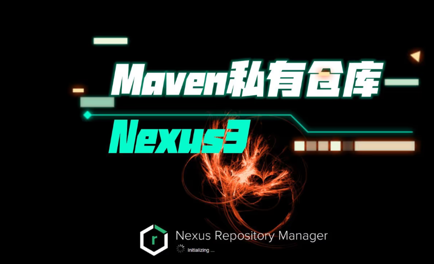
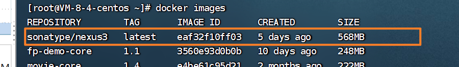
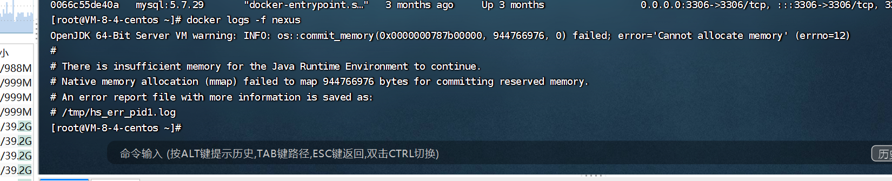

# nexus3的docker安装





```
docker run -d -p 8083:8083 --name nexus sonatype/nexus3
```




```
# There is insufficient memory for the Java Runtime Environment to continue.
# Native memory allocation (mmap) failed to map 944766976 bytes for committing reserved memory.
# An error report file with more information is saved as:
# /tmp/hs_err_pid1.log
#内存不足，Java运行时环境无法继续。
#本机内存分配（mmap）无法映射944766976字节以提交保留内存。
#包含详细信息的错误报告文件另存为：
#/tmp/hs_err_pid1.log
```




