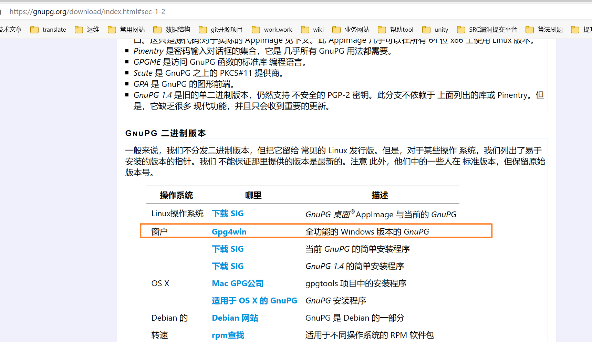
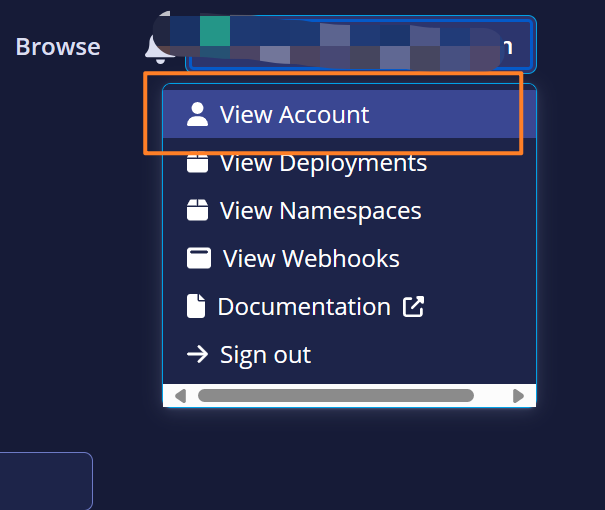

# 发布一个jar到中央仓库


## 01)新账号注册(必选)

```
https://central.sonatype.com/
https://central.sonatype.org/register/legacy/
```


## 02)添加命名空间


## 03)设置dns(可选)

如果你不是用的上面的一些公共仓库代理的域名 + username反写来作为groupid的话你还得设置下dns，这个我没有试过的，只不过官方有这个dns的一个设置说明，因为我的这个是windows电脑，所以在本机设置下dns如下：


```
https://central.sonatype.org/faq/how-to-set-txt-record/#by-dns

这个里面还有比如阿里云的dns设置啊，就是一些云厂商的dns的设置
```


本机执行如下：

```

Windows：
CMD:
nslookup -type=TXT yourdomain.com

Powershell:
Resolve-DnsName yourdomain.com -Type TXT
Linux⚓︎

$ host -t txt yourdomain.com
yourdomain.com descriptive text "OSSRH-XXYYZZ"
or

dig -t txt yourdomain.com
macOS⚓︎

dig -t txt yourdomain.com
```


##  04)namespace的校验(必选)

```
https://central.sonatype.org/register/namespace/
```


根据上面的namespace的格式创建了一个namespace后，是未提交审核的状态，可以**提前**在根据verification-key在对应的githue或gitee上创建一个公共的仓库，用于namespace提交审核的时候可以证明这个仓库是你自己所有，如果你是先创建namespace之后，没有创建对应verification-key的公共仓库，然后你点击提交审核，你的邮箱里面会收到一条短信如下：


## 05)namespace使用自己的域名

```
Verify Namespace
To prove the ownership of this Namespace, a DNS TXT Record is required with the same value that matches its Verification Key(rewy5b19lc).

For the Namespace top.wutunan.www you will need to create TXT Record:

rewy5b19lc

Domain Registrars services have different procedures for adding a TXT Record, please check your registers documentation to find out how to add a TXT Record.
```

::: details 翻译

验证命名空间
为了证明此命名空间的所有权，需要具有与其验证密钥（rewy5b19lc）匹配的相同值的DNS TXT记录。
对于命名空间top.wutunan.ww，您需要创建TXT记录：
rewy5b19lc
域注册服务有不同的添加TXT记录的程序，请查看您的注册文档以了解如何添加TXT纪录。

:::


## 05)下载安装好gpg创建和私钥

gpg的下载地址如下：windows下载的是Gpg4win，这个根据你的电脑型号去下面第二个链接查看下载什么对应机子操作系统匹配的gpg即可

```
https://www.gpg4win.org/download.html
https://central.sonatype.org/publish/requirements/gpg/#answer
```




将公钥或key发布到 PGP 密钥服务器：我用的是第二个命令带有这个的hkp://keyserver.ubuntu.com:11371命令，两条命令应该是一样的效果：cmd执行下面的命令即可，然后记住你设置的密码，下面的setting.xml中配置gpg需要用到。

```
gpg --keyserver hkp://pool.sks-keyservers.net --send-keys 公钥ID或上面提到的key
gpg --keyserver hkp://keyserver.ubuntu.com:11371 --send-keys 你自己的密钥（去重空格）
```


查询公钥是否发布成功：

指纹的key

```
gpg --keyserver hkp://pool.sks-keyservers.net --recv-keys 公钥ID或上面提到的key
gpg --keyserver hkp://keyserver.ubuntu.com:11371 --recv-keys 你自己的密钥（去除空格）
```


密钥对创建成功。

指纹：9EA79495D4A40BE062C45D8299087B8285ED6787


## 06)idea中maven的setting.xml文件配置

idea中的setting.xml指定的文件路径中不要包含中文，否则会deplay失败，报错说是setting文件路径中包含中文字符而报错，这里需要注意下，每次修改server的token信息都要记得保存(ctrl + s)

```
<servers>
    <server>
       <!--id固定是central 每次deploy前就要去后台申请一个新的token,注意申请了新的token不要去点击比如maven的clean等非deploy的按钮，不然这个token就会被使用了，重复使用就会报错401，所以clean要在配置新的token前就去执行了，配置好新的token后，直接点击项目中maven的deploy发布即可-->
       <id>central</id>
       <username>token-username</username>
       <password>token</password>
     </server>
  </servers>
  
  <profiles>
    <profile>
      <id>central</id>
      <activation>
      <activeByDefault>true</activeByDefault>
    </activation>
    <properties>
            <!-- gpg的安装位置的 GnuPG\bin\gpg，因为我是安装在D盘在，所以没有设置安装路径，所以子在D盘会有两个文件夹GnuPG和\Gpg4win，如果指定了安装路径的话，一个是在一个文件夹下有GnuPG和\Gpg4win，然后配置应该是这种的 安装位置   x盘:\xxxx+\GnuPG\bin\gpg -->
       <gpg.executable>D:\GnuPG\bin\gpg</gpg.executable>
       <gpg.passphrase>你的gpg的密码</gpg.passphrase>
    </properties>
  </profile>
 </profiles>
```

登录新账户创建token-username和token



点击创建token，将创建的username和password配置到上面setting.xml的server标签中


官方是建议使用这种方式的，不建议直接配置新账号的用户名和密码，并且使用token-username和token的这种方式，每次上传就要去后台生成一个然后将idea配置的seting.xml中的server的server的username、password重新使用新生成的，也就是说每次deploy都要去后台新生成一个token-username和token，生成的token-username和token只能使用一次，这个也是为了安全考虑，我试过配置setting.xml中server标签中新用户的账号（明文）和密码（明文）然后去发布也还是401的，不支持，老账号那种倒是支持的，并且密码中不能设置特殊字符，官网有说明的，但是现在这种使用token的方式就不用管密码中是否有特殊字符了，申请一次用一次。

```
<server>
	<id>${server}</id>
	<username>U73OYVtk</username>
	<password>YhhZUXoS1lGX3fgg0X36ubOxygLI7ZKm8fzthLP47vdH</password>
</server>

```


## 08)项目中配置pom

官方maven的pom配置规范：

https://central.sonatype.org/publish/requirements/*#provide-files-checksums*

下面的可以直接copy过去使用的：

```
<properties>
        <java.version>1.8</java.version>
        <maven.compiler.source>${java.version}</maven.compiler.source>
        <maven.compiler.target>${java.version}</maven.compiler.target>
        <project.build.sourceEncoding>UTF-8</project.build.sourceEncoding>
        <project.reporting.outputEncoding>UTF-8</project.reporting.outputEncoding>
        <serverId>central</serverId><!-- 服务id 也就是setting.xml中的servers.server.id -->
</properties>

<build>
        <plugins>
            <!-- 编译插件，设置源码以及编译的jdk版本 -->
            <plugin>
                <groupId>org.apache.maven.plugins</groupId>
                <artifactId>maven-compiler-plugin</artifactId>
                <configuration>
                    <source>${maven.compiler.source}</source>
                    <target>${maven.compiler.target}</target>
                </configuration>
            </plugin>
            <!-- Source -->
            <plugin>
                <groupId>org.apache.maven.plugins</groupId>
                <artifactId>maven-source-plugin</artifactId>
                <version>2.2.1</version>
                <executions>
                    <execution>
                        <phase>package</phase>
                        <goals>
                            <goal>jar-no-fork</goal>
                        </goals>
                    </execution>
                </executions>
            </plugin>
            <!-- Javadoc -->
            <plugin>
                <groupId>org.apache.maven.plugins</groupId>
                <artifactId>maven-javadoc-plugin</artifactId>
                <version>2.9.1</version>
                <configuration>
                    <additionalparam>-Xdoclint:none</additionalparam>
                </configuration>
                <executions>
                    <execution>
                        <phase>package</phase>
                        <goals>
                            <goal>jar</goal>
                        </goals>
                    </execution>
                </executions>
            </plugin>
            <!-- Javadoc -->
            <!-- Gpg Signature -->
            <plugin>
                <groupId>org.apache.maven.plugins</groupId>
                <artifactId>maven-gpg-plugin</artifactId>
                <version>1.6</version>
                <executions>
                    <execution>
                        <phase>verify</phase>
                        <goals>
                            <goal>sign</goal>
                        </goals>
                    </execution>
                </executions>
            </plugin>
            <!-- 老账号的配置：Gpg Signature -->
            <!--将组件部署到OSSRH并将其发布到Central Repository-->
            <!--<plugin>
                <groupId>org.sonatype.plugins</groupId>
                <artifactId>nexus-staging-maven-plugin</artifactId>
                <version>1.6.8</version>
                <extensions>true</extensions>
                <configuration>
                    <serverId>${serverId}</serverId>
                    <nexusUrl>https://s01.oss.sonatype.org/</nexusUrl>
                    <autoReleaseAfterClose>true</autoReleaseAfterClose>
                </configuration>
            </plugin>-->
            <!--新账号的配置：将组件部署到OSSRH并将其发布到Central Repository-->
            <plugin>
                <groupId>org.sonatype.central</groupId>
                <artifactId>central-publishing-maven-plugin</artifactId>
                <version>0.4.0</version>
                <extensions>true</extensions>
                <configuration>
                    <publishingServerId>central</publishingServerId>
                    <tokenAuth>true</tokenAuth>
                </configuration>
            </plugin>
        </plugins>
    </build>
    <distributionManagement>
          <snapshotRepository>
              <!-- 与settings.xml的server.id保持一致 -->
            <id>${serverId}</id>
            <url>https://central.sonatype.com/</url>
        </snapshotRepository>
        <!-- 老账号配置
        <snapshotRepository>
            &lt;!&ndash;这个id和settings.xml中servers.server.id要相同，因为上传jar需要登录才有权限&ndash;&gt;
            <id>${serverId}</id>
            <name>OSS Snapshots Repository</name>
            <url>https://s01.oss.sonatype.org/content/repositories/snapshots/</url>
        </snapshotRepository>
        <repository>
            &lt;!&ndash;这个id和settings.xml中servers.server.id要相同，因为上传jar需要登录才有权限&ndash;&gt;
            <id>${serverId}</id>
            <name>OSS Staging Repository</name>
            <url>https://s01.oss.sonatype.org/service/local/staging/deploy/maven2/</url>
        </repository>-->
    </distributionManagement>
```

需要修改的配置：

坐标id：

```
<groupId>io.github.账号username</groupId>
或者：
<groupId>io.gitee.账号username</groupId>
```


下面是一个demo示例：需要注意的是version必须不带SNAPSHOT的，因为新版不支持发布SNAPSHOT，descriptio描述必须要有，这里也是要注意一下的，如果version设置的有问题或者description没有的话deploy的时候会报错提示的

```
<groupId>io.github.bigbigfeifei</groupId>
    <artifactId>es-spring-boot-start</artifactId>
    <!-- 发布到这个上OSSRH:项目中的version,不要带上SNAPSHOT，这样就可以直接发布到中央仓库
         如果带上了，会发布到私服的snapshots下面，可以搜索进行查看,
         但是发布到Maven Central的新版本是不支持SNAPSHOT会被校验这个的，如果带来SNAPSHOT则推送失败，所以需要去掉version这个SNAPSHOT。-->
    <version>1.0</version>
    <!--描述一定要有-->
    <description>es启动器</description>
```

下面是需要修改成你自己的项目地址即可：url、scm、developers修改成自己的即可，licenses不用修改直接使用

```
   <!--项目访问url -->   
    <url>https://github.com/BigBigFeiFei/es-spring-boot-start</url>
    <scm>
         <!--项目访问url -->
        <url>https://github.com/BigBigFeiFei/es-spring-boot-start</url>
        <!--项目访问url.git结尾 -->
        <connection>scm:git:https://github.com/BigBigFeiFei/es-spring-boot-start.git</connection>
         <!--项目访问url.git结尾 -->
        <developerConnection>scm:git:https://github.com/BigBigFeiFei/es-spring-boot-start.git</developerConnection>
    </scm>

    <developers>
        <developer>
            <id>BigFei</id>
            <name>BigFei</name>
            <email>xxxx@qq.com</email>
             <!--项目访问url -->
            <url>https://github.com/BigBigFeiFei/es-spring-boot-start</url>
            <timezone>+8</timezone>
        </developer>
    </developers>

    <licenses>
        <license>
            <name>The Apache Software License, Version 2.0</name>
            <url>http://www.apache.org/licenses/LICENSE-2.0.txt</url>
        </license>
    </licenses>
```


##  09)idea中点击deploy发布

做好了以上的配置准备后，我们就可以来发布项目到中央仓库了。

在idea的项目中点击deploy，运行没有报错，能看到BUILD SUCCESS,说明是上传成功，要注意的是idea配置的maven的setting.xml中server的token-username、token每次点击deploy前都要去后台重新生成一个，然后配置到maven的setting.xml中的sever里面，每deploy前都要去搞一对新的token秘钥对来进行配置，一对只能使用一次，重复使用deploy会报401


mvn命令参考：

```
https://www.cnblogs.com/tobyhomels/p/15890023.html
https://blog.csdn.net/zdwzzu2006/article/details/130788625
```

还有如果你按照老的那个账号的配置pom中的仓库地址是

老式账号pom中配置了plugin和仓库地址如下，deploy的时候会报401，没有权限，身份认证失败


## 10)新账号登录后点击发布

```
登录注册地址：
https://central.sonatype.com/
```


发布了之后就删除不了了，看看能把namespace删除之后重新，创建namespace审核通过后去提交一个，这个没有必要去删除namespace，发布了之后删除不了就不要管它的，你修改版本号重新推送去发布即可，根据版本号来发布就是最新的包了，**如果已经上传过了，再去执行deploy的话会报错**，后台管理会有一条上传的消息说，你这个包已经上传过了，然后你可以把那个上传失败记录删除了。


## 11)搜索发布的依赖


## 总结

由于我之前不是写了几个好用的start，然后我就想着能不能发布到国外的中央仓库上，给大家提供一个依赖，引入即可，然后我就去网上看了一些教程，结果实践下来发现，全部是过时的教程了。

全网都没有一篇可行的教程么？然后我就通过看之前那些旧的教程博客和官方的文档，去做了各种的尝试，上传这个尝试也是花了我点时间，摸索了几天还是搞出来了的，去看官方的英文文档，也是有点蛋疼，英文不咋个好就只能用翻译软件翻译着看，或者边看边猜它的大概意思，最终还是发布上去了，特殊说明在访问github或国外的一些网站需要科学上网一下，不然有的是访问不到的，这个需要你去处理解决下这个网络不通的问题，后面我会把我之前写的那几个好用的start开源出来，然后提供出中央仓库的坐标，方便大家直接引入使用，通过本文你可以把自己的轮子发布到中央仓库给大家使用，so easy，敬请期待，希望我的分享对你有所启发和帮助，请一键三连，么么么哒！


## 问题


