# 阿里云短信服务

官方网站：https://www.aliyun.com/product/sms?spm=5176.19720258.J_8058803260.611.48192c4abPvXEp

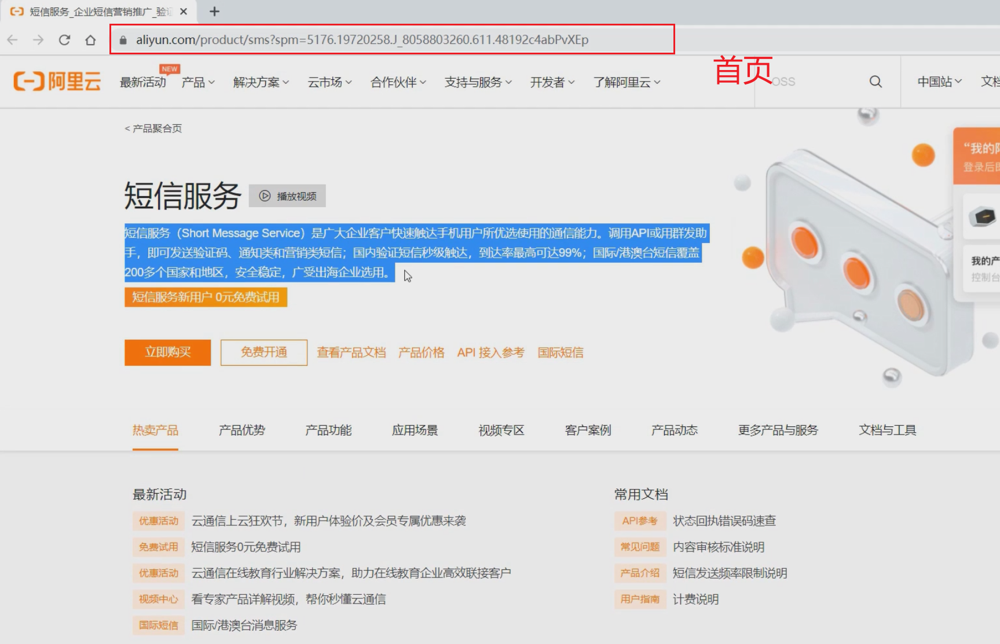

1. 注册阿里云账号

2. 开通短信服务

3. 申请签名

4. 配置模板
5. 示例代码测试

## 01)注册阿里云账号


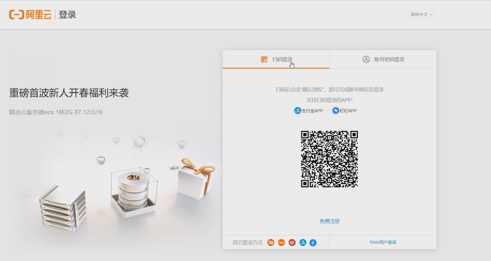


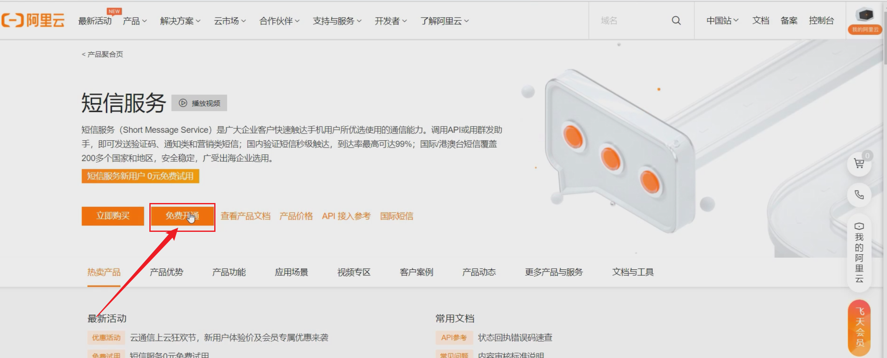


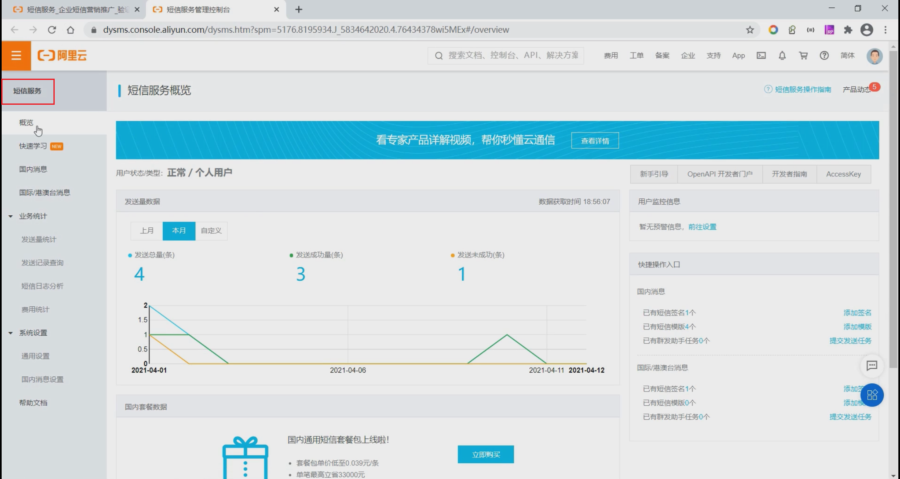


**短信后台管理系统**

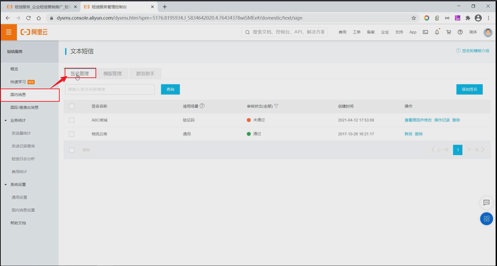


这个页面下，添加一个签名。

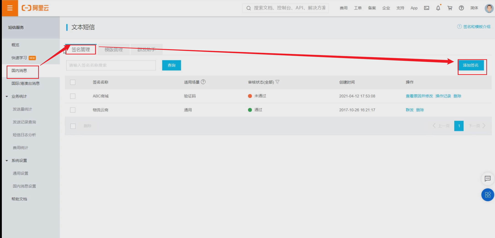


## 02)申请签名

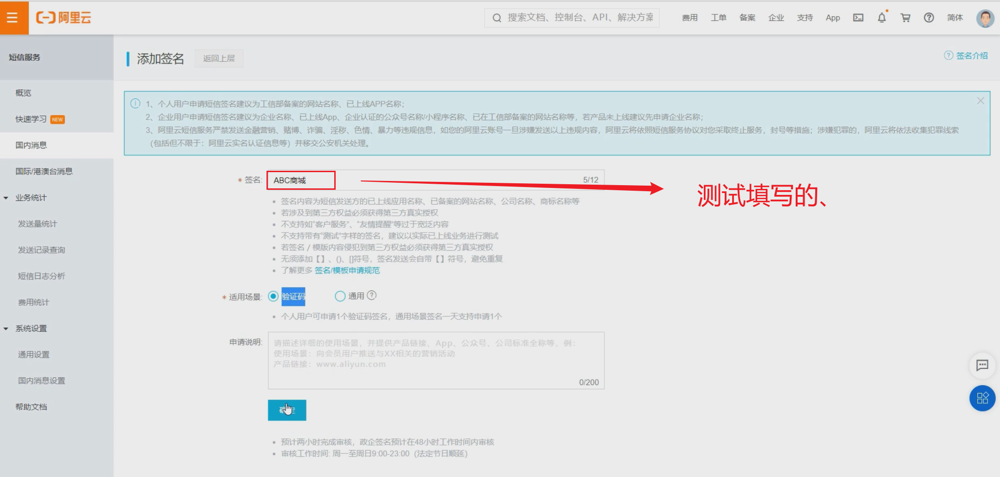

::: tip  注意

说明：申请签名时，**个人用户**只能申请一个并且签名的名称必须为“ABC商城”，否则审核不通过。

:::

## 03)配置模板

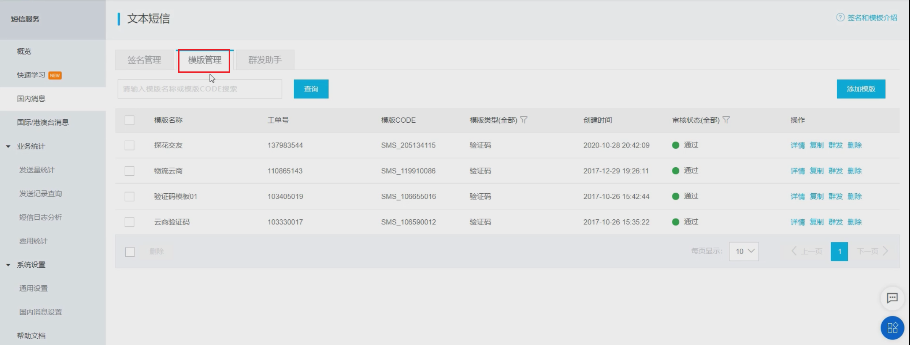


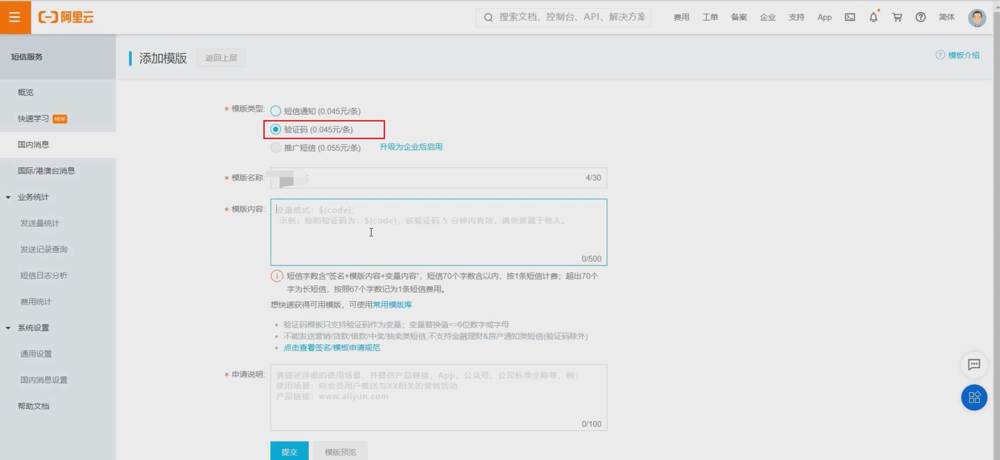


查看模板详情。


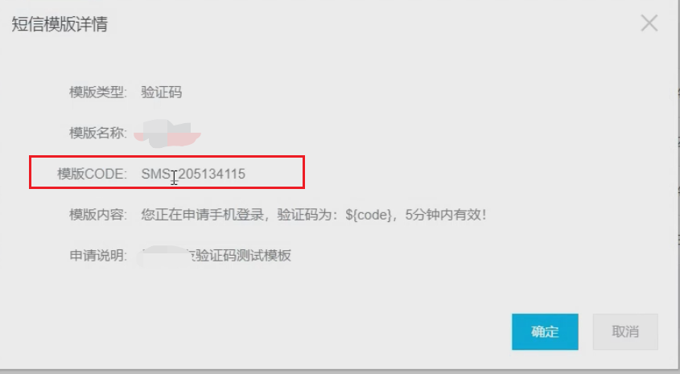

::: tip  注意

审核时间需要1~2小时，请耐心等待~

:::


## AccessKey管理

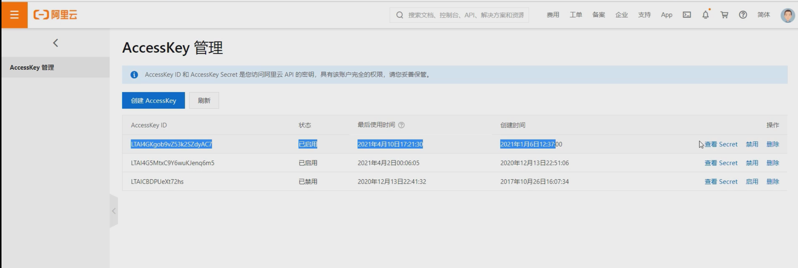

AccesskeyID和AccesskeySecret是您访问阿里云API的密钥，具有该账户完全的权限，请您妥善保管。

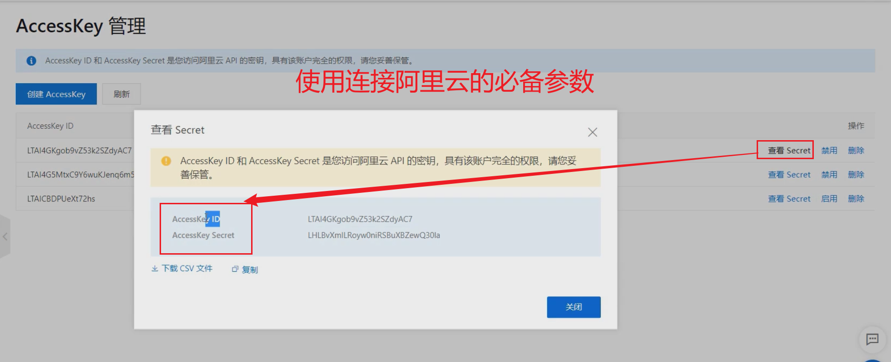


## java发送验证码短信


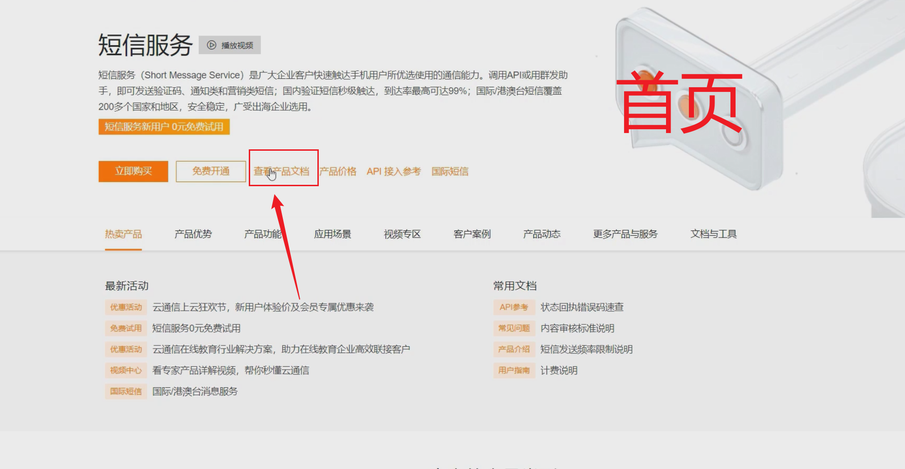


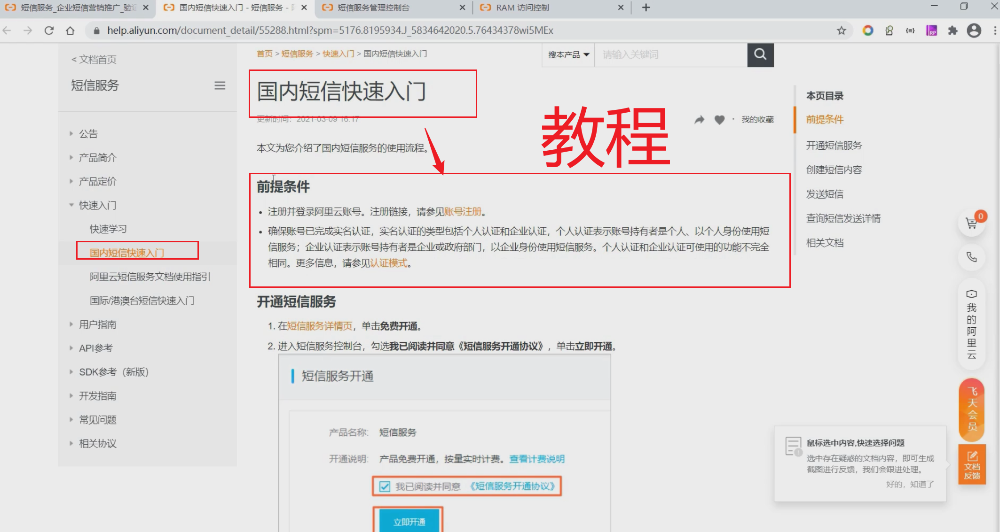


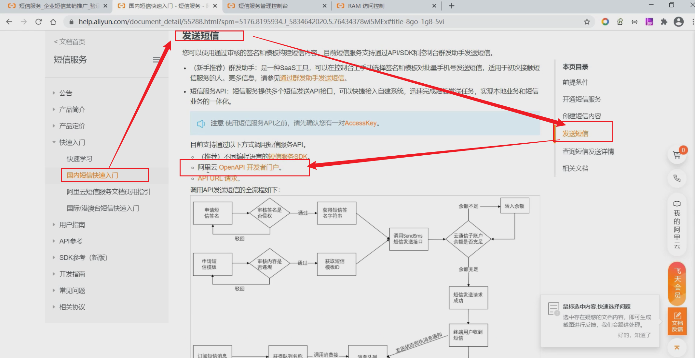


在线调试发送短信的模板1


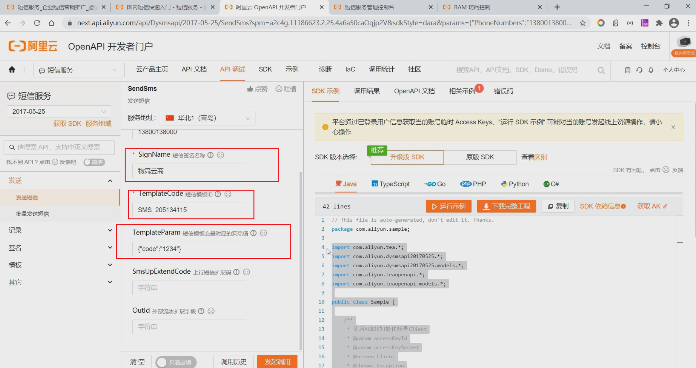

自动帮我们生产用例代码。


## java发送短信的测试用例

```java
package com.gun.sso.service;

import com.aliyun.dysmsapi20170525.models.SendSmsRequest;
import com.aliyun.dysmsapi20170525.models.SendSmsResponse;
import com.aliyun.dysmsapi20170525.models.SendSmsResponseBody;
import com.aliyun.teaopenapi.models.Config;

public class SendSms {

    /**
     * 使用AK&SK初始化账号Client
     * @param accessKeyId
     * @param accessKeySecret
     * @return Client   发送短信的  客户端对象
     * @throws Exception
     */
    public static com.aliyun.dysmsapi20170525.Client createClient(String accessKeyId, String accessKeySecret) throws Exception {
        
        //1. 创建配置对象
        Config config = new Config()
                // 您的AccessKey ID
                .setAccessKeyId(accessKeyId)
                // 您的AccessKey Secret
                .setAccessKeySecret(accessKeySecret)
                .setEndpoint("dysmsapi.aliyuncs.com");        // 访问的域名、连接地址

        //2. 返回客户端对象
        return new com.aliyun.dysmsapi20170525.Client(config);
    }

    public static void main(String[] args_) throws Exception {
        java.util.List<String> args = java.util.Arrays.asList(args_);
        com.aliyun.dysmsapi20170525.Client client = SendSms
                .createClient("**********", "**********");

        // 3、 创建  请求对象
        SendSmsRequest sendSmsRequest = new SendSmsRequest()
                .setPhoneNumbers( "158****7944") //目标手机号
                .setSignName("ABC商城") //签名名称
                .setTemplateCode("SMS_204756062") //短信模板code
                .setTemplateParam("{\"code\":\"1111\"}"); //模板中变量替换
        
        //  4、 客户端发送请求。  获取响应。
        SendSmsResponse sendSmsResponse = client.sendSms(sendSmsRequest);

        //  获取响应体。
        SendSmsResponseBody body = sendSmsResponse.getBody();

        // code = OK 代表成功
        System.out.println(body.getCode() + "  " + body.getMessage());
    }

}
```

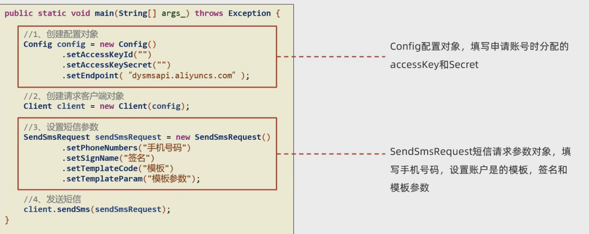

第三方服务直接从官网下载示例代码进行调试配置即可使用

## 阿里云短信-组件抽取

- 企业开发中，往往将常见的工具类封装抽取，以简洁便利的方式供其他工程模块使用，而SpringBoot的自动装配
  机制可以方便的实现组件抽取。

springboot的自动装配的步骤：

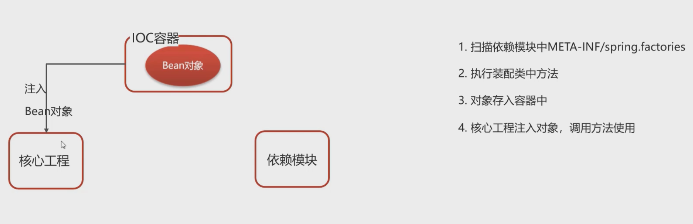

1. 在gun模块定义模板对象SmsTemplate。
2. 在gun模块定义自动装配类TanhuaAutoConfiguration。
3. 在gun模块中添加装配文件META-INF/spring.factories。
4. gun-app模块引入装配依赖。
5. 注入SmsTemplate发送短信。


### 01)自动装配配置

根据自动装配原则，在gun工程创建 /META-INF/spring.factories文件

```xml
org.springframework.boot.autoconfigure.EnableAutoConfiguration=\
com.tanhua.autoconfig.TanhuaAutoConfiguration
```


### 02)抽取公共配置

案例：自动读取Yml中配置

实现：创建配置类

```yaml
gun:
  sms:
    signName: 物流云商
    templateCode: SMS_106590012
    accessKey: LTAI4GKgob9vZ53k2SZdyAC7
    secret: LHLBvXmILRoyw0niRSBuXBZewQ30la
```

### 03)创建配置类

实现：

1. 定义SmspProperties类，通过@ConfigurationProperties指定配置文件前缀

```java
@Data
@ConfigurationProperties(prefix = "tanhua.sms")
public class SmsProperties {
    private String signName;
    private String templateCode;
    private String accessKey;
    private String secret;
}
```


### 04)发送短信模板对象

```java
package com.gun.autoconfig.template;

import com.aliyun.dysmsapi20170525.models.SendSmsRequest;
import com.aliyun.dysmsapi20170525.models.SendSmsResponse;
import com.aliyun.dysmsapi20170525.models.SendSmsResponseBody;
import com.aliyun.teaopenapi.models.Config;
import com.tanhua.autoconfig.properties.SmsProperties;

public class SmsTemplate {

    private SmsProperties properties;

    // 构造方法注入
    public SmsTemplate(SmsProperties properties) {
        this.properties = properties;
    }

    // 省略代码
    public void sendSms(String mobile,String code);

}
```

SmsProperties实例对象谁创建呢？

答：自动装配类帮我们创建。


### 05)写自动装配类

```java
package com.gun.autoconfig;


import com.tanhua.autoconfig.properties.*;
import com.tanhua.autoconfig.template.*;
import org.springframework.boot.autoconfigure.condition.ConditionalOnProperty;
import org.springframework.boot.context.properties.EnableConfigurationProperties;
import org.springframework.context.annotation.Bean;

@EnableConfigurationProperties({
        SmsProperties.class
})
public class TanhuaAutoConfiguration {

    @Bean
    public SmsTemplate smsTemplate(SmsProperties properties) {
        return new SmsTemplate(properties);
    }
}
```


### 06)编写单元测试类

```java
@RunWith(SpringRunner.class)
@SpringBootTest(classes = AppServerApplication.class)
public class SmsTemplateTest {

    //注入
    @Autowired
    private SmsTemplate smsTemplate;

    //测试
    @Test
    public void testSendSms() {
        smsTemplate.sendSms("18618412321","4567");
    }
}
```


