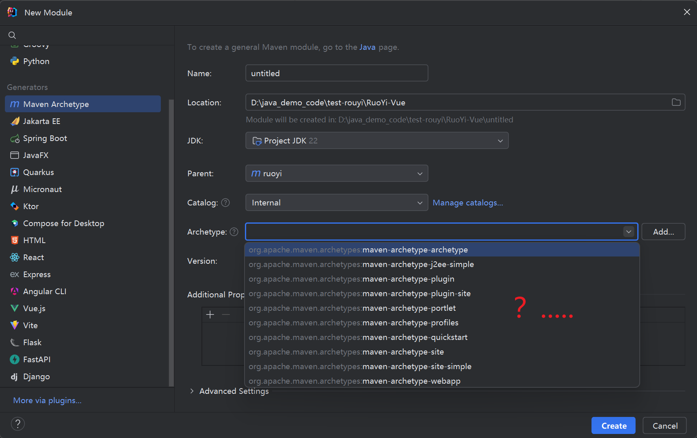
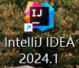

# maven项目创建

对于一些老鸟java程序员来说idea工具的使用一定是轻车熟路了。

当我2025年使用新版的idea创建maven项目时傻眼了！



what？...我应该怎么选？


## idea版本2024.1

时间在流逝，时代也在进步。我们不应该守旧。idea版本是：




回到上面的问题。我们改怎么选呢？

答：**maven-archetype-quickstart** 是最常用的标准 Maven 项目模板

**选择理由：**

- 它会创建一个标准的 Java 项目结构，包含：
  - `src/main/java` - 主代码目录
  - `src/test/java` - 测试代码目录
  - 标准的 `pom.xml` 配置
- 适合大多数普通的 Java 应用程序开发。

**其他 Archetype 的用途：**

- **maven-archetype-webapp** - Web 应用程序项目
- **maven-archetype-j2ee-simple** - J2EE 企业级应用
- **maven-archetype-site** - 项目文档站点
- **maven-archetype-plugin** - Maven 插件开发

如果你只是要创建一个普通的 Java 项目（比如工具类、库、桌面应用等），选择 **quickstart** 是最合适的。

官方有对maven-archetype-quickstart这个项目模板有描述文档吗？地址是？

**Maven Archetypes 官方列表：**
https://maven.apache.org/archetypes/maven-archetype-quickstart/

**Maven 官方指南 - 使用原型创建项目：**
https://maven.apache.org/guides/introduction/introduction-to-archetypes.html

**所有官方 Archetype 列表：**
https://maven.apache.org/archetypes/

主要信息包括：

- **描述**：一个用于创建 Maven 项目的简单原型
- **项目结构**：生成标准的 Maven 目录布局
- **包含内容**：
  - 示例 Java 类 (`App.java`)
  - 示例 JUnit 测试类 (`AppTest.java`)
  - 基本的 `pom.xml`

```shell
项目名/
├── src/
│   ├── main/
│   │   └── java/
│   │       └── com/example/
│   │           └── App.java
│   └── test/
│       └── java/
│           └── com/example/
│               └── AppTest.java
└── pom.xml
```


