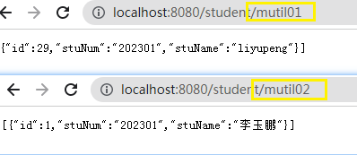

# mybatis-pius使用多数据源

在一个springboob应用项目中，一般我们都是去连接某一个数据库，但是有些业务场景要连接多个数据库。那么怎么办呢？

阅读必知

- mybatis-plus查询简单入门案例。
- mybatis-puls的多数据源查询案例。
- 在编写案例中发现业务上的问题的提出与验证。

## 数据准备

创建学生表

```sql
CREATE TABLE `student` (
  `id` int(11) NOT NULL AUTO_INCREMENT,
  `stu_num` varchar(200) NOT NULL,
  `stu_name` varchar(30) DEFAULT NULL,
  PRIMARY KEY (`id`)
) ENGINE=InnoDB AUTO_INCREMENT=0 DEFAULT CHARSET=utf8;
```

创建数据库：


### 数据库sql

创建数据库表mutil01

```sql
SET NAMES utf8mb4;
SET FOREIGN_KEY_CHECKS = 0;

-- ----------------------------
-- Table structure for student
-- ----------------------------
DROP TABLE IF EXISTS `student`;
CREATE TABLE `student`  (
  `id` int(11) NOT NULL AUTO_INCREMENT,
  `stu_num` varchar(200) CHARACTER SET utf8 COLLATE utf8_general_ci NOT NULL,
  `stu_name` varchar(30) CHARACTER SET utf8 COLLATE utf8_general_ci NULL DEFAULT NULL,
  PRIMARY KEY (`id`) USING BTREE
) ENGINE = InnoDB AUTO_INCREMENT = 30 CHARACTER SET = utf8 COLLATE = utf8_general_ci ROW_FORMAT = Dynamic;

-- ----------------------------
-- Records of student
-- ----------------------------
INSERT INTO `student` VALUES (29, '202301', 'liyupeng');

SET FOREIGN_KEY_CHECKS = 1;
```

创建数据库表mutil02

```sql

SET NAMES utf8mb4;
SET FOREIGN_KEY_CHECKS = 0;

-- ----------------------------
-- Table structure for student
-- ----------------------------
DROP TABLE IF EXISTS `student`;
CREATE TABLE `student`  (
  `id` int(11) NOT NULL AUTO_INCREMENT,
  `stu_num` varchar(200) CHARACTER SET utf8 COLLATE utf8_general_ci NOT NULL,
  `stu_name` varchar(30) CHARACTER SET utf8 COLLATE utf8_general_ci NULL DEFAULT NULL,
  PRIMARY KEY (`id`) USING BTREE
) ENGINE = InnoDB AUTO_INCREMENT = 2 CHARACTER SET = utf8 COLLATE = utf8_general_ci ROW_FORMAT = Dynamic;

-- ----------------------------
-- Records of student
-- ----------------------------
INSERT INTO `student` VALUES (1, '202301', '李玉鹏');

SET FOREIGN_KEY_CHECKS = 1;
```


## ex1)mybatis-plus简单查询

需求：查询mutil01数据库全部信息。

### 导入依赖

父工程依赖

```xml
<?xml version="1.0" encoding="UTF-8"?>
<project xmlns="http://maven.apache.org/POM/4.0.0" xmlns:xsi="http://www.w3.org/2001/XMLSchema-instance"
         xsi:schemaLocation="http://maven.apache.org/POM/4.0.0 https://maven.apache.org/xsd/maven-4.0.0.xsd">
    <modelVersion>4.0.0</modelVersion>
    <dependencies>
        <dependency>
            <groupId>org.springframework.boot</groupId>
            <artifactId>spring-boot-starter</artifactId>
        </dependency>

        <dependency>
            <groupId>org.springframework.boot</groupId>
            <artifactId>spring-boot-starter-test</artifactId>
            <scope>test</scope>
        </dependency>

        <dependency>
            <groupId>org.projectlombok</groupId>
            <artifactId>lombok</artifactId>
            <optional>true</optional>
        </dependency>


        <!-- ============== fastjson ============== -->
        <dependency>
            <groupId>com.alibaba</groupId>
            <artifactId>fastjson</artifactId>
            <version>1.2.47</version>
        </dependency>
        <!-- 阿里巴巴druid -->
        <dependency>
            <groupId>com.alibaba</groupId>
            <artifactId>druid-spring-boot-starter</artifactId>
            <version>1.1.21</version>
        </dependency>
        <!-- mybatis升级mybatis-plus -->
        <dependency>
            <groupId>com.baomidou</groupId>
            <artifactId>mybatis-plus-boot-starter</artifactId>
            <version>3.4.0</version>
        </dependency>
        <dependency>
            <groupId>mysql</groupId>
            <artifactId>mysql-connector-java</artifactId>
            <version>5.1.6</version>
            <scope>runtime</scope>
        </dependency>

    </dependencies>
</project>

```

子工程就不必导入了。


### 01)书写配置文件：

```yaml

# 配置数据源
spring:
  datasource:
    driver-class-name: com.mysql.jdbc.Driver
    url: jdbc:mysql://localhost:3306/mutil01?useUnicode=true&characterEncoding=UTF-8&useSSL=false&useTimezone=true&serverTimezone=GMT%2B8&autoReconnect=true
    username: root
    password: root
    hikari:
      maximum-pool-size: 100
      minimum-idle: 5
      idle-timeout: 20000
      connection-timeout: 5000
      max-lifetime: 360000
######################################   mybatis-plus集成
mybatis-plus:
# 映射实体对象的包名
  type-aliases-package: 
    - cn.gun.pojo
  global-config:
#######数据库的配置
    db-config:
#主键类型  AUTO:"数据库ID自增", INPUT:"用户输入ID",ID_WORKER:"全局唯一ID (数字类型唯一ID)", UUID:"全局唯一ID UUID";
      id-type: auto
#########################################  日志    ####################################
logging:
  level:
    org.springfromework.web: ERROR
    org.mybatis: info
```


### 02)创建pojo对象

```java
package com.gun.pojo;

import lombok.Data;

@Data
public class Student {
    private Integer id;
    private String stuNum;
    private String stuName;
}

```

::: tip 属性名字的书写

- 数据库字段属性是：xxx_xxx。
- pojo对象要遵循xxXxxx的命名规范。

这样就数据库字段与pojo对象的属性能进行映射不报错。

:::

### 03)创建Mapper接口

这个sql语句就不写了，直接使用mybatis-plus的方法进行查询。如下：

```java
package com.gun.mapper;

import com.baomidou.mybatisplus.core.mapper.BaseMapper;
import com.gun.pojo.Student;
import org.apache.ibatis.annotations.Mapper;

@Mapper
public interface Mutil01Mapper extends BaseMapper<Student> {
}

```

### 04)编写测试类

```java
package com.gun;

import com.baomidou.mybatisplus.core.conditions.query.QueryWrapper;
import com.gun.mapper.Mutil01Mapper;
import com.gun.pojo.Student;
import org.junit.Test;
import org.junit.runner.RunWith;
import org.springframework.beans.factory.annotation.Autowired;
import org.springframework.boot.test.context.SpringBootTest;
import org.springframework.test.context.junit4.SpringRunner;

import java.util.List;

@SpringBootTest
@RunWith(SpringRunner.class)
public class Test01 {

    @Autowired
    private Mutil01Mapper mutil01Mapper;

    /**
     * 查询数据库 mutil01
     */
    @Test
    public void selectStudent(){


        List<Student> students = mutil01Mapper.selectList(null);
        for (int i = 0; i < students.size(); i++) {
            System.out.println(students.get(i));
        }
        System.out.println("11111");
    }

}

```

结果：


### 05)编写controller类

```java
package com.gun.controller;

import com.gun.mapper.Mutil01Mapper;
import com.gun.pojo.Student;
import org.springframework.beans.factory.annotation.Autowired;
import org.springframework.web.bind.annotation.GetMapping;
import org.springframework.web.bind.annotation.RequestMapping;
import org.springframework.web.bind.annotation.RestController;

import java.util.List;

@RestController
@RequestMapping("/student")
public class MutilDataSourceController {

    @Autowired
    private Mutil01Mapper mutil01Mapper;

    @GetMapping("mutil01")
    public List<Student> mutil01(){
        List<Student> students = mutil01Mapper.selectList(null);
        return students;
    }


}
```

浏览器访问：


1. @GetMapping("mutil01")前面的请求路径没有写 “/”。【得知：springboot帮我们自动不全】

**抛出问题1：**

那么@RequestMapping("/student")的“/”与@GetMapping("mutil01")都没写呢？

**小心验证:**

1. 修改
2. 重新启动在访问。

**得出结论:**

- 可正常正常请求。

::: tip 小结

- 以上案例是连接mutil01数据查询的结果，那么多数据源怎么整呢？

  - 答：简单快捷的就使用第三方的jar,多数据源下一节案例就是：

- 怎么打印查询的sql日志信息呢？

  ```yaml
  mybatis-plus:
    # 输出sql的日志信息
    configuration:
      log-impl: org.apache.ibatis.logging.stdout.StdOutImpl
  ```

  在配置文件进行书写。如果是propreties类型的配置文件。

  ```properties
  mybatis-plus.configuration.log-impl: org.apache.ibatis.logging.stdout.StdOutImpl
  ```

  输出结果为：

  ```xquery
  Creating a new SqlSession
  SqlSession [org.apache.ibatis.session.defaults.DefaultSqlSession@ba7006f] was not registered for synchronization because synchronization is not active
  # 未注册进行同步，因为同步未处于活动状态
  JDBC Connection [com.mysql.jdbc.JDBC4Connection@1d4a43ee] will not be managed by Spring
  # JDBC连接[com.mysql.jdbc.JDBC4Connection@1d4a43ee]将不由Spring管理
  ==>  Preparing: SELECT id,stu_num,stu_name FROM student
  ==> Parameters: 
  <==    Columns: id, stu_num, stu_name
  <==        Row: 29, 202301, liyupeng
  <==      Total: 1
  Closing non transactional SqlSession [org.apache.ibatis.session.defaults.DefaultSqlSession@ba7006f]
  ```

- jdbc的连接对象，不是有spring管理。
- org.apache.ibatis.session.defaults.DefaultSqlSession，DefaultSqlSession是个什么对象？是接口吗？如果是，它有哪些实现类呢？

:::

## ex2)mybatis-plus多数据源

需求：实现多个数据库的查询操作。

### 01)导入依赖

```xml
        <!--  实现mybatis-plus多数据源  -->
        <dependency>
            <groupId>com.baomidou</groupId>
            <artifactId>dynamic-datasource-spring-boot-starter</artifactId>
            <version>3.4.0</version>
        </dependency>
```

在上面的依赖中加入这个坐标。

### 02)修改配置文件

之前的一个数据源的配置文件如下：

```yaml
spring:
  datasource:
    driver-class-name: com.mysql.jdbc.Driver
    url: jdbc:mysql://localhost:3306/mutil01?useUnicode=true&characterEncoding=UTF-8&useSSL=false&useTimezone=true&serverTimezone=GMT%2B8&autoReconnect=true
    username: root
    password: root
    hikari:
      maximum-pool-size: 100
      minimum-idle: 5
      idle-timeout: 20000
      connection-timeout: 5000
      max-lifetime: 360000

```

修改后，多数据源配置如下：

```yaml
spring:
  datasource:
    dynamic:
      datasource:
        mutil01: # 给数据源起一个名字，随意。
          driver-class-name: com.mysql.jdbc.Driver
          url: jdbc:mysql://localhost:3306/mutil01?useUnicode=true&characterEncoding=UTF-8&useSSL=false&useTimezone=true&serverTimezone=GMT%2B8&autoReconnect=true
          username: root
          password: root
          hikari:
            maximum-pool-size: 100
            minimum-idle: 5
            idle-timeout: 20000
            connection-timeout: 5000
            max-lifetime: 360000
        mutil02:
          driver-class-name: com.mysql.jdbc.Driver
          url: jdbc:mysql://localhost:3306/mutil02?useUnicode=true&characterEncoding=UTF-8&useSSL=false&useTimezone=true&serverTimezone=GMT%2B8&autoReconnect=true
          username: root
          password: root
          hikari:
            maximum-pool-size: 100
            minimum-idle: 5
            idle-timeout: 20000
            connection-timeout: 5000
            max-lifetime: 360000
      primary: mutil01 # 设置默认数据源，默认是master数据源
```

### 03)编写controller

在原来的ex1中的conroller添加了一个访问第二个数据源的方法。

```java
package com.gun.controller;

import com.gun.mapper.Mutil01Mapper;
import com.gun.pojo.Student;
import org.springframework.beans.factory.annotation.Autowired;
import org.springframework.web.bind.annotation.GetMapping;
import org.springframework.web.bind.annotation.RequestMapping;
import org.springframework.web.bind.annotation.RestController;

import java.util.List;

@RestController
@RequestMapping("student")
public class MutilDataSourceController {

    @Autowired
    private Mutil01Mapper mutil01Mapper;


    /**
     * 访问第一个数据源
     * @return
     */
    @GetMapping("mutil01")
    public List<Student> mutil01(){
        List<Student> students = mutil01Mapper.selectList(null);
        return students;
    }

    /**
     * 访问第二个数据源
     * @return
     */
    @GetMapping("mutil02")
    public List<Student> mutil02(){
        List<Student> students = mutil01Mapper.selectList(null);
        return students;
    }
    
}
```

### 04)指定数据源

怎么指定你要查询的数据源呢？

- 使用注解@DS

在哪里使用这个注解呢？如下：

- 在controller的方法上使用。

```java
package com.gun.controller;

import com.baomidou.dynamic.datasource.annotation.DS;
import com.gun.mapper.Mutil01Mapper;
import com.gun.pojo.Student;
import org.springframework.beans.factory.annotation.Autowired;
import org.springframework.web.bind.annotation.GetMapping;
import org.springframework.web.bind.annotation.RequestMapping;
import org.springframework.web.bind.annotation.RestController;

import java.util.List;

@RestController
@RequestMapping("student")
public class MutilDataSourceController {

    @Autowired
    private Mutil01Mapper mutil01Mapper;


    /**
     * 访问第一个数据源
     * @return
     */
    @DS(value = "mutil01")
    @GetMapping("mutil01")
    public List<Student> mutil01(){
        List<Student> students = mutil01Mapper.selectList(null);
        return students;
    }

    /**
     * 访问第二个数据源
     * @return
     */
    @DS(value = "mutil02")
    @GetMapping("mutil02")
    public List<Student> mutil02(){
        List<Student> students = mutil01Mapper.selectList(null);
        return students;
    }

}
```

- value：在配置文件中为数据源起的别名。
- 作用：使用指定的数据源进行查询。

### 05)多数据源验证

怎么去验证呢？

- 二个数据库分别是mutil01、mutil02。

  - mutil01的数据是：拼音表示

    

  - mutil02的数据是：汉字

    

- 预期值。当访问01时是拼音。当访问02时是汉字。



**得出结论：**

配置多数据源生效了。

### 06)@DS怎么使用

- 问题一：在controller层加的方法上加@DS注解，mapper接口对象就在这个方法里面使用。如果我在controller方法上加@DS，业务调用写在service上调用Mapper方法。能成功吗？
- 猜想结论：
  1. 成功，就是在方法嵌套中涉及到的所以mapper接口使用的数据源都是@DS指定的数据源。
  2. 不成功，
     - 不可以方法嵌套
     - 只要指定本方法有mapper接口的方法。

**验证过程：**

第一步：编写service方法。

```java
package com.gun.service.impl;

import com.gun.mapper.MutilMapper;
import com.gun.pojo.Student;
import com.gun.service.MutilDatasource;
import org.springframework.beans.factory.annotation.Autowired;
import org.springframework.stereotype.Service;

import java.util.List;

@Service
public class MutilDatasourceServiceImpl implements MutilDatasource {

    @Autowired
    private MutilMapper mutilMapper;

    @Override
    public List<Student> mutil01() {
        return mutilMapper.selectList(null);
    }

    @Override
    public List<Student> mutil02() {
        return mutilMapper.selectList(null);
    }
}
```

第二步：修改controller

```java
package com.gun.controller;

import com.baomidou.dynamic.datasource.annotation.DS;
import com.gun.pojo.Student;
import com.gun.service.MutilDatasource;
import org.springframework.beans.factory.annotation.Autowired;
import org.springframework.web.bind.annotation.GetMapping;
import org.springframework.web.bind.annotation.RequestMapping;
import org.springframework.web.bind.annotation.RestController;

import java.util.List;

@RestController
@RequestMapping("student")
public class MutilDataSourceController {


    @Autowired
    private MutilDatasource mutilDatasource;

    /**
     * 访问第一个数据源
     * @return
     */
    @DS(value = "mutil01")
    @GetMapping("mutil01")
    public List<Student> mutil01(){
        List<Student> students = mutilDatasource.mutil01();
        return students;
    }

    /**
     * 访问第二个数据源
     * @return
     */
    @DS(value = "mutil02")
    @GetMapping("mutil02")
    public List<Student> mutil02(){
        List<Student> students = mutilDatasource.mutil02();
        return students;
    }

}
```

测试结果：


::: warning 得出结论
猜想结论是：成功

- @DS支持方法嵌套
- 只要方法嵌套中有使用mybatisplus的接口查询的都能支持@DS指定数据源去查询。

:::

## 业务需求一：

需求描述：一个springboot应用查询一个名为user_db的数据库下的全部表信息。另外一个springboot查询order数据库下面的全部表信息。

在这种场景下，要进行微服务的合并。合并后，到底查询那个数据库，数据源怎么配置呢？

那就是要配置多数据源进行查询。

### 问题一：

当调用的方法中需要在不同的数据库里面查询具体的数据。也就是使用mybatisplus要使用多个mapper接口去不同的数据里面查询对应的表。

那怎么解决？一般在项目架构上做好不要有这样的情况。可以进行微服务的拆分处理。在代码上好像也该可以解决。【有解决的伙伴知乎、github上留言我看到一起讨论。技术共勉之......】