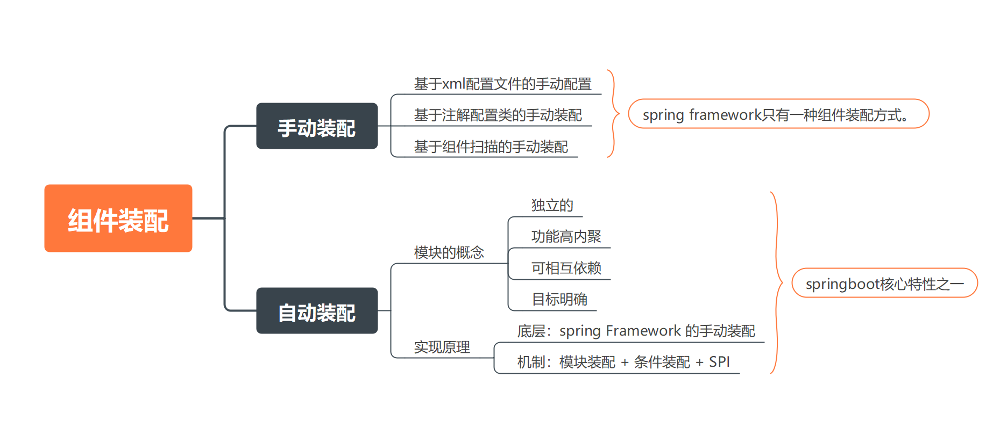
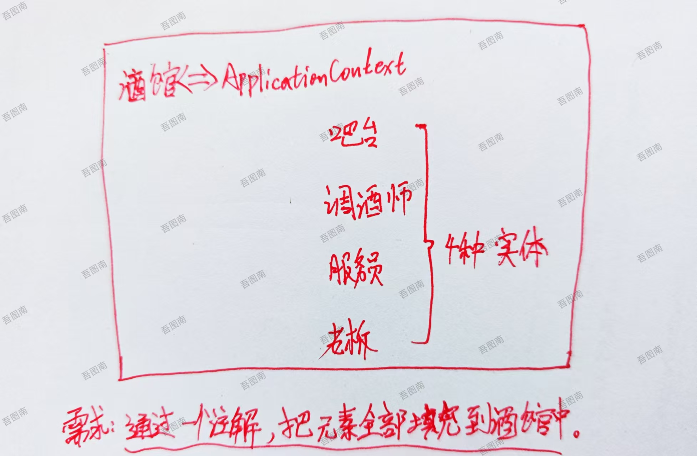
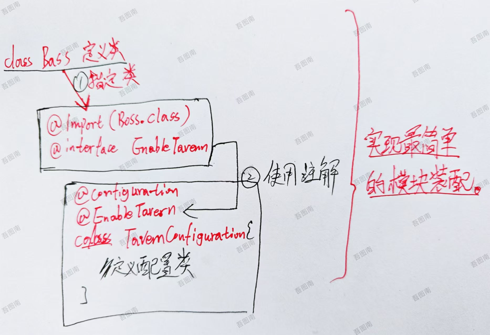

# springboot自动装配

## 组件装配

什么是组件？

::: details 回答
核心api以对象的形式注册到IOC容器中。说白了：容器中的核心api对象本身就是一个个的bean对象。——即“组件”。
:::

## 快速体验模块装配

入门自动装配简单需求：

通过一个注解，把元素全部填充到酒馆中。

| 实体      | 描述   |
| --------- | ------ |
| Boss      | 老板   |
| Bartender | 调酒师 |
| waiter    | 服务员 |
| bar       | 吧台   |
| tavern    | 酒馆   |

我称之为：我的酒馆模型。

下面来看一个简单的实现思路！

