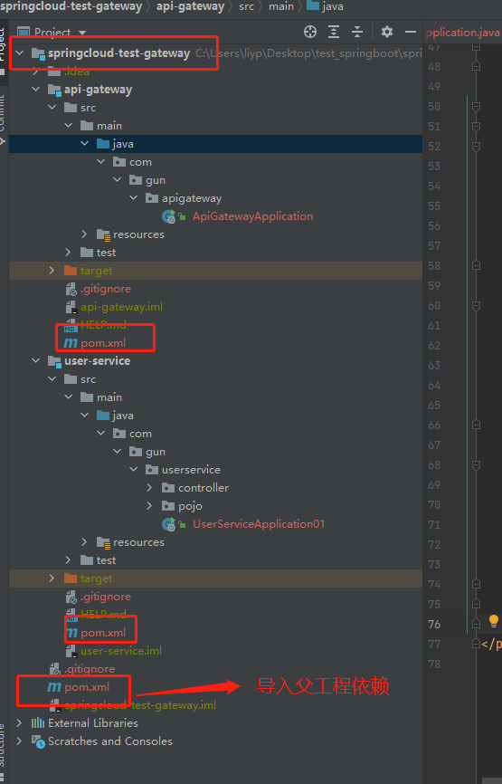
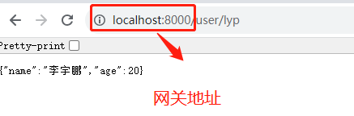
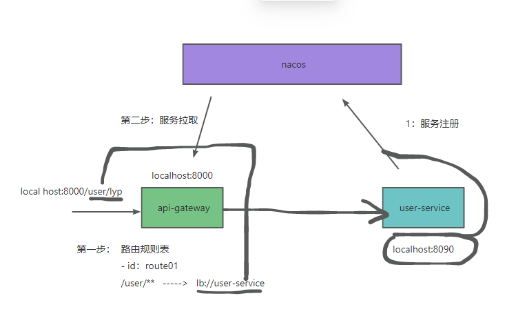

# 网关入门快速搭建

## 第一步：创建父工程




```xml
<?xml version="1.0" encoding="UTF-8"?>
<project xmlns="http://maven.apache.org/POM/4.0.0" xmlns:xsi="http://www.w3.org/2001/XMLSchema-instance"
         xsi:schemaLocation="http://maven.apache.org/POM/4.0.0 https://maven.apache.org/xsd/maven-4.0.0.xsd">
    <modelVersion>4.0.0</modelVersion>
    <groupId>com.gun</groupId>
    <artifactId>springcloud-test-gateway</artifactId>
    <version>1.0-SNAPSHOT</version>
    <name>springcloud-test-gateway</name>
    <description>Demo project for Spring Boot</description>
    <packaging>pom</packaging>

    <properties>
        <java.version>1.8</java.version>
        <project.build.sourceEncoding>UTF-8</project.build.sourceEncoding>
        <project.reporting.outputEncoding>UTF-8</project.reporting.outputEncoding>
        <!--    注意： 就用这个版本     -->
        <!--  springboot2.3.4.RELEASE      -->
        <spring-boot.version>2.3.4.RELEASE</spring-boot.version>
        <spring-cloud.version>Hoxton.SR8</spring-cloud.version>
    </properties>

    <modules>
        <module>api-gateway</module>
        <module>user-service</module>
    </modules>

    <dependencies>
        <dependency>
            <groupId>org.springframework.boot</groupId>
            <artifactId>spring-boot-starter</artifactId>
        </dependency>
        <dependency>
            <groupId>org.springframework.boot</groupId>
            <artifactId>spring-boot-starter-test</artifactId>
            <scope>test</scope>
        </dependency>
        <dependency>
            <groupId>org.projectlombok</groupId>
            <artifactId>lombok</artifactId>
            <optional>true</optional>
        </dependency>
        <!-- ============== fastjson ============== -->
        <dependency>
            <groupId>com.alibaba</groupId>
            <artifactId>fastjson</artifactId>
            <version>1.2.47</version>
        </dependency>
    </dependencies>

    <dependencyManagement>
        <dependencies>
            <dependency>
                <groupId>org.springframework.boot</groupId>
                <artifactId>spring-boot-dependencies</artifactId>
                <version>${spring-boot.version}</version>
                <type>pom</type>
                <scope>import</scope>
            </dependency>
            <!--     springcould       -->
            <dependency>
                <groupId>org.springframework.cloud</groupId>
                <artifactId>spring-cloud-dependencies</artifactId>
                <version>${spring-cloud.version}</version>
                <type>pom</type>
                <scope>import</scope>
            </dependency>
            <!--            spring-cloud-alibaba用：2.2.1.RELEASE -->
            <dependency>
                <groupId>com.alibaba.cloud</groupId>
                <artifactId>spring-cloud-alibaba-dependencies</artifactId>
                <version>2.2.1.RELEASE</version>
                <type>pom</type>
                <scope>import</scope>
            </dependency>
        </dependencies>
    </dependencyManagement>
</project>

```


## 第二步：创建网关子项目

### 导入依赖

```xml
<?xml version="1.0" encoding="UTF-8"?>
<project xmlns="http://maven.apache.org/POM/4.0.0" xmlns:xsi="http://www.w3.org/2001/XMLSchema-instance"
         xsi:schemaLocation="http://maven.apache.org/POM/4.0.0 https://maven.apache.org/xsd/maven-4.0.0.xsd">
    <modelVersion>4.0.0</modelVersion>
    <!--   根  -->
    <parent>
        <groupId>com.gun</groupId>
        <artifactId>springcloud-test-gateway</artifactId>
        <version>1.0-SNAPSHOT</version>
    </parent>

    <groupId>com.gun</groupId>
    <artifactId>api-gateway</artifactId>
    <version>0.0.1-SNAPSHOT</version>
    <name>api-gateway</name>

    <description>网关</description>

    <dependencies>
        <!--网关-->
        <dependency>
            <groupId>org.springframework.cloud</groupId>
            <artifactId>spring-cloud-starter-gateway</artifactId>
        </dependency>
        <!--nacos服务发现依赖-->
        <dependency>
            <groupId>com.alibaba.cloud</groupId>
            <artifactId>spring-cloud-starter-alibaba-nacos-discovery</artifactId>
        </dependency>
    </dependencies>

    <build>
        <finalName>webapp</finalName>
        <plugins>
            <plugin>
                <groupId>org.springframework.boot</groupId>
                <artifactId>spring-boot-maven-plugin</artifactId>
            </plugin>
        </plugins>
    </build>

</project>

```

### 书写配置文件

```yml
server:
  port: 8000 # 网关端口
spring:
  application:
    name: gateway # 服务名称
  cloud:
    nacos:
      server-addr: localhost:8848 # nacos地址
      discovery:
        ip: 127.0.0.1
    gateway:
      routes: # 网关路由配置
        - id: userservice # 路由id，自定义，只要唯一即可
          # uri: http://127.0.0.1:8081 # 路由的目标地址 http就是固定地址
          uri: lb://userservice # 路由的目标地址 lb就是负载均衡，后面跟服务名称
          predicates: # 路由断言，也就是判断请求是否符合路由规则的条件
            - Path=/user/** # 这个是按照路径匹配，只要以/user/开头就符合要求
```


## 第三步：创建user子项目

### 导入依赖

```xml
<?xml version="1.0" encoding="UTF-8"?>
<project xmlns="http://maven.apache.org/POM/4.0.0" xmlns:xsi="http://www.w3.org/2001/XMLSchema-instance"
         xsi:schemaLocation="http://maven.apache.org/POM/4.0.0 https://maven.apache.org/xsd/maven-4.0.0.xsd">
    <modelVersion>4.0.0</modelVersion>
    <!--   根  -->
    <parent>
        <groupId>com.gun</groupId>
        <artifactId>springcloud-test-gateway</artifactId>
        <version>1.0-SNAPSHOT</version>
    </parent>

    <groupId>com.gun</groupId>
    <artifactId>user-service01</artifactId>
    <version>0.0.1-SNAPSHOT</version>
    <name>user-service</name>
    <description>Demo project for Spring Boot</description>

    <dependencies>

        <dependency>
            <groupId>org.springframework.boot</groupId>
            <artifactId>spring-boot-starter-web</artifactId>
        </dependency>
        <!--nacos服务发现依赖-->
        <dependency>
            <groupId>com.alibaba.cloud</groupId>
            <artifactId>spring-cloud-starter-alibaba-nacos-discovery</artifactId>
        </dependency>
    </dependencies>
</project>

```

### 书写配置文件

```yml
server:
  port: 8091

spring:
  application:
    name: userservice
  cloud:
    nacos:
      server-addr: localhost:8848 # nacos地址
      discovery:
        ip: 127.0.0.1
userservice:
  ribbon:
    NFLoadBalancerRuleClassName: com.alibaba.cloud.nacos.ribbon.NacosRule  # 负载均衡规则
```


### 编写Controller

```java
package com.gun.userservice.controller;

import com.gun.userservice.pojo.User;
import org.springframework.beans.factory.annotation.Autowired;
import org.springframework.beans.factory.annotation.Value;
import org.springframework.web.bind.annotation.GetMapping;
import org.springframework.web.bind.annotation.PathVariable;
import org.springframework.web.bind.annotation.RequestMapping;
import org.springframework.web.bind.annotation.RestController;

/**
 * @author liyupeng
 * @date 2023/8/3&15:27
 * @function TODO:
 * @packageName com.gun.userservice.controller
 */
@RestController
@RequestMapping("/user")
public class UserController {

    @Value("${spring.application.name}")
    private String appName;

    @GetMapping("{orderId}")
    public User getUser(@PathVariable("orderId") String orderId){
        System.out.println(orderId);
        System.out.println("我是====="+appName+"=====应用程序");
        User user = new User();
        user.setName("李宇鹏");
        user.setAge(20);
        return user;
    }

}
```

## 测试




网关后台

```xquery
2023-08-03 17:49:03.318  INFO 8908 --- [ctor-http-nio-2] c.netflix.loadbalancer.BaseLoadBalancer  : Client: userservice instantiated a LoadBalancer: DynamicServerListLoadBalancer:{NFLoadBalancer:name=userservice,current list of Servers=[],Load balancer stats=Zone stats: {},Server stats: []}ServerList:null
2023-08-03 17:49:03.322  INFO 8908 --- [ctor-http-nio-2] c.n.l.DynamicServerListLoadBalancer      : Using serverListUpdater PollingServerListUpdater
2023-08-03 17:49:03.346  INFO 8908 --- [ctor-http-nio-2] c.netflix.config.ChainedDynamicProperty  : Flipping property: userservice.ribbon.ActiveConnectionsLimit to use NEXT property: niws.loadbalancer.availabilityFilteringRule.activeConnectionsLimit = 2147483647
2023-08-03 17:49:03.349  INFO 8908 --- [ctor-http-nio-2] c.n.l.DynamicServerListLoadBalancer      : DynamicServerListLoadBalancer for client userservice initialized: DynamicServerListLoadBalancer:{NFLoadBalancer:name=userservice,current list of Servers=[127.0.0.1:8090, 127.0.0.1:8091],Load balancer stats=Zone stats: {unknown=[Zone:unknown;	Instance count:2;	Active connections count: 0;	Circuit breaker tripped count: 0;	Active connections per server: 0.0;]
},Server stats: [[Server:127.0.0.1:8090;	Zone:UNKNOWN;	Total Requests:0;	Successive connection failure:0;	Total blackout seconds:0;	Last connection made:Thu Jan 01 08:00:00 CST 1970;	First connection made: Thu Jan 01 08:00:00 CST 1970;	Active Connections:0;	total failure count in last (1000) msecs:0;	average resp time:0.0;	90 percentile resp time:0.0;	95 percentile resp time:0.0;	min resp time:0.0;	max resp time:0.0;	stddev resp time:0.0]
, [Server:127.0.0.1:8091;	Zone:UNKNOWN;	Total Requests:0;	Successive connection failure:0;	Total blackout seconds:0;	Last connection made:Thu Jan 01 08:00:00 CST 1970;	First connection made: Thu Jan 01 08:00:00 CST 1970;	Active Connections:0;	total failure count in last (1000) msecs:0;	average resp time:0.0;	90 percentile resp time:0.0;	95 percentile resp time:0.0;	min resp time:0.0;	max resp time:0.0;	stddev resp time:0.0]
]}ServerList:com.alibaba.cloud.nacos.ribbon.NacosServerList@3000583b
2023-08-03 17:49:04.326  INFO 8908 --- [erListUpdater-0] c.netflix.config.ChainedDynamicProperty  : Flipping property: userservice.ribbon.ActiveConnectionsLimit to use NEXT property: niws.loadbalancer.availabilityFilteringRule.activeConnectionsLimit = 2147483647

```

解析下面话：

```xquery
c.n.l.DynamicServerListLoadBalancer   
#为 客户端 userservice 初始化了  动态均衡负载列表 : 
DynamicServerListLoadBalancer for client userservice initialized: 
、
# 动态的均衡负载服务列表
DynamicServerListLoadBalancer:
{
NFLoadBalancer:name=userservice,
#当前服务的列表，可以看到一个是网关、一个是 userservice服务。一个二个
current list of Servers=[127.0.0.1:8090, 127.0.0.1:8091],

# 均衡负载 统计  zone表示：全部统计吧，在某一个范围内进行。
Load balancer stats=Zone 
stats: {
unknown=[Zone:unknown;
		# 实例统计了 2 个
		Instance count:2;
        # 活动 连接数
		Active connections count: 0;
        # 断路器  跳       闸         次数：
		Circuit breaker tripped count: 0;
        # 每个服务器的活动连接数
		Active connections per server: 0.0;
		]
},

# 服务状态
Server stats: [
[

Server:127.0.0.1:8090;
# 区域：未知；
Zone:UNKNOWN;	
Total Requests:0;	
# 连续连接              失败
Successive connection failure:0;
# 总停电秒数
Total blackout seconds:0;
# 上次连接时间：  
Last connection made:Thu Jan 01 08:00:00 CST 1970;	
First connection made: Thu Jan 01 08:00:00 CST 1970;	
Active Connections:0;	
total failure count in last (1000) msecs:0;	
# 平均的
average resp time:0.0;	
90 percentile resp time:0.0;
# 95% 百分位数
95 percentile resp time:0.0;	
min resp time:0.0;	
max resp time:0.0;	
# 标准偏差 响应时间
stddev resp time:0.0]
, 

[Server:127.0.0.1:8091;	
Zone:UNKNOWN;	
Total Requests:0;	
Successive connection failure:0;	
Total blackout seconds:0;	
Last connection made:Thu Jan 01 08:00:00 CST 1970;	
First connection made: Thu Jan 01 08:00:00 CST 1970;	
Active Connections:0;	
total failure count in last (1000) msecs:0;
average resp time:0.0;	
90 percentile resp time:0.0;	
95 percentile resp time:0.0;	
min resp time:0.0;	
max resp time:0.0;	
stddev resp time:0.0
]
]
}
#服务列表对象
ServerList:com.alibaba.cloud.nacos.ribbon.NacosServerList@3000583b
```

json解析：





::: tip 小结

- 通过服务名字(user-service)与拉取下来的服务(IP地址)进行匹配。
- 如果这个服务名字匹配多个服务实例，则要进行均衡负转发送请求。

:::
