# Spring源码下载

从[github](https://so.csdn.net/so/search?q=github&spm=1001.2101.3001.7020)上下载Spring的源代码

下载地址：https://github.com/spring-projects/spring-framework

访问地址之后，打开Spring的代码页面找到你想下载的版本，如5.0.x，如下图所示：

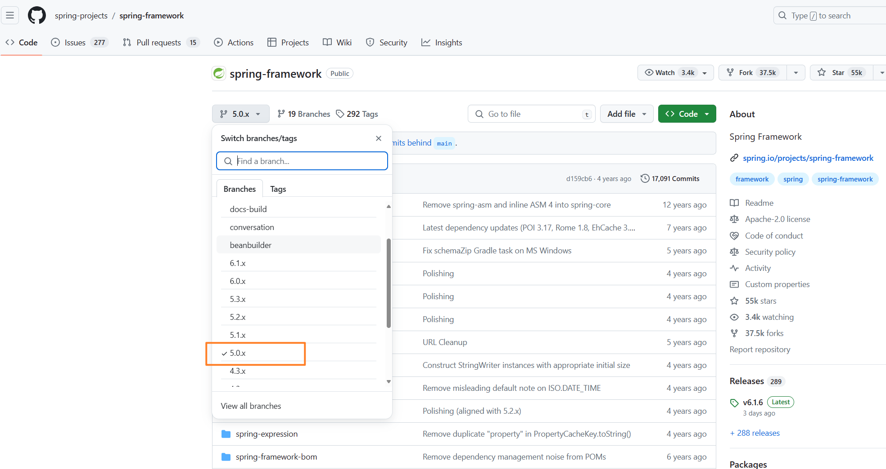


## 下载方式一：git clone

切换版本后，点右侧的code按钮，拷贝地址，在本地的执行git clone命令

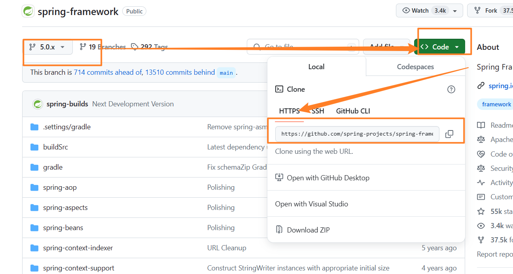


- 下载源码

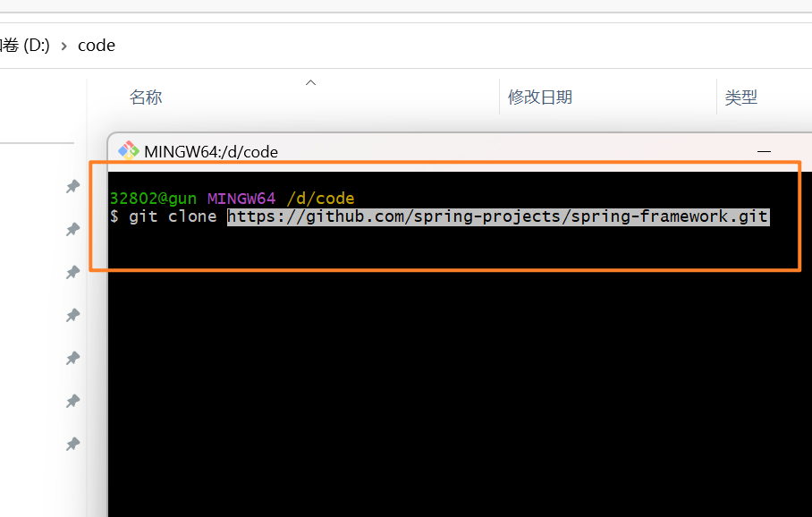


- 项目的目录结构


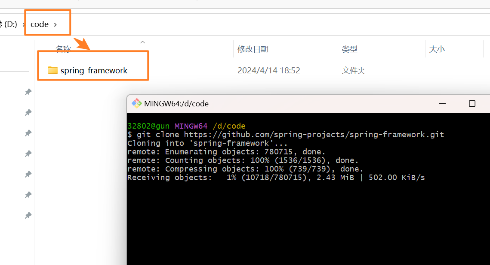


- 打开spring项目

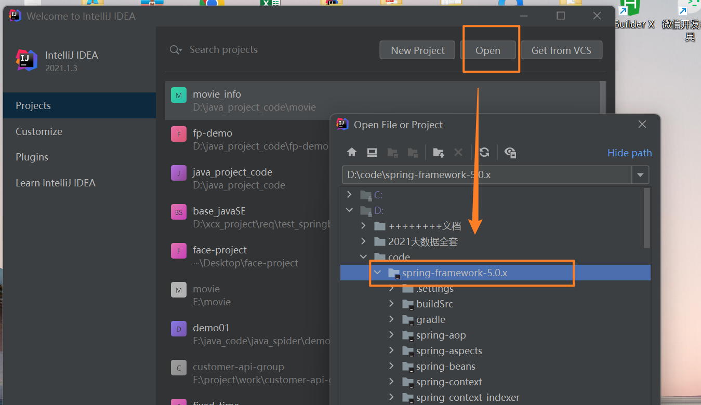


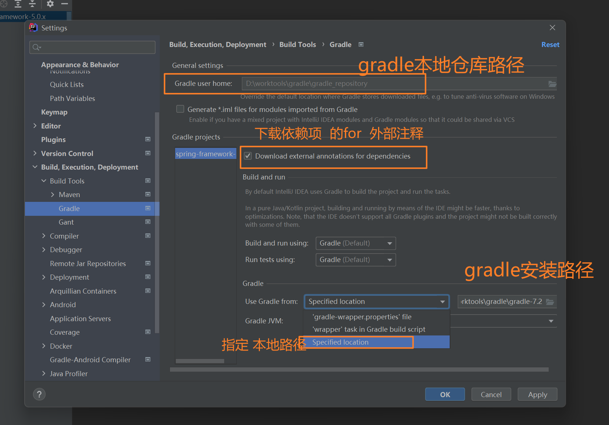


## 下载方式二：直接下载压缩包

还是在Code按钮中点开，找到下载代码压缩包，如下图所示：

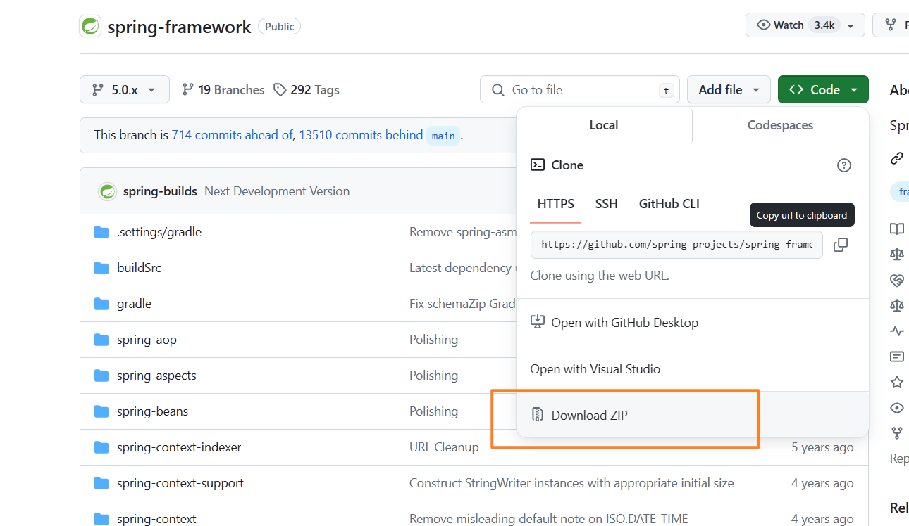


- 压缩包下载


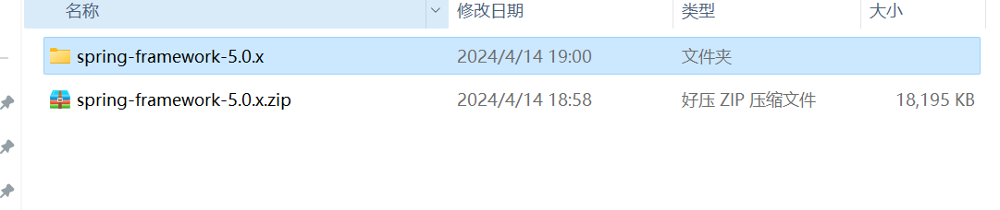


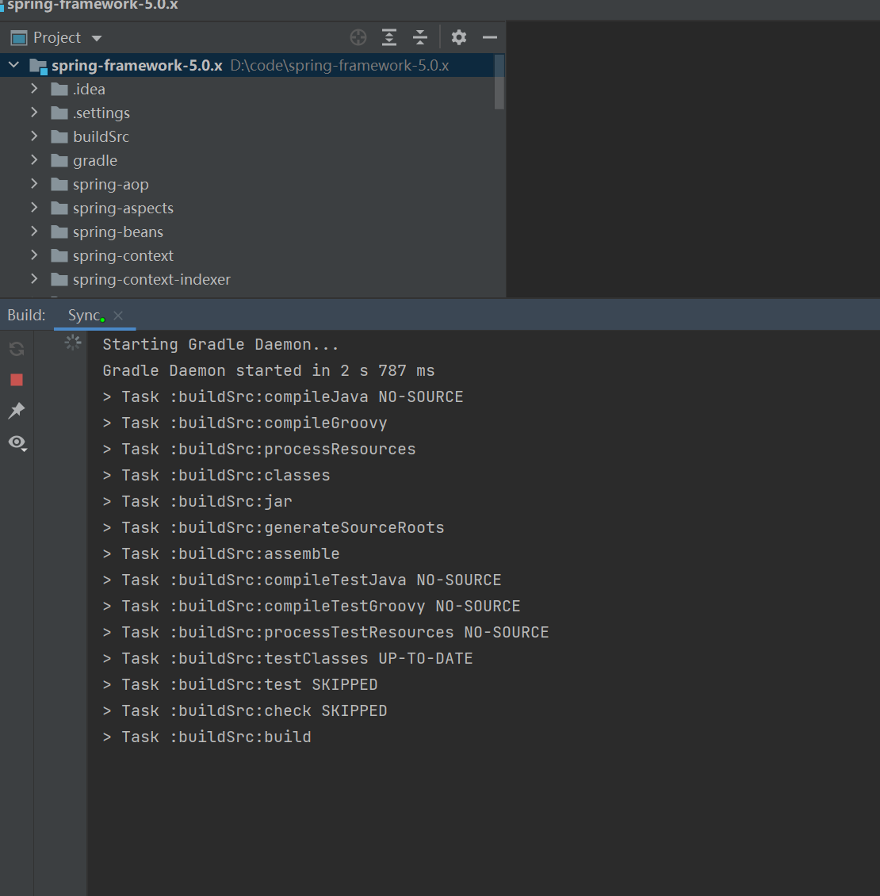


## 编译中遇到问题1

由于到目前为止，只是打开代码等待IDEA的自动编译，在编译的过程中会出现如下错误：

```
Could not GET ‘https://repo.spring.io/plugins-release/org/springframework/build/gradle/xxx
```

控制台的报错信息如下： 

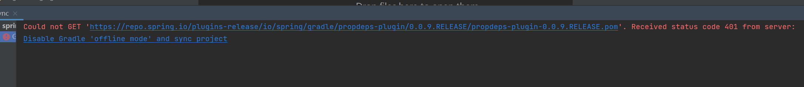

无法获取“https://repo.spring.io/plugins-release/io/spring/gradle/propdeps-plugin/0.0.9.RELEASE/propdeps-plugin-0.0.9.RELEASE.pom'. 从服务器接收到状态代码401：禁用Gradle“脱机模式”并同步项目

**原因**

原来Spring从5.X之后访问**repo.spring.io**仓库需要权限认证了，但是我没有Spring仓库的账户和密码改怎么拉去jar呢？在这里我们可以用阿里云的镜像代替Spring官网的镜像。在项目中的**build.gradle**文件中的镜像修改一下就好啦。

**解决**

打开工程下的**build.gradle文件，如下图所示：**

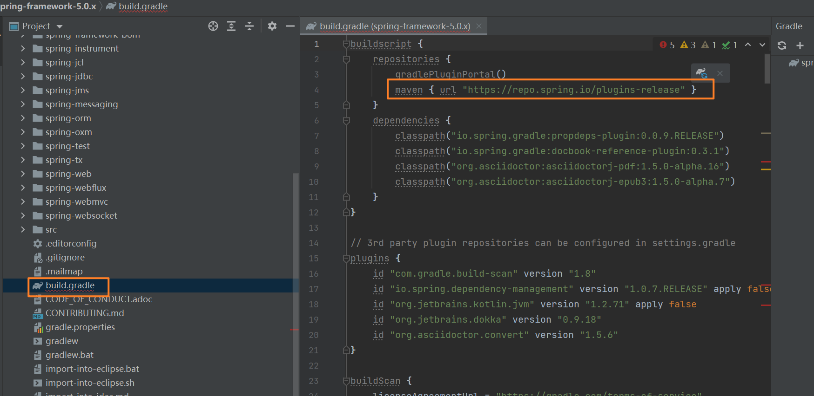

```gradle
		//maven私服。此处设置为ali的旧库，地址是url
		maven{ url "http://maven.aliyun.com/nexus/content/groups/public" }
		//阿里云新库
		maven { url "https://maven.aliyun.com/repository/central" }
		maven { url "https://maven.aliyun.com/repository/google" }
		maven { url "https://maven.aliyun.com/repository/gradle-plugin" }
		maven { url "https://maven.aliyun.com/repository/jcenter" }
		maven { url "https://maven.aliyun.com/repository/spring" }
		maven { url "https://maven.aliyun.com/repository/spring-plugin" }
		maven { url "https://maven.aliyun.com/repository/public" }
		maven { url "https://maven.aliyun.com/repository/releases" }
		maven { url "https://maven.aliyun.com/repository/snapshots" }
		maven { url "https://maven.aliyun.com/repository/grails-core" }
		maven { url "https://maven.aliyun.com/repository/mapr-public" }
		maven { url "https://maven.aliyun.com/repository/apache-snapshots" }
```

- 替换的效果

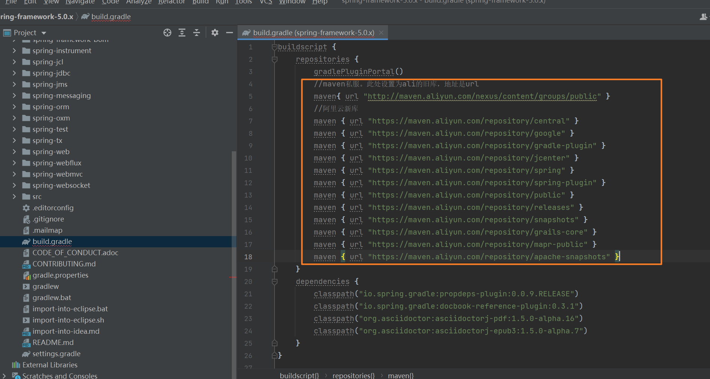

替换结束后，重新点击编译，此时就可以下载依赖的jar包了。

> 注意：<font color='red'>**此过程可能较慢，请耐心等待。。。**</font>等下载完成后，编译结束，就可以自由查阅Spring源码了。。。 


