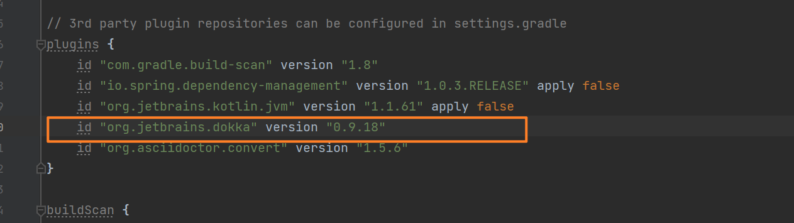
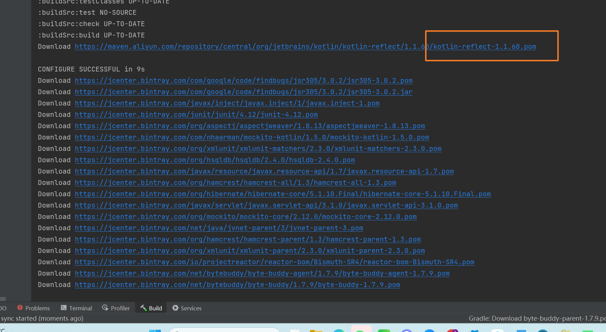

# Spring源码下载

从[github](https://so.csdn.net/so/search?q=github&spm=1001.2101.3001.7020)上下载Spring的源代码

下载地址：https://github.com/spring-projects/spring-framework

访问地址之后，打开Spring的代码页面找到你想下载的版本，如5.0.x，如下图所示：


## 下载方式一：git clone

切换版本后，点右侧的code按钮，拷贝地址，在本地的执行git clone命令


- 下载源码


- 项目的目录结构


- 打开spring项目


## 下载方式二：直接下载压缩包

还是在Code按钮中点开，找到下载代码压缩包，如下图所示：


- 压缩包下载


## 编译中遇到问题1

由于到目前为止，只是打开代码等待IDEA的自动编译，在编译的过程中会出现如下错误：

```
Could not GET ‘https://repo.spring.io/plugins-release/org/springframework/build/gradle/xxx
```

控制台的报错信息如下： 


无法获取“https://repo.spring.io/plugins-release/io/spring/gradle/propdeps-plugin/0.0.9.RELEASE/propdeps-plugin-0.0.9.RELEASE.pom'. 从服务器接收到状态代码401：禁用Gradle“脱机模式”并同步项目

**原因**

原来Spring从5.X之后访问**repo.spring.io**仓库需要权限认证了，但是我没有Spring仓库的账户和密码改怎么拉去jar呢？在这里我们可以用阿里云的镜像代替Spring官网的镜像。在项目中的**build.gradle**文件中的镜像修改一下就好啦。

**解决**

打开工程下的**build.gradle文件，如下图所示：**


```gradle
		//maven私服。此处设置为ali的旧库，地址是url
		maven{ url "http://maven.aliyun.com/nexus/content/groups/public" }
		//阿里云新库
		maven { url "https://maven.aliyun.com/repository/central" }
		maven { url "https://maven.aliyun.com/repository/google" }
		maven { url "https://maven.aliyun.com/repository/gradle-plugin" }
		maven { url "https://maven.aliyun.com/repository/jcenter" }
		maven { url "https://maven.aliyun.com/repository/spring" }
		maven { url "https://maven.aliyun.com/repository/spring-plugin" }
		maven { url "https://maven.aliyun.com/repository/public" }
		maven { url "https://maven.aliyun.com/repository/releases" }
		maven { url "https://maven.aliyun.com/repository/snapshots" }
		maven { url "https://maven.aliyun.com/repository/grails-core" }
		maven { url "https://maven.aliyun.com/repository/mapr-public" }
		maven { url "https://maven.aliyun.com/repository/apache-snapshots" }
```

- 替换的效果


替换结束后，重新点击编译，此时就可以下载依赖的jar包了。

> 注意：<font color='red'>**此过程可能较慢，请耐心等待。。。**</font>等下载完成后，编译结束，就可以自由查阅Spring源码了。。。 


## 常见问题2





```
distributionUrl=file:///D:/worktools/gradle/gradle-4.3.1-bin.zip
```


```
CONFIGURE SUCCESSFUL in 9s
The getTestClassesDir() method has been deprecated and is scheduled to be removed in Gradle 5.0. Please use the getTestClassesDirs() method instead.
	at org.gradle.api.tasks.testing.Test.getTestClassesDir(Test.java:950)
	at org.gradle.api.tasks.testing.Test_Decorated.getTestClassesDir(Unknown Source)
	at sun.reflect.NativeMethodAccessorImpl.invoke0(Native Method)
	at sun.reflect.NativeMethodAccessorImpl.invoke(NativeMethodAccessorImpl.java:62)
	at sun.reflect.DelegatingMethodAccessorImpl.invoke(DelegatingMethodAccessorImpl.java:43)
	at java.lang.reflect.Method.invoke(Method.java:498)
	at org.codehaus.groovy.reflection.CachedMethod.invoke(CachedMethod.java:93)
	at groovy.lang.MetaBeanProperty.getProperty(MetaBeanProperty.java:59)
	at org.gradle.internal.metaobject.BeanDynamicObject$MetaClassAdapter.getProperty(BeanDynamicObject.java:228)
	at org.gradle.internal.metaobject.BeanDynamicObject.tryGetProperty(BeanDynamicObject.java:171)
	at org.gradle.internal.metaobject.CompositeDynamicObject.tryGetProperty(CompositeDynamicObject.java:55)
	at org.gradle.internal.metaobject.AbstractDynamicObject.getProperty(AbstractDynamicObject.java:59)
	at org.gradle.api.tasks.testing.Test_Decorated.getProperty(Unknown Source)
	at org.codehaus.groovy.runtime.callsite.PogoGetPropertySite.getProperty(PogoGetPropertySite.java:50)
	at org.codehaus.groovy.runtime.callsite.AbstractCallSite.callGetProperty(AbstractCallSite.java:296)
	at org.jetbrains.plugins.gradle.tooling.builder.ExternalTestsModelBuilderImpl.getClassesDirs(ExternalTestsModelBuilderImpl.groovy:84)
	at org.jetbrains.plugins.gradle.tooling.builder.ExternalTestsModelBuilderImpl.access$0(ExternalTestsModelBuilderImpl.groovy)
	at org.jetbrains.plugins.gradle.tooling.builder.ExternalTestsModelBuilderImpl$_getMapping_closure1.doCall(ExternalTestsModelBuilderImpl.groovy:41)
	at sun.reflect.NativeMethodAccessorImpl.invoke0(Native Method)
	at sun.reflect.NativeMethodAccessorImpl.invoke(NativeMethodAccessorImpl.java:62)
	at sun.reflect.DelegatingMethodAccessorImpl.invoke(DelegatingMethodAccessorImpl.java:43)
	at java.lang.reflect.Method.invoke(Method.java:498)
	at org.codehaus.groovy.reflection.CachedMethod.invoke(CachedMethod.java:93)
	at groovy.lang.MetaMethod.doMethodInvoke(MetaMethod.java:325)
	at org.codehaus.groovy.runtime.metaclass.ClosureMetaClass.invokeMethod(ClosureMetaClass.java:294)
	at groovy.lang.MetaClassImpl.invokeMethod(MetaClassImpl.java:1022)
	at groovy.lang.Closure.call(Closure.java:414)
	at groovy.lang.Closure.call(Closure.java:430)
	at org.gradle.api.internal.ClosureBackedAction.execute(ClosureBackedAction.java:71)
	at org.gradle.util.ConfigureUtil.configureTarget(ConfigureUtil.java:160)
	at org.gradle.util.ConfigureUtil.configureSelf(ConfigureUtil.java:136)
	at org.gradle.api.internal.AbstractTask.configure(AbstractTask.java:638)
	at org.gradle.api.internal.AbstractTask.configure(AbstractTask.java:90)
	at org.gradle.util.ConfigureUtil.configure(ConfigureUtil.java:104)
	at org.gradle.util.ConfigureUtil$1.execute(ConfigureUtil.java:123)
	at org.gradle.internal.Actions$FilteredAction.execute(Actions.java:205)
	at org.gradle.api.internal.DefaultDomainObjectCollection.all(DefaultDomainObjectCollection.java:136)
	at org.gradle.api.internal.DefaultDomainObjectCollection.all(DefaultDomainObjectCollection.java:154)
	at org.gradle.api.internal.tasks.RealizableTaskCollection.all(RealizableTaskCollection.java:197)
	at org.gradle.api.internal.DefaultDomainObjectCollection.withType(DefaultDomainObjectCollection.java:165)
	at org.jetbrains.plugins.gradle.tooling.builder.ExternalTestsModelBuilderImpl.getMapping(ExternalTestsModelBuilderImpl.groovy:40)
	at org.jetbrains.plugins.gradle.tooling.builder.ExternalTestsModelBuilderImpl.buildAll(ExternalTestsModelBuilderImpl.groovy:29)
	at org.jetbrains.plugins.gradle.tooling.internal.ExtraModelBuilder.buildAll(ExtraModelBuilder.java:115)
	at org.jetbrains.plugins.gradle.tooling.internal.ExtraModelBuilder.buildAll(ExtraModelBuilder.java:80)
	at org.gradle.tooling.internal.provider.runner.DefaultBuildController.getModel(DefaultBuildController.java:55)
	at org.gradle.tooling.internal.consumer.connection.BuildControllerWithoutParameterSupport.getModel(BuildControllerWithoutParameterSupport.java:53)
	at org.gradle.tooling.internal.consumer.connection.UnparameterizedBuildController.getModel(UnparameterizedBuildController.java:113)
	at org.gradle.tooling.internal.consumer.connection.BuildControllerWithoutParameterSupport.getModel(BuildControllerWithoutParameterSupport.java:48)
	at org.gradle.tooling.internal.consumer.connection.UnparameterizedBuildController.findModel(UnparameterizedBuildController.java:97)
	at org.gradle.tooling.internal.consumer.connection.BuildControllerWithoutParameterSupport.findModel(BuildControllerWithoutParameterSupport.java:32)
	at org.gradle.tooling.internal.consumer.connection.UnparameterizedBuildController.findModel(UnparameterizedBuildController.java:81)
	at org.gradle.tooling.internal.consumer.connection.BuildControllerWithoutParameterSupport.findModel(BuildControllerWithoutParameterSupport.java:32)
	at org.jetbrains.plugins.gradle.model.ProjectImportAction$MyBuildController.findModel(ProjectImportAction.java:581)
	at org.jetbrains.plugins.gradle.model.ClassSetImportModelProvider.populateProjectModels(ClassSetImportModelProvider.java:39)
	at org.jetbrains.plugins.gradle.model.ProjectImportAction.getProjectModels(ProjectImportAction.java:290)
	at org.jetbrains.plugins.gradle.model.ProjectImportAction.access$600(ProjectImportAction.java:42)
	at org.jetbrains.plugins.gradle.model.ProjectImportAction$5.execute(ProjectImportAction.java:206)
	at org.jetbrains.plugins.gradle.model.ProjectImportAction$5.execute(ProjectImportAction.java:203)
	at org.jetbrains.plugins.gradle.model.ProjectImportAction.fetchProjectBuildModels(ProjectImportAction.java:219)
	at org.jetbrains.plugins.gradle.model.ProjectImportAction.execute(ProjectImportAction.java:126)
	at org.jetbrains.plugins.gradle.model.ProjectImportAction.execute(ProjectImportAction.java:42)
	at org.gradle.tooling.internal.consumer.connection.InternalBuildActionAdapter.execute(InternalBuildActionAdapter.java:55)
	at org.gradle.tooling.internal.provider.runner.ClientProvidedBuildActionRunner.buildResult(ClientProvidedBuildActionRunner.java:76)
	at org.gradle.tooling.internal.provider.runner.ClientProvidedBuildActionRunner.access$000(ClientProvidedBuildActionRunner.java:38)
	at org.gradle.tooling.internal.provider.runner.ClientProvidedBuildActionRunner$1.buildFinished(ClientProvidedBuildActionRunner.java:57)
	at sun.reflect.NativeMethodAccessorImpl.invoke0(Native Method)
	at sun.reflect.NativeMethodAccessorImpl.invoke(NativeMethodAccessorImpl.java:62)
	at sun.reflect.DelegatingMethodAccessorImpl.invoke(DelegatingMethodAccessorImpl.java:43)
	at java.lang.reflect.Method.invoke(Method.java:498)
	at org.gradle.internal.dispatch.ReflectionDispatch.dispatch(ReflectionDispatch.java:35)
	at org.gradle.internal.dispatch.ReflectionDispatch.dispatch(ReflectionDispatch.java:24)
	at org.gradle.internal.event.DefaultListenerManager$ListenerDetails.dispatch(DefaultListenerManager.java:371)
	at org.gradle.internal.event.DefaultListenerManager$ListenerDetails.dispatch(DefaultListenerManager.java:353)
	at org.gradle.internal.event.AbstractBroadcastDispatch.dispatch(AbstractBroadcastDispatch.java:58)
	at org.gradle.internal.event.DefaultListenerManager$EventBroadcast$ListenerDispatch.dispatch(DefaultListenerManager.java:341)
	at org.gradle.internal.event.DefaultListenerManager$EventBroadcast$ListenerDispatch.dispatch(DefaultListenerManager.java:328)
	at org.gradle.internal.event.AbstractBroadcastDispatch.dispatch(AbstractBroadcastDispatch.java:42)
	at org.gradle.internal.event.BroadcastDispatch$SingletonDispatch.dispatch(BroadcastDispatch.java:230)
	at org.gradle.internal.event.BroadcastDispatch$SingletonDispatch.dispatch(BroadcastDispatch.java:149)
	at org.gradle.internal.event.AbstractBroadcastDispatch.dispatch(AbstractBroadcastDispatch.java:58)
	at org.gradle.internal.event.BroadcastDispatch$CompositeDispatch.dispatch(BroadcastDispatch.java:324)
	at org.gradle.internal.event.BroadcastDispatch$CompositeDispatch.dispatch(BroadcastDispatch.java:234)
	at org.gradle.internal.event.ListenerBroadcast.dispatch(ListenerBroadcast.java:140)
	at org.gradle.internal.event.ListenerBroadcast.dispatch(ListenerBroadcast.java:37)
	at org.gradle.internal.dispatch.ProxyDispatchAdapter$DispatchingInvocationHandler.invoke(ProxyDispatchAdapter.java:93)
	at com.sun.proxy.$Proxy17.buildFinished(Unknown Source)
	at org.gradle.initialization.DefaultGradleLauncher.finishBuild(DefaultGradleLauncher.java:148)
	at org.gradle.initialization.DefaultGradleLauncher.finishBuild(DefaultGradleLauncher.java:116)
	at org.gradle.internal.invocation.GradleBuildController$2.call(GradleBuildController.java:88)
	at org.gradle.internal.invocation.GradleBuildController$2.call(GradleBuildController.java:84)
	at org.gradle.internal.work.DefaultWorkerLeaseService.withLocks(DefaultWorkerLeaseService.java:152)
	at org.gradle.internal.invocation.GradleBuildController.doBuild(GradleBuildController.java:100)
	at org.gradle.internal.invocation.GradleBuildController.configure(GradleBuildController.java:84)
	at org.gradle.tooling.internal.provider.runner.ClientProvidedBuildActionRunner.run(ClientProvidedBuildActionRunner.java:65)
	at org.gradle.launcher.exec.ChainingBuildActionRunner.run(ChainingBuildActionRunner.java:35)
	at org.gradle.launcher.exec.ChainingBuildActionRunner.run(ChainingBuildActionRunner.java:35)
	at org.gradle.tooling.internal.provider.ValidatingBuildActionRunner.run(ValidatingBuildActionRunner.java:32)
	at org.gradle.launcher.exec.RunAsBuildOperationBuildActionRunner$1.run(RunAsBuildOperationBuildActionRunner.java:43)
	at org.gradle.internal.progress.DefaultBuildOperationExecutor$RunnableBuildOperationWorker.execute(DefaultBuildOperationExecutor.java:336)
	at org.gradle.internal.progress.DefaultBuildOperationExecutor$RunnableBuildOperationWorker.execute(DefaultBuildOperationExecutor.java:328)
	at org.gradle.internal.progress.DefaultBuildOperationExecutor.execute(DefaultBuildOperationExecutor.java:199)
	at org.gradle.internal.progress.DefaultBuildOperationExecutor.run(DefaultBuildOperationExecutor.java:110)
	at org.gradle.launcher.exec.RunAsBuildOperationBuildActionRunner.run(RunAsBuildOperationBuildActionRunner.java:40)
	at org.gradle.tooling.internal.provider.SubscribableBuildActionRunner.run(SubscribableBuildActionRunner.java:51)
	at org.gradle.launcher.exec.InProcessBuildActionExecuter.execute(InProcessBuildActionExecuter.java:47)
	at org.gradle.launcher.exec.InProcessBuildActionExecuter.execute(InProcessBuildActionExecuter.java:30)
	at org.gradle.launcher.exec.BuildTreeScopeBuildActionExecuter.execute(BuildTreeScopeBuildActionExecuter.java:39)
	at org.gradle.launcher.exec.BuildTreeScopeBuildActionExecuter.execute(BuildTreeScopeBuildActionExecuter.java:25)
	at org.gradle.tooling.internal.provider.ContinuousBuildActionExecuter.execute(ContinuousBuildActionExecuter.java:80)
	at org.gradle.tooling.internal.provider.ContinuousBuildActionExecuter.execute(ContinuousBuildActionExecuter.java:53)
	at org.gradle.tooling.internal.provider.ServicesSetupBuildActionExecuter.execute(ServicesSetupBuildActionExecuter.java:57)
	at org.gradle.tooling.internal.provider.ServicesSetupBuildActionExecuter.execute(ServicesSetupBuildActionExecuter.java:32)
	at org.gradle.tooling.internal.provider.GradleThreadBuildActionExecuter.execute(GradleThreadBuildActionExecuter.java:36)
	at org.gradle.tooling.internal.provider.GradleThreadBuildActionExecuter.execute(GradleThreadBuildActionExecuter.java:25)
	at org.gradle.tooling.internal.provider.ParallelismConfigurationBuildActionExecuter.execute(ParallelismConfigurationBuildActionExecuter.java:43)
	at org.gradle.tooling.internal.provider.ParallelismConfigurationBuildActionExecuter.execute(ParallelismConfigurationBuildActionExecuter.java:29)
	at org.gradle.tooling.internal.provider.StartParamsValidatingActionExecuter.execute(StartParamsValidatingActionExecuter.java:64)
	at org.gradle.tooling.internal.provider.StartParamsValidatingActionExecuter.execute(StartParamsValidatingActionExecuter.java:29)
	at org.gradle.tooling.internal.provider.SessionFailureReportingActionExecuter.execute(SessionFailureReportingActionExecuter.java:59)
	at org.gradle.tooling.internal.provider.SessionFailureReportingActionExecuter.execute(SessionFailureReportingActionExecuter.java:44)
	at org.gradle.tooling.internal.provider.SetupLoggingActionExecuter.execute(SetupLoggingActionExecuter.java:45)
	at org.gradle.tooling.internal.provider.SetupLoggingActionExecuter.execute(SetupLoggingActionExecuter.java:30)
	at org.gradle.launcher.daemon.server.exec.ExecuteBuild.doBuild(ExecuteBuild.java:67)
	at org.gradle.launcher.daemon.server.exec.BuildCommandOnly.execute(BuildCommandOnly.java:36)
	at org.gradle.launcher.daemon.server.api.DaemonCommandExecution.proceed(DaemonCommandExecution.java:122)
	at org.gradle.launcher.daemon.server.exec.WatchForDisconnection.execute(WatchForDisconnection.java:37)
	at org.gradle.launcher.daemon.server.api.DaemonCommandExecution.proceed(DaemonCommandExecution.java:122)
	at org.gradle.launcher.daemon.server.exec.ResetDeprecationLogger.execute(ResetDeprecationLogger.java:26)
	at org.gradle.launcher.daemon.server.api.DaemonCommandExecution.proceed(DaemonCommandExecution.java:122)
	at org.gradle.launcher.daemon.server.exec.RequestStopIfSingleUsedDaemon.execute(RequestStopIfSingleUsedDaemon.java:34)
	at org.gradle.launcher.daemon.server.api.DaemonCommandExecution.proceed(DaemonCommandExecution.java:122)
	at org.gradle.launcher.daemon.server.exec.ForwardClientInput$2.call(ForwardClientInput.java:74)
	at org.gradle.launcher.daemon.server.exec.ForwardClientInput$2.call(ForwardClientInput.java:72)
	at org.gradle.util.Swapper.swap(Swapper.java:38)
	at org.gradle.launcher.daemon.server.exec.ForwardClientInput.execute(ForwardClientInput.java:72)
	at org.gradle.launcher.daemon.server.api.DaemonCommandExecution.proceed(DaemonCommandExecution.java:122)
	at org.gradle.launcher.daemon.server.exec.LogAndCheckHealth.execute(LogAndCheckHealth.java:55)
	at org.gradle.launcher.daemon.server.api.DaemonCommandExecution.proceed(DaemonCommandExecution.java:122)
	at org.gradle.launcher.daemon.server.exec.LogToClient.doBuild(LogToClient.java:62)
	at org.gradle.launcher.daemon.server.exec.BuildCommandOnly.execute(BuildCommandOnly.java:36)
	at org.gradle.launcher.daemon.server.api.DaemonCommandExecution.proceed(DaemonCommandExecution.java:122)
	at org.gradle.launcher.daemon.server.exec.EstablishBuildEnvironment.doBuild(EstablishBuildEnvironment.java:82)
	at org.gradle.launcher.daemon.server.exec.BuildCommandOnly.execute(BuildCommandOnly.java:36)
	at org.gradle.launcher.daemon.server.api.DaemonCommandExecution.proceed(DaemonCommandExecution.java:122)
	at org.gradle.launcher.daemon.server.exec.StartBuildOrRespondWithBusy$1.run(StartBuildOrRespondWithBusy.java:50)
	at org.gradle.launcher.daemon.server.DaemonStateCoordinator$1.run(DaemonStateCoordinator.java:295)
	at org.gradle.internal.concurrent.ExecutorPolicy$CatchAndRecordFailures.onExecute(ExecutorPolicy.java:63)
	at org.gradle.internal.concurrent.ManagedExecutorImpl$1.run(ManagedExecutorImpl.java:46)
	at java.util.concurrent.ThreadPoolExecutor.runWorker(ThreadPoolExecutor.java:1142)
	at java.util.concurrent.ThreadPoolExecutor$Worker.run(ThreadPoolExecutor.java:617)
	at org.gradle.internal.concurrent.ThreadFactoryImpl$ManagedThreadRunnable.run(ThreadFactoryImpl.java:55)
	at java.lang.Thread.run(Thread.java:745)
```





