# srping源码编译

解压

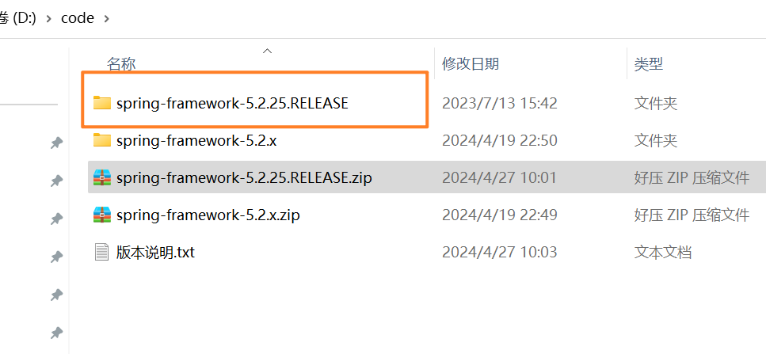


spring源码目录。


## 01)安装gradle


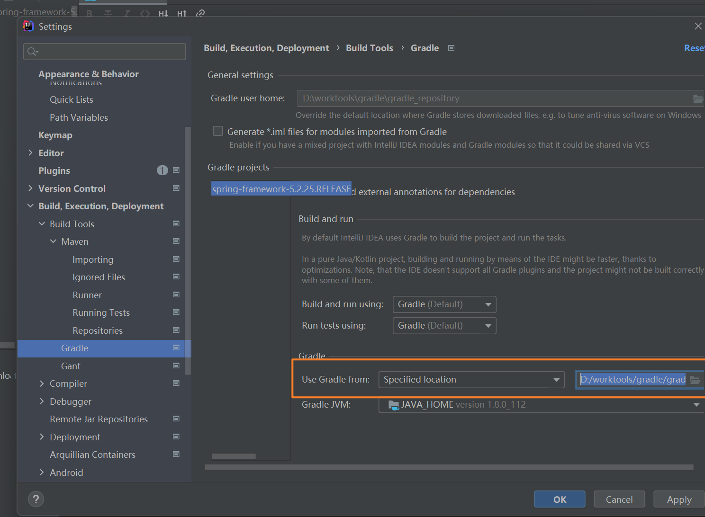


## 02)idea打开


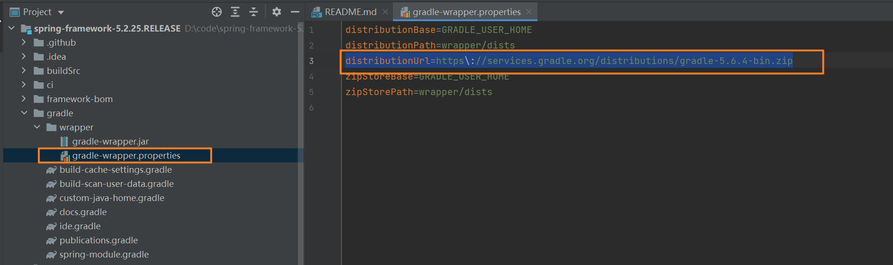


```
distributionUrl=file:///D:/worktools/gradle/gradle-5.6.4-bin.zip
```


## 03)修改下载依赖地址

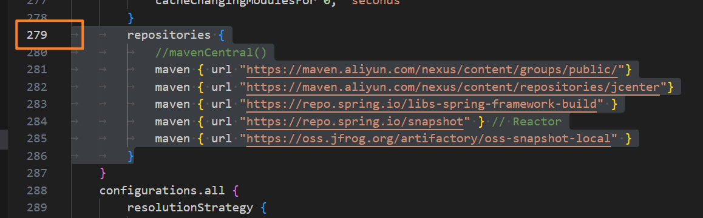


```xml
		repositories {
			//mavenCentral()
			maven { url "https://maven.aliyun.com/nexus/content/groups/public/"}
			maven { url "https://maven.aliyun.com/nexus/content/repositories/jcenter"}
			maven { url "https://repo.spring.io/libs-spring-framework-build" }
			maven { url "https://repo.spring.io/snapshot" } // Reactor
			maven { url "https://oss.jfrog.org/artifactory/oss-snapshot-local" }
		}
```


## 04)构建完成

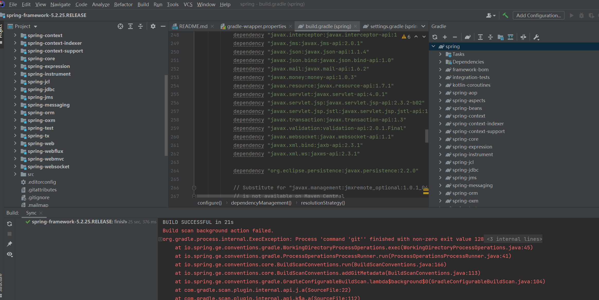


## 05)创建一个模块

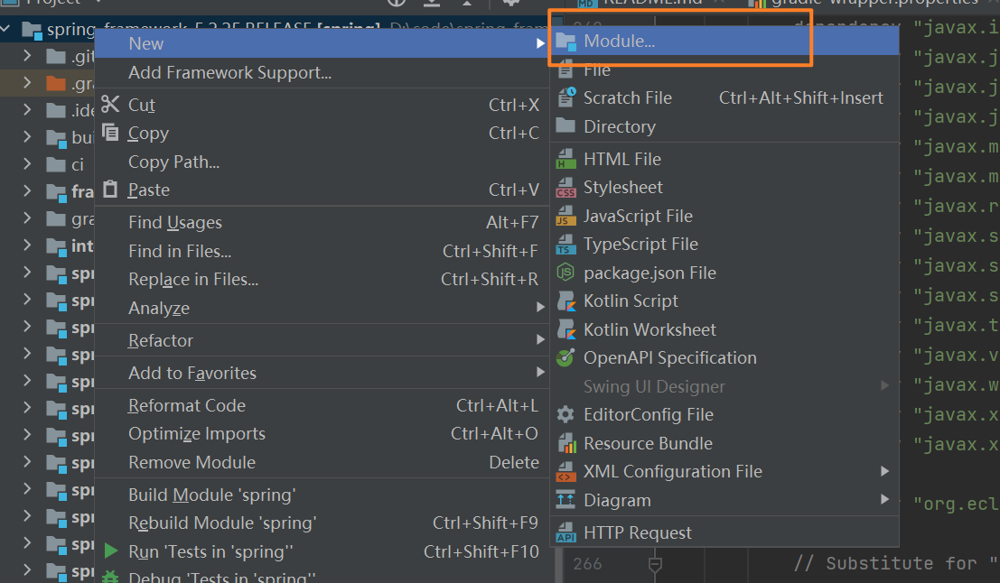


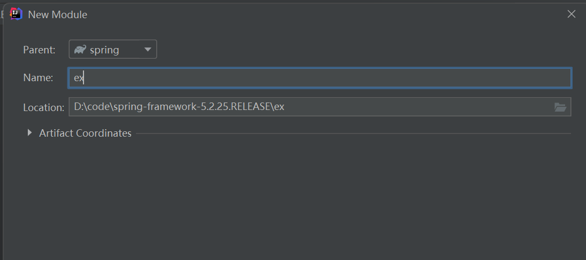


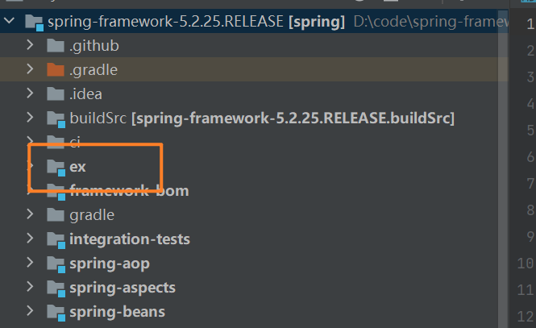


## 06)编译响应的模块

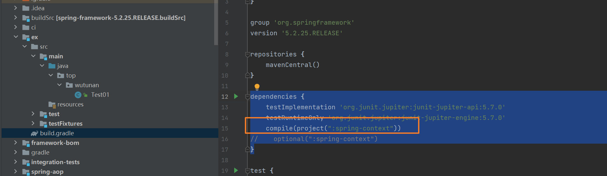

```xml
dependencies {
    testImplementation 'org.junit.jupiter:junit-jupiter-api:5.7.0'
    testRuntimeOnly 'org.junit.jupiter:junit-jupiter-engine:5.7.0'
    compile(project(":spring-context"))
//    optional(":spring-context")
}
```

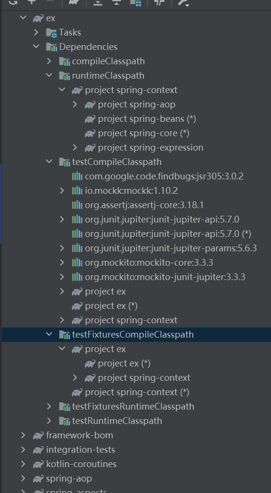


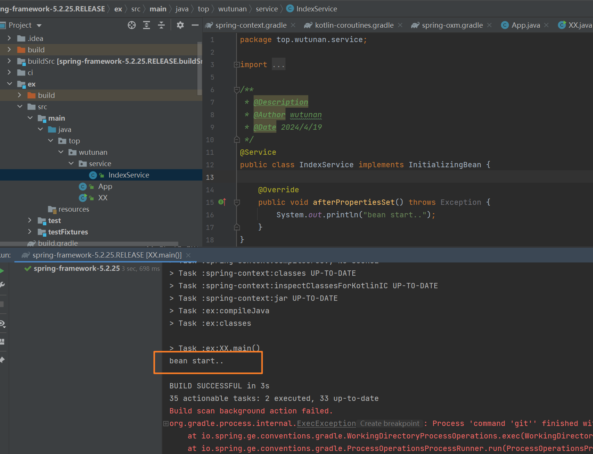


## 常见报错

```
fatal: not a git repository (or any of the parent directories): .git

BUILD SUCCESSFUL in 21s
Build scan background action failed.
org.gradle.process.internal.ExecException: Process 'command 'git'' finished with non-zero exit value 128
	at org.gradle.process.internal.DefaultExecHandle$ExecResultImpl.assertNormalExitValue(DefaultExecHandle.java:409)
	at org.gradle.process.internal.DefaultExecAction.execute(DefaultExecAction.java:38)
	at org.gradle.process.internal.DefaultExecActionFactory.exec(DefaultExecActionFactory.java:145)
	at io.spring.ge.conventions.gradle.WorkingDirectoryProcessOperations.exec(WorkingDirectoryProcessOperations.java:45)
	at io.spring.ge.conventions.gradle.ProcessOperationsProcessRunner.run(ProcessOperationsProcessRunner.java:41)
	at io.spring.ge.conventions.core.BuildScanConventions.run(BuildScanConventions.java:166)
	at io.spring.ge.conventions.core.BuildScanConventions.addGitMetadata(BuildScanConventions.java:113)
	at io.spring.ge.conventions.gradle.GradleConfigurableBuildScan.lambda$background$0(GradleConfigurableBuildScan.java:104)
	at com.gradle.scan.plugin.internal.api.j.a(SourceFile:22)
	at com.gradle.scan.plugin.internal.api.k$a.a(SourceFile:112)
	at com.gradle.scan.plugin.internal.api.h.a(SourceFile:62)
	at java.util.concurrent.Executors$RunnableAdapter.call(Executors.java:511)
	at java.util.concurrent.FutureTask.run(FutureTask.java:266)
	at java.util.concurrent.ThreadPoolExecutor.runWorker(ThreadPoolExecutor.java:1142)
	at java.util.concurrent.ThreadPoolExecutor$Worker.run(ThreadPoolExecutor.java:617)
	at java.lang.Thread.run(Thread.java:745)
```


::: tip 我这个之前编译过
本地就有之前编译的依赖。
:::


