# 带你彻底搞懂Redis分布式锁

 一个叫杠的程序员，他刚工作不久，然后公司让他开发一个秒杀的功能。他经过需求分析之后呢发现很简单，只需要根据当前秒杀的商品，判断该商品的库存是否大于0

```java
// 下单
public static void placeOrder（） throws Exception {
	if(stock > 0){
	Thread.sleep（ millis： 100）;
	stock--;
	System.out.println（Thread.currentThread（）.getName（） + "秒杀成功"）;
				
		} else {
	System.out.println（Thread.currentThread（）.getName（） + "秒杀失败！库存不足");
		}
}


// 用户抢票开始
public static void main(String[] args) throws Exception {
	for (int i=0;i<3;i++){
		// 同时创建三个线程。
		new Thread(() -> {
            try {
                placeOrder();
            } catch (Exception e) {
                e. printStackTrace();
            }   
		}). start();
        
    }
```

但上线之后呢挨了老板的屌，因为他发现呢，有一个商品的库存只有一个，但是却卖出了好几份

那由于这个问题呢？杠这个月的KPI直接扣光了，

分析一：

在多线程并发的一个情况下，如果同时对一个共享资源进行读写呢，会对这个数据造成数据的错乱的问题，那杠呢他也意识到了这个问题，所以说他在这个基础上呢进行了改造。

```java


// 下单
public static void placeOrder（） throws Exception {

    //加上同步锁
    synchronized（stock）{
            if(stock > 0){
            Thread.sleep（ millis： 100）;
            stock--;
            System.out.println(Thread.currentThread（）.getName（） + "秒杀成功");

            } else {
        System.out.println(Thread.currentThread（）.getName（） + "秒杀失败！库存不足");
            }
            }
}


// 用户抢票开始
public static void main(String[] args) throws Exception {
	for (int i=0;i<3;i++){
		// 同时创建三个线程。
		new Thread(() -> {
            try {
                placeOrder();
            } catch (Exception e) {
                e. printStackTrace();
            }   
		}). start();
        
    }
```

这一次呢他加了一把同步锁，然后呢在上线之前他学聪明了。

多线程并发的情况下我们加了同步锁，那其他的线程呢，同时进来会进行一个互斥，他需要排队等待【wait】

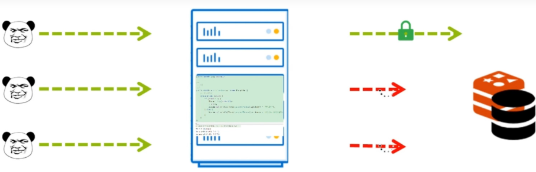

需要等持有锁的线程处理完之后，其他的线程才能正常的进行处理，

但是随着用户量日益增多，小徐发现服务器压力越来越大，性能已经到达了瓶颈，但是他不慌啊。

因为他学过一个叫做Nginx，负载均衡的技术。他将服务器呢进行了**水平扩展**，通过Nginx进行分布式集群部署，

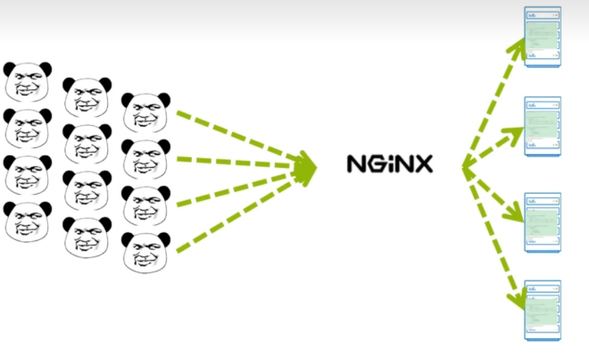

分析二：

但是在压测的时候呢。发现吞吐量确实上来了，但是秒杀功能呢又出现了超卖问题？

那经过他的研究发现，原来是同步锁的问题，因为同步锁呢他是JVM级别的，他只能锁住单个进程。

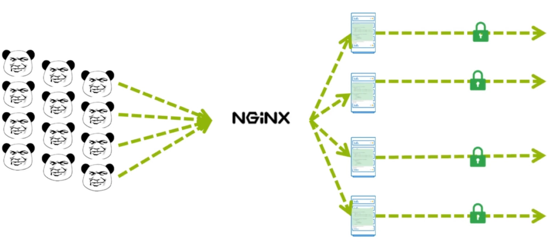

但是经过分布式部署之后呢，每台服务器在并发的情况下，只能锁住一个线程，

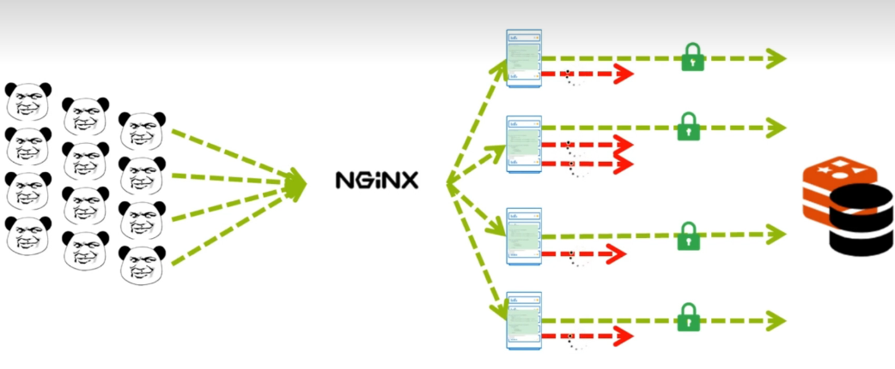


原来是这样。经过他一个晚上未免研究发现，可以通过一个叫做分布式锁的技术来进解决。

解决：

那现在主流的分布式所解决方案呢有Redis和zookeeper，由于它的系统已经使用到了Redis，所以呢考虑zookeeper需要再部署服务，不想再间增加服务器的成本。那他决定呢采用redis来实现分布锁。


通过Redis的setNX，就可以非常简单的实现分配，setNX它的特性是什么样的呢。

当一个线程进来往Redis的当中，通过setNX去存储一个值的时候，他发现一个键【key】，比如说通过setNX发现，xushu的这个键里面，没有值的时候，他会往里面存储一个值，然后返回true，


然后又一个线程进来当往xushu这个键里面通过setNX存储一个值的时候，发现有值，此时它会返回false。

那通过这个特性呢，就可以实现分布入锁。


当用户请求进来的时候呢，通过c的NX来进行设置一个键（值随意），那当里面没有的时候返回true，加锁成功，

但是记住一定要加上过期时间，因为小徐经过测试的时候发现，用户在请求的过程当中，

如果此时服务器挂掉了。

那么其他的服务器正常请求，依然会出现一个阻塞的一个情况。因为他们其他的服务器的线程，通过setNX来进行上锁的时候呢，发现这个键当中一直会有值，所以说永远都上锁不成功。之前挂掉的这个服务器呢

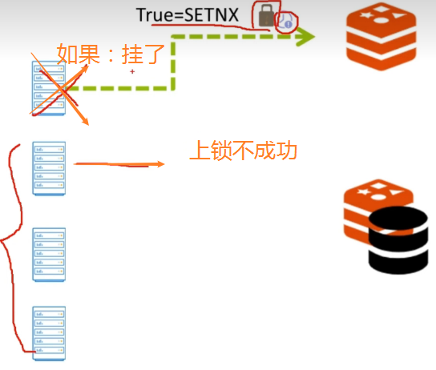


他一直持有锁，从而呢造成了一个死锁的现象。所以说呢，他发现一定要加一个过期时间，这样如果服务器挂掉了，经过这个时间之后，这把锁将会自动释放，那从而不影响，其他的服务器的一个正常请求。


那么通过setNX呢，在用户请求进来加上锁，其他所有服务器的线程呢，此时再通过setNX发现，已经无法进行上锁，需要进行等待。


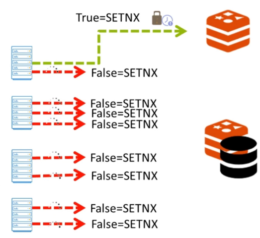

那只有将第一个线程处理完毕之后。

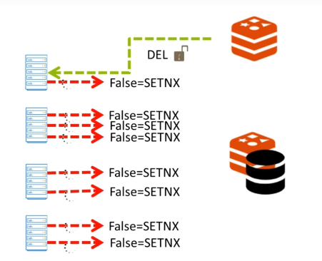


释放之后才有第二个请求继续setNX上锁。

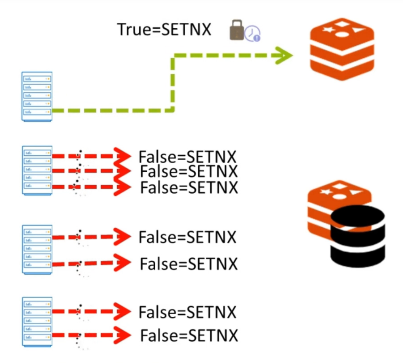

同样的第二个请求，请求释放之后，

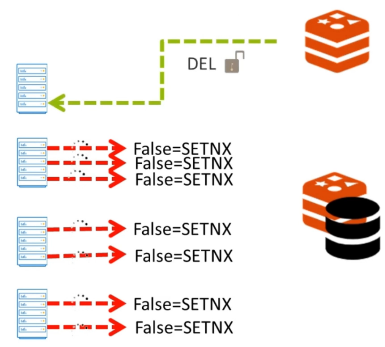

其他的线程才可以进行请求。其他的线程以此类推。


问题：

但是随着业务的扩展，有暴露出来一些问题。他发现当业务的处理时间，超过了这把锁的过期时间？业务还没有过期处理完毕。此时，这把锁他会自动的释放。其他的线程就会趁虚而入

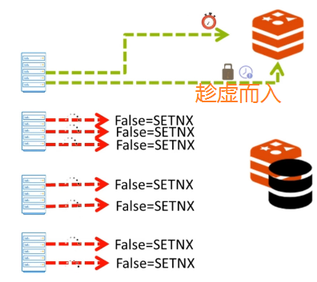

而线程一处理完了之后呢，此时释放线程二的锁。其他线又会趁虚而入。

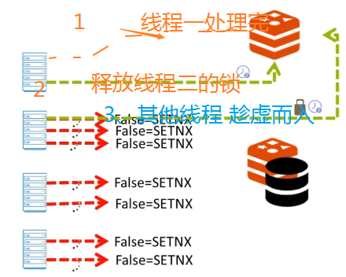


以此类推。从而又会造成超卖的问题。


什么问题，

二个问题，

第一个问题，是当锁的过期时间到了，义务代码还没有执行完毕。说白了就是:是一个锁的过期时间问题。 

第二个问题：是在第一个问题的基础上，当业务代码处理完毕之后。由于其他的线程乘虚而入，而导致释放了其他线程的锁，


解决：

第一个问题：

加长锁的一个过期时间，还考虑到，如果我加长的这个时间还是不够，等待我的业务代码处理完毕怎么办。

例外一个解决方案，在这个代码中它添加了一个子线程，每10秒去确认主线程是不是在线。如果在线，将过期时间重新置设，【锁续命】


第二个问题：就是给锁增加了一个唯一ID，那这样就能保证每一把锁他的key是绑定的自己的哪一个线程。从而就不会释放其他线程的锁。


新发现：要自己去实现代码，麻烦，


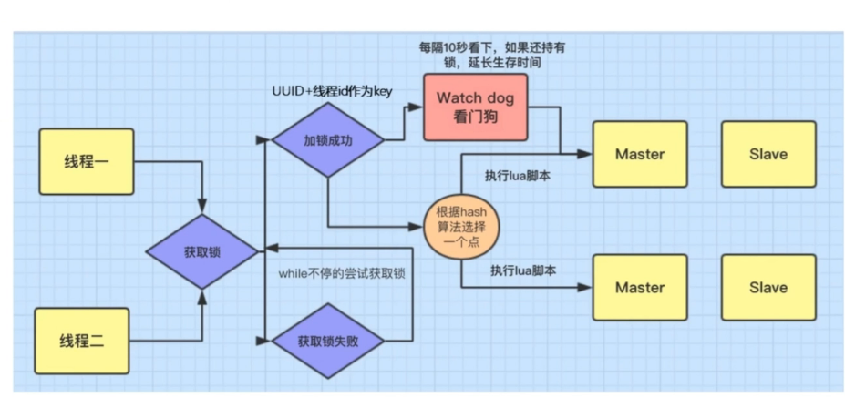


同样的我们多个线程同时请求，去竞争这个锁，当然只有一个线程才能获取到这把锁。那假设线程一他获取到了锁，那么，他的key就是，UUID+加线程id，保证我们的key与当前线程在一起绑定，这样就不会释放其他线程的锁。那么当他获取锁成功，去处理业务的时候，他的内部会有一个这样的任务，叫watch dog，看门狗。他会没10秒看一下，当前线程是否还持有锁，如果持有的话，就延续生存时间，从而个这把锁来进行续命。


如果我们实现了我们的redis的集群呢？他会看，选择redis集群中哪一个集群。

那么，如果没有获取锁，他会进行自旋，一直的去获取锁。直到超时为止。

面试问题;

redis使用了主从集群模式，我们的主节点挂了，redis采用的是AP模式。

大白话就是：redis去设置锁时，他会在一个节点进行设置，然后设置完毕后就会马上告诉你设置成功，然后他内部就进行同步。但是，如果你把这个key设置在主节点，正好主节点挂了，但是从节点呢并没有同步到这这把锁，这时线程不安全。

解决：redlock，它要保证所有的节点存储完毕，他才给你响应完毕结果。【保证强一致性问题】


