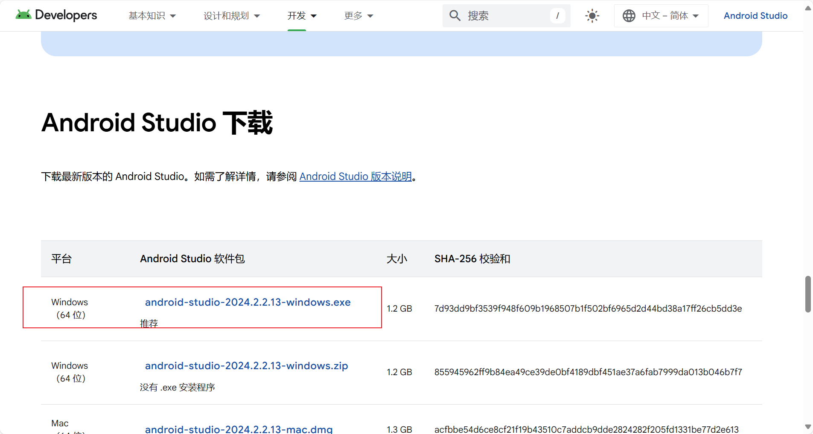
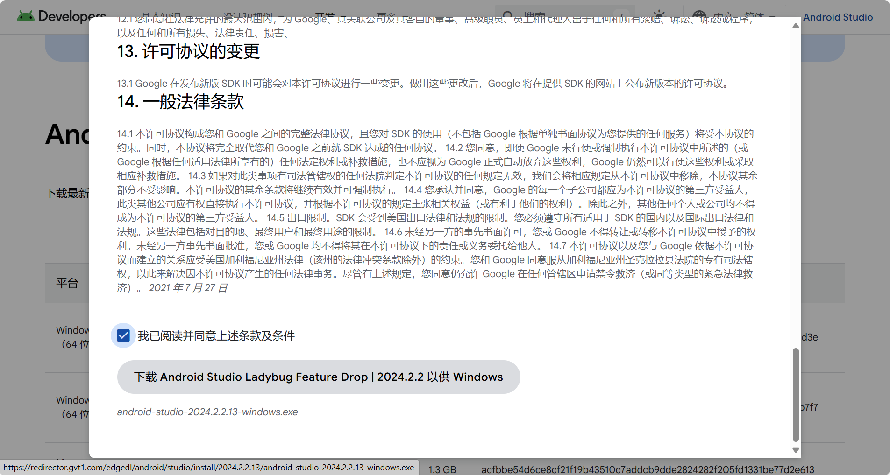
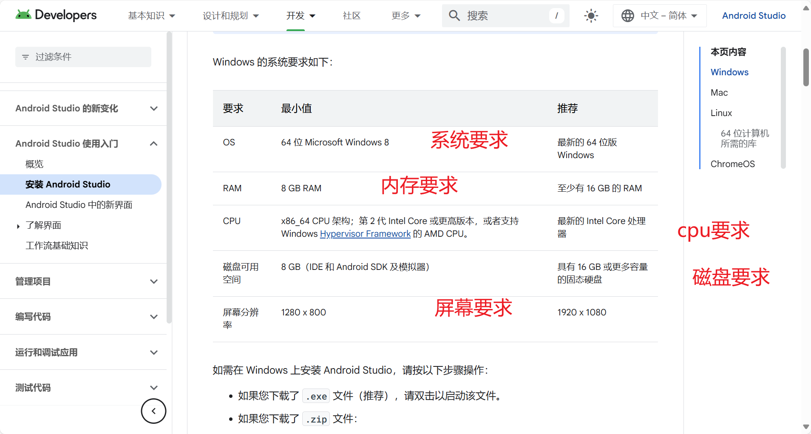

# 构建第一个Android_App


## 工具安装与环境配置

- 下载Android sutido。
- 下载Android SDK。
- Kotlin的开发环境配置。

[Android 移动应用开发者工具 – Android 开发者  | Android Developers](https://developer.android.google.cn/?hl=zh-cn)

注意·：上面的官网以后100%与之打交道。







问：什么电脑上能安装Android sutido呢？

答：如下图要求。




## Android SDK的下载

Android SDK在安卓开发的过程中是必须要使用的。必须安装。

建议：android的sdk存放路径自己创建。规范点。

```
D:\android\sdk
```


## 工程创建介绍


