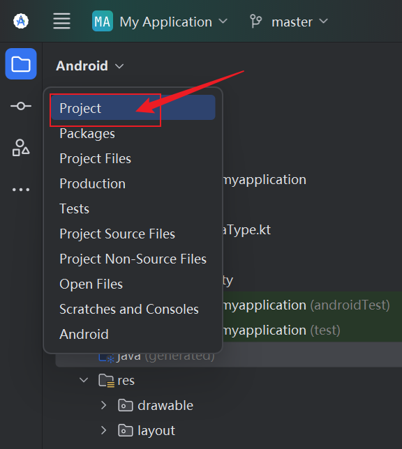
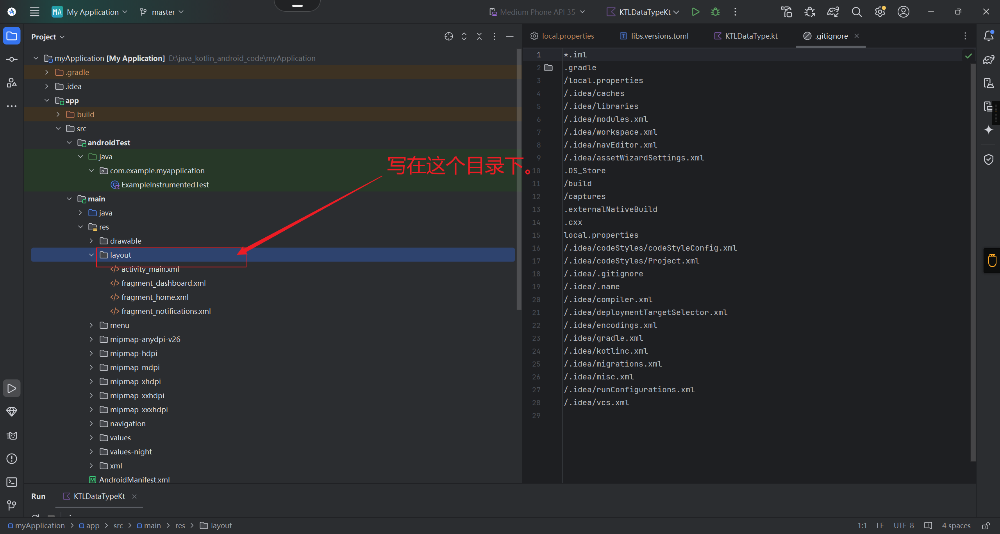
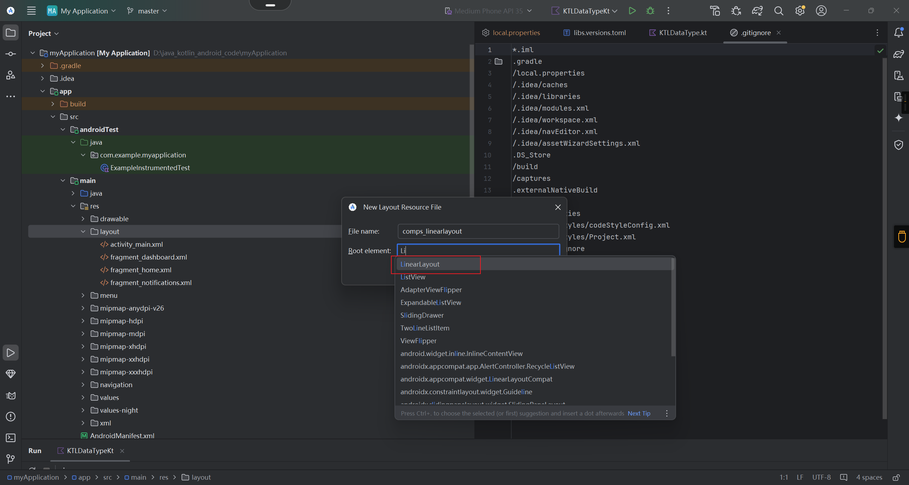
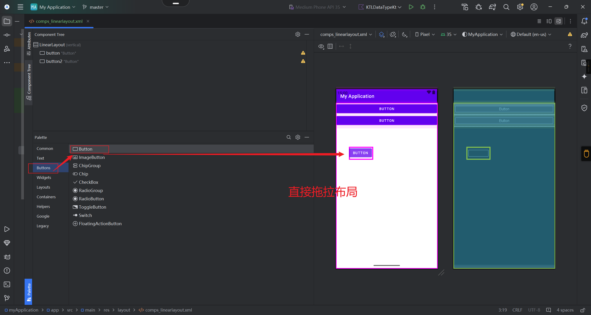
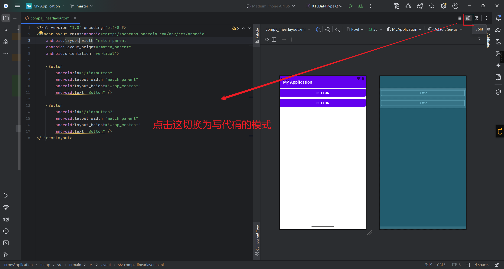
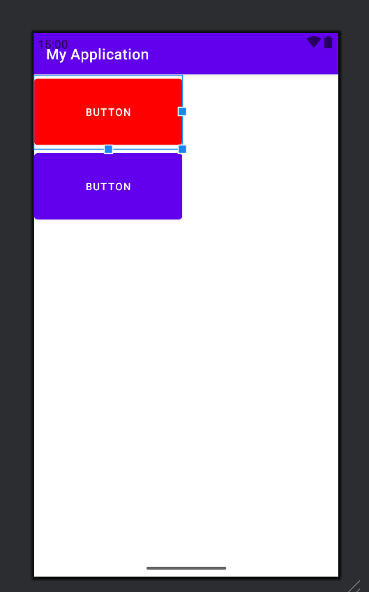
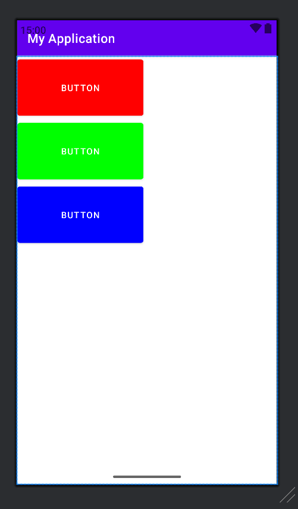

# Android常用的基础布局容器

Android 的UI可以分为两类，一类叫做ViewGroup<font color = 'red'>容器</font>，一类叫做View<font color = 'red'>视图</font>。

- View视图：（TextView、Button、lmageView）都是常用常见的视图。

- ViewGroup容器：内部可以承载、放置、添加View视图。

## 基础的布局容器

**LinearLayout**<font color = 'red'>线性布局</font>：横着或竖着按顺序排列。

**RelativeLayout**<font color = 'red'>相对布局</font>：起始坐标时屏幕左上角，以同级或上级为参考系定位位置。

**FrameLayout**<font color = 'red'>帧布局</font>：像千层饼一样，一层压着一层。

ConstraintLayout<font color = 'red'>约束布局</font>：google于2016年新发布的一种布局方式，它不在android的基础api包里需要额外引入。

Aoselutetayout<font color = 'red'>绝对布局</font>(以屏幕左上角为参考系，定位自己的位置，从android 2.2版本后废弃)

GridLayout<font color = 'red'>网格布局</font>(可以指定行数列数，子控件自动根据行列数进行分配位置，于android 4.0后新增进api中)

## LinearLayout

线性布局就是**从左到右**或**从上到下**按顺序排列的一种布局。下面讲一讲LinearLayout的基础属性。

| 属性                           | 可选值                                                       | 说明                                                         |
| ------------------------------ | ------------------------------------------------------------ | ------------------------------------------------------------ |
| orientation                    | vertical：垂直排列<br />horrizontal：水平排列                | 也就是这个线性布局到底是水平方向逐个排列还是垂直方向逐个排列。 |
| layout_width<br/>layout_height | match_parent：填充父容器的剩余空间。<br />wrap_content：根据子视图宽高自适应自己的宽高。<br />自定义大小50dp。 | layout_width和layout_height是android中控件的必要属性规定了控件的宽度和高度，这个两个属性的值可以是指定的值，也可以根据**内容自适应**，还可以**填充整个剩余空间**。 |
| background                     | #ff0000 红色                                                 | 填充背景色。                                                 |
| gravity                        | center:所有子视图相对于父容器居中显示。<br />horizontal center.所有子容器的横向方向上相对父容器居中显示。<br />vertical center:所有子视图的纵向方向上相对父容器居中显示。 | 定子控件相对该父容器的位置。                                 |
| layout_gravity                 | center:该容器相对于它的父容器居中显示<br />horizontal center该容器横向方向上相对它的父容器居中显示。<br />vertical center:该容器纵向方向上相对它的父容器居中显示。 | 决定该容器相对它的父容器的位置。                             |
| weight                         |                                                              | 按比例分配父容器剩余的宽度或高度。                           |


## 编写项目代码

注意我们切换到 project模式。




现在我们的布局的代码要写在哪里呢？



路径：app/src/main/res/layout

我们怎么创建文件呢？创建什么格式的文件编写代码呢？

答：在上面的目录下创建一个名字为：：comps_linearlayout。

注意：不能使用大写字母。不能使用中划线。



```
androidx.constraintlayout.widget.ConstraintLayout
```

androidx.constraintlayout.widget.ConstraintLayout 的根元素要有一定的前置基础。

2024的android studio的编辑器有了拖拉布局的功能。简直是yyds、sb。




那么我们想写代码怎么办呢？

答：进行如下操作。




## LinearLayout实战

```xml
<?xml version="1.0" encoding="utf-8"?>
<LinearLayout xmlns:android="http://schemas.android.com/apk/res/android"
    android:layout_width="match_parent"
    android:layout_height="match_parent"
    android:orientation="vertical">

    <Button
        android:id="@+id/button"
        android:layout_width="match_parent"
        android:layout_height="wrap_content"
        android:text="Button" />

    <Button
        android:id="@+id/button2"
        android:layout_width="match_parent"
        android:layout_height="wrap_content"
        android:text="Button" />
    
</LinearLayout>
```


设置一个按钮为红色。

```
    <Button
        android:id="@+id/button"
        android:layout_width="200dp"
        android:layout_height="100dp"
        android:backgroundTint="#ff0000"
        android:text="Button" />
```

效果展示：




添加三个按钮，进行垂直排列。第一个按钮为红色、第二个按钮为绿色、第三个按钮为蓝色。实现的布局文件代码如下：

```xml
<?xml version="1.0" encoding="utf-8"?>
<LinearLayout xmlns:android="http://schemas.android.com/apk/res/android"
    android:layout_width="match_parent"
    android:layout_height="match_parent"
    android:orientation="vertical">

    <Button
        android:id="@+id/button"
        android:layout_width="200dp"
        android:layout_height="100dp"
        android:backgroundTint="#ff0000"
        android:text="Button" />

    <Button
        android:id="@+id/button2"
        android:layout_width="200dp"
        android:layout_height="100dp"
        android:backgroundTint="#00ff00"
        android:text="Button" />

    <Button
        android:id="@+id/button3"
        android:layout_width="200dp"
        android:layout_height="100dp"
        android:backgroundTint="#0000ff"
        android:text="Button" />
    
</LinearLayout>
```

实现的效果：




## RelativeLayout

相对布局在摆放子视图位置时，按照指定的参考系来摆放子视图的位置，默认以屏幕左上角(0,0)位置作为参考系摆放位置。

相对于父元素 7个常用属性

| 属性                     | 可选值     | 说明                           |
| ------------------------ | ---------- | ------------------------------ |
| layout _alignParentTop   | true/false | 是否让控件相对于父容器顶部对齐 |
| layout_alignParentBottom | true/false | 是否让控件相对于父容器底部对齐 |
| layout_alignParentLeft   | true/false | 是否让控件相对于父容器左边对齐 |
| layout_alignParentRight  | true/false | 是否让控件相对于父容器右边对齐 |
| layout_centerHorizontal  | true/false | 相对父容器水平居ical示         |
| layout_centerVertical    | true/false | 相对父容器垂直居中显示         |
| centerInParent           | true/false | 相对父容器居中显示             |

相对于兄弟元素 4个常用属性

| 属性                     | 可选值 | 说明                 |
| ------------------------ | ------ | -------------------- |
| layout above             | @+id/  | 指定在那个控件的上侧 |
| layout below             | @+id/  | 指定在那个控件的上侧 |
| android:layout toLeftOf  | @+id/  | 指定在那个控件的左侧 |
| android:layout toRightOf | @+id/  | 指定在那个控件的右侧 |

相对于兄弟元素的对齐方式

| 属性               | 可选值 | 说明                                 |
| ------------------ | ------ | ------------------------------------ |
| layout _alignLeft  | @+id/  | 该控件的左边沿与指定控件的左边对齐   |
| layout aliginRight | @+id/  | 该控件的右边沿与指定控件的右边对齐   |
| layout alignTop    | @+id/  | 该控件的上边沿与指定控件的上边沿对齐 |
| layout alignBottom | @+id/  | 该控件的下边沿与指定控件的下边沿对齐 |


## RelativeLayout实战

第一：创建一个布局文件，名字为：comps_relativelayout。【在layout的目录下创建，这个是安卓开发的基本规范。】

第二：root element选择RelativeLayout。


