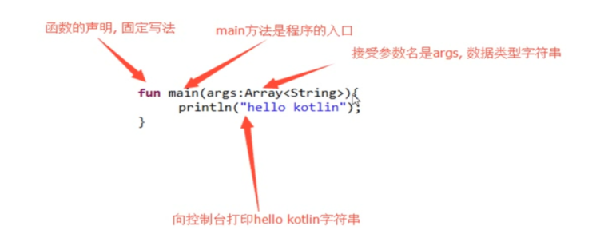
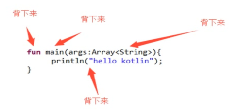

# kotlin基础hello world

## 梦开始的地方

kotlin的语言与java语言的入门程序代码来比较。kotlin看上去比较简洁。

kotlin的开发者定义了main的标准。我们作为一个语言的使用者我们应该按照这种标准去编写代码。所以学是学不完的。

我们学习这个标准的过程，我们就是在学习kotlin的这个语言。你也不要有太多负担。就当是逛菜市场走个过程。

上面的代码一定要背下来。背不下来的写5遍。抄写100遍。直到条件反射。应为这个非常的重要。

