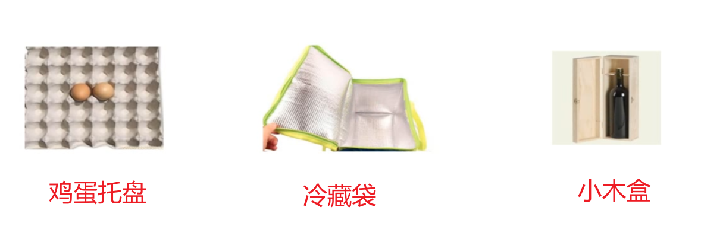

# kotlin的变量

变量就像是给女朋友买包包。

为什么需要买包呢？

女生逛街总会拎个小包或者手提袋什么的，装上点儿琐碎的东西。回家以后就取出东西来，将袋子放到一边去。

同理：计算机里也得用上这种小包或小袋子把我们输入的**字符串**或者数据装起来，用的时候就取出来。

## 连接生活

逛超市。

上面的东西可以用一个词语来概括。什么词语呢?

答：容器。

容器的作用是什么？现实生活中的容器用来干什么呢？现实中的容器有哪些方面的应用呢？如果你自己能独立思考清楚，那么你是真的明白了。

---

逛超市之前,我们准备了这样几种容器，鸡蛋盒、冷藏盒、木酒盒。

买鸡蛋,只需要把鸡蛋放入鸡蛋盒。

买肉，只需要把肉放进冷藏盒。

买红酒,只需要把红酒放入木酒盒。

不同的东西放入不同的盒子里，方便管理。东西也不易损坏。

---

同样的，计算机中的kotlin程序也给我们实现准备好了很多类型的盒子，用于存放不同类型的数据。

