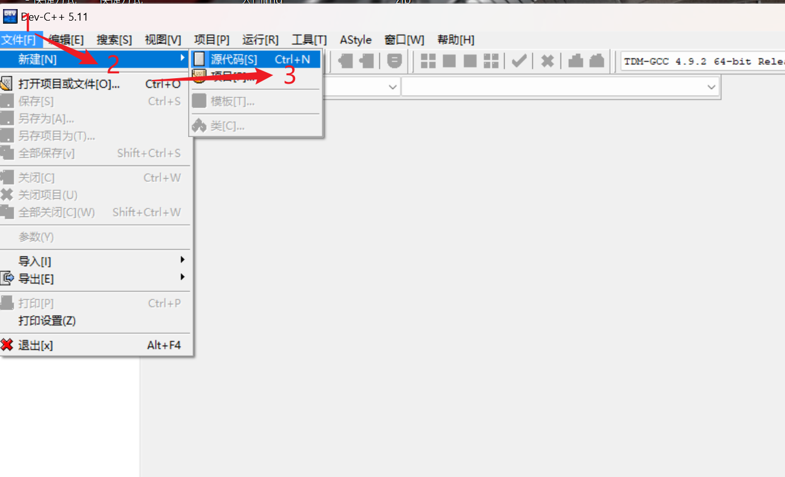
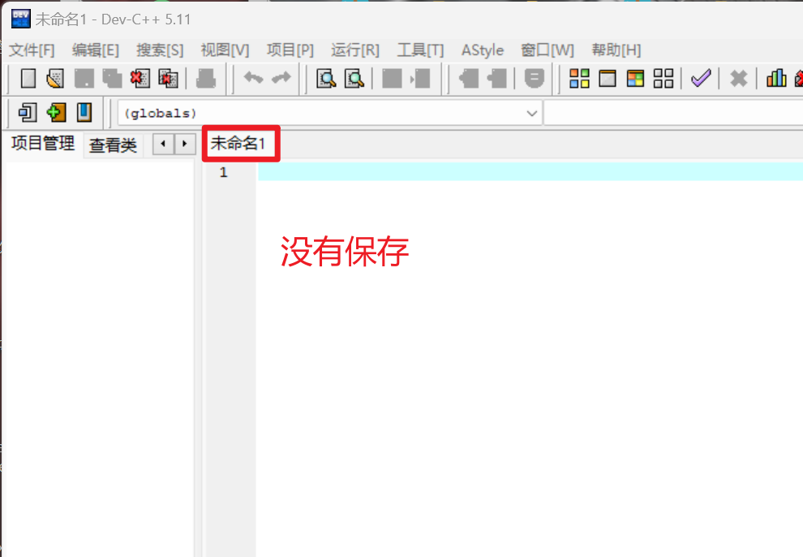
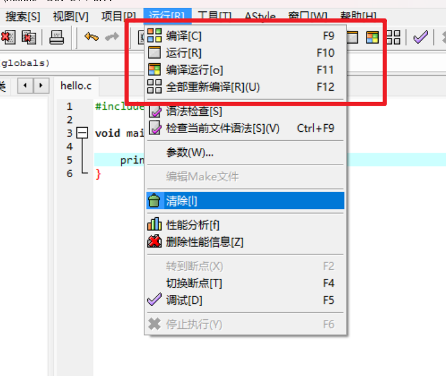
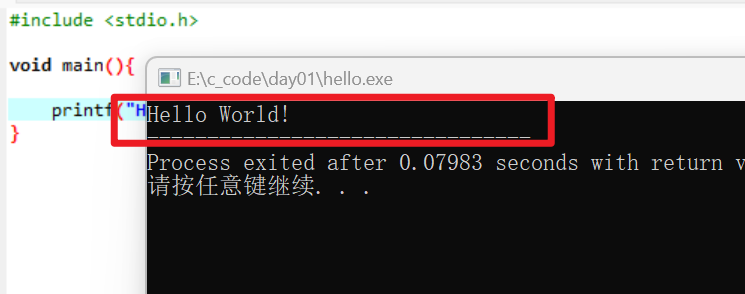

# 你好啊，世界！

为什么要记录下面步骤。为什么呢？吃饱了没事干吗？

如下步骤以后做项目时候可以会用到，某些细节方面的地方。

如：c是怎么编译的、等目录结构问题！还是记录为好，因为本人记忆不是很好！

## 01)创建第一个c项目

第一步：初始化的编译器页面的效果截图。


第二步：创建源代码。



- 第三步：创建后的效果截图。




## 02)编写第一个c程序

编写你的第一个c程序。

```c
#include <stdio.h> 
void main(){
	printf("Hello World!\n");
}
```

或

```c
#include <stdio.h> 
void main(){
	printf("Hello World!\n");
    // 暂停小黑窗口
	system ("pause"); 
}
```


::: details 编写第一个c程序注意事项

**输出**

```c
	printf("Hello World!\n");
```

- ""⾥⾯的内容叫做“字符串” ，printf会把其中的内 容原封不动地输出 •

- \n表⽰需要在输出的结果后⾯换⼀⾏

**暂停**

如果你在使⽤Dev C++ 4.9.9.2 

-  system("pause"); 【黑色小窗口暂停作用】

- 让程序运⾏完成后，窗⼝还能留下

- 不是Dev C++ 4.9.9.2就不需要这个了

**程序中的错误**

- 编译的时候发现的错误所在的地⽅会 以红⾊的底表⽰出来 。

- 具体的错误原因列在下⽅的窗⼝⾥（是 英⽂的） 。

- C的编译器给出的错误提⽰往往不那 么好“猜。

**不要⽤中⽂！！！**

- 中国学⽣还有⼀个极其常⻅的低级错误，就是 ⽤了中⽂输⼊法来输⼊程序。那些标点符号， 在中⽂和英⽂可能看上去相似，但是对于计算 机是完全不同的符号，如果你还开了全⾓标点 的话，问题就更严重了

:::

点击保存。


修改为hello.c


保存成功的效果


## 03)运行程序

认识运行的菜单项




运行成功




## 04)截图F1无法使用


F1无法使用


Dev-C++ 这个软件的官方文档。


## 05)为什么编译出exe文件呢？


点击运行

