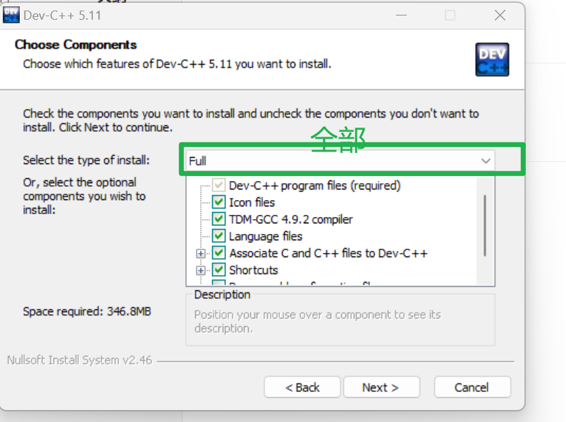
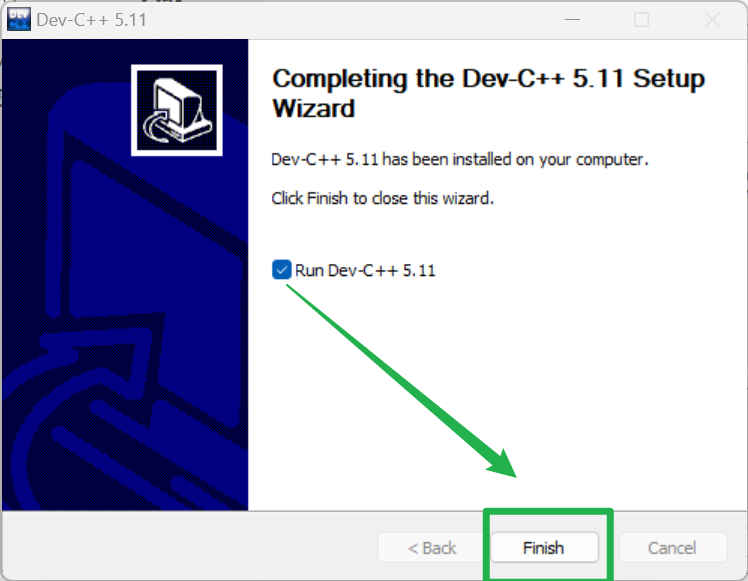
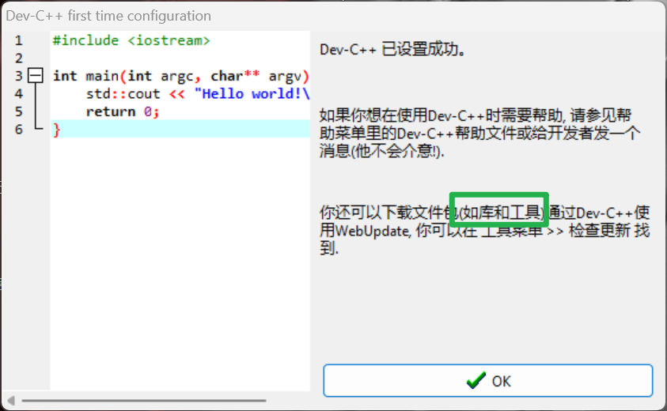

# 安装devc++

万事开头最难。时间久了c都忘记怎么编译怎么运行？忘了！就连运行环境都要搭建好久搞定。连开发的创建项目都不规范。因此记录。

也是寻求c项目的规范操作解决方案？？

头大啊。

安装c的编译器版本信息描述。

- devc++ 5.11版

为什么要安装devC++它？

devc++是c语言的一个编译工具。正所谓，工欲善其事，必先利其器。他只是一个工具而已

- 免费 

- 安装简单 

- 不⽤建⼯程

相比MS Visual Studio Express（Windows）【太大了】

## 01解压安装

第二步：默认安装就行。

## 02)默认启动

第一步：选择全部的中文。点击next。

第二步：默认下一步就行。

## 03)成功效果

