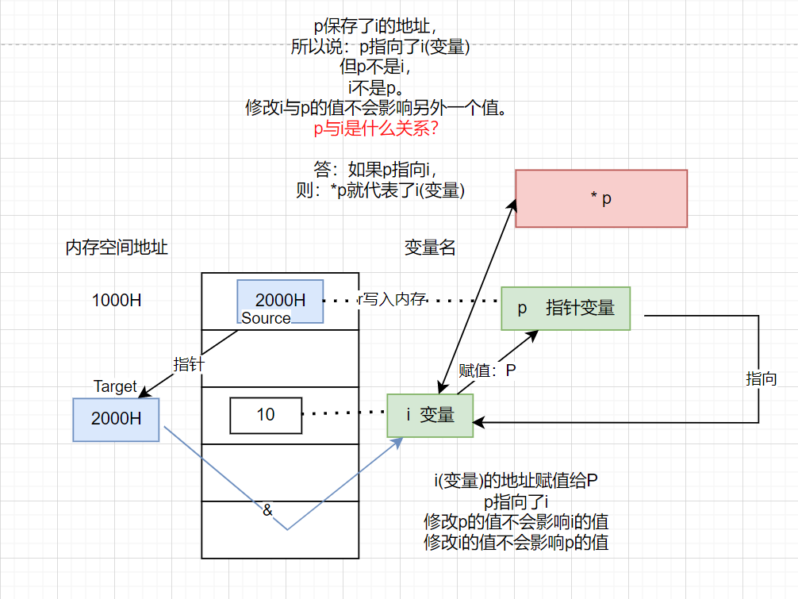
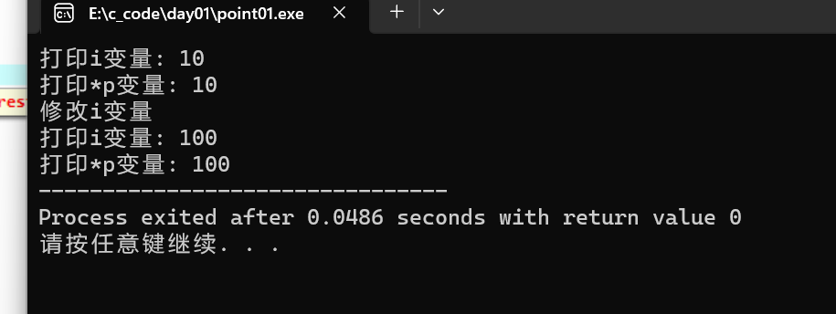
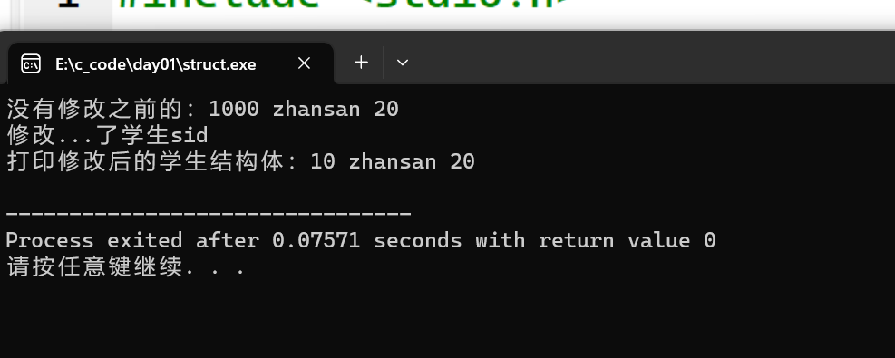

# c语言数据结构与算法

::: tip 写在基石之前

- 难点、重点。
- 数据结构与算法要多花时间去学。

:::

**学习目标**

- 学习指针的目的是什么？

答：为了把java对象引用搞清楚。

**指针课纲**

1. 基本类型的指针【基础】
2. 指针与数组的关系【基础】
3. 指针和函数
4. 指针与宏W
5. 指针与多维数组

## Java&C的对比

**java语言中**

- java中引用类型的概念

```java
Student student = new Student();
```

student：的本质是：一个指针;

student 保存了 new Student() 对象在堆空间的地址。

- 如下代码的理解;是地址的赋值。

```java
Student student1 = student;
```

- 如下代码注意；student不在是指针地址了。而是指向该对应的对象了！

```
student.eat();
```

::: tip 看是非常简单的java代码

```
Student student = new Student();
Student student1 = student;
student.eat();
```

为什么要理解上面的代码？java对象来回调用就非常容易不理解！

上面的java代码太难理解了！一定要去深入理解c的指针！

:::

::: danger c的预备基础知识

- 指针
- 结构体【c++就不用学，使用类就可以实现。】
- 动态内存的分配和释放

:::

## 指针

- 指针的重要性：

指针是c语言的灵魂。

- 什么是指针？、

定义：

​	地址：<font color='red'>就是内存单元的编号</font>。从0开始的非负数整数。0 -- FFFFFFFF【8位】【范围：0 ~ 4G-1】

| 名词术语解释 | 描述                                                         |
| ------------ | ------------------------------------------------------------ |
| 指针         | 指针是：地址，地址就是指针！                                 |
| 指针变量     | 指针变量是：<font color='red'>存放</font>内存单元地址的变量。 |
|              |                                                              |

::: tip 变量是什么？

请看c语言基础篇；

:::

- 所以；指针的本质是什么？

答：指针的本质是一个操作受限的非负整数。


```
int * p
```

- p 是个指针变量。
- int * 表示：该p变量只能存储int类型变量的地址。


## 指针基本代码理解


```c
 #include <stdio.h>
 
 int main(void)
 {
 	int * p;
 	int i = 10;
 	int j;
 	p = &i;
 	printf("打印i变量: %d",i);
 	printf("\n打印*p变量: %d",*p);
 	
 	// 修改 i变量的值。
	 i = 100;
	printf("\n打印i变量: %d",i);
 	printf("\n打印*p变量: %d",*p);
 	return 0;
 	
 }
```



运行结果：




::: tip  p与i是什么关系呢？

答：如果p指向i，则：*p就代表了i(变量)。不能直接说 * p 是i的地址、i的值。

结论：

1. i能代表什么，*p它也就能代表什么。
2. i 与 *p 能在任何的地方进行互换。
3. *p 就等价于 i， i的值改了，则：*  * p的值也改变了

:::


::: tip *p的错误写法

- 错误写法一

```c
int *p
int j;
j = *p; // *p 没初始化过。
```

原因：*p是一个不确定的值。不能将一个保存这不确认值赋值给一个变量。

- 错误写法二

```c
int *p
int i;
*p = i; // *p 相当于 i 不报错，无意义。
```

:::

p的内存被释放了，p原来的空间的数据是不会被销毁的。

- 什么叫释放？

指：

1. 操作系统回收了对p的**控制权限**。其他程序都不能在使用这个p空间，如果要使用，必须向操作系统请求。

2. p内存空间保存这原来的垃圾数据。


## 内存的基本概念

- 内存是用来存储数据的<font color='red'>设备</font>。它的存储速度介于<font color='red'>寄存器和硬盘</font>之间。

- 内存是CPU唯一可以访问的大容量的存储设备!所有硬盘中的程序和数据必须调入内存之后方可被CPU执行！**切记**:CPU不能直接处理硬盘中的数据!
- 内存的问题是软件开发中最核心的问题之一!如:内存的分配，内存的释放，内存什么时候分配，内存什么时候释放，由谁来分配，由谁来释放，分配在是什么地方访问权限如何!

- 内存是多字节组成的<font color='red'>线性一维存储空间</font>
- 内存的基本划分单位是<font color='red'>字节</font>。
- 每个字节含有8位。每一位存放1个0或1个1。

- 字节和编号是一一对应的。<font color='red'>每个字节都有一个唯一确定的编号</font>，一个编号对应一个字节!这个编号也叫地址。
- 一个系统所能管理的内存空间的大小取决于<font color='red'>参与编号的二进制位数</font>!。

**如:**

DOS系统20位寻址方案可控制2 20B   1MB的内存。

386/486系统采用三字节编制，可寻址224M即16M的内存。

奔腾寻址空间32位，其有效寻址空间为2 32 M，即 4GB。


## 软件运行于内存关系(垃圾数据)

1. 软件在运行前需要向操作系统申请存储空间，在内存空闲空间足够时,操作系统将分配一段内存空间并将外存中软件拷贝一份存入该内存空间中，并启动该软件的运行!
2. 在软件运行期间，该软件所占内存空间不再分配给其他软件。
3. 当软件运行完毕后，操作系统将回收该内存空间(注意:<font color='red'>操作系统并不清空该内存空间中遗留下来的数据</font>)，以便再次分配给其他软件使用。

::: tip 知识连接 第三条

因为：<font color='red'>操作系统并不清空该内存空间中遗留下来的数据</font>。

所以：java中规定，局部变量一定要进行初始化，否则就不能进行使用。【语法规则】

- java中对象的属性不用进行初始化就能进行使用。为什么？

答：默认程序帮我们初始化。

::: 

综上所述，一个软件所分配到的空间中极可能存在着以前其他软件使用过后的残留数据，这些数据被称之为垃圾数据。所以通常情况下我们为一个变量，为一个数组:


## 格式输出类型总结

| 输出类型占位符 | 描述         |
| -------------- | ------------ |
| %p             | 十六进制输出 |
|                |              |
|                |              |


## 数组的元素地址

x占8个字节，1个字节是8位。

1个字节一个地址

```c
#include<stdio.h>
int main() 
{
	double * p;
	double x = 66.6;
	p = &x;
	
	// 定义一个数组
	double arr[4] = {1.1, 2.2, 3.3, 4.4};
	double * q;

	q = &arr[0];
	printf("第1个元素的地址：%p\n", q);
	
	q = &arr[1];
	printf("第2个元素的地址：%p", q);
	return 0;
}
```

- 运行结果

```
第1个元素的地址：000000000062FDE0
第2个元素的地址：000000000062FDE8
```

地址相差8。


## 结构体的概述

**学习目标**

- 为什么会出现结构体？

表示一个学生的个属性，要单独的去声明一个变量去保存。学生多了。变量的名字可读性差。所以：一个学生对应一个结构体表示更为可读性。

```c
struct Student{
	// 结构体伪代码
	int sid;
	String name;
	void sage;
}
```

在java中我们使用一个学生类来表示一个对象。

```java
Class Student{
	int sid;
	String name;
	void sage;
    void inputStudenInfo(){
        // 输出学生对象的信息。
    }
}
```

::: tip c与java的总结

在c的结构体表现事物是有缺陷的，Java的类中能更好的表现具体的事物。

区别：c的结构体只能表示属性，不能表示行为。【大白话，结构体只有属性、没有方法。】

结构体是类的一个过度。【了解，不用研究太深！目的为了学习c的数据结构与算法。】

:::

- 什么叫结构体?

结构体：是用户根据实际需求，要自己定义的<font color='red'>复合数据类</font>

知识连接：

java中类也是用户根据实际需求，自己定义的数据类。

- 如何使用结构体？

有二中方式

1. 方式一：

```
结构体变量名.属性名
```

2. 方式二：

```
结构体指针变量名->属性名
```

**案例：**

```c
#include <stdio.h>
#include <stdlib.h>
#include <string.h>
// 定义模型 
struct Student
{
	// 添加 
	int sid;
	char name[200];
	int age;
};  // 分号不能省略 
int main(int argc, char *argv[]) {
	int i = 10;
	printf("没有修改的值%d\n",i);
	// 结构体初始化 
    
    // 方式一：
	// struct 自己定义的类型名字  结构体变量名; 
	struct Student st =  {1000,"zhansan", 20};
	printf("%d %s %d\n",st.sid, st.name, st.age);
	struct Student st1 =  {1000,"zhansan", 20};
	st1.sid = 100;
	strcpy(st1.name,"liyu");
	st1.age = 12;
	printf("%d %s %d\n",st1.sid, st1.name, st1.age);
    
    // 方式二：
	// 定义结构体指针
	 struct Student * pst;
	 pst = &st1;
	printf("结构体指针变量访问：%d %s %d\n",pst->sid, pst->name, pst->age);	 
	return 0;
}
```

什么是：pst->sid是声明？

答：pst所指向的结构体变量中的sid这个成员

- 注意什么事项？

1. 结构体不能加减乘除，但是可以相互赋值。
2. 结构体变量和结构体指针变量作为函数传参的问题。

## 函数修改结构体属性


```c
#include <stdio.h>
#include <stdlib.h>
#include <string.h>
// 定义学生结构体模型。 
struct Student
{
	// 添加 
	int sid;
	char name[200];
	int age;
};  // 分号不能省略 

// 传指针变脸进行打印 
void change(struct Student * pst );  
// 赋值打印。 
void print_struct(struct Student st);
int main(int argc, char *argv[]) {
	// 结构体初始化 
	// struct 自己定义的类型名字  结构体变量名; 
	struct Student st =  {1000,"zhansan", 20};
	printf("没有修改之前的：%d %s %d\n",st.sid, st.name, st.age);
	change(&st);
	print_struct(st); 
	return 0;
}
// 建议：传指针。内存占用小； 
void change(struct Student * pst) 
{
	printf("修改...了学生sid\n");
	pst->sid = 10;
}
// 缺点:传参消耗内存 
void print_struct(struct Student st)
{
	printf("打印修改后的学生结构体：%d %s %d\n",st.sid, st.name, st.age);
} 

```

- 运行结果




## 动态的内存与释放

静态数组的概念：

```c
int a[5] = {1, 2, 3, 4, 5};
```

::: tip 静态分配数组内存大小

- 大小是在内存里面写死的，程序跑起来后不能进行修改，要关闭程序后，修改源码进行分配数组的大小。缺点：无法进行动态的配置内存。【后面有动态的进行分配内存大小的解决方法。】

:::


病毒就是靠访问正在运行的那些程序所占用的内存。Java中规定局部 变量必须初始化，因为这些变量一开始都是垃圾值，但是属性不是必须初始化的，因为已经默认初始化为0 动态内存分配和释放（动态分配的内存一定要手动释放，否则造成内存泄露。

- 动态的分配

```c
// java中
A aa = new A();
// 其实就是
A *p = (A *)malloc(sizeof(A))）
```

- 手动释放！

```c
free(首地址指针变量);  // 动态分配的内存权限归还给操作系统。
```

::: tip  动态分配的优点

- 


:::

## c函数与java的区别


```c
#include <stdio.h>
#include <stdlib.h>
// 声明函数；  注意：与java中的抽象方法一样的写法。 
void f(int * i); 
int main(int argc, char *argv[]) {
	int i = 10;
	printf("没有修改的值%d\n",i);
	
	// 修改 i的值。怎么做？
	f(&i);
	// 修改后的值 
	printf("修改后的值:%d",i);
	return 0;
}
// 定义函数与java不一样的。区别在于要添加一个前置说明 
void f(int *a)
{
	*a = 99;
}
```


## 跨函数使用内存问题


