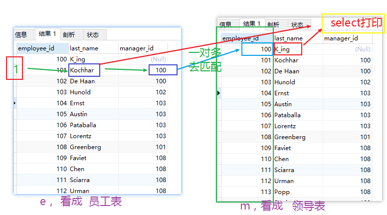

# #进阶6：连接查询

## 第一步：导入girls表：

理解多表查询：

图

/*
含义：又称**多表查询**  或者 **多表连接**；当查询的字段来自于多个表时，就会用到连接查询

笛卡尔乘积现象：表1 有m行，表2有n行，结果=m*n行

发生原因：没有有效的连接条件
如何避免：添加有效的连接条件

分类：

	按年代分类：
	sql92标准:仅仅支持内连接
	sql99标准【推荐】：支持内连接+外连接（左外和右外）+交叉连接


​	【重点介绍】
​	按功能分类：
​		内连接：
​			等值连接
​			非等值连接
​			自连接
​		外连接：
​			左外连接
​			右外连接
​			全外连接
​		
​		交叉连接


*/

SELECT * FROM beauty;

SELECT * FROM boys;


SELECT NAME,boyName FROM boys,beauty
WHERE beauty.boyfriend_id= boys.id;

# #一、sql92标准

## #1、等值连接

/*

① 多表等值连接的结果为多表的交集部分
②n表连接，至少需要n-1个连接条件
③ 多表的顺序没有要求
④一般需要为表起别名
⑤可以搭配前面介绍的所有子句使用，比如排序、分组、筛选

*/


##### #案例1：

查询  **女神名**  和对应的   **男神名**

女神表和男神表：


卡迪尔集的错误语法：

```mysql
select name, boyName from beauti, boys;
```

结果原理解释：

   4  *  12  =  48 条结果：


**原理理解：**用表里面某个字段的值去  匹配  另外一个外表的字段值去对比

```MySQL
SELECT NAME,boyName 
FROM boys,beauty
WHERE beauty.boyfriend_id= boys.id;
```

两个表的字段  根据 beauty.boyfrind_id  =  boys.id 进行关联，叫做内连接！

大白话说：原表没有某个指端，通过两个表进行某条件 进行关联！

**结果：**


##### #案例2：

查询员工表中 员工名  和    部门表中对应的部门名

```MySQL
SELECT last_name,department_name
--  员工表       部门表 
FROM employees,departments
WHERE employees.`department_id`=departments.`department_id`;
-- 部门id  == 部门id
-- 通过两个表进行某条件 进行关联
```

**结果：**


**理解**：记口诀：一对多匹配

案例2图解：


第二行同理：是这样匹配“一对多”

问题：代码from 中 两个表中进行 调换位置写有什么情况呢？( )

A、报错       B、结果一样！C、一样

答案： C

##### #案例3、为表起别名

/*
①提高语句的**简洁度**
②区分多个重名的字段

**注意**：如果为表起了别名，则查询的字段就不能使用原来的表名去限定

###### **一句话记心间**：

 别名不能重复！就像心上人是唯一的！

*/

#查询  员工表中的：员工名、 工种号，和 工种表中的 ： 工种名，

```MySQL
SELECT e.last_name,e.job_id,j.job_title
FROM employees as e, jobs as j        -- 分别查询二个表不同的表的字段数据
WHERE e.`job_id`=j.`job_id`;			-- 通过两个表进行某条件 进行关联
```


`两个表的顺序是否可以调换`

#查询员工名、工种号、工种名

```MySQL 
SELECT e.last_name,e.job_id,j.job_title
FROM jobs as j,employees as e               -- 表的 顺序 可以调换写
WHERE e.`job_id`=j.`job_id`;
```

显示两个表的  交集    部分！

## #4、可以加筛选

##### #案例1：

查询有奖金的 员工表中的 ： 员工名、  部门表中的： 部门名

```mysql
SELECT last_name,department_name,commission_pct

FROM employees as e,departments as d
WHERE e.`department_id`=d.`department_id`
AND e.`commission_pct` IS NOT NULL; 
```

**结果：**


##### #案例2：

查询 位置表（locations）中：城市名 中第二个字符为o的字符，显示  部门表中的：部门名  和  位置表（locations）中的：城市名

由题可得：多表连接【部门表中的，位置表，】

```mysql
SELECT department_name,city

FROM departments d,locations l

WHERE d.`location_id` = l.`location_id` AND city LIKE '_o%';
-- 部门表中的：location_id  与   位置表（locations）中：location_id 关联！

```

**结果：**


## #5、可以加分组

##### #案例1：

查询位置表（locations）中：每个城市的 部门个数

```mysql
SELECT COUNT(*) 个数,city
FROM departments d,locations l
WHERE d.`location_id`=l.`location_id`
GROUP BY city;
```


##### #案例2：

查询有奖金的每个部门的部门名和部门的领导编号和该部门的最低工资

```MySQL
-- 			部门名			部门的领导编号		最低工资
SELECT  first_name, department_name, d.`manager_id`,MIN(salary)

FROM departments d,employees e

WHERE d.`department_id`=e.`department_id`

AND commission_pct IS NOT NULL

GROUP BY department_name,d.`manager_id`;
```

MIN(salary) 改为  count(*) 有多少人进行比较； 可以清晰的看到有34个同部门人进行比较   求最小值；

**结果：**


```mysql
SELECT first_name, department_name,d.`manager_id`

FROM departments d,employees e

WHERE  d.`department_id`=e.`department_id`

AND commission_pct IS NOT NULL

GROUP BY department_name,d.`manager_id`;
```


**结果：**


## #6、可以加排序

#案例：查询每个工种的工种名和员工的个数，并且按员工个数降序

```mysql
SELECT job_title,COUNT(*)
FROM employees e,jobs j
WHERE e.`job_id`=j.`job_id`
GROUP BY job_title
ORDER BY COUNT(*) DESC;
```


## #7、可以实现三表连接？

#案例：查询员工名、部门名和所在的城市

```mysql
SELECT last_name,department_name,city
FROM employees as e,departments as d,locations as l
WHERE e.`department_id`=d.`department_id`
AND d.`location_id`=l.`location_id`
AND city LIKE 's%'

ORDER BY department_name DESC;
```


# #2、非等值连接

大白话理解：二个表没有  相同的 id 去对应关联


等值链接 有一个等于号关联  

而非等值链接 不是等于号   or   >   <   ......等其他条件运算符

##### #案例1：

查询**员工表（employes）里**：员工的  工资   和    **工资级别【job_grades】 表**里的  等级

进行非等值链接

并且查询  工资为A 等级的 员工名[first_name]

```mysql
--     工资      等级分别有[A B C D E F]   
SELECT first_name, salary,grade_level

--    员工表 起一个别名为 e   工资级别表别名为 g        
FROM employees as e,job_grades as g

WHERE salary BETWEEN g.`lowest_sal` AND g.`highest_sal`

AND g.`grade_level`='A';
```

##### 理解图：


**结果：**


/*

select salary,employee_id from employees;
select * from job_grades;

创建   工资级别表 的sql 脚本

```mysql
CREATE TABLE job_grades
(grade_level VARCHAR(3),
 lowest_sal  int,
 highest_sal int);

INSERT INTO job_grades
VALUES ('A', 1000, 2999);

INSERT INTO job_grades
VALUES ('B', 3000, 5999);

INSERT INTO job_grades
VALUES('C', 6000, 9999);

INSERT INTO job_grades
VALUES('D', 10000, 14999);

INSERT INTO job_grades
VALUES('E', 15000, 24999);

INSERT INTO job_grades
VALUES('F', 25000, 40000);
```


*/


## #3、自连接，自取名： 等值自连接

自连接   **相当于**  等值链接


##### #案例1：

查询 **员工名**和**上级的名称**

第一步：查询 

```mysql
select employee_id, last_name, manger_id form employees;
```


```mysql

SELECT e.employee_id,e.last_name,m.employee_id,m.last_name

-- 给同一张表起 不同的别名    第一步 开始执行
FROM employees e,employees m

-- 第二步开始执行
WHERE e.`manager_id`=m.`employee_id`;
```

只可意会，不可言传的理解图！

程序执行第一步：



程序执行第二步：


就相当于·把一张表看成 多张表！


# #二、sql99语法

sql99语法就是1999年开发的是sql语法标准；

/*
语法：

【】表示可选标志！

​	select 查询列表
​	from   表1   别名 【连接类型】
​	join 表2 别名 
​	on 连接条件
​	【where 筛选条件】
​	【group by 分组】
​	【having 筛选条件】        #  是对上面的  结果  进行分组
​	【order by 排序列表】
​	

**分类：**

**内连接**（★）：   关键词用：  inner
**外连接**
	左外(★):left 【outer】   左外和右外都是 及其相似  
	右外(★)：right 【outer】
	全外：full【outer】
交叉连接：cross 

**【注意】**用“【】”扣起来的可以省略！

*/

## **#一）内连接**

/*

##### 内连接语法：

```mysql
select 查询列表
from 表1 别名
inner join 表2 别名
on 连接条件;
```


- 内连接分类：
  	  1，等值
        	2，非等值
        	3，自连接

特点：

①可以添加排序、分组、筛选
②inner可以省略
③ 筛选条件放在where后面，连接条件放在on后面，提高分离性，便于阅读
④inner join连接和sql92语法中的等值连接效果是一样的，都是查询多表的交集

**内连接怎么理解：**

大白话：

### #1）等值链接

*/

##### #案例1：

#1、等值连接
#案例1.查询  员工表中的：员工名（last_name）  与 部门表中的：部门名 (department_name)

tip:两个表通过 两个表都有共同字段进行关联

**#sql 92怎么写**

```mysql
SELECT last_name, department_name
from employees e, departments f
where e.department_id = f.department_id;
```


**#sql99语法**

```mysql
-- 员工名  部门名
SELECT last_name,department_name
-- 从 部门表  起别名为 d
FROM departments d
-- 内连接 员工表 起别名为 e
JOIN  employees e
-- 两个表的链接 条件是：员工表里面的部门id 要等于 部门表里面部门id
ON e.`department_id` = d.`department_id`;

-- 最后满足条件 就打印 last_name, department_name
```

**结果：**


**理解：**

拿着 departments【部门表】 去匹配   employees【员工表】 链接匹配条件是：

【员工表里面的部门id 要等于 部门表里面部门id】

**匹配成功显示那个表中的数据呢？**

答：

两表可以调换顺序！结果一样！

##### #案例2:（添加筛选）

查询员工表（employees）：员工名字中包含e的  员工名   和    工种名（添加筛选）

工种名在 工种表（jobs）中

工种表 ： 工种编号(varchar(10))

​		  工种名称(varchar(35))

​		  最低工资(int(6))

​		  最高工资(int(6))

**sql92语法：**

```mysql
SELECT last_name,job_title
FROM employees e, jobs j 	
WHERE e.`last_name` LIKE '%e%'and  e.`job_id`=  j.`job_id`;     

```

**sql99语法：**

```mysql
--      员工名     工种名  
SELECT last_name,job_title
FROM employees e	-- 来自 员工表  起别名 e 
INNER JOIN jobs j   -- 链接 工种表  起别名 j
ON e.`job_id`=  j.`job_id`          -- 以二个不同的表字段是否相等进行比较筛选
WHERE e.`last_name` LIKE '%e%';
```

结果：


##### #案例3（添加分组+筛选）

查询部门个数>3的城市名和部门个数，（添加分组+筛选）


每一个部门都有他所在地；

**步骤：**

#①先查询每个城市的  部门个数 
#②在①结果上筛选满足条件的

```MySQL
SELECT city -- 部门个数
FROM departments d
INNER JOIN locations l
ON d.`location_id`=l.`location_id`
```

结果：


```MySQL
SELECT city,COUNT(*) -- 部门个数
FROM departments d
INNER JOIN locations l
ON d.`location_id`=l.`location_id`
GROUP BY city      -- 对满足上面 d.`location_id`=l.`location_id` 行 进行分组
```

结果：


3.在对分组的结果进行筛选

```mysql
SELECT city,COUNT(*) -- 部门个数
FROM departments d
INNER JOIN locations l
ON d.`location_id`=l.`location_id`
GROUP BY city      -- 对满足上面 d.`location_id`=l.`location_id` 行 进行分组
HAVING COUNT(*)>3;
```

结果


部门表


位置 表


结果：


##### #案例4：

查询哪个部门的员工个数>3的【部门名】和员工个数，并按个数降序（添加排序）

#①先查询每个部门的员工个数

```mysql
SELECT COUNT(*),department_name
FROM employees e
INNER JOIN departments d
ON e.`department_id`=d.`department_id`
GROUP BY department_name
```


#② 在①结果上筛选员工个数>3的记录，并排序

```mysql
SELECT COUNT(*) 不同部门的员工人数, department_name
FROM employees e
INNER JOIN departments d
ON e.`department_id`=d.`department_id`

-- 通过 部门名 进行分组 并且统计分了组的个数
GROUP BY department_name

-- 对结果进行  筛选
HAVING COUNT(*)>3

ORDER BY COUNT(*) DESC;
```


##### #案例5：

查询【员工名】、【部门名】、【工种名】，并按 部门名 降序（添加三表连接）
【三个不同的表的字段连接查询】

last_name                   员工名

department_name    部门名

job_title  					 工种名

departments          【部门表】

jobs                          【工种表】

```mysql
SELECT last_name, department_name, job_title
FROM employees e

INNER JOIN departments d 
ON e.`department_id`=d.`department_id`

INNER JOIN jobs j 
ON e.`job_id` = j.`job_id`

ORDER BY department_name DESC;
```


### #2）非等值连接

##### #案例一：

#查询员工的工资级别

**sql92语法：**

```mysql
--     工资      等级分别有[A B C D E F]   
SELECT first_name, salary,grade_level

--    员工表 起一个别名为 e   工资级别表别名为 g        
FROM employees as e,job_grades as g

WHERE salary BETWEEN g.`lowest_sal` AND g.`highest_sal`

AND g.`grade_level`='A';
```


**sql99语法：**

```mysql
SELECT salary,grade_level
FROM employees e
JOIN job_grades g
ON e.`salary` BETWEEN g.`lowest_sal` AND g.`highest_sal`;
```


##### #案例二：

 #查询工资级别的个数>20的个数，并且按工资级别降序

```mysql
SELECT COUNT(*),grade_level
FROM employees e
JOIN job_grades g
ON e.`salary` BETWEEN g.`lowest_sal` AND g.`highest_sal`
GROUP BY grade_level      	-- 通过等级分组  把等级相同分一组
HAVING COUNT(*)>20		-- 
ORDER BY grade_level DESC;	-- 
```


### #3）自连接

##### 案例一：

#查询员工的名字、上级的名字

sql92语法：

```mysql

```

sql99语法：

```mysql
SELECT e.last_name,m.last_name
FROM employees e
JOIN employees m
ON e.`manager_id`= m.`employee_id`;
```


##### 案例二：

#查询姓名中包含字符k的员工的名字、上级的名字

```mysql
SELECT e.last_name,m.last_name
FROM employees e
JOIN employees m
ON e.`manager_id`= m.`employee_id`

WHERE e.`last_name` LIKE '%k%';		--  这个字段包含k字符，满足条件就  打印这一行数据
```


## #二）外连接

 /*
 应用场景：用于查询一个表中有，另一个表没有的记录

 特点：
 1、外连接的查询结果为  【主表】中的所有记录
	如果【从表】中有和它匹配的，则显示匹配的值
	如果从【表中】没有和它匹配的，则显示null
	外连接查询结果=内连接结果+主表中有而从表没有的记录

**理解上边叙述：**


  

主表从表怎么分？ 

**2、**

​    左外连接，left join左边的是主表
​    右外连接，right join右边的是主表
 3、左外和右外交换两个表的顺序，可以实现同样的效果 
 4、全外连接=内连接的结果+表1中有但表2没有的+表2中有但表1没有的
 */

#####  **#引入：**

**查询男朋友 不在男神表的的女神名**

在girls库

 SELECT * FROM beauty;
 SELECT * FROM boys;

 #左外连接

```mysql
SELECT b.*,bo.*
FROM boys bo
LEFT OUTER JOIN beauty b
ON b.`boyfriend_id` = bo.`id`
WHERE b.`id` IS NULL;
```

 

boys是主表，

beauty是从表，

因为 left 指定了 buys 是主表


#####  #案例1：

查询哪个部门没有员工
 #左外

```mysql
SELECT d.*,e.employee_id
FROM departments d
LEFT OUTER JOIN employees e
ON d.`department_id` = e.`department_id`
WHERE e.`employee_id` IS NULL;
```


 #右外

```mysql
  SELECT d.*,e.employee_id
 FROM employees e
 RIGHT OUTER JOIN departments d
 ON d.`department_id` = e.`department_id`
 WHERE e.`employee_id` IS NULL;
```


 #全外

```mysql
 USE girls;
 SELECT b.*,bo.*
 FROM beauty b
 FULL OUTER JOIN boys bo
 ON b.`boyfriend_id` = bo.id;
```


##  #交叉连接

```mysql
 SELECT b.*,bo.*
 FROM beauty b
 CROSS JOIN boys bo;
```

笛卡尔乘积效果！

 

 #sql92和 sql99pk
 /*
 功能：sql99支持的较多
 可读性：sql99实现  连接条件  和  筛选条件  的分离，可读性较高
 */


