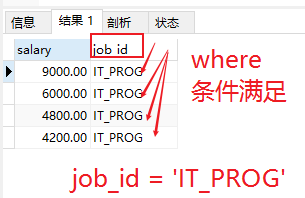

# 进阶7)子查询

##### 含义：

出现在**其他语句**中的select语句，称为子查询或内查询
外部的查询语句，称为主查询或外查询

##### 分类：

按子查询出现的位置：
	select后面：
		仅仅支持标量子查询
	

```
from后面：
	支持表子查询
```

​	where或having后面：★
​		标量子查询（单行） √            
​		列子查询  （多行） √
​		

```
	行子查询
	
exists后面（相关子查询）        意思:存在于否？
	表子查询
```
按结果集的行列数不同：
	1、标量子查询（结果集只有一行一列）
	2、列子查询（结果集只有一列多行）
	3、行子查询（结果集有一行多列）
	4、表子查询（结果集一般为多行多列）


一、where或having后面

1、标量子查询（单行子查询）

大白话说：查询的结果是 ：  一行一列

2、列子查询（多行子查询）

大白话说：查询的结果是 ：  多行一列

3、行子查询（多列多行）

大白话说：查询的结果是 ：  多列多行

##### **子查询特点：**

①子查询放在小括号内
②子查询一般放在条件的右侧
③标量子查询，一般搭配着【单行操作符】使用

**条件运算符：**也叫【单行操作符】

```
   >     <    >=    <=    =     <>不等于
```


列子查询，一般搭配着多行操作符使用
in、any/some【任意】、all

④子查询的执行优先于主查询执行，主查询的条件用到了**子查询的结果**

记忆： 中下什么因，就结出什么果！由因  到  果！

### 1.标量子查询

**（单行子查询）**

##### 案例1：

谁的工资比 Abel 高?

①查询Abel的工资

```mysql
SELECT salary
FROM employees
WHERE last_name = 'Abel'   -- 通过名字进行筛选  在打印工资
```

结果：


#②查询员工的信息，满足 salary>①结果

```mysql
SELECT *
FROM employees
WHERE salary>(
    	--  Abel的工资 如上图值 11000.00
		SELECT salary
		FROM employees
		WHERE last_name = 'Abel'
);
```


##### #案例2：

查询  job_id与员工id 141号员工相同，并且salary比员工id为143号员工多的

其他  员工姓名，job_id 和 工资 信息！

#①查询141号员工的job_id

```mysql
SELECT job_id
FROM employees
WHERE employee_id = 141
```

**结果：一行一列**


#②查询143号员工的salary

```mysql
SELECT salary
FROM employees
WHERE employee_id = 143
```

**结果：一行一列**


#③查询员工的姓名，job_id 和工资，要求job_id=①并且salary>②

```mysql
SELECT last_name,job_id,salary
FROM employees
WHERE job_id = (
	SELECT job_id
	FROM employees   --查询141号员工的job_id  -- ST_CLERK
	WHERE employee_id = 141
) AND salary>(
	SELECT salary
	FROM employees   --查询143号员工的salary   2600.00
	WHERE employee_id = 143

);
```

**大白话讲：**

查询

【

​		工种id必须是 ST_CLERK

​		工资必须要大于143员工的2800.00的工资salary

】条件

的其他员工信息的  【名字  工种id   工资】

**结果：**


##### #案例3：

查询：公司工资最少的员工的  last_name,  job_id  和  salary

#①查询公司的 最低工资是多少？值是多少？

```mysql
SELECT MIN(salary)   -- min() 函数
FROM employees
```

结果：


#②查询last_name,job_id和salary，要求salary=①

```mysql
SELECT last_name,job_id,salary
FROM employees
WHERE salary=(
	SELECT MIN(salary)
	FROM employees
);   -- 查询最小工资哪个人的 信息
```

结果：


##### #案例4：

查询每一个部门id最低工资  大于  部门id为50的最低工资的  部门id  和  其最低工资 

#①查询部门id为50号的最低工资

```mysql
SELECT  MIN(salary)
FROM employees
WHERE department_id = 50
```

结果：


#②查询每个部门的最低工资

```mysql
SELECT MIN(salary),department_id
FROM employees
GROUP BY department_id
```

结果：


#③ 在②基础上筛选，满足min(salary)>①

```mysql
SELECT MIN(salary),department_id
FROM employees
GROUP BY department_id
HAVING MIN(salary)>(
    
    -- 子查询   查的是部门id为50的员工中工资最低是多少money
	SELECT  MIN(salary)
	FROM employees
	WHERE department_id = 50


);
```


### #1.1非法使用标量子查询

标量子查询：结果是一个值。

非法使用标量子查询： 结果数据是 以一列多行数据。

```mysql
	SELECT  salary
	FROM employees
	WHERE department_id = 50；
```

结果：


```mysql
SELECT MIN(salary),department_id
FROM employees
GROUP BY department_id
HAVING MIN(salary)>(
    
    
	SELECT  salary
	FROM employees
	WHERE department_id = 50


);


```


### #2.列子查询（多行子查询）★

返回多行

使用多行比较操作符

| 操作符      | 含义                       |
| ----------- | -------------------------- |
| in/not  in  | 等于列表中的任意一个       |
| any \| some | 和子查询返回的某一个值比较 |
| all         | 和子查询返回的所有值比较   |

体会any 和 all 的区别

##### #案例1：

查询查询员工表中：location_id是1400或1700的部门中的所有员工姓名

#①查询部门表中：location_id是1400或1700的员工的部门编号是多少?

```mysql
SELECT DISTINCT department_id
FROM departments
WHERE location_id IN(1400,1700);
```

结果：部门编号有那些呢？


#②查询员工姓名，要求部门号是①列表中的某一个

```mysql
-- 查询员工名字
SELECT last_name
FROM employees
WHERE department_id  = any (
    
    -- 一结果列表中 所有值
	SELECT DISTINCT department_id
	FROM departments
	WHERE location_id IN(1400,1700)


);
```


##### #案例2：

返回其它工种中比job_id为‘IT_PROG’工种任一工资低的员工的员工号、姓名、job_id 以及salary

#①查询employees表中：job_id【工种id】为‘IT_PROG’ 的工资是多少？

```mysql
SELECT DISTINCT salary
FROM employees
WHERE job_id = 'IT_PROG';
```

结果：



#②查询  员工号、姓名、job_id 以及salary，但是salary<(①)的任意一个

```mysql
SELECT last_name,employee_id,job_id,salary
FROM employees
-- 等同于数学里面的集合，函数， 一个X 要小于 一个集合里面的一个数 就等同于  集合求最大值 
-- 只要 x 小于这个集合里面最大值就一定满足 any等同与 max()
-- 口决：   any小于号，any求最大。
-- 		   any大于号，any求最小。		
WHERE salary<ANY(
	SELECT DISTINCT salary
	FROM employees
	WHERE job_id = 'IT_PROG'
-- 并且 工种id 要不等于  'IT_PROG'
) AND job_id<>'IT_PROG';
```

意思：

查询employees表中 员工姓名【last_name】，员工id【employee_id】，工种id【job_id】，工资【salary】，并且工资【salary】只要小于 工种号【job_id】 要等于  'IT_PROG' 的员工中任意一个人的工资 ，而且 工种号还要不等与   'IT_PROG'

**结果:**


#或

```mysql
SELECT last_name,employee_id,job_id,salary
FROM employees
WHERE salary<(
    
    -- 满足口诀： 求最大值
	SELECT MAX(salary)
	FROM employees
	WHERE job_id = 'IT_PROG'
    

) AND job_id<>'IT_PROG';
```


##### #案例3：

返回其它部门中比job_id为‘IT_PROG’部门所有工资都低的员工   的员工号、姓名、job_id 以及salary

```mysql
SELECT last_name,employee_id,job_id,salary
FROM employees
WHERE salary<ALL(
	SELECT DISTINCT salary
	FROM employees
	WHERE job_id = 'IT_PROG'

) AND job_id<>'IT_PROG';
```

结果：


#或

```mysql
SELECT last_name,employee_id,job_id,salary
FROM employees
WHERE salary<(
    
    -- 求列表的最小值min 
	SELECT MIN( salary)
	FROM employees
	WHERE job_id = 'IT_PROG'

) AND job_id<>'IT_PROG';
```


### #3、行子查询（结果集一行多列或多行多列）

#案例：查询employees表中：员工编号最小**并且【and，&】**工资最高的   员工信息


**#方法一：**

```mysql
SELECT * 
FROM employees
-- 有点python 的列表元组分别赋值
-- 一个虚拟的字段数据表 
WHERE (employee_id,salary)=(
	SELECT MIN(employee_id),MAX(salary)
	FROM employees
);
```


**#方法二：**

#①查询最小的员工编号

```mysql
SELECT MIN(employee_id)
FROM employees
```


#②查询最高工资

```mysql
SELECT MAX(salary)
FROM employees
```


#③查询员工信息

```mysql
SELECT *
FROM employees
WHERE employee_id=(
    -- 标量子查询 一个结果
	SELECT MIN(employee_id)
	FROM employees


)AND salary=(
     -- 标量子查询 一个结果
	SELECT MAX(salary)
	FROM employees

);
```

**结果：**


#### #二、select后面

/*
仅仅支持   标量子查询
*/

##### #案例1：

查询每个部门的员工个数


```mysql
SELECT d.*,(
		SELECT COUNT(*)
		FROM employees e
    -- 上面而行代码 表示 统计这个表有多少行
		WHERE e.department_id = d.`department_id`
    -- 满足id 相等就统计次行
     ) 个数
 FROM departments d;
```
结果


#####  #案例2：

查询员工号=102   的部门名   

**方法一：**

链接查询可以做


**方法二：**

```mysql
SELECT (
      
	SELECT department_name,e.department_id
	FROM departments d
	INNER JOIN employees e
	ON d.department_id=e.department_id
    -- 上面表内链接后   在 进行条件筛选
	WHERE e.employee_id=102
	
) 部门名;
```


#### #三、from后面

/*
将子查询结果充当一张表，**要求**必须起别名
*/

##### #案例：

查询每个部门的平均工资的  工资等级
#①查询每个部门的平均工资

```mysql
-- 分组函数           部门id编号
SELECT AVG(salary),department_id

FROM employees
-- 是用了分组函数  必要分组
-- 记忆口诀：   有分组函数，必字段分组！
--            有字段分组，可分组函数！
GROUP BY department_id
```

**结果：**


```mysql
SELECT * FROM job_grades;
```

方法一：链接查询


方法二：子查询

#②连接①的结果集和job_grades表，筛选条件平均工资 between lowest_sal and highest_sal

```mysql
-- 查询 ag_dep的所有字段   g表的
SELECT  ag_dep.*,g.`grade_level`
FROM (
	SELECT AVG(salary) as ag,department_id
	FROM employees
	GROUP BY department_id
) ag_dep
INNER JOIN job_grades g
ON ag_dep.ag BETWEEN lowest_sal AND highest_sal;

```


#### #四、exists后面（相关子查询）

/*
语法：
exists(完整的查询语句)
结果：
1或0


*/

SELECT EXISTS(SELECT employee_id FROM employees WHERE salary=300000);

EXISTS意思：是否存在   有结果为1   无为0

道德经有言曰：     有无相生，难易相成。。。

##### #案例1：

查询有员工   的部门名

**方法一：**

#in

```mysql
SELECT department_name
FROM departments d

--  部门id在 在员工表中是否存在相同的部门id编号
WHERE d.`department_id` IN(
    -- 多行子查询
	SELECT department_id
	FROM employees

)
```

1、有些部门有名无人

**方法二：**

#exists

```mysql
SELECT department_name
FROM departments d
WHERE EXISTS(
    -- 内链接
	SELECT *
	FROM employees e
    --  相关子查询  知意
    -- 二表相关联为一行 
	WHERE d.`department_id`=e.`department_id`


);
```

口诀：

in接多行子查询，exists接俩表内链接！

##### #案例2：

查询没有女朋友的男神信息

#in

```mysql
SELECT bo.*
FROM boys bo
WHERE bo.id NOT IN(
    -- 多行子查询
	SELECT boyfriend_id
	FROM beauty
)
```


#exists

```mysql
SELECT bo.*
FROM boys bo
WHERE NOT EXISTS(
    -- 链接查询 
	SELECT boyfriend_id
	FROM beauty b
	WHERE bo.`id`=b.`boyfriend_id`

);
```


