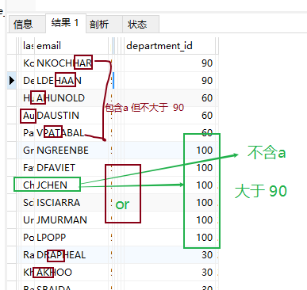

# #进阶9：联合查询

/*

union：意思：联合     记忆：联合 国

union 联合 合并：将**多条查询语句的结果**合并成一个结果

语法：

```mysql
查询语句1  -- slect ...
union
查询语句2
union	 -- slect ...
...
```

union all 可以包含重复项

**应用场景：**
要查询的结果来自于多个表，且多个表没有直接的连接关系，但查询的**信息一致**时

特点：★【注意】
1、要求多条查询语句的【查询列数，也就是select 后面要查询的字段】是要一致的！
2、要求多条查询语句的【查询的每一列的类型和顺序】最好一致
3、union关键字默认去重，如果使用union all 可以包含重复项

*/

##### #引入的案例： 

查询部门编号>90  或   邮箱包含a  的员工信息

方法一：

```mysql
SELECT * FROM employees 
WHERE email LIKE '%a%' OR department_id>90;
```

**结果：**



**方法二：**

```mysql
SELECT * FROM employees  WHERE email LIKE '%a%'
UNION
SELECT * FROM employees  WHERE department_id>90;
```

结果如上：


##### #案例1：

查询   中国用户中男性的信息  以及   外国用户中年男性的用户信息

```mysql
SELECT id,cname FROM t_ca WHERE csex='男'
UNION ALL
SELECT t_id,tname FROM t_ua WHERE tGender='male';
```


