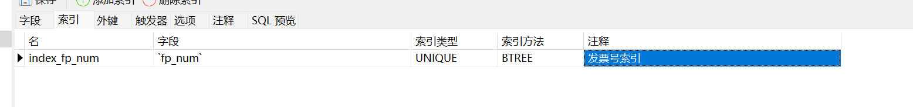
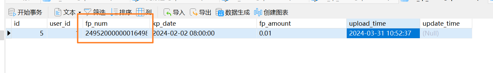
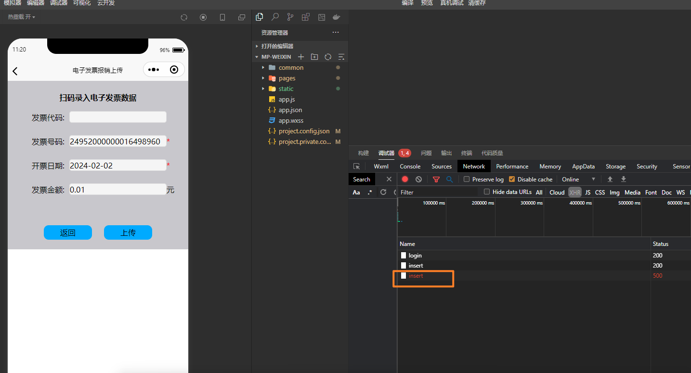
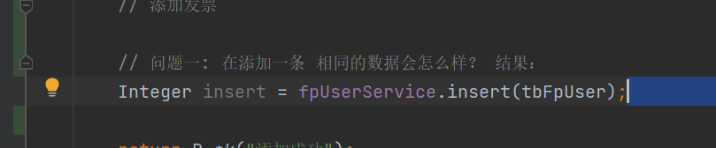
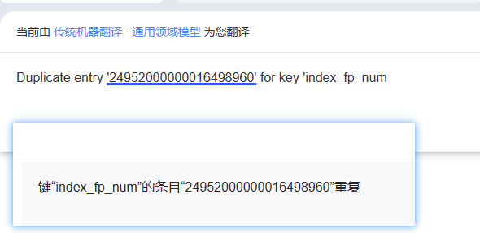

# 唯一索引在添加相同数据



## 问题

- 在添加一条相同的数据会怎么样？ 


## 表结构

```sql
CREATE TABLE `tb_fp_user` (
  `id` int(10) unsigned NOT NULL AUTO_INCREMENT COMMENT '主键',
  `user_id` int(10) DEFAULT NULL COMMENT '用户·id',
  `fp_num` varchar(100) DEFAULT NULL COMMENT '发票号码',
  `kp_date` datetime DEFAULT NULL COMMENT '发票的开票日期',
  `fp_amount` varchar(255) DEFAULT NULL COMMENT '发票的金额',
  `upload_time` datetime DEFAULT NULL ON UPDATE CURRENT_TIMESTAMP COMMENT '发票信息上传的时间',
  `update_time` datetime DEFAULT NULL ON UPDATE CURRENT_TIMESTAMP COMMENT '发票最后修改时间',
  PRIMARY KEY (`id`),
  UNIQUE KEY `index_fp_num` (`fp_num`) USING BTREE COMMENT '发票号索引'
) ENGINE=InnoDB AUTO_INCREMENT=7 DEFAULT CHARSET=utf8mb4;
```




## 再次添加

前端代码




java后端代码




抛出异常

```
### Error updating database.  Cause: java.sql.SQLIntegrityConstraintViolationException: Duplicate entry '24952000000016498960' for key 'index_fp_num'
### The error may exist in file [D:\java_project_code\fp-demo\fp-demo-core\target\classes\mapper\TbFpUserDao.xml]
### The error may involve top.wutunan.web.dao.TbFpUserDao.insert-Inline
### The error occurred while setting parameters
### SQL: insert into tb_fp_user (user_id, fp_num, kp_date,        fp_amount, upload_time, update_time       )     values (?, ?, ?,        ?, ?, ?       )
### Cause: java.sql.SQLIntegrityConstraintViolationException: Duplicate entry '24952000000016498960' for key 'index_fp_num'
; Duplicate entry '24952000000016498960' for key 'index_fp_num'; nested exception is java.sql.SQLIntegrityConstraintViolationException: Duplicate entry '24952000000016498960' for key 'index_fp_num'] with root cause
java.sql.SQLIntegrityConstraintViolationException: Duplicate entry '24952000000016498960' for key 'index_fp_num'
	at com.mysql.cj.jdbc.exceptions.SQLError.createSQLException(SQLError.java:117)
	at com.mysql.cj.jdbc.exceptions.SQLExceptionsMapping.translateException(SQLExceptionsMapping.java:122)
	at com.mysql.cj.jdbc.ClientPreparedStatement.executeInternal(ClientPreparedStatement.java:953)
	at com.mysql.cj.jdbc.ClientPreparedStatement.execute(ClientPreparedStatement.java:370)
	at com.alibaba.druid.pool.DruidPooledPreparedStatement.execute(DruidPooledPreparedStatement.java:497)
	at sun.reflect.NativeMethodAccessorImpl.invoke0(Native Method)
	at sun.reflect.NativeMethodAccessorImpl.invoke(NativeMethodAccessorImpl.java:62)
	at sun.reflect.DelegatingMethodAccessorImpl.invoke(DelegatingMethodAccessorImpl.java:43)
	at java.lang.reflect.Method.invoke(Method.java:498)
	at org.apache.ibatis.logging.jdbc.PreparedStatementLogger.invoke(PreparedStatementLogger.java:59)
	at com.sun.proxy.$Proxy105.execute(Unknown Source)
	at org.apache.ibatis.executor.statement.PreparedStatementHandler.update(PreparedStatementHandler.java:47)
	at org.apache.ibatis.executor.statement.RoutingStatementHandler.update(RoutingStatementHandler.java:74)
	at org.apache.ibatis.executor.SimpleExecutor.doUpdate(SimpleExecutor.java:50)
	at org.apache.ibatis.executor.BaseExecutor.update(BaseExecutor.java:117)
	at org.apache.ibatis.executor.CachingExecutor.update(CachingExecutor.java:76)
	at org.apache.ibatis.session.defaults.DefaultSqlSession.update(DefaultSqlSession.java:197)
	at org.apache.ibatis.session.defaults.DefaultSqlSession.insert(DefaultSqlSession.java:184)
	at sun.reflect.NativeMethodAccessorImpl.invoke0(Native Method)
	at sun.reflect.NativeMethodAccessorImpl.invoke(NativeMethodAccessorImpl.java:62)
	at sun.reflect.DelegatingMethodAccessorImpl.invoke(DelegatingMethodAccessorImpl.java:43)
	at java.lang.reflect.Method.invoke(Method.java:498)
	at org.mybatis.spring.SqlSessionTemplate$SqlSessionInterceptor.invoke(SqlSessionTemplate.java:426)
	at com.sun.proxy.$Proxy60.insert(Unknown Source)
	at org.mybatis.spring.SqlSessionTemplate.insert(SqlSessionTemplate.java:271)
	at org.apache.ibatis.binding.MapperMethod.execute(MapperMethod.java:62)
	at org.apache.ibatis.binding.MapperProxy$PlainMethodInvoker.invoke(MapperProxy.java:152)
	at org.apache.ibatis.binding.MapperProxy.invoke(MapperProxy.java:85)
	at com.sun.proxy.$Proxy82.insert(Unknown Source)
	at top.wutunan.web.service.impl.FpUserServiceImpl.insert(FpUserServiceImpl.java:22)
	at top.wutunan.web.controller.FpUserController.login(FpUserController.java:50)
	at top.wutunan.web.controller.FpUserController$$FastClassBySpringCGLIB$$cbe3c71e.invoke(<generated>)
	at org.springframework.cglib.proxy.MethodProxy.invoke(MethodProxy.java:218)
	at org.springframework.aop.framework.CglibAopProxy$CglibMethodInvocation.invokeJoinpoint(CglibAopProxy.java:771)
	at org.springframework.aop.framework.ReflectiveMethodInvocation.proceed(ReflectiveMethodInvocation.java:163)
	at org.springframework.aop.framework.CglibAopProxy$CglibMethodInvocation.proceed(CglibAopProxy.java:749)
	at org.springframework.aop.aspectj.MethodInvocationProceedingJoinPoint.proceed(MethodInvocationProceedingJoinPoint.java:88)
	at top.wutunan.aop.TokenAspect.around(TokenAspect.java:41)
	at sun.reflect.NativeMethodAccessorImpl.invoke0(Native Method)
	at sun.reflect.NativeMethodAccessorImpl.invoke(NativeMethodAccessorImpl.java:62)
	at sun.reflect.DelegatingMethodAccessorImpl.invoke(DelegatingMethodAccessorImpl.java:43)
	at java.lang.reflect.Method.invoke(Method.java:498)
	at org.springframework.aop.aspectj.AbstractAspectJAdvice.invokeAdviceMethodWithGivenArgs(AbstractAspectJAdvice.java:644)
	at org.springframework.aop.aspectj.AbstractAspectJAdvice.invokeAdviceMethod(AbstractAspectJAdvice.java:633)
	at org.springframework.aop.aspectj.AspectJAroundAdvice.invoke(AspectJAroundAdvice.java:70)
	at org.springframework.aop.framework.ReflectiveMethodInvocation.proceed(ReflectiveMethodInvocation.java:186)
	at org.springframework.aop.framework.CglibAopProxy$CglibMethodInvocation.proceed(CglibAopProxy.java:749)
	at org.springframework.aop.interceptor.ExposeInvocationInterceptor.invoke(ExposeInvocationInterceptor.java:95)
	at org.springframework.aop.framework.ReflectiveMethodInvocation.proceed(ReflectiveMethodInvocation.java:186)
	at org.springframework.aop.framework.CglibAopProxy$CglibMethodInvocation.proceed(CglibAopProxy.java:749)
	at org.springframework.aop.framework.CglibAopProxy$DynamicAdvisedInterceptor.intercept(CglibAopProxy.java:691)
	at top.wutunan.web.controller.FpUserController$$EnhancerBySpringCGLIB$$c0483dfe.login(<generated>)
	at sun.reflect.NativeMethodAccessorImpl.invoke0(Native Method)
	at sun.reflect.NativeMethodAccessorImpl.invoke(NativeMethodAccessorImpl.java:62)
	at sun.reflect.DelegatingMethodAccessorImpl.invoke(DelegatingMethodAccessorImpl.java:43)
	at java.lang.reflect.Method.invoke(Method.java:498)
	at org.springframework.web.method.support.InvocableHandlerMethod.doInvoke(InvocableHandlerMethod.java:190)
	at org.springframework.web.method.support.InvocableHandlerMethod.invokeForRequest(InvocableHandlerMethod.java:138)
	at org.springframework.web.servlet.mvc.method.annotation.ServletInvocableHandlerMethod.invokeAndHandle(ServletInvocableHandlerMethod.java:105)
	at org.springframework.web.servlet.mvc.method.annotation.RequestMappingHandlerAdapter.invokeHandlerMethod(RequestMappingHandlerAdapter.java:878)
	at org.springframework.web.servlet.mvc.method.annotation.RequestMappingHandlerAdapter.handleInternal(RequestMappingHandlerAdapter.java:792)
	at org.springframework.web.servlet.mvc.method.AbstractHandlerMethodAdapter.handle(AbstractHandlerMethodAdapter.java:87)
	at org.springframework.web.servlet.DispatcherServlet.doDispatch(DispatcherServlet.java:1040)
	at org.springframework.web.servlet.DispatcherServlet.doService(DispatcherServlet.java:943)
	at org.springframework.web.servlet.FrameworkServlet.processRequest(FrameworkServlet.java:1006)
	at org.springframework.web.servlet.FrameworkServlet.doPost(FrameworkServlet.java:909)
	at javax.servlet.http.HttpServlet.service(HttpServlet.java:652)
	at org.springframework.web.servlet.FrameworkServlet.service(FrameworkServlet.java:883)
	at javax.servlet.http.HttpServlet.service(HttpServlet.java:733)
	at org.apache.catalina.core.ApplicationFilterChain.internalDoFilter(ApplicationFilterChain.java:231)
	at org.apache.catalina.core.ApplicationFilterChain.doFilter(ApplicationFilterChain.java:166)
	at org.apache.tomcat.websocket.server.WsFilter.doFilter(WsFilter.java:53)
	at org.apache.catalina.core.ApplicationFilterChain.internalDoFilter(ApplicationFilterChain.java:193)
	at org.apache.catalina.core.ApplicationFilterChain.doFilter(ApplicationFilterChain.java:166)
	at org.apache.shiro.web.servlet.ProxiedFilterChain.doFilter(ProxiedFilterChain.java:61)
	at org.apache.shiro.web.servlet.AdviceFilter.executeChain(AdviceFilter.java:108)
	at org.apache.shiro.web.servlet.AdviceFilter.doFilterInternal(AdviceFilter.java:137)
	at top.wutunan.config.shiro.OAuth2Filter.doFilterInternal(OAuth2Filter.java:147)
	at org.apache.shiro.web.servlet.OncePerRequestFilter.doFilter(OncePerRequestFilter.java:125)
	at org.apache.shiro.web.servlet.ProxiedFilterChain.doFilter(ProxiedFilterChain.java:66)
	at org.apache.shiro.web.servlet.AbstractShiroFilter.executeChain(AbstractShiroFilter.java:449)
	at org.apache.shiro.web.servlet.AbstractShiroFilter$1.call(AbstractShiroFilter.java:365)
	at org.apache.shiro.subject.support.SubjectCallable.doCall(SubjectCallable.java:90)
	at org.apache.shiro.subject.support.SubjectCallable.call(SubjectCallable.java:83)
	at org.apache.shiro.subject.support.DelegatingSubject.execute(DelegatingSubject.java:387)
	at org.apache.shiro.web.servlet.AbstractShiroFilter.doFilterInternal(AbstractShiroFilter.java:362)
	at org.apache.shiro.web.servlet.OncePerRequestFilter.doFilter(OncePerRequestFilter.java:125)
	at org.apache.catalina.core.ApplicationFilterChain.internalDoFilter(ApplicationFilterChain.java:193)
	at org.apache.catalina.core.ApplicationFilterChain.doFilter(ApplicationFilterChain.java:166)
	at org.apache.shiro.web.servlet.AdviceFilter.executeChain(AdviceFilter.java:108)
	at org.apache.shiro.web.servlet.AdviceFilter.doFilterInternal(AdviceFilter.java:137)
	at top.wutunan.config.shiro.OAuth2Filter.doFilterInternal(OAuth2Filter.java:147)
	at org.apache.shiro.web.servlet.OncePerRequestFilter.doFilter(OncePerRequestFilter.java:125)
	at org.apache.catalina.core.ApplicationFilterChain.internalDoFilter(ApplicationFilterChain.java:193)
	at org.apache.catalina.core.ApplicationFilterChain.doFilter(ApplicationFilterChain.java:166)
	at org.springframework.web.filter.RequestContextFilter.doFilterInternal(RequestContextFilter.java:100)
	at org.springframework.web.filter.OncePerRequestFilter.doFilter(OncePerRequestFilter.java:119)
	at org.apache.catalina.core.ApplicationFilterChain.internalDoFilter(ApplicationFilterChain.java:193)
	at org.apache.catalina.core.ApplicationFilterChain.doFilter(ApplicationFilterChain.java:166)
	at org.springframework.web.filter.FormContentFilter.doFilterInternal(FormContentFilter.java:93)
	at org.springframework.web.filter.OncePerRequestFilter.doFilter(OncePerRequestFilter.java:119)
	at org.apache.catalina.core.ApplicationFilterChain.internalDoFilter(ApplicationFilterChain.java:193)
	at org.apache.catalina.core.ApplicationFilterChain.doFilter(ApplicationFilterChain.java:166)
	at org.springframework.web.filter.CharacterEncodingFilter.doFilterInternal(CharacterEncodingFilter.java:201)
	at org.springframework.web.filter.OncePerRequestFilter.doFilter(OncePerRequestFilter.java:119)
	at org.apache.catalina.core.ApplicationFilterChain.internalDoFilter(ApplicationFilterChain.java:193)
	at org.apache.catalina.core.ApplicationFilterChain.doFilter(ApplicationFilterChain.java:166)
	at org.apache.catalina.core.StandardWrapperValve.invoke(StandardWrapperValve.java:202)
	at org.apache.catalina.core.StandardContextValve.invoke(StandardContextValve.java:97)
	at org.apache.catalina.authenticator.AuthenticatorBase.invoke(AuthenticatorBase.java:541)
	at org.apache.catalina.core.StandardHostValve.invoke(StandardHostValve.java:143)
	at org.apache.catalina.valves.ErrorReportValve.invoke(ErrorReportValve.java:92)
	at org.apache.catalina.core.StandardEngineValve.invoke(StandardEngineValve.java:78)
	at org.apache.catalina.connector.CoyoteAdapter.service(CoyoteAdapter.java:343)
	at org.apache.coyote.http11.Http11Processor.service(Http11Processor.java:374)
	at org.apache.coyote.AbstractProcessorLight.process(AbstractProcessorLight.java:65)
	at org.apache.coyote.AbstractProtocol$ConnectionHandler.process(AbstractProtocol.java:868)
	at org.apache.tomcat.util.net.NioEndpoint$SocketProcessor.doRun(NioEndpoint.java:1590)
	at org.apache.tomcat.util.net.SocketProcessorBase.run(SocketProcessorBase.java:49)
	at java.util.concurrent.ThreadPoolExecutor.runWorker(ThreadPoolExecutor.java:1142)
	at java.util.concurrent.ThreadPoolExecutor$Worker.run(ThreadPoolExecutor.java:617)
	at org.apache.tomcat.util.threads.TaskThread$WrappingRunnable.run(TaskThread.java:61)
	at java.lang.Thread.run(Thread.java:745)

```


## 总结

会抛出异常

java.sql.SQLIntegrityConstraintViolationException: Duplicate entry '24952000000016498960' for key 'index_fp_num'

百度翻译




大概意思是说：

键'index_fp_num' 重复插入  24952000000016498960。


