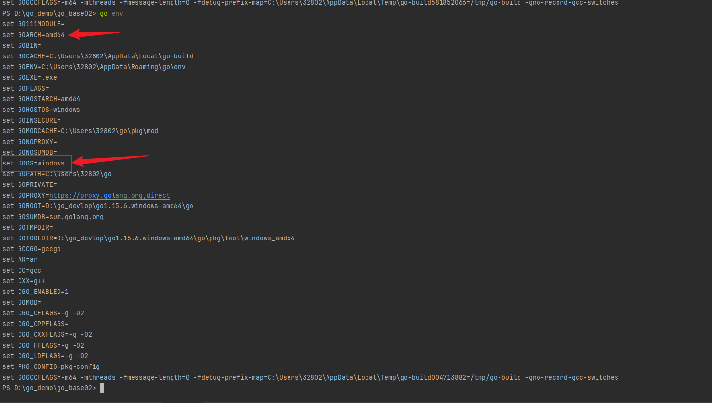
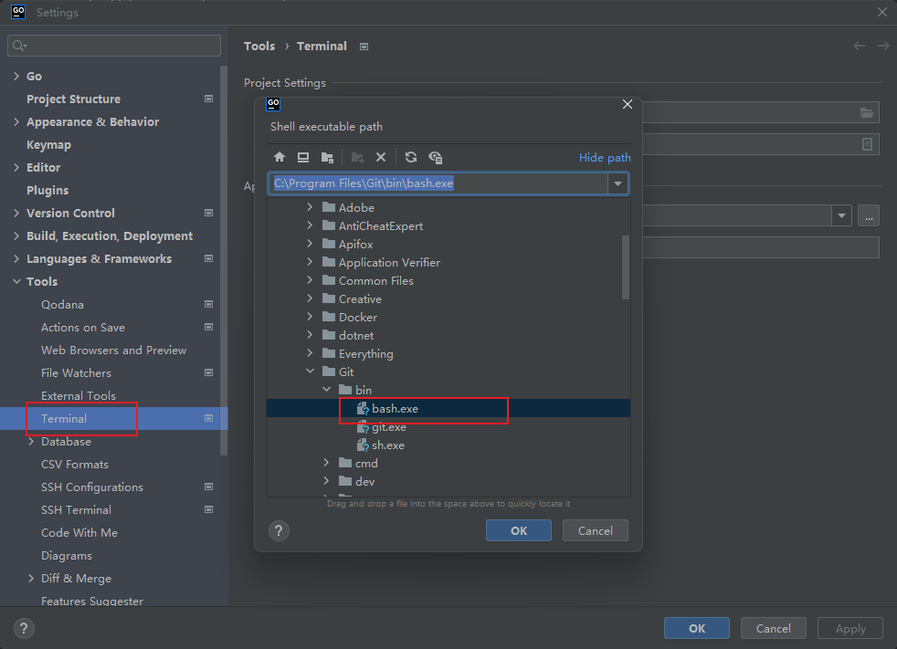

# 首次邂逅go

语言：golang

开发工具：goland_2024版


## go语言本身

1. 为什么学习go语言？
2. go语言2008年前后由google公司开发，开发人员都是c语言的大佬
3. 2020年4月TIOBE排名12位
4. 开发速度快，执行效率高：
   1. 开发速度：c < go < python
   2. 效率：python < go < c
5. go语言开发的项目：docker， k8s，区块链项目（以太坊，fabric）
6. 公司开发新项目、旧项目重构：**后台服务器、web服务器**  ==》 使用go语言
7. go语言找工作一般都会认为是其他语言转行过来，一般会理解为c语言转行过来的（尤其体现在面试上）
8. go语言在中国的发展格外迅速： 七牛云、滴滴


##  HelloWorld概览

```go
package main

import "fmt"

func main()  {
	fmt.Println("hello world")
}
```

解析go代码：

```go
//每个go程序，都必须有一个 package main
//每个go程序，都是.go结尾的
//go程序中没有.h，没有.o, 只有.go
//一个package，包名，相当于命名空间
//std::cout
package main

//这是导入一个标准包fmt，format，一般用于格式化输出
import "fmt"

//主函数，所有的函数必须使用func 开头
//一个函数的返回值，不会放在func前，而是放在参数后面
//函数左花括号必须与函数名同行，不能写到下一行
func main() {

	//go语言语句不需要使用分号结尾
	fmt.Println("hello world");
}
```


## go语言特点

如果说到java。那么你会想起 "跨平台"、"一次编译处处运行"等特点。go也是一样的。

1. 没有头文件概念,  .go走天下。
2. 强类型的语言，编译性语言（pthon是弱类型，解释性语言）
3. 一个go语言的应用程序，在运行的时候是不需要依赖外部库的
   - 把执行时需要的所有库都打包到程序中
   - go程序比较大
   - 如果import的包在程序中没有使用，那么程序不允许编译
4. go语法是不区分平台的，在windows下面也可以编译一个程序，在linux下运行，需要两个环境变量来控制：
   1. GOOS：设定运行的平台
      1. mac：GOOS=darwin【下辈子的事了】
      2. **linux**: GOOS= linux
      3. **windows** :GOOS=windows
   2. GOARCH: 目标平台的体系构架
      1. 386： GOARCH=386
      2. amd64: GOARCH=amd64
      3. arm : GOARCH=arm




## goland终端配置成shell

内壳选择bash。




