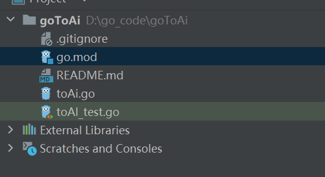
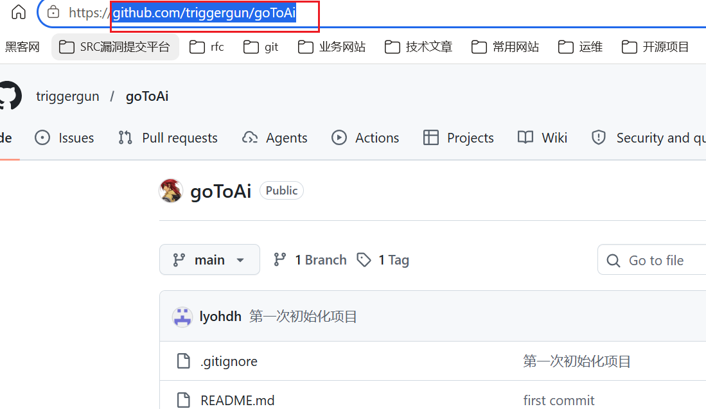
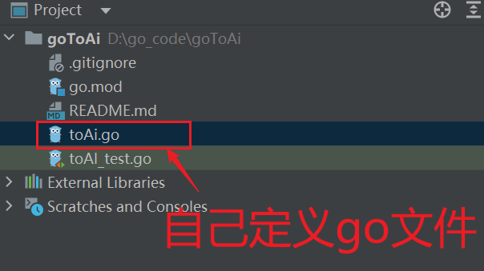
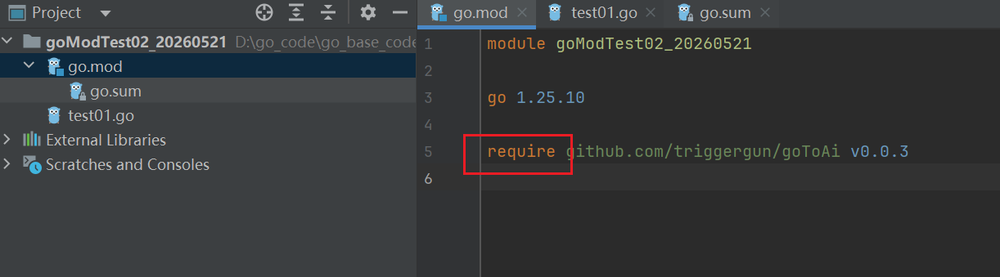

# go怎么定义模块？

使用过c、java都知道。都要用到依赖库函数。方便解耦、功能拆分、并行开发。

- c需要依赖系统内部的lib。也就是系统头文件、自定义头文件。
- java需要依赖jar包。

那么怎么go怎么定义自己的独立模块给程序调用呢？

它要遵循哪一些原则呢？

下面是本人自己摸索怎么定义一个go模块案例。具体步骤如下：

- 创建自己定义go模块github仓库
- 编写自己定义go模块功能代码。
- 在另外一个go项目中调用··自己定义的go模块封装的方法。


## 创建自定go模块




go.mod编写：

```go
module github.com/triggergun/goToAi

go 1.25.10

```

为什么这样写github.com/triggergun/goToAi呢？

答：这个就是自己在github创建的仓库地址http连接路径。




::: tip 提交远程仓库

在自己定义的模块编码完成后提交需要记得打标签（tag）。这个非常重要。因为这个其它项目使用自己定义模块是通过tag来区分版本的。

:::


## 编写自己定义go模块

我们可以在根目录下创建点go文件进行实现自定义功能逻辑。




## 测试自己定义go模块



在新的项目中通过require关键字导入自己定义的go模块。原来是拉取远程github源码包到本地来。

测试我们可以通过调用方法进行验证。


