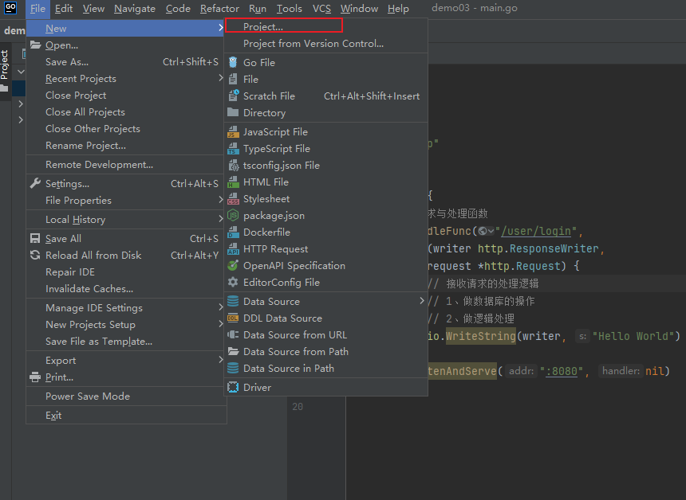
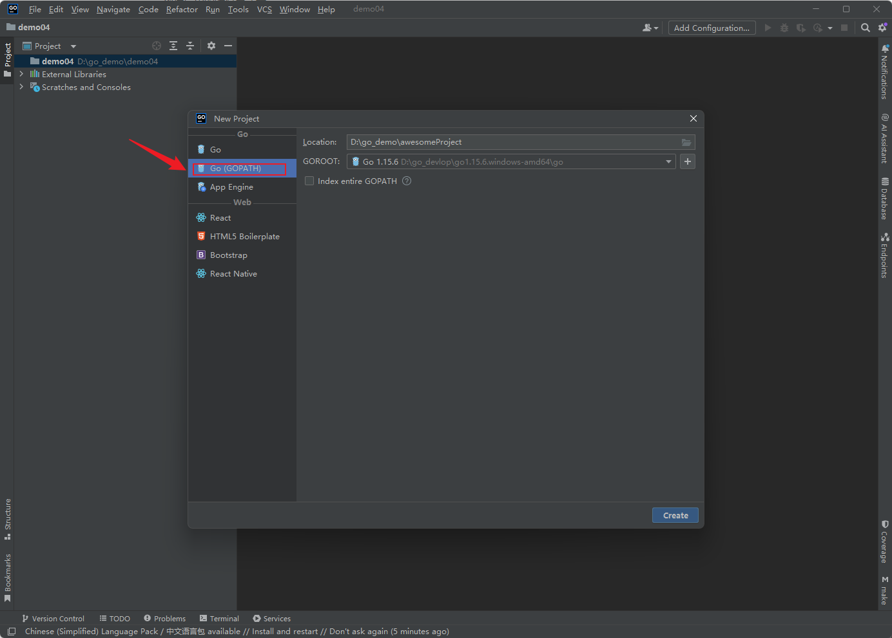
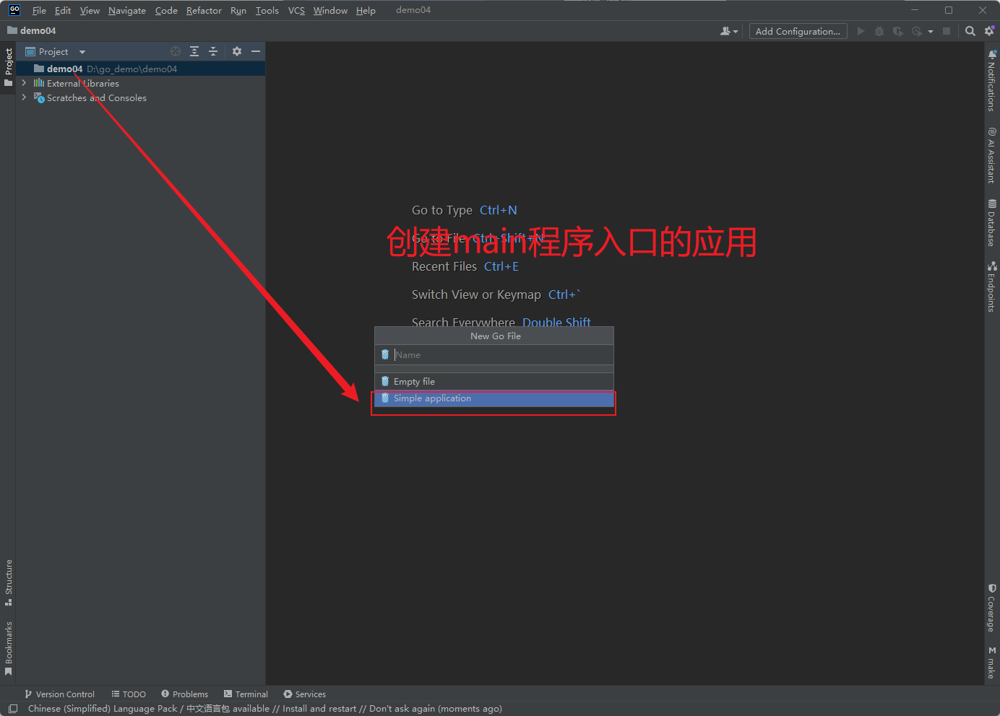

# go的web项目入门


创建应用的时候要注意：




我们创建的web项目选择创建按 GOPATH类型的。这里就有人问了GOPATH是什么？App engine的又是什么？Go类型又是什么？这些问题我也不知道？只有更加深入的学习理解go才能拨开云雾。成长的道路永远是艰难的。




创建的项目是空的，没有任何的文件。接下来就是要创建文件。创建文件的时候我们一定要注意：不要选择空文件。



## web入门的第一个案例

```go
package demo_01

import (
	"io"
	"net/http"
)

func main() {
	// 绑定请求与处理函数
	http.HandleFunc("/user/login",
		func(writer http.ResponseWriter,
			request *http.Request) {
			// 接收请求的处理逻辑
			// 1、做数据库的操作
			// 2、做逻辑处理
			io.WriteString(writer, "Hello World")
		})
	http.ListenAndServe(":8080", nil)
}

```


## 测试

```cmd
C:\Users\32802>curl http://localhost:8080/user/login
Hello World
C:\Users\32802>
```

看到Hello World说明服务端web启动成功了！


