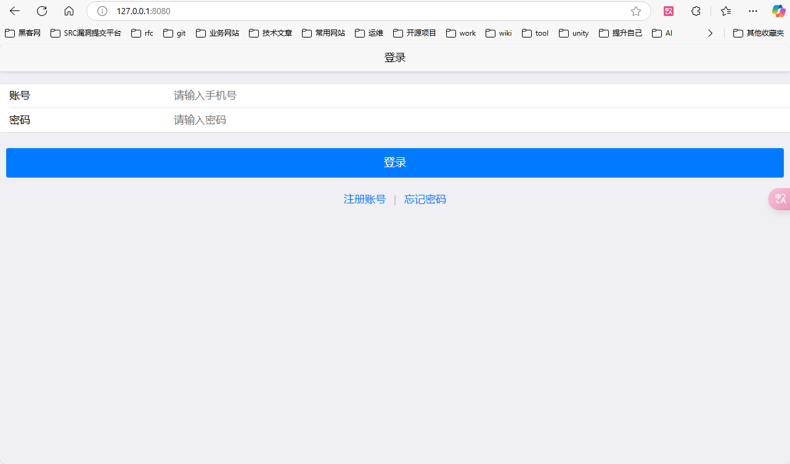
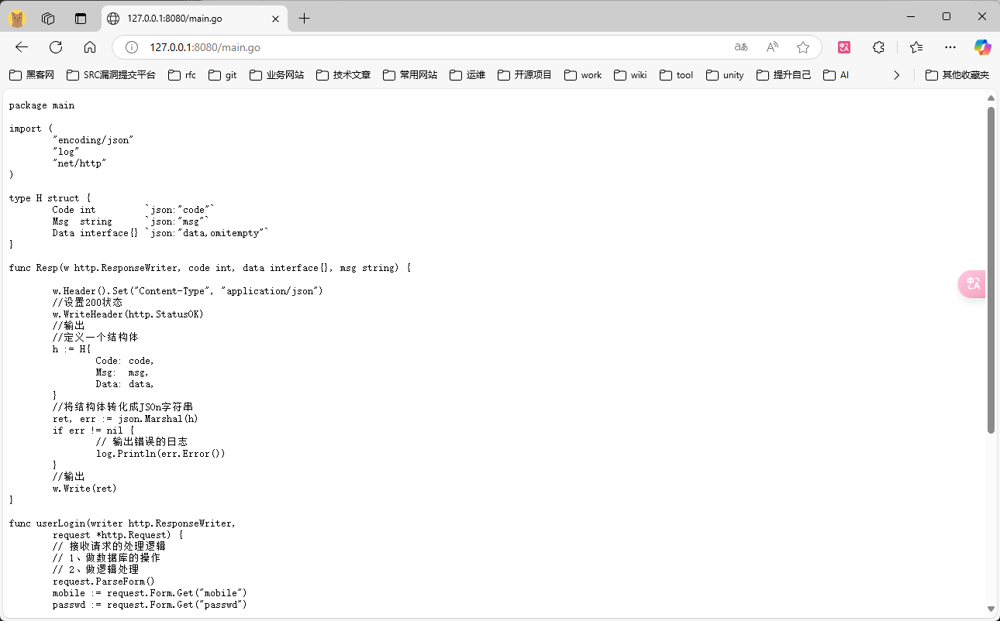
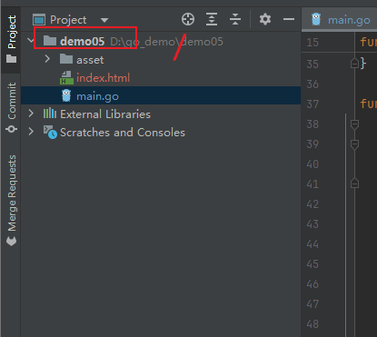
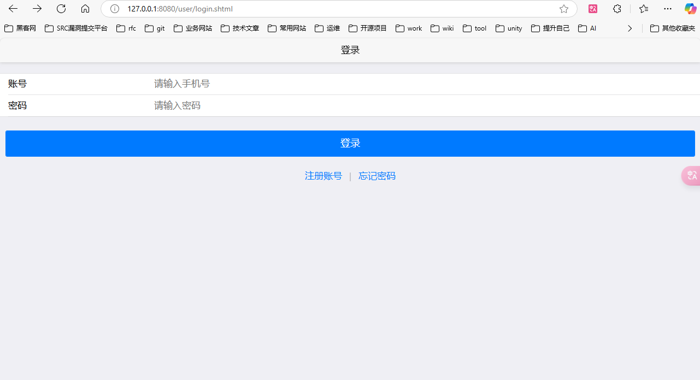
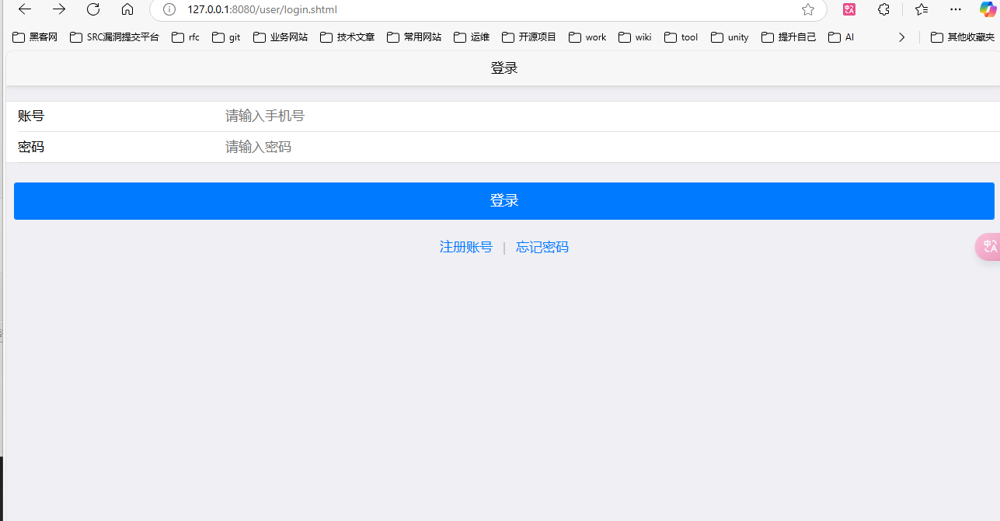
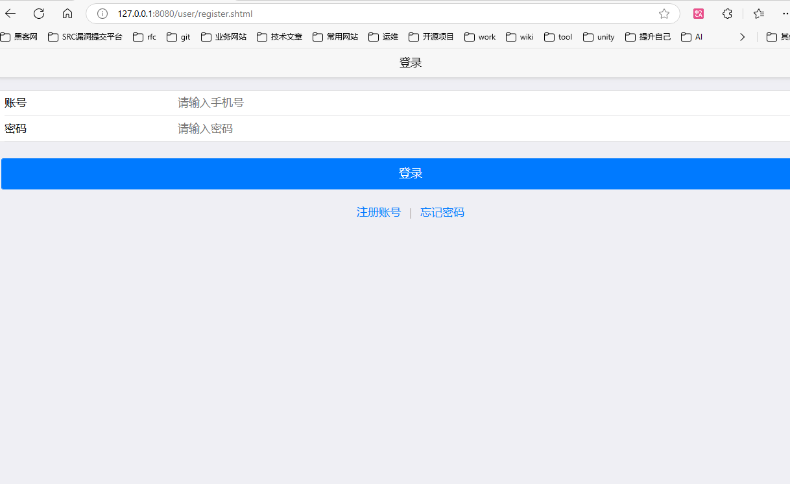

# 实现登录前端界面并接入

## 学习目标

1. 实现静态资源服务。

```go
func FileServer(root FileServer)
```

2. template模板渲染必备技巧。

3. Vue + Mui + Ajax + Promis 的学习


## 登入页面的实现

```html
<!DOCTYPE html>
<html>
<head>
    <meta name="viewport" content="width=device-width, initial-scale=1,maximum-scale=1,user-scalable=no">
    <title>IM解决方案</title>
    <link rel="stylesheet" href="/asset/plugins/mui/css/mui.css" />
    <link rel="stylesheet" href="/asset/css/login.css" />
    <script src="/asset/plugins/mui/js/mui.js" ></script>
    <script src="/asset/js/vue.min.js" ></script>
    <script src="/asset/js/util.js" ></script>
</head>
<body>

<header class="mui-bar mui-bar-nav">
    <h1 class="mui-title">登录</h1>
</header>
<div class="mui-content" id="pageapp">
    <form id='login-form' class="mui-input-group">
        <div class="mui-input-row">
            <label>账号</label>
            <input v-model="user.mobile" placeholder="请输入手机号" type="text" class="mui-input-clear mui-input" >
        </div>
        <div class="mui-input-row">
            <label>密码</label>
            <input v-model="user.passwd" placeholder="请输入密码"  type="password" class="mui-input-clear mui-input" >
        </div>
    </form>
    <div class="mui-content-padded">
        <button @click="login"  type="button"  class="mui-btn mui-btn-block mui-btn-primary">登录</button>
        <div class="link-area"><a id='reg' href="register.shtml">注册账号</a> <span class="spliter">|</span> <a  id='forgetPassword'>忘记密码</a>
        </div>
    </div>
    <div class="mui-content-padded oauth-area">
    </div>
</div>
</body>
</html>
<script>
    var app = new Vue({
        el:"#pageapp",
        data:function(){
          return {
              user:{
                  mobile:"",
                  passwd:""
              }
          }
        },
        methods:{
            login:function(){
                //检测手机号是否正确
                console.log("login")
                //检测密码是否为空

                //网络请求
                //封装了promis
                util.post("user/login",this.user).then(res=>{
                    console.log(res)
                    if(res.code!=0){
                        mui.toast(res.msg)
                    }else{
                        //location.replace("//127.0.0.1/demo/index.shtml")
                        mui.toast("登录成功,即将跳转")
                    }
                })
            },
        }
    })
</script>
```


## 实现静态资源服务

怎么提供静态资源服务？

答：添加一行代码。

```go
	http.Handle("/", http.FileServer(http.Dir(".")))
```

最终实现的代码

```go
func main() {
	// 绑定请求与处理函数
	http.HandleFunc("/user/login", userLogin)
	http.Handle("/", http.FileServer(http.Dir(".")))
	http.ListenAndServe(":8080", nil)
}
```

访问首页的路径：

```
127.0.0.1:8080
```




上面哪一行代码存在安全的问题。

如下访问的路径：

```
http://127.0.0.1:8080/main.go
```




可以访问到我们的go文件源码这个是危险级别的了。

/     对应的   index.html

/main.go  对应的  main.go




## 定义模板的名称


```html
{{define  "/user/login.shtml"}}
XXXX
{{end}}
```

/user/login.shtml 表示 模板的名称。

shtml  表示一种后端渲染的文件。


渲染模板：

```
	http.HandleFunc("模板的名字"，匿名函数，)
```

匿名函数的逻辑：

- 解析模板。

  template.ParseFile("当前路径下的html文件")


访问路径：

​	http://127.0.0.1:8080/user/login.shtml




最终实现的代码：

```go

func main() {
	// 绑定请求与处理函数
	http.HandleFunc("/user/login", userLogin)

	http.Handle("/asset/", http.FileServer(http.Dir(".")))

	// 渲染模板
	http.HandleFunc("/user/login.shtml", func(writer http.ResponseWriter, request *http.Request) {

		tpl, err := template.ParseFiles("view/user/login.html")

		if err != nil {
			// 打印直接退出
			log.Fatal(err.Error())
		}

		tpl.ExecuteTemplate(writer, "/user/login.shtml", nil)

	})

	http.ListenAndServe(":8080", nil)
}

```


## 注册页面模板的添加

同理


## 万能的模板加载进行抽象


```go
func RegisterView() {
	//一次解析出全部模板
	tpl, err := template.ParseGlob("view/**/*")
	if nil != err {
		log.Fatal(err)
	}
	//通过for循环做好映射
	for _, v := range tpl.Templates() {
		// 模板的名字
		tplname := v.Name()
		fmt.Println("HandleFunc     " + v.Name())
		http.HandleFunc(tplname, func(w http.ResponseWriter,
			request *http.Request) {
			//
			fmt.Println("parse     " + v.Name() + "==" + tplname)
			err := tpl.ExecuteTemplate(w, tplname, nil)
			if err != nil {
				log.Fatal(err.Error())
			}
		})
	}

}
```


测试效果：

```
http://127.0.0.1:8080/user/login.shtml
http://127.0.0.1:8080/user/register.shtml
```





