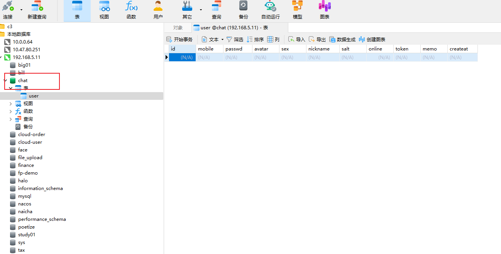
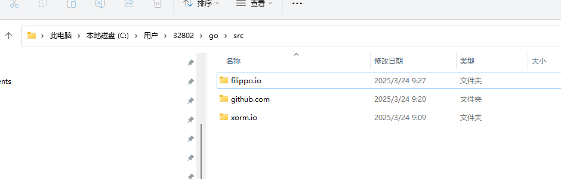

# 在golang中使用xorm操作数据库


## 学习目标

- xorm的安装
- Xorm的初始化
- 用xorm实现curd


## xorm的安装

1. 安装相应的依赖包。

```
go get github.com/go-xorm/xorm
```

2. 安装mysql的驱动依赖。

```
go get github.com/go-sql-driver/mysql
```


::: tip 提问环节

go get github.com/go-xorm/xorm 这个安装的依赖包安装到电脑那个位置下去了呢？

- 使用 Go Modules 时，依赖安装到 `$GOPATH/pkg/mod`。
- 未使用 Go Modules 时，依赖安装到 `$GOPATH/src`。

:::


## Xorm的初始化

定义模型层

```go
package model

import "time"

const (
	SEX_WOMEN = "W"
	SEX_MEN   = "M"
	//
	SEX_UNKNOW = "U"
)

type User struct {
	//用户ID
	Id int64 `xorm:"pk autoincr bigint(20)" form:"id" json:"id"`
	//手机号
	Mobile string `xorm:"varchar(20)" form:"mobile" json:"mobile"`
	// 用户密码 = （passwd + salt） 使用 MD5
	Passwd string `xorm:"varchar(40)" form:"passwd" json:"-"`
	// 头像
	Avatar string `xorm:"varchar(150)" form:"avatar" json:"avatar"`
	Sex    string `xorm:"varchar(2)" form:"sex" json:"sex"`
	// 名称
	Nickname string `xorm:"varchar(20)" form:"nickname" json:"nickname"`
	//加盐随机字符串
	Salt   string `xorm:"varchar(10)" form:"salt" json:"-"`    // 什么角色
	Online int    `xorm:"int(10)" form:"online" json:"online"` //是否在线
	//前端鉴权因子,   一样鉴权 通过过。不一样鉴权失败。
	Token    string    `xorm:"varchar(40)" form:"token" json:"token"`
	Memo     string    `xorm:"varchar(140)" form:"memo" json:"memo"`
	Createat time.Time `xorm:"datetime" form:"createat" json:"createat"`
}

```


定义服务层


```
https://gitea.com/xorm/builder
```


```
go get xorm.io/builder
go get xorm.io/xorm
go get xorm.io/core
go get xorm.io/log
```


```
go get github.com/golang/snappy
go get xorm.io/xorm
```


## 自动创建表结构

下面是自动创建user对象的表结构输出日志。

```
[xorm] [info]  2025/03/24 10:18:47.757207 [SQL] SELECT `TABLE_NAME`, `ENGINE`, `TABLE_ROWS`, `AUTO_INCREMENT`, `TABLE_COMMENT` from `INFORMATION_SCHEMA`.`TABLES` WHERE `TABLE_SCHEMA`=? AND (`ENGINE`='MyISAM' OR `ENGINE` = 'InnoDB' OR `ENGINE` = 'TokuDB') [chat]
init data base ok
```

上面的日志是没有先在数据库中创建chat库。


下面的日志是数据库已经准备了chat的数据库。

```
[xorm] [info]  2025/03/24 10:24:04.245633 [SQL] SELECT `TABLE_NAME`, `ENGINE`, `TABLE_ROWS`, `AUTO_INCREMENT`, `TABLE_COMMENT` from `INFORMATION_SCHEMA`.`TABLES` WHERE `TABLE_SCHEMA`=? AND (`ENGINE`='MyISAM' OR `ENGINE` = 'InnoDB' OR `ENGINE` = 'TokuDB') [chat]
[xorm] [info]  2025/03/24 10:24:04.283731 [SQL] CREATE TABLE IF NOT EXISTS `user` (`id` BIGINT(20) PRIMARY KEY AUTO_INCREMENT NOT NULL, `mobile` VARCHAR(20) NULL, `passwd` VARCHAR(40) NULL, `avatar` VARCHAR(150) NULL, `sex` VARCHAR(2) NULL, `nickname` VARCHAR(20) NULL, `salt` VARCHAR(10) NULL, `online` INT(10) NULL, `token` VARCHAR(40) NULL, `memo` VARCHAR(140) NULL, `createat` DATETIME NULL) DEFAULT CHARSET utf8
init data base ok
```

自动创建表结构效果如下验证：



## 测试案例

```
curl http://127.0.0.1:8080/user/register -d "mobile=19970694323&passwd=123456"
```


## 相关问题

启动项目的时候，安装的依赖无法解析。




如上图这些依赖。无法解析。程序启动的时候各种问题的报错。

解决办法：

使用最新版的go编译器。注意：不是依赖源代码的问题。是go编译器的版本问题。使用最新版就能解决问题。
