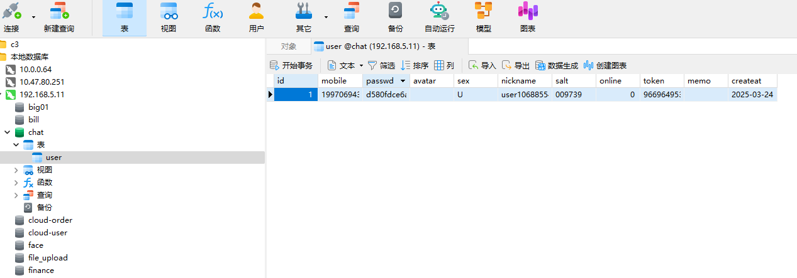
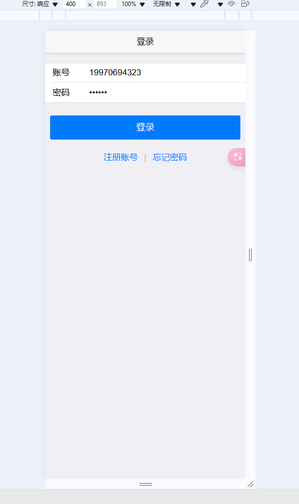
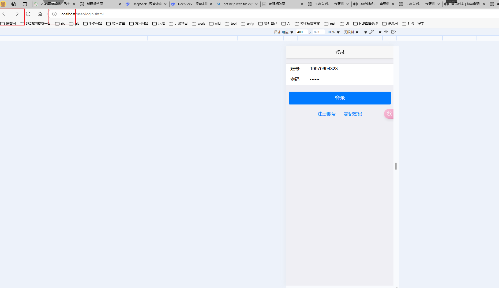
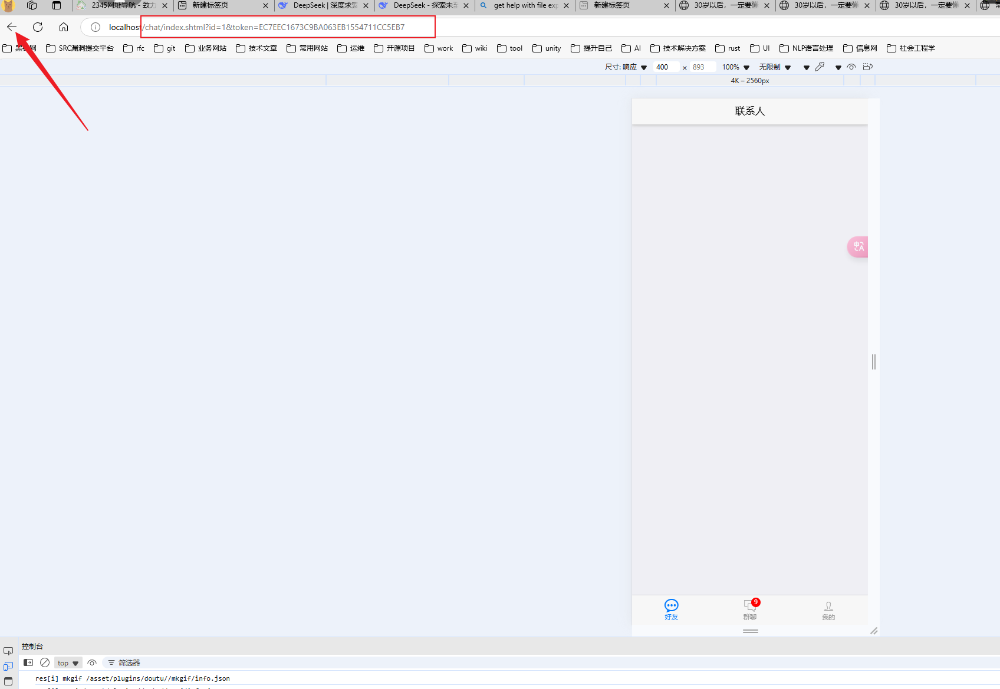
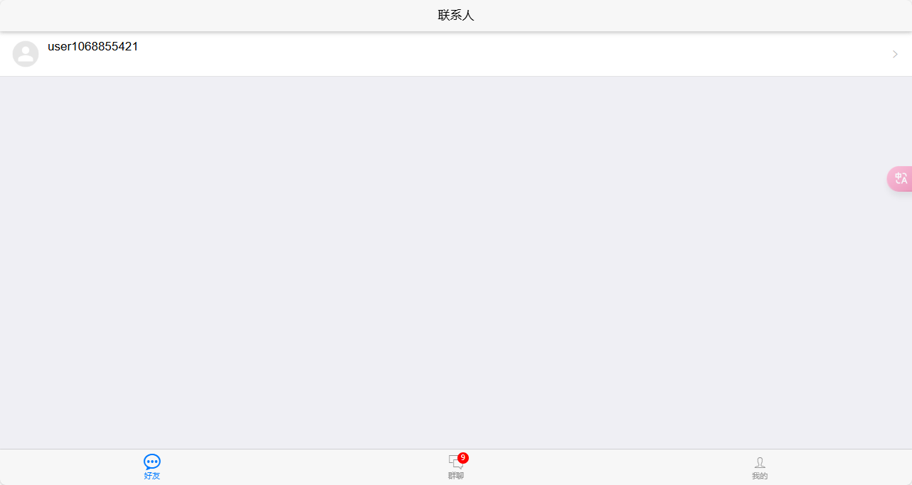

# 接入聊天主界面


## 遇到的问题

如何安全的接入这个聊天主页面？

1. 用户登入的时候调用登入的api（user/login）获取到id和token。
2.  前端获取到含有id与token的json串。前端进行拼接url。
3. 前端拼接的url（/chat/index.shtml?id=1&token=123）
4. 通过 localtion.href 进行跳转操作。


---

如何添加或显示好友？

答：如用户10 添加好友11，往contact表中添加两条记录。userId、dstid

```
/contact/addfriend
```

第一条：owerid = 10，dstobj = 11

第二条：owerid = 11，dstobj = 10

显示全部的好友查接口。接口的参数：userId

```
/contact/loadfriend
```

---

如何添加或显示群？


## dev1.0的测试

- 注册用户的接口：http://localhost/user/register

请求模式：post

接口参数：

```
mobile=19970694323
&
passwd=123456
```

测试成功日志

```
$ curl http://localhost/user/register -X POST -d "mobile=19970694323&passwd=123456"
{"code":0,"msg":"","data":{"id":1,"mobile":"19970694323","avatar":"","sex":"U","nickname":"user1068855420","online":0,"token":"966964953","memo":"","createat":"2025-03-24T15:05:10.6316503+08:00"}}

```

参看数据是否有数据。




- 用户登入接口测试。接口：




输入手机号与密码。登入成功跳转到首页。




注意跳转之后的页面变化。




注意：数据库里面要添加一个新的用户。


