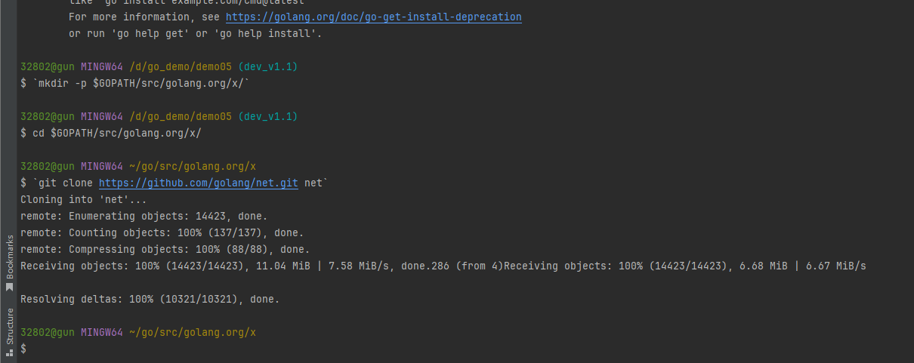

# 发送文字、图片


## 相关依赖包

golang.org/x/net/proxy


## 下载命令

```
go get golang.org/x/net/proxy
```


在Go语言环境中安装`golang.org/x/net/proxy`包，可以通过以下几种方法进行：

1. **使用`go get`命令**
   - 打开终端或命令提示符。
   - 输入以下命令并回车：
     - `go get golang.org/x/net/proxy`。
   - 此命令会从源码仓库获取该包及其依赖，并安装到你的`$GOPATH/pkg`路径下（如果你的Go环境已正确设置了`GOPATH`）。
   - 安装完成后，你可以通过在Go程序中导入`"golang.org/x/net/proxy"`来确认是否安装成功。
2. **手动安装**
   - 如果你的环境无法直接执行`go get`命令（例如遇到网络问题或需要离线安装），可以手动下载并安装。
   - 首先，确保你的系统上已经安装了Git。如果未安装，请先安装Git。
   - 然后，执行以下命令在本地构造目录结构并克隆仓库：
     - `mkdir -p $GOPATH/src/golang.org/x/`
     - `cd $GOPATH/src/golang.org/x/`
     - `git clone https://github.com/golang/net.git net`
   - 最后，执行`go install net`命令完成安装。
3. **检查安装**
   - 无论采用哪种方法安装，都建议在安装后通过编写一个简单的Go程序来测试是否成功导入了`golang.org/x/net/proxy`包。
   - 例如，创建一个新文件`main.go`，内容如下：

```go
package main
import (
  "fmt"
  "golang.org/x/net/proxy"
)
func main() {
  fmt.Println("proxy package imported successfully")
}

```

- 运行该程序，如果输出"proxy package imported successfully"，则说明安装成功。

总的来说，以上步骤应能帮助你顺利安装`golang.org/x/net/proxy`包。如果遇到任何问题，建议检查你的Go环境和网络连接是否正常。





## 依赖二

```
ctrl\chat.go:7:2: cannot find package "gopkg.in/fatih/set.v0" in any of:
	D:\go_devlop\go1.22.5.windows-amd64\go\src\gopkg.in\fatih\set.v0 (from $GOROOT)
	C:\Users\32802\go\src\gopkg.in\fatih\set.v0 (from $GOPATH)
```


