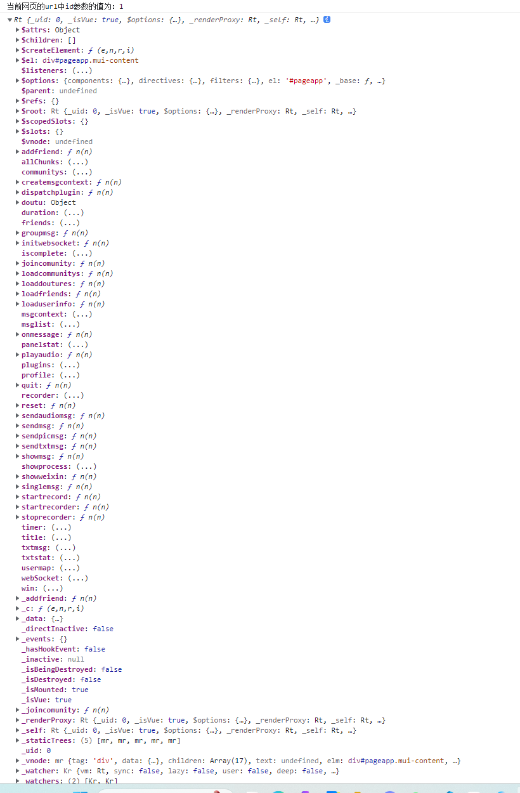

# 添加好友逻辑分析


## 前端代码

显示代码：

```html
        <li @click="addfriend" class="mui-table-view-cell">
            <a class="mui-navigate-right">
                添加好友
            </a>
        </li>
```

可以看到这里绑定了一个addfriend方法的事件函数。

调用后端逻辑代码：

```js
             // 点击添加好友的 函数
                addfriend: function () {
                    var that = this;
                    //prompt  对话框输入 好友id
                    mui.prompt('', '请输入好友ID', '加好友', ['取消', '确认'], function (e) {
                        if (e.index == 1) {
                            if (isNaN(e.value) || e.value <= 0) {
                                // 好友的id不能小于0
                                mui.toast('id不能为空或小于0');
                            } else {
                                // 好友的id 是合法的值。
                                //mui.toast(e.value);
                                that._addfriend(e.value)
                            }
                        } else {
                            //mui.toast('您取消了入库');
                        }
                    }, 'div');
                    document.querySelector('.mui-popup-input input').type = 'number';
                },
                // 向后端发送请求 添加好友   开始
                // dstobj是要添加的好友的id
                _addfriend: function (dstobj) {
                    var that = this
                    post("contact/addfriend", {dstid: dstobj, userid: userId()}, function (res) {
                        if (res.code == 0) {
                            mui.toast("添加好友成功");
                            that.loadfriends();
                        } else {
                            mui.toast(res.msg);
                        }
                    })
                },
                // 向后端发送请求 添加好友   end
```

- 第一：调后端接口处理添加好友。

发送的请求路径：contact/addfriend

请求模式：post

请求的参数如下：

```json
{dstid: dstobj, "userid": userId()}
```

userId()为当前登入用户的id。


- 第二：添加好友成功后要从新刷新好友的列表。

```js
                loadfriends: function () {
                    console.log("调用loadfriends方法的this是什么？答：" + this)
                    var that = this;
                    post("contact/loadfriend", {userid: userId()}, function (res) {
                        that.friends = res.rows || [];
                        // vue的data 属性usermap: {},
                        var usermap = this.usermap;
                        // 遍历用户对象数组
                        for (var i in res.rows) {
                            // i表示数组的索引号。访问元素快。
                            var k = "" + res.rows[i].id
                            // key = 用户的id
                            // value = 用户对象
                            usermap[k] = res.rows[i];
                        }
                        // 赋值给全局变量
                        this.usermap = usermap;
                    }.bind(this))
                },
```


::: tip loadfriends方法的this指向的是谁？

答：我们测试添加成功好友后看看控制台打印什么就能证明了。

控制台打印的结果是：调用loadfriends方法的this是什么？答：[object Object]

可是无法观察这个是一个什么呢？下面的问题就是这个对象内容是什么？




```js
                    console.log(this)
                    console.dir(this)
```

使用上面的二个可以打印一堆对象的属性。

:::


## 后端代码逻辑分析


**服务层代码分析**

```go
// 自动添加好友
func (service *ContactService) AddFriend(
	userid, //用户id 10086,
	dstid int64) error {
	//如果加自己
	if userid == dstid {
		return errors.New("不能添加自己为好友啊")
	}

	// 判断当前用户是否存在？
	user := model.User{}
	exists, err := DbEngin.
		Where("id = ?", dstid). // 假设用户ID字段是 `id`
		Get(&user)

	if err != nil {
		log.Printf("查询用户失败: %v", err)
		return errors.New("该用户已经被添加过啦")
	}

	if exists {
		log.Printf("dstid用户 %d 存在，可以被添加", dstid)
	} else {
		log.Printf("dstid用户 %d 不存在", dstid)
		return errors.New("该用户不存在！")
	}

	//判断是否已经加了好友
	tmp := model.Contact{}
	//查询是否已经是好友
	// 条件的链式操作
	DbEngin.Where("ownerid = ?", userid).
		And("dstobj = ?", dstid).
		And("cate = ?", model.CONCAT_CATE_USER).
		Get(&tmp)
	//获得1条记录
	//count()
	//如果存在记录说明已经是好友了不加
	if tmp.Id > 0 {
		return errors.New("该用户已经是你好友。")
	}

	//事务,
	session := DbEngin.NewSession()

	//  =====   开始事务   =========
	session.Begin()
	//插自己的
	_, e2 := session.InsertOne(model.Contact{
		Ownerid:  userid,
		Dstobj:   dstid,
		Cate:     model.CONCAT_CATE_USER,
		Createat: time.Now(),
	})
	//插对方的
	_, e3 := session.InsertOne(model.Contact{
		Ownerid:  dstid,
		Dstobj:   userid,
		Cate:     model.CONCAT_CATE_USER,
		Createat: time.Now(),
	})
	//没有错误
	if e2 == nil && e3 == nil {
		//提交
		session.Commit()
		return nil
	} else {
		//回滚
		session.Rollback()
		if e2 != nil {
			return e2
		} else {
			return e3
		}
	}

	//  =====   事务代码结束   =========
}
```


