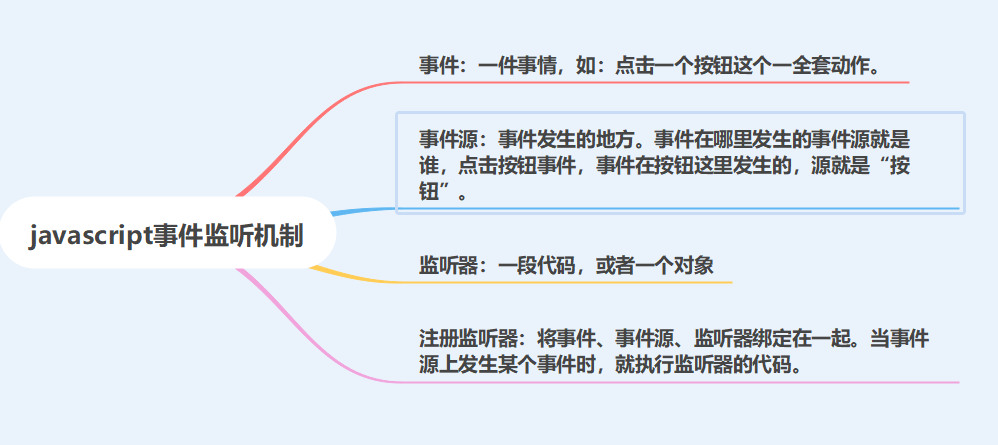

# 事件

javascript事件监听机制，可与java里面的监听器一样的机制理解，原理上都是一样的。类比总结如下。

javascript



java的事件监听。类比下。

## Listener：监听器

- 事件：servletContext对象被创建之后要执行什么代码，销毁之前要执行什么代码。

* ServletContextListener:监听ServletContext对象的创建和销毁【事件的源】
	* 方法：
		* void contextDestroyed(ServletContextEvent sce) ：ServletContext对象被销毁之前会调用该方法
		* void contextInitialized(ServletContextEvent sce) ：ServletContext对象创建后会调用该方法
	
	**步骤：**
	
	1. 定义一个类，实现ServletContextListener接口
	
	2. 复写方法
	
	3. 配置【相当于注册监听器】
	
	  配置web.xml文件
	
	  ```
	  				 <listener>
	  				 <listener-class>cn.itcast.web.listener.ContextLoaderListener</listener-class>
	  				</listener>
	  
	  				* 指定初始化参数<context-param>
	  ```

​			  注解配置：

​				@WebListener


