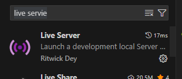

# export关键字

`export` 是 **JavaScript 的模块语法**，属于 **ES6（ECMAScript 2015）** 引入的模块化规范（ES Modules，简称 ESM）。

## 主要用途：

- **导出变量、函数、类**：让其他模块可以使用 `import` 导入。
- **模块化开发**：实现代码的封装和复用。

## 案例1)具名导出

案例的目的：

- 实验export怎么导出元素的。
- 实验import怎么导入元素的。
- 在index中怎么加载js文件(模块)。

编写案例的工程目录结构：

```
demo/
├── index.html
├── importTest.js
└── test.js
```

第一步：使用VScode编辑器打开。

- 安装：live servie。




**第二步：编写逻辑代码。**

- test.js文件创建。

```js
// test.js 文件
const k = 12;

// 导出 k
export default k;
```


- importTest.js文件创建。

```js
// 其他文件
import m from "./test.js"; // 请注意，我们可以自由地使用 import m 而不是 import k，因为 k 是默认导出
console.log(m); // 12
```

导出的k，在这个importTest.js文件中导入。我们可以自定义命名。


- 编写index.html。

```html
<!DOCTYPE html>
<html lang="en">
<head>
    <meta charset="UTF-8">
    <title>import</title>
    <script type="module" src="./importTest.js"></script>
</head>
<body>

</body>
</html>
```


**第三步：在index.html中运行。**


运行结果：


